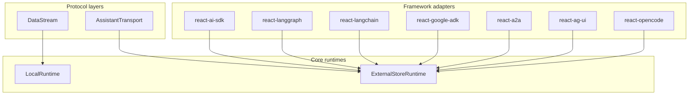

Search...
Ctrl
K
Playground
Resources
Pricing
Cloud

Installation

Get assistant-ui running in 5 minutes with npm and your first chat component.

Quick Start

The fastest way to get started with assistant-ui.

animated gif showing the steps to create a new project

Initialize assistant-ui

Create a new project:


npx assistant-ui@latest create
Or choose a template:


# Minimal starter
npx assistant-ui@latest create -t minimal
# Assistant Cloud - with persistence and thread management
npx assistant-ui@latest create -t cloud
# Assistant Cloud + Clerk authentication
npx assistant-ui@latest create -t cloud-clerk
# LangGraph starter (react-langchain adapter)
npx assistant-ui@latest create -t langchain
# MCP starter template
npx assistant-ui@latest create -t mcp
# Eve agent starter template
npx assistant-ui@latest create -t eve
Add to an existing project:


npx assistant-ui@latest init
Add API key

Create a .env file with your API key:


OPENAI_API_KEY="sk-xxxxxxxxxxxxxxxxxxxxxxxxxxxxxxxxxxxxxxxx"
Developing locally with a ChatGPT Plus or Pro plan? You can skip the API key and run on your subscription instead; see ChatGPT Subscription.

Start the app


npm run dev
Manual Setup

If you prefer not to use the CLI, you can install components manually.

Add assistant-ui

CLI
Manual
npm
pnpm
yarn
bun
xpm

npx shadcn@latest add https://r.assistant-ui.com/thread.json https://r.assistant-ui.com/thread-list.json
Setup Backend Endpoint

Install provider SDK:

OpenAI
Anthropic
Azure
AWS
Gemini
GCP
Groq
Fireworks
Cohere
Ollama
Chrome AI
npm
pnpm
yarn
bun
xpm

npm install ai @assistant-ui/react-ai-sdk @ai-sdk/openai
Add an API endpoint:

OpenAI
Anthropic
Azure
AWS
Gemini
GCP
Groq
Fireworks
Cohere
Ollama
Chrome AI
/app/api/chat/route.ts

import { openai } from "@ai-sdk/openai";
import { frontendTools } from "@assistant-ui/react-ai-sdk";
import { convertToModelMessages, streamText } from "ai";
export const maxDuration = 30;
export async function POST(req: Request) {
  const { messages, system, tools } = await req.json();
  const result = streamText({
    model: openai("gpt-5.4-nano"),
    system,
    messages: await convertToModelMessages(messages),
    tools: frontendTools(tools),
  });
  return result.toUIMessageStreamResponse();
}
Define environment variables:

OpenAI
Anthropic
Azure
AWS
Gemini
GCP
Groq
Fireworks
Cohere
Ollama
Chrome AI
/.env.local

OPENAI_API_KEY="sk-xxxxxxxxxxxxxxxxxxxxxxxxxxxxxxxxxxxxxxxx"
If you aren't using Next.js, you can also deploy this endpoint to Cloudflare Workers, or any other serverless platform.

Use it in your app

Thread
AssistantModal
/app/page.tsx

import { AssistantRuntimeProvider } from "@assistant-ui/react";
import { useChatRuntime, AssistantChatTransport } from "@assistant-ui/react-ai-sdk";
import { ThreadList } from "@/components/assistant-ui/thread-list";
import { Thread } from "@/components/assistant-ui/thread";
export default function MyApp() {
  const runtime = useChatRuntime({
    transport: new AssistantChatTransport({
      api: "/api/chat",
    }),
  });
  return (
    <AssistantRuntimeProvider runtime={runtime}>
      <div>
        <ThreadList />
        <Thread />
      </div>
    </AssistantRuntimeProvider>
  );
}
What's Next?


but we not needed its installation becauise i have download thier project which we uses directly in our app ,
[xulux-base-demo](file;file:///c%3A/Users/kashif/Downloads/agentcompletev2-main/xulux-base-demo) 

here is complete docs
File Attachments

Let users attach images, PDFs, and other files to AI chat messages in React. Drag-drop, paste, and vision-model support, built into assistant-ui.

Enable users to attach files to their messages, enhancing conversations with images, documents, and other content.

Remove file
Remove file
Send a message...
Add Attachment
Send message
Overview

The attachment system in assistant-ui provides a flexible framework for handling file uploads in your AI chat interface. It consists of:

Attachment Adapters: Backend logic for processing attachment files
UI Components: Pre-built components for attachment display and interaction
Runtime Integration: Seamless integration with all assistant-ui runtimes
Getting Started

Install UI Components

First, add the attachment UI components to your project:

CLI
Manual
npm
pnpm
yarn
bun
xpm

npx shadcn@latest add https://r.assistant-ui.com/attachment.json
This adds /components/assistant-ui/attachment.tsx to your project.

Next steps: Feel free to adjust these auto-generated components (styling, layout, behavior) to match your application's design system.

Set up Runtime (No Configuration Required)

For useChatRuntime, attachments work automatically without additional configuration:

/app/MyRuntimeProvider.tsx

import { useChatRuntime } from "@assistant-ui/react-ai-sdk";
const runtime = useChatRuntime();
Note: The AI SDK runtime handles attachments automatically. For other runtimes like useLocalRuntime, you may still need to configure attachment adapters as shown in the Creating Custom Attachment Adapters section below.

Add UI Components

Integrate the attachment components into your chat interface. See Attachment UI components for the full install and usage guide.

Built-in Attachment Adapters

AI SDK Runtime (Default)

When using useChatRuntime, the built-in adapter accepts all file types and converts them to base64 data URLs. This works well for images and small files.

Most models only support image attachments. Sending unsupported file types (audio, video, PDF, etc.) will result in an API error. Check your model provider's documentation for supported input types.

To restrict accepted file types, pass a custom adapter:


const runtime = useChatRuntime({
  adapters: {
    attachments: new SimpleImageAttachmentAdapter(), // only images
  },
});
SimpleImageAttachmentAdapter

Handles image files and converts them to data URLs for display in the chat UI.


const imageAdapter = new SimpleImageAttachmentAdapter();
// Accepts: image/* (JPEG, PNG, GIF, etc.)
SimpleTextAttachmentAdapter

Processes text files and wraps content in formatted tags:


const textAdapter = new SimpleTextAttachmentAdapter();
// Accepts: text/plain, text/html, text/markdown, etc.
CompositeAttachmentAdapter

Combines multiple adapters to support various file types:


const compositeAdapter = new CompositeAttachmentAdapter([
  new SimpleImageAttachmentAdapter(),
  new SimpleTextAttachmentAdapter(),
]);
Creating Custom Attachment Adapters

Build your own adapters for specialized file handling. Below are complete examples for common use cases. For PendingAttachment and CompleteAttachment type definitions, see Attachment types.

Vision-Capable Image Adapter

Send images to vision-capable LLMs like GPT-5.4, Claude Sonnet 4.6, or Gemini Pro Vision:


import {
  AttachmentAdapter,
  PendingAttachment,
  CompleteAttachment,
} from "@assistant-ui/react";
class VisionImageAdapter implements AttachmentAdapter {
  accept = "image/jpeg,image/png,image/webp,image/gif";
  async add({ file }: { file: File }): Promise<PendingAttachment> {
    // Validate file size (e.g., 20MB limit for most LLMs)
    const maxSize = 20 * 1024 * 1024; // 20MB
    if (file.size > maxSize) {
      throw new Error("Image size exceeds 20MB limit");
    }
    // Return pending attachment while processing
    return {
      id: crypto.randomUUID(),
      type: "image",
      name: file.name,
      file,
      status: { type: "requires-action", reason: "composer-send" },
    };
  }
  async send(attachment: PendingAttachment): Promise<CompleteAttachment> {
    // Convert image to base64 data URL
    const base64 = await this.fileToBase64DataURL(attachment.file);
    // Return in assistant-ui format with image content
    return {
      id: attachment.id,
      type: "image",
      name: attachment.name,
      content: [
        {
          type: "image",
          image: base64, // data:image/jpeg;base64,... format
        },
      ],
      status: { type: "complete" },
    };
  }
  async remove(attachment: PendingAttachment): Promise<void> {
    // Cleanup if needed (e.g., revoke object URLs if you created any)
  }
  private async fileToBase64DataURL(file: File): Promise<string> {
    return new Promise((resolve, reject) => {
      const reader = new FileReader();
      reader.onload = () => {
        // FileReader result is already a data URL
        resolve(reader.result as string);
      };
      reader.onerror = reject;
      reader.readAsDataURL(file);
    });
  }
}
PDF Document Adapter

Handle PDF files by extracting text or converting to base64 for processing:


import {
  AttachmentAdapter,
  PendingAttachment,
  CompleteAttachment,
} from "@assistant-ui/react";
class PDFAttachmentAdapter implements AttachmentAdapter {
  accept = "application/pdf";
  async add({ file }: { file: File }): Promise<PendingAttachment> {
    // Validate file size
    const maxSize = 10 * 1024 * 1024; // 10MB limit
    if (file.size > maxSize) {
      throw new Error("PDF size exceeds 10MB limit");
    }
    return {
      id: crypto.randomUUID(),
      type: "document",
      name: file.name,
      file,
      status: { type: "requires-action", reason: "composer-send" },
    };
  }
  async send(attachment: PendingAttachment): Promise<CompleteAttachment> {
    // Option 1: Extract text from PDF (requires pdf parsing library)
    // const text = await this.extractTextFromPDF(attachment.file);
    // Option 2: Convert to base64 for API processing
    const base64Data = await this.fileToBase64(attachment.file);
    return {
      id: attachment.id,
      type: "document",
      name: attachment.name,
      content: [
        {
          type: "text",
          text: `[PDF Document: ${attachment.name}]\nBase64 data: ${base64Data.substring(0, 50)}...`,
        },
      ],
      status: { type: "complete" },
    };
  }
  async remove(attachment: PendingAttachment): Promise<void> {
    // Cleanup if needed
  }
  private async fileToBase64(file: File): Promise<string> {
    const arrayBuffer = await file.arrayBuffer();
    const bytes = new Uint8Array(arrayBuffer);
    let binary = "";
    bytes.forEach((byte) => {
      binary += String.fromCharCode(byte);
    });
    return btoa(binary);
  }
  // Optional: Extract text from PDF using a library like pdf.js
  private async extractTextFromPDF(file: File): Promise<string> {
    // Implementation would use pdf.js or similar
    // This is a placeholder
    return "Extracted PDF text content";
  }
}
Using Custom Adapters

With LocalRuntime

When using LocalRuntime, you need to handle images in your ChatModelAdapter (the adapter that connects to your AI backend):


import { useLocalRuntime, ChatModelAdapter } from "@assistant-ui/react";
// This adapter connects LocalRuntime to your AI backend
const MyModelAdapter: ChatModelAdapter = {
  async run({ messages, abortSignal }) {
    // Convert messages to format expected by your vision-capable API
    const formattedMessages = messages.map((msg) => {
      if (
        msg.role === "user" &&
        msg.content.some((part) => part.type === "image")
      ) {
        // Format for GPT-5.4 or similar vision models
        return {
          role: "user",
          content: msg.content.map((part) => {
            if (part.type === "text") {
              return { type: "text", text: part.text };
            }
            if (part.type === "image") {
              return {
                type: "image_url",
                image_url: { url: part.image },
              };
            }
            return part;
          }),
        };
      }
      // Regular text messages
      return {
        role: msg.role,
        content: msg.content
          .filter((c) => c.type === "text")
          .map((c) => c.text)
          .join("\n"),
      };
    });
    // Send to your vision-capable API
    const response = await fetch("/api/vision-chat", {
      method: "POST",
      headers: { "Content-Type": "application/json" },
      body: JSON.stringify({ messages: formattedMessages }),
      signal: abortSignal,
    });
    const data = await response.json();
    return {
      content: [{ type: "text", text: data.message }],
    };
  },
};
// Create runtime with vision image adapter
const runtime = useLocalRuntime(MyModelAdapter, {
  adapters: {
    attachments: new VisionImageAdapter(),
  },
});
Advanced Features

Progress Updates

Provide real-time upload progress using async generators:


class UploadAttachmentAdapter implements AttachmentAdapter {
  accept = "*";
  async *add({ file }: { file: File }) {
    const id = generateId();
    // Initial pending state
    yield {
      id,
      type: "file",
      name: file.name,
      file,
      status: { type: "running", reason: "uploading", progress: 0 },
    } as PendingAttachment;
    // Simulate upload progress
    for (let progress = 10; progress <= 90; progress += 10) {
      await new Promise((resolve) => setTimeout(resolve, 100));
      yield {
        id,
        type: "file",
        name: file.name,
        file,
        status: { type: "running", reason: "uploading", progress },
      } as PendingAttachment;
    }
    // Yield final progress so the 100% state reaches the composer
    yield {
      id,
      type: "file",
      name: file.name,
      file,
      status: { type: "running", reason: "uploading", progress: 100 },
    } as PendingAttachment;
  }
  async send(attachment: PendingAttachment): Promise<CompleteAttachment> {
    // Upload the file and return complete attachment
    const url = await this.uploadFile(attachment.file);
    return {
      id: attachment.id,
      type: attachment.type,
      name: attachment.name,
      content: [
        {
          type: "file",
          data: url, // or base64 data
          mimeType: attachment.file.type,
        },
      ],
      status: { type: "complete" },
    };
  }
  async remove(attachment: PendingAttachment): Promise<void> {
    // Cleanup logic
  }
  private async uploadFile(file: File): Promise<string> {
    // Your upload logic here
    return "https://example.com/file-url";
  }
}
Validation and Error Handling

Implement robust validation in your adapters:


class ValidatedImageAdapter implements AttachmentAdapter {
  accept = "image/*";
  maxSizeBytes = 5 * 1024 * 1024; // 5MB
  async add({ file }: { file: File }): Promise<PendingAttachment> {
    // Validate file size
    if (file.size > this.maxSizeBytes) {
      return {
        id: generateId(),
        type: "image",
        name: file.name,
        file,
        status: {
          type: "incomplete",
          reason: "error",
        },
      };
    }
    // Validate image dimensions
    try {
      const dimensions = await this.getImageDimensions(file);
      if (dimensions.width > 4096 || dimensions.height > 4096) {
        throw new Error("Image dimensions exceed 4096x4096");
      }
    } catch (error) {
      return {
        id: generateId(),
        type: "image",
        name: file.name,
        file,
        status: {
          type: "incomplete",
          reason: "error",
        },
      };
    }
    // Return valid attachment
    return {
      id: generateId(),
      type: "image",
      name: file.name,
      file,
      status: { type: "requires-action", reason: "composer-send" },
    };
  }
  private async getImageDimensions(file: File) {
    // Implementation to check image dimensions
  }
}
To surface failures in the UI, subscribe to composer.attachmentAddError. It fires whenever an add operation produces a failure, in either of two ways:

addAttachment() rejects: no adapter is configured, the file type does not match accept, or the adapter's add() throws.
addAttachment() resolves but the adapter returned (or, for async-iterator adapters, yielded) an attachment whose status.reason === "error". The promise resolves successfully, yet the event still fires so the UI can react.
The event payload carries a reason discriminator and a human-readable message, so you can branch UI on the failure mode:

reason	When It Fires
no-adapter	addAttachment(File) was called but no AttachmentAdapter is configured.
not-accepted	The file's content type (or filename extension) did not match adapter.accept. External CreateAttachment descriptors also trigger this when their contentType does not match adapter.accept.
adapter-error	The adapter's add() threw, or returned/yielded an attachment with status.reason === "error". If the adapter produced any attachment before failing, the errored attachment is also visible in composer.attachments; if it threw before producing one, the event is the only signal.

import { toast } from "sonner"; // or your toast library of choice
import { useAuiEvent } from "@assistant-ui/react";
function AttachmentErrorToast() {
  useAuiEvent("composer.attachmentAddError", ({ reason, message, error }) => {
    if (reason === "not-accepted") {
      toast.error("This file type is not supported.");
    } else if (reason === "no-adapter") {
      toast.error("Attachments are not configured for this composer.");
    } else {
      if (error) console.error(error); // underlying Error, useful for logging
      toast.error(message || "Attachment failed to upload.");
    }
  });
  return null;
}
attachmentId is included when the failure is associated with an attachment that was registered (typically adapter-error cases). It is undefined for no-adapter and not-accepted failures because those reject before any attachment is registered.

External Source Attachments

Add attachments from external sources (URLs, API data, CMS references) without needing a File object or an AttachmentAdapter:


const aui = useAui();
// Add an attachment from an external source
await aui.composer().addAttachment({
  name: "report.pdf",
  contentType: "application/pdf",
  content: [{ type: "text", text: "Extracted document content..." }],
});
// Optionally provide id and type
await aui.composer().addAttachment({
  id: "cms-doc-123",
  type: "document",
  name: "Product Spec",
  content: [{ type: "text", text: "Product specification content..." }],
});
External attachments are added as complete attachments directly. They bypass the AttachmentAdapter's add() step (no upload), but adapter.accept is still enforced when an AttachmentAdapter is configured: a CreateAttachment whose contentType does not match adapter.accept is rejected and emits composer.attachmentAddError. If contentType is omitted, the descriptor's filename extension is matched against adapter.accept only when accept itself contains explicit extension entries (e.g. .png,.pdf); MIME-wildcard accept strings such as image/* always require a matching contentType. When no AttachmentAdapter is configured, external attachments are added without any content-type check, and they can be removed without an adapter.

Multiple File Selection

Enable multi-file selection with custom limits:


const aui = useAui();
const handleMultipleFiles = async (files: FileList) => {
  const maxFiles = 5;
  const filesToAdd = Array.from(files).slice(0, maxFiles);
  for (const file of filesToAdd) {
    await aui.composer().addAttachment(file);
  }
};
Backend Integration

With Vercel AI SDK

Attachments are sent to the backend as file content parts.

Runtime Support

Attachments work with all assistant-ui runtimes:

AI SDK Runtime: useChatRuntime
External Store: useExternalStoreRuntime
LangGraph: useLangGraphRuntime
Custom Runtimes: Any runtime implementing the attachment interface
The attachment system is designed to be extensible. You can create adapters for any file type, integrate with cloud storage services, or implement custom processing logic to fit your specific needs.

Large File Uploads

The built-in adapters convert files to base64 data URLs in memory. For large files (long audio, video, etc.), this can cause performance issues. Instead, upload to a server and pass the URL:


class ServerUploadAdapter implements AttachmentAdapter {
  accept = "*";
  private urls = new Map<string, string>();
  async *add({ file }: { file: File }) {
    const id = crypto.randomUUID();
    yield {
      id, type: "file" as const, name: file.name, file,
      contentType: file.type,
      status: { type: "running" as const, reason: "uploading" as const, progress: 0 },
    };
    const form = new FormData();
    form.append("file", file);
    const { url } = await fetch("/api/upload", { method: "POST", body: form }).then(r => r.json());
    this.urls.set(id, url);
    yield {
      id, type: "file" as const, name: file.name, file,
      contentType: file.type,
      status: { type: "requires-action" as const, reason: "composer-send" as const },
    };
  }
  async send(attachment: PendingAttachment): Promise<CompleteAttachment> {
    const url = this.urls.get(attachment.id)!;
    this.urls.delete(attachment.id);
    return {
      ...attachment, status: { type: "complete" },
      content: [{ type: "file", data: url, mimeType: attachment.contentType ?? "", filename: attachment.name }],
    };
  }
  async remove() {}
}
assistant-ui Cloud includes CloudFileAttachmentAdapter which handles large file uploads via presigned URLs out of the box.

Best Practices

File Size Limits: Always validate file sizes to prevent memory issues
Type Validation: Verify file types match your accept pattern
Error Handling: Provide clear error messages for failed uploads
Progress Feedback: Show upload progress for better UX
Security: Validate and sanitize file content before processing
Accessibility: Ensure attachment UI is keyboard navigable
Mentions in Chat

Let users @-mention tools or custom items in the AI chat composer to guide the LLM. Mention picker built into assistant-ui's React composer.

Mentions let users type @ in the composer to open a popover picker, select an item (e.g. a tool), and insert a directive into the message text. The LLM can then use the directive as a hint.

How It Works

User types @
Trigger detected
Adapter providescategories / items
User selects itemfrom popover
Directive inserted
"Message sent with:tool[Label
The mention system has three layers:

Trigger detection — the composer input watches for a trigger character (@ by default) and extracts the query
Adapter — provides the categories and items to display in the popover (e.g. registered tools)
Formatter — serializes a selected item into directive text (:type[label]{name=id}) and parses it back for rendering
Under the hood, mentions are one kind of trigger popover. A mention declares its behavior with a <TriggerPopover.Directive> sub-primitive, which writes the formatter-serialized directive into the composer on selection.

Quick Start

The fastest path is the pre-built Mention UI components, which wire everything together with two shadcn components — the popover picker and the message-side chip renderer:


npx shadcn@latest add "https://r.assistant-ui.com/composer-trigger-popover" "https://r.assistant-ui.com/directive-text"
See the Composer Trigger Popover and Directive Text guides for setup steps.

The rest of this guide covers the underlying concepts and customization points.

Trigger Adapter

A Unstable_TriggerAdapter provides the data for the popover. All methods are synchronous — use external state management (React Query, SWR, local state) for async data, then expose loaded results through the adapter.


import type { Unstable_TriggerAdapter } from "@assistant-ui/core";
const myAdapter: Unstable_TriggerAdapter = {
  categories() {
    return [
      { id: "tools", label: "Tools" },
      { id: "users", label: "Users" },
    ];
  },
  categoryItems(categoryId) {
    if (categoryId === "tools") {
      return [
        { id: "search", type: "tool", label: "Search" },
        { id: "calculator", type: "tool", label: "Calculator" },
      ];
    }
    if (categoryId === "users") {
      return [
        { id: "alice", type: "user", label: "Alice" },
        { id: "bob", type: "user", label: "Bob" },
      ];
    }
    return [];
  },
  // Optional — global search across all categories
  search(query) {
    const lower = query.toLowerCase();
    const all = [
      ...this.categoryItems("tools"),
      ...this.categoryItems("users"),
    ];
    return all.filter(
      (item) =>
        item.label.toLowerCase().includes(lower) ||
        item.id.toLowerCase().includes(lower),
    );
  },
};
Async Mention Search

The built-in unstable_useLiveCompletionAdapter wraps an async fetcher with debouncing, stale-request cancellation (results for an outdated query are dropped), and a single-entry cache. Its search returns the last results synchronously and schedules a debounced fetch when the query changes; when results arrive the returned adapter re-creates, which re-runs the popover lookup so the fresh items render. It also reports isLoading, which you pass to the popover to show a loading state.


import {
  unstable_useLiveCompletionAdapter,
  unstable_defaultDirectiveFormatter,
} from "@assistant-ui/react";
import { ComposerTriggerPopover } from "@/components/assistant-ui/composer-trigger-popover";
function MentionPopover() {
  const mentions = unstable_useLiveCompletionAdapter({
    fetcher: async (query) => {
      const users = await fetchUsers(query);
      return users.map((u) => ({ id: u.id, type: "user", label: u.name }));
    },
  });
  return (
    <ComposerTriggerPopover
      char="@"
      adapter={mentions.adapter}
      isLoading={mentions.isLoading}
      directive={{ formatter: unstable_defaultDirectiveFormatter }}
    />
  );
}
The adapter interface is itself synchronous, so you can also wire async data by hand when you need a custom cache, no debounce, or an existing query client. Load results into React state (or a query cache) and read the current snapshot inside the adapter methods. The adapter re-creates on each render, so the popover always sees the latest results.

With React state and useEffect:


import { useState, useEffect, useMemo } from "react";
import type { Unstable_TriggerAdapter } from "@assistant-ui/core";
function useUserMentionAdapter(query: string) {
  const [users, setUsers] = useState<{ id: string; name: string }[]>([]);
  useEffect(() => {
    if (!query) return;
    let cancelled = false;
    fetchUsers(query).then((results) => {
      if (!cancelled) setUsers(results);
    });
    return () => { cancelled = true; };
  }, [query]);
  const adapter: Unstable_TriggerAdapter = useMemo(() => ({
    categories: () => [],
    categoryItems: () => [],
    search: () =>
      users.map((u) => ({ id: u.id, type: "user", label: u.name })),
  }), [users]);
  return adapter;
}
query here is the text the user typed after @. You can read it from unstable_useTriggerPopoverScopeContext if you need it inside the component tree, or pass it as state from a controlled input.

With React Query:


import { useQuery } from "@tanstack/react-query";
import type { Unstable_TriggerAdapter } from "@assistant-ui/core";
function useMentionAdapter(query: string): Unstable_TriggerAdapter {
  const { data = [] } = useQuery({
    queryKey: ["mention-search", query],
    queryFn: () => fetchUsers(query),
    enabled: query.length > 0,
  });
  return useMemo(() => ({
    categories: () => [],
    categoryItems: () => [],
    search: () =>
      data.map((u) => ({ id: u.id, type: "user", label: u.name })),
  }), [data]);
}
Pass the adapter to TriggerPopover and declare a Directive sub-primitive to bind the insertion behavior:


import { ComposerPrimitive } from "@assistant-ui/react";
import { unstable_defaultDirectiveFormatter } from "@assistant-ui/react";
<ComposerPrimitive.Unstable_TriggerPopoverRoot>
  <ComposerPrimitive.Root>
    <ComposerPrimitive.Input placeholder="Type @ to mention..." />
    <ComposerPrimitive.Unstable_TriggerPopover
      char="@"
      adapter={myAdapter}
    >
      <ComposerPrimitive.Unstable_TriggerPopover.Directive
        formatter={unstable_defaultDirectiveFormatter}
      />
      <ComposerPrimitive.Unstable_TriggerPopoverCategories>
        {(categories) =>
          categories.map((cat) => (
            <ComposerPrimitive.Unstable_TriggerPopoverCategoryItem
              key={cat.id}
              categoryId={cat.id}
            >
              {cat.label}
            </ComposerPrimitive.Unstable_TriggerPopoverCategoryItem>
          ))
        }
      </ComposerPrimitive.Unstable_TriggerPopoverCategories>
      <ComposerPrimitive.Unstable_TriggerPopoverItems>
        {(items) =>
          items.map((item) => (
            <ComposerPrimitive.Unstable_TriggerPopoverItem
              key={item.id}
              item={item}
            >
              {item.label}
            </ComposerPrimitive.Unstable_TriggerPopoverItem>
          ))
        }
      </ComposerPrimitive.Unstable_TriggerPopoverItems>
    </ComposerPrimitive.Unstable_TriggerPopover>
  </ComposerPrimitive.Root>
</ComposerPrimitive.Unstable_TriggerPopoverRoot>
Exactly one behavior sub-primitive (Directive or Action) is allowed per TriggerPopover. The parent reads the registered behavior and wires the selection machinery.

Built-in Mention Adapter

unstable_useMentionAdapter covers the common cases: mention registered tools, add your own items, mix tools with custom items, or show multi-category drill-down.

Tools from model context (default):


import { unstable_useMentionAdapter } from "@assistant-ui/react";
const mention = unstable_useMentionAdapter();
// → { adapter, directive } — spread into <ComposerTriggerPopover {...mention} />
// Default: single "Tools" category reading from toolkit registrations
Custom items only (no tools):


const mention = unstable_useMentionAdapter({
  items: [
    { id: "alice", type: "user", label: "Alice", icon: "User" },
    { id: "bob", type: "user", label: "Bob", icon: "User" },
  ],
});
Mix custom items with model-context tools (flat):


const mention = unstable_useMentionAdapter({
  items: [{ id: "kb", type: "doc", label: "Knowledge Base", icon: "Book" }],
  includeModelContextTools: true,
});
Multi-category drill-down:


const mention = unstable_useMentionAdapter({
  categories: [
    {
      id: "users",
      label: "Users",
      items: [
        { id: "alice", type: "user", label: "Alice", icon: "User" },
        { id: "bob", type: "user", label: "Bob", icon: "User" },
      ],
    },
    {
      id: "files",
      label: "Files",
      items: [
        { id: "readme", type: "file", label: "README.md", icon: "FileText" },
      ],
    },
  ],
  // Tools auto-appended as their own category (default id "tools", label "Tools")
  includeModelContextTools: true,
});
Tool formatting and category override:


const mention = unstable_useMentionAdapter({
  categories: [{ id: "users", label: "Users", items: [...] }],
  includeModelContextTools: {
    category: { id: "integrations", label: "Integrations" },
    formatLabel: (name) =>
      name.replaceAll("_", " ").replace(/\b\w/g, (c) => c.toUpperCase()),
    icon: "Wrench",
  },
});
Options summary:

Option	Type	Behavior
items	Unstable_Mention[]	Flat list (ignored when categories is set)
categories	{id, label, items}[]	Drill-down groups
includeModelContextTools	boolean | object	Default: true iff neither items nor categories
formatter	Unstable_DirectiveFormatter	Override directive serialization (default: unstable_defaultDirectiveFormatter)
onInserted	(item) => void	Fires after the directive is inserted into the composer
iconMap	Record<string, IconComponent>	Maps metadata.icon / category id strings to React components
fallbackIcon	IconComponent	Fallback when no entry in iconMap matches
icon on each mention is a shortcut for metadata.icon that the picker UI resolves via iconMap. Dedup between custom items and model-context tools is by id — explicit items win.

The hook returns { adapter, directive, iconMap?, fallbackIcon? } — spread into <ComposerTriggerPopover {...mention} /> for one-line wiring. Callers consuming the raw primitives instead destructure: mention.adapter, mention.directive.formatter, etc.

Directive Format

When a user selects a mention item, it is serialized into the composer text as a directive. The default format is:


:type[label]{name=id}
For example, selecting a tool named "get_weather" with label "Get Weather" produces:


:tool[Get Weather]{name=get_weather}
When id equals label, the {name=…} attribute is omitted for brevity:


:tool[search]
Custom Formatter

Implement Unstable_DirectiveFormatter to use a different format:


import type { Unstable_DirectiveFormatter } from "@assistant-ui/react";
const slashFormatter: Unstable_DirectiveFormatter = {
  serialize(item) {
    return `/${item.id}`;
  },
  parse(text) {
    const segments = [];
    const re = /\/(\w+)/g;
    let lastIndex = 0;
    let match;
    while ((match = re.exec(text)) !== null) {
      if (match.index > lastIndex) {
        segments.push({ kind: "text" as const, text: text.slice(lastIndex, match.index) });
      }
      segments.push({
        kind: "mention" as const,
        type: "tool",
        label: match[1]!,
        id: match[1]!,
      });
      lastIndex = re.lastIndex;
    }
    if (lastIndex < text.length) {
      segments.push({ kind: "text" as const, text: text.slice(lastIndex) });
    }
    return segments;
  },
};
Pass it to the trigger's Directive sub-primitive and the message renderer:


// Composer
<ComposerPrimitive.Unstable_TriggerPopover
  char="@"
  adapter={adapter}
>
  <ComposerPrimitive.Unstable_TriggerPopover.Directive formatter={slashFormatter} />
  ...
</ComposerPrimitive.Unstable_TriggerPopover>
// User messages
const SlashDirectiveText = createDirectiveText(slashFormatter);
<MessagePrimitive.Parts components={{ Text: SlashDirectiveText }} />
Textarea vs Lexical

The mention system supports two input modes:

Textarea (default)	Lexical
Input component	ComposerPrimitive.Input	LexicalComposerInput
Mention display in composer	Raw directive text (:tool[Label])	Inline chips (atomic nodes)
Dependencies	None	@assistant-ui/react-lexical, lexical, @lexical/react
Best for	Simple setups, minimal bundle	Rich editing, polished UX
With textarea, selecting a mention inserts the directive string directly into the text. The user sees :tool[Get Weather]{name=get_weather} in the input.

With Lexical, selected mentions appear as styled inline chips that behave as atomic units — they can be selected, deleted, and undone as a whole. The underlying text still uses the directive format.


import { LexicalComposerInput } from "@assistant-ui/react-lexical";
<ComposerPrimitive.Unstable_TriggerPopoverRoot>
  <ComposerPrimitive.Root>
    <LexicalComposerInput placeholder="Type @ to mention..." />
    <ComposerPrimitive.Send />
    <ComposerPrimitive.Unstable_TriggerPopover
      char="@"
      adapter={adapter}
    >
      <ComposerPrimitive.Unstable_TriggerPopover.Directive formatter={formatter} />
      ...
    </ComposerPrimitive.Unstable_TriggerPopover>
  </ComposerPrimitive.Root>
</ComposerPrimitive.Unstable_TriggerPopoverRoot>
LexicalComposerInput automatically discovers every Directive trigger registered under TriggerPopoverRoot and renders their selections as inline chips.

Rendering Mentions in Messages

Use DirectiveText as the Text component for user messages so directives render as inline chips instead of raw syntax. See the Directive Text guide for setup and customization.

Processing Mentions on the Backend

The message text arrives at your backend with directives inline. Parse them to extract mentioned items:


// Default format: :type[label]{name=id}
const DIRECTIVE_RE = /:([\w-]+)\[([^\]]+)\](?:\{name=([^}]+)\})?/g;
function parseMentions(text: string) {
  const mentions = [];
  let match;
  while ((match = DIRECTIVE_RE.exec(text)) !== null) {
    mentions.push({
      type: match[1],        // e.g. "tool"
      label: match[2],       // e.g. "Get Weather"
      id: match[3] ?? match[2], // e.g. "get_weather"
    });
  }
  return mentions;
}
// Example:
// parseMentions("Use :tool[Get Weather]{name=get_weather} to check")
// → [{ type: "tool", label: "Get Weather", id: "get_weather" }]
You can use the extracted mentions to:

Force-enable specific tools for the LLM call
Add context about mentioned users or documents to the system prompt
Log which tools users request most often
Reading Mention State

Use unstable_useTriggerPopoverScopeContext inside the TriggerPopover to programmatically access the popover state for that trigger:


import { unstable_useTriggerPopoverScopeContext } from "@assistant-ui/react";
function MyPopoverContent() {
  const scope = unstable_useTriggerPopoverScopeContext();
  // scope.open — whether the popover is visible
  // scope.query — current search text after the trigger
  // scope.categories — filtered category list
  // scope.items — filtered item list
  // scope.highlightedIndex — keyboard-navigated index
  // scope.isSearchMode — true when global search is active
  // scope.selectItem(item) — programmatically select an item
  // scope.close() — close the popover
  return null;
}
This hook must be used inside a ComposerPrimitive.Unstable_TriggerPopover.

To iterate every registered trigger (e.g. from a custom input implementation), use unstable_useTriggerPopoverTriggers inside TriggerPopoverRoot.

Building a Custom Popover

Use the trigger popover primitives to build a fully custom popover:


<ComposerPrimitive.Unstable_TriggerPopoverRoot>
  <ComposerPrimitive.Root>
    <ComposerPrimitive.Input />
    <ComposerPrimitive.Unstable_TriggerPopover
      char="@"
      adapter={adapter}
      className="popover"
    >
      <ComposerPrimitive.Unstable_TriggerPopover.Directive formatter={formatter} />
      <ComposerPrimitive.Unstable_TriggerPopoverBack>
        ← Back
      </ComposerPrimitive.Unstable_TriggerPopoverBack>
      <ComposerPrimitive.Unstable_TriggerPopoverCategories>
        {(categories) =>
          categories.map((cat) => (
            <ComposerPrimitive.Unstable_TriggerPopoverCategoryItem
              key={cat.id}
              categoryId={cat.id}
            >
              {cat.label}
            </ComposerPrimitive.Unstable_TriggerPopoverCategoryItem>
          ))
        }
      </ComposerPrimitive.Unstable_TriggerPopoverCategories>
      <ComposerPrimitive.Unstable_TriggerPopoverItems>
        {(items) =>
          items.map((item) => (
            <ComposerPrimitive.Unstable_TriggerPopoverItem
              key={item.id}
              item={item}
            >
              {item.label}
            </ComposerPrimitive.Unstable_TriggerPopoverItem>
          ))
        }
      </ComposerPrimitive.Unstable_TriggerPopoverItems>
    </ComposerPrimitive.Unstable_TriggerPopover>
    <ComposerPrimitive.Send />
  </ComposerPrimitive.Root>
</ComposerPrimitive.Unstable_TriggerPopoverRoot>
Primitives Reference

See the Composer Primitives reference for the full list of trigger popover primitives and their props.

Combining with Slash Commands

Mentions and slash commands coexist on the same composer. See Combining Slash Commands and Mentions for the full pattern.

Related

ComposerTriggerPopover UI Component — pre-built shadcn component
DirectiveText UI Component — renders mention chips in user messages
Slash Commands Guide — / command system built on the same architecture
Tools Guide — register tools that appear in the mention picker
Composer Primitives — underlying composer primitives
Slash Commands

Trigger predefined actions in your AI chat by typing / — slash command palette with popover, search, and action handlers in React via assistant-ui.

Slash commands let users type / in the composer to open a popover, browse available commands, and execute one. Unlike mentions (which only insert a directive into the message), slash commands additionally fire an action callback at the moment of selection.

How It Works

User types /
Trigger detected
Adapter providescommands
User selects commandfrom popover
Callback fired
Directive chip left in composer(or removed if removeOnExecute)
The slash command system is built on the same trigger popover architecture as mentions. A slash command declares its behavior with a <TriggerPopover.Action> sub-primitive whose onExecute callback fires when an item is chosen.

By default Action leaves a directive chip in the composer — giving the user (and the LLM) an audit trail of which commands were invoked. Pass removeOnExecute to strip the /command text entirely.

Quick Start

1. Define Commands with unstable_useSlashCommandAdapter

Declare commands (data + execute bundled together, like a toolkit entry). The hook returns { adapter, action } — wire both into a single <TriggerPopover>:


import {
  ComposerPrimitive,
  unstable_useSlashCommandAdapter,
  type Unstable_SlashCommand,
} from "@assistant-ui/react";
const SLASH_COMMANDS: readonly Unstable_SlashCommand[] = [
  {
    id: "summarize",
    description: "Summarize the conversation",
    execute: () => console.log("Summarize!"),
  },
  {
    id: "translate",
    description: "Translate text to another language",
    execute: () => console.log("Translate!"),
  },
  {
    id: "help",
    description: "List all available commands",
    execute: () => console.log("Help!"),
  },
];
function MyComposer() {
  const slash = unstable_useSlashCommandAdapter({ commands: SLASH_COMMANDS });
  return (
    <ComposerPrimitive.Unstable_TriggerPopoverRoot>
      <ComposerPrimitive.Root>
        <ComposerPrimitive.Input placeholder="Type / for commands..." />
        <ComposerPrimitive.Send>Send</ComposerPrimitive.Send>
        <ComposerPrimitive.Unstable_TriggerPopover
          char="/"
          adapter={slash.adapter}
          className="popover"
        >
          <ComposerPrimitive.Unstable_TriggerPopover.Action {...slash.action} />
          <ComposerPrimitive.Unstable_TriggerPopoverItems>
            {(items) =>
              items.map((item, index) => (
                <ComposerPrimitive.Unstable_TriggerPopoverItem
                  key={item.id}
                  item={item}
                  index={index}
                  className="popover-item"
                >
                  <strong>{item.label}</strong>
                  {item.description && <span>{item.description}</span>}
                </ComposerPrimitive.Unstable_TriggerPopoverItem>
              ))
            }
          </ComposerPrimitive.Unstable_TriggerPopoverItems>
        </ComposerPrimitive.Unstable_TriggerPopover>
      </ComposerPrimitive.Root>
    </ComposerPrimitive.Unstable_TriggerPopoverRoot>
  );
}
The label defaults to /${id}; override via label on the command. Icons are strings that your iconMap on the picker UI resolves to components (see ComposerTriggerPopover).

unstable_useSlashCommandAdapter options

Option	Type	Default	Description
commands	Unstable_SlashCommand[]	—	Command definitions — each has id, optional label, description, icon, and an execute callback (required)
removeOnExecute	boolean	false	When true, strips the trigger text from the composer after executing instead of leaving a directive chip
iconMap	Record<string, IconComponent>	—	Maps metadata.icon / category id strings to React icon components; forwarded to ComposerTriggerPopover
fallbackIcon	IconComponent	—	Fallback when no iconMap entry matches; forwarded to ComposerTriggerPopover
The hook returns { adapter, action, iconMap?, fallbackIcon? } — spread directly into <ComposerTriggerPopover char="/" {...slash} /> for one-line wiring.

2. Controlling the Chip

By default, a selected /summarize is converted into a directive chip (:command[/summarize]{name=summarize}) in the composer text and the command's execute fires. This keeps an audit trail of which commands were invoked.

To strip the trigger text entirely — useful for purely transient commands — pass removeOnExecute on the hook options:


const slash = unstable_useSlashCommandAdapter({
  commands: SLASH_COMMANDS,
  removeOnExecute: true,
});
3. Custom Dispatch

For side effects on top of execute (logging, analytics, intercept), wrap the hook's onExecute:


<ComposerPrimitive.Unstable_TriggerPopover.Action
  onExecute={(item) => {
    logCommandUsed(item.id);
    slash.action.onExecute(item);
  }}
/>
Categorized Commands

For categorized navigation (drill-down into groups), return categories from categories() and items from categoryItems(). The popover shows categories first, then items within the selected category:


import type { Unstable_TriggerAdapter } from "@assistant-ui/core";
const adapter: Unstable_TriggerAdapter = {
  categories() {
    return [
      { id: "actions", label: "Actions" },
      { id: "export", label: "Export" },
    ];
  },
  categoryItems(categoryId) {
    if (categoryId === "actions") {
      return [
        { id: "summarize", type: "command", label: "/summarize", description: "Summarize the conversation" },
        { id: "translate", type: "command", label: "/translate", description: "Translate text" },
      ];
    }
    if (categoryId === "export") {
      return [
        { id: "pdf", type: "command", label: "/export pdf", description: "Export as PDF" },
        { id: "markdown", type: "command", label: "/export md", description: "Export as Markdown" },
      ];
    }
    return [];
  },
  // Optional — enables search across all categories
  search(query) {
    const lower = query.toLowerCase();
    const all = [...this.categoryItems("actions"), ...this.categoryItems("export")];
    return all.filter(
      (item) => item.label.toLowerCase().includes(lower) || item.description?.toLowerCase().includes(lower),
    );
  },
};
When using a categorized adapter, add TriggerPopoverCategories to your popover UI:


const commandHandlers: Record<string, () => void> = {
  summarize: () => {/* ... */},
  pdf: () => {/* ... */},
};
<ComposerPrimitive.Unstable_TriggerPopover
  char="/"
  adapter={adapter}
>
  <ComposerPrimitive.Unstable_TriggerPopover.Action
    formatter={unstable_defaultDirectiveFormatter}
    onExecute={(item) => commandHandlers[item.id]?.()}
  />
  <ComposerPrimitive.Unstable_TriggerPopoverBack>← Back</ComposerPrimitive.Unstable_TriggerPopoverBack>
  <ComposerPrimitive.Unstable_TriggerPopoverCategories>
    {(categories) => categories.map((cat) => (
      <ComposerPrimitive.Unstable_TriggerPopoverCategoryItem key={cat.id} categoryId={cat.id}>
        {cat.label}
      </ComposerPrimitive.Unstable_TriggerPopoverCategoryItem>
    ))}
  </ComposerPrimitive.Unstable_TriggerPopoverCategories>
  <ComposerPrimitive.Unstable_TriggerPopoverItems>
    {(items) => items.map((item, index) => (
      <ComposerPrimitive.Unstable_TriggerPopoverItem key={item.id} item={item} index={index}>
        {item.label}
      </ComposerPrimitive.Unstable_TriggerPopoverItem>
    ))}
  </ComposerPrimitive.Unstable_TriggerPopoverItems>
</ComposerPrimitive.Unstable_TriggerPopover>
Combining with Mentions

Slash commands and mentions live under the same TriggerPopoverRoot. Declare one TriggerPopover per trigger — each with its own behavior sub-primitive:


<ComposerPrimitive.Unstable_TriggerPopoverRoot>
  <ComposerPrimitive.Root>
    <ComposerPrimitive.Input placeholder="Type @ to mention, / for commands..." />
    <ComposerPrimitive.Send>Send</ComposerPrimitive.Send>
    {/* @ mention popover */}
    <ComposerPrimitive.Unstable_TriggerPopover
      char="@"
      adapter={mention.adapter}
    >
      <ComposerPrimitive.Unstable_TriggerPopover.Directive {...mention.directive} />
      <ComposerPrimitive.Unstable_TriggerPopoverItems>
        {(items) => items.map((item) => (
          <ComposerPrimitive.Unstable_TriggerPopoverItem key={item.id} item={item}>
            {item.label}
          </ComposerPrimitive.Unstable_TriggerPopoverItem>
        ))}
      </ComposerPrimitive.Unstable_TriggerPopoverItems>
    </ComposerPrimitive.Unstable_TriggerPopover>
    {/* / slash command popover */}
    <ComposerPrimitive.Unstable_TriggerPopover
      char="/"
      adapter={slash.adapter}
    >
      <ComposerPrimitive.Unstable_TriggerPopover.Action {...slash.action} />
      <ComposerPrimitive.Unstable_TriggerPopoverItems>
        {(items) => items.map((item, index) => (
          <ComposerPrimitive.Unstable_TriggerPopoverItem key={item.id} item={item} index={index}>
            {item.label}
          </ComposerPrimitive.Unstable_TriggerPopoverItem>
        ))}
      </ComposerPrimitive.Unstable_TriggerPopoverItems>
    </ComposerPrimitive.Unstable_TriggerPopover>
  </ComposerPrimitive.Root>
</ComposerPrimitive.Unstable_TriggerPopoverRoot>
Each TriggerPopover is its own scope — the @ popover and the / popover read state from their own declaration and never collide. Keyboard events route to whichever popover is currently active.

Commands with Arguments

Some commands accept inline arguments typed after the command word — for example /translate en or /ask what is TypeScript. Because the adapter's search method receives the full text after /, you can split on the first space to separate the command from its arguments:


const SLASH_COMMANDS: readonly Unstable_SlashCommand[] = [
  {
    id: "translate",
    description: "Translate to a language, e.g. /translate en",
    execute: () => {/* arguments extracted separately, see below */},
  },
  {
    id: "ask",
    description: "Ask about a topic, e.g. /ask what is TypeScript",
    execute: () => {/* arguments extracted separately, see below */},
  },
];
function MyComposer() {
  const composerRef = useRef<HTMLTextAreaElement>(null);
  const slash = unstable_useSlashCommandAdapter({
    commands: SLASH_COMMANDS.map((cmd) => ({
      ...cmd,
      execute: () => {
        // Read the full composer text to extract arguments
        const raw = composerRef.current?.value ?? "";
        // Match "/<id> <args>" at start of input
        const match = raw.match(new RegExp(`^\\/${cmd.id}\\s+(.*)`));
        const args = match?.[1]?.trim() ?? "";
        handleCommand(cmd.id, args);
      },
    })),
    removeOnExecute: true,
  });
  return (
    <ComposerPrimitive.Unstable_TriggerPopoverRoot>
      <ComposerPrimitive.Root>
        <ComposerPrimitive.Input ref={composerRef} placeholder="Type / for commands..." />
        <ComposerPrimitive.Unstable_TriggerPopover char="/" adapter={slash.adapter}>
          <ComposerPrimitive.Unstable_TriggerPopover.Action {...slash.action} />
          <ComposerPrimitive.Unstable_TriggerPopoverItems>
            {(items) => items.map((item, i) => (
              <ComposerPrimitive.Unstable_TriggerPopoverItem key={item.id} item={item} index={i}>
                <strong>{item.label}</strong>
                {item.description && <span>{item.description}</span>}
              </ComposerPrimitive.Unstable_TriggerPopoverItem>
            ))}
          </ComposerPrimitive.Unstable_TriggerPopoverItems>
        </ComposerPrimitive.Unstable_TriggerPopover>
        <ComposerPrimitive.Send>Send</ComposerPrimitive.Send>
      </ComposerPrimitive.Root>
    </ComposerPrimitive.Unstable_TriggerPopoverRoot>
  );
}
removeOnExecute: true strips the /translate en text from the composer so the argument is consumed by the handler rather than sent to the LLM.

Async Command Loading

The adapter interface is synchronous, but the command list can come from any async source. Load commands into state (or a query cache) and pass the current snapshot to the hook. Because unstable_useSlashCommandAdapter re-runs on every render, the adapter always reflects the latest list.

With React state:


function MyComposer() {
  const [commands, setCommands] = useState<Unstable_SlashCommand[]>([]);
  useEffect(() => {
    fetchAvailableCommands().then(setCommands);
  }, []);
  const slash = unstable_useSlashCommandAdapter({ commands });
  return (/* ... */);
}
With React Query:


function MyComposer() {
  const { data: commands = [] } = useQuery({
    queryKey: ["slash-commands"],
    queryFn: fetchAvailableCommands,
  });
  const slash = unstable_useSlashCommandAdapter({ commands });
  return (/* ... */);
}
Keyboard Navigation

See ComposerTriggerPopover keyboard navigation for the full key bindings table.

Trigger Popover Architecture

Both mentions and slash commands are built on a generic trigger popover system where each Unstable_TriggerPopover declares one trigger character, an adapter, and exactly one behavior sub-primitive (Directive or Action). Multiple triggers coexist under a single Unstable_TriggerPopoverRoot. See the Composer Primitives reference for the complete API.

Primitives Reference

See the Composer Primitives reference for the full list of trigger popover primitives and their props.

Related

Mentions Guide — @-mention system built on the same architecture
Suggestions Guide — static follow-up prompts (different from slash commands)
Composer Primitives — underlying composer primitives

nput History

Terminal-style ArrowUp/ArrowDown recall of previously sent messages in the assistant-ui React composer.

Input history lets users press ArrowUp in an empty composer to recall previously sent messages, newest first, like a shell prompt. ArrowDown steps back toward the newest entry and finally restores the draft that was being typed when browsing started.

This API is marked unstable and may change without notice.

Usage

Spread the hook's bundle onto ComposerPrimitive.Input:


import {
  ComposerPrimitive,
  unstable_useComposerInputHistory,
} from "@assistant-ui/react";
const Composer = () => {
  const history = unstable_useComposerInputHistory();
  return (
    <ComposerPrimitive.Root>
      <ComposerPrimitive.Input {...history} />
      <ComposerPrimitive.Send />
    </ComposerPrimitive.Root>
  );
};
The history ring is derived live from the current thread's user messages (trimmed, with adjacent duplicates collapsed), so it needs no persistence or configuration.

Behavior

ArrowUp starts recall only when the composer is empty (whitespace-only drafts count as empty and are restored on the way back down).
While a recalled multi-line message is shown, arrows move the caret line by line; recall only steps when the caret is on the first line (ArrowUp) or last line (ArrowDown).
An open mention or slash-command popover keeps owning the arrow keys; the hook yields whenever a trigger popover is active.
IME composition, modifier keys, text selections, and events a preceding handler already preventDefaulted are left untouched.
Switching threads or sending a message resets the browse position.
The hook is inert on edit composers.
To interleave your own ArrowUp handling ahead of history (for example, stepping through queued messages), compose your handler before the hook's and call preventDefault when you consume the key:


<ComposerPrimitive.Input
  onKeyDown={(e) => {
    myHandler(e);
    history.onKeyDown(e);
  }}
/>

eadless Composer Input

Build a custom composer input while keeping assistant-ui composer state and send gating.

ComposerPrimitive.Input is still the recommended composer input for most apps. It owns autosize, keyboard shortcuts, IME handling, paste-to-attachment, focus behavior, and trigger-popover keyboard integration.

Use unstable_useComposerInput when you already own the input surface, such as a custom editor, a contentEditable surface, or a textarea wrapper whose behavior cannot be expressed through ComposerPrimitive.Input's props, asChild, or render APIs.

This API is marked unstable and may change without notice. It is a thin bridge to composer text and send state, not a replacement implementation of ComposerPrimitive.Input.

Usage

Render the custom input inside a composer and mirror text changes into the assistant-ui composer state:


"use client";
import {
  ComposerPrimitive,
  unstable_useComposerInput,
  unstable_useTriggerPopoverAriaProps,
} from "@assistant-ui/react";
function HeadlessComposer() {
  const composer = unstable_useComposerInput();
  const popoverAria = unstable_useTriggerPopoverAriaProps();
  return (
    <ComposerPrimitive.Root>
      <textarea
        aria-label="Message"
        value={composer.value}
        disabled={composer.isDisabled}
        onChange={(event) => {
          composer.setText(event.currentTarget.value);
        }}
        onKeyDown={(event) => {
          if (event.nativeEvent.isComposing) return;
          if (event.key === "Enter" && !event.shiftKey) {
            event.preventDefault();
            if (composer.canSend) {
              composer.send();
            }
          }
        }}
        {...popoverAria}
      />
      <ComposerPrimitive.Send />
    </ComposerPrimitive.Root>
  );
}
composer.send() exposes the same send action used by ComposerPrimitive.Send, including send options such as composer.send({ steer: true }). It is a no-op unless composer.canSend is true; check canSend in custom keyboard handlers to keep your event handling explicit.

Hook Result

Field	Description
value	Current composer text. Returns "" when the composer is not editing.
setText(text)	Writes text into the composer while it is editing.
send(options?)	Sends the current composer message when canSend is true; otherwise a no-op.
isDisabled	Combines the hook's disabled option with assistant-ui disabled sources, such as thread disabled state and active dictation input lock.
canSend	Matches ComposerPrimitive.Send gating, then also respects isDisabled.
Pass disabled when your editor has an additional read-only state:


const composer = unstable_useComposerInput({
  disabled: editorReadOnly,
});
What You Still Own

The hook does not recreate the behavior of ComposerPrimitive.Input. Your input or editor remains responsible for:

Enter/newline shortcuts, steer shortcuts, escape/cancel behavior, and any other keyboard behavior.
IME and composition handling.
Cursor and selection tracking.
Autosize and focus management.
Paste/drop attachment behavior.
Rich text state, serialization, and DOM synchronization for contentEditable or editor-library integrations.
For styled textareas, prefer ComposerPrimitive.Input. Reach for the headless hook when the editor has its own model or DOM lifecycle and assistant-ui should only supply composer state and send gating.

Trigger Popovers

unstable_useTriggerPopoverAriaProps returns the combobox ARIA attributes for the currently open trigger popover:


const popoverAria = unstable_useTriggerPopoverAriaProps();
<textarea {...popoverAria} />;
Spread these props last so they can mirror ComposerPrimitive.Input when a popover is open.

This helper only describes the open popover to assistive technology. It does not wire a custom editor into mention or slash-command keyboard handling, cursor tracking, or item insertion. For the full built-in trigger-popover experience, use ComposerPrimitive.Input; for richer editors, integrate the trigger UI with the editor's own selection and keyboard model.

Quote Selected Text

Let users select text from AI messages and quote it back into the composer. Full quoting flow with backend handling and programmatic API in assistant-ui.

The runtime system follows a layered architecture with framework-agnostic core, public API adapters, and React context hooks

Can you explain how the layers connect?

Built-in Quote component
Get Started

Install and wire up the quote registry component by following the Quote component page. It covers the install command, component placement, and the injectQuoteContext helper for forwarding quote data to the LLM.

Limitations: only one quote can be active at a time. setQuote replaces the previous quote instead of appending. The floating toolbar only appears when the selection is entirely within a single message part; cross-message and cross-part selections are ignored.

How It Works

When a user selects text in an assistant message, a floating toolbar appears with a Quote button. Clicking it calls composer.setQuote() to store the selection on the composer. The Quote component does this out of the box.

When the message is sent, the composer runtime automatically writes the quote to message.metadata.custom.quote and clears it from the composer.

On the backend, the route handler extracts the quote from metadata and surfaces it to the LLM. We export a helper called injectQuoteContext that handles this automatically for AI-SDK. Without this step, the quote appears in the UI but is not sent to the model as context. See Backend Handling for more info and alternatives.

Data Shape


type QuoteInfo = {
  readonly text: string;       // selected plain text
  readonly messageId: string;  // source message ID
};
// Stored at: message.metadata.custom.quote
Backend Handling

Quote data travels in message metadata, not content, so the LLM will not see it unless your backend extracts and surfaces it. The simplest path is injectQuoteContext, which prepends quoted text as a markdown blockquote before the message parts.

For provider-specific handling, work with the quote metadata directly.

Claude SDK Citations

Pass the quoted text as a citation source so Claude produces citations that reference it:

app/api/chat/route.ts

import Anthropic from "@anthropic-ai/sdk";
const client = new Anthropic();
export async function POST(req: Request) {
  const { messages } = await req.json();
  const claudeMessages = messages.map((msg) => {
    const quote = msg.metadata?.custom?.quote;
    if (!quote?.text) {
      return { role: msg.role, content: extractText(msg) };
    }
    return {
      role: "user",
      content: [
        {
          type: "text",
          text: quote.text,
          cache_control: { type: "ephemeral" },
          citations: { enabled: true },
        },
        {
          type: "text",
          text: extractText(msg),
        },
      ],
    };
  });
  const response = await client.messages.create({
    model: "claude-sonnet-4-6",
    max_tokens: 1024,
    messages: claudeMessages,
  });
  // ... stream response back
}
OpenAI Message Context

Inject the quote as additional context in the user message:

app/api/chat/route.ts

function injectQuoteForOpenAI(messages) {
  return messages.map((msg) => {
    const quote = msg.metadata?.custom?.quote;
    if (!quote?.text || msg.role !== "user") return msg;
    return {
      ...msg,
      content: `[Referring to: "${quote.text}"]\n\n${msg.content}`,
    };
  });
}
Reading Quote Data

Use useMessageQuote to access quote data in custom components:


import { useMessageQuote } from "@assistant-ui/react";
function CustomQuoteDisplay() {
  const quote = useMessageQuote();
  if (!quote) return null;
  return (
    <blockquote className="border-l-2 pl-3 text-sm text-muted-foreground">
      {quote.text}
    </blockquote>
  );
}
Programmatic API

Set or clear quotes via useAui from @assistant-ui/react. Call aui.thread().composer().setQuote() when your component is rendered outside of a specific thread context, or aui.composer().setQuote() when it is rendered inside a thread:


import { useAui } from "@assistant-ui/react";
function MyComponent() {
  const aui = useAui();
  const quoteText = () => {
    aui.thread().composer().setQuote({
      text: "The text to quote",
      messageId: "msg-123",
    });
  };
  const clearQuote = () => {
    aui.thread().composer().setQuote(undefined);
  };
  return (
    <>
      <button onClick={quoteText}>Set Quote</button>
      <button onClick={clearQuote}>Clear Quote</button>
    </>
  );
}
Design Notes

snapshot text: the selected text is captured when the quote is created and is not linked to the source message afterward.
streaming messages: the toolbar still works while a message is streaming because it relies on the captured selection rather than message status.
isEmpty unchanged: a quote by itself does not make the composer non-empty; the user still needs to type a reply.
scroll hides toolbar: the toolbar hides on scroll because its position would otherwise become stale.

Speech-to-Text Dictation

Add voice dictation to your AI chat composer with the Web Speech API or a custom adapter. Speech-to-text in React, integrated through assistant-ui.

assistant-ui supports speech-to-text (dictation) via the DictationAdapter interface. This allows users to input messages using their voice.

Voice Input Demo
Click the mic button to speak

What's the weather
in San Francisco?

Help me write an essay
about AI chat applications
Send a message...
Add Attachment
Voice input
Send message
DictationAdapter

Currently, the following dictation adapters are supported:

WebSpeechDictationAdapter: Uses the browser's Web Speech API (SpeechRecognition)
The WebSpeechDictationAdapter is supported in Chrome, Edge, and Safari. Check browser compatibility for details.

Configuration


import { WebSpeechDictationAdapter } from "@assistant-ui/react";
const runtime = useChatRuntime({
  adapters: {
    dictation: new WebSpeechDictationAdapter({
      // Optional configuration
      language: "en-US",         // Language for recognition (default: browser language)
      continuous: true,          // Keep recording after user stops (default: true)
      interimResults: true,      // Return interim results (default: true)
    }),
  },
});
UI

The dictation feature uses ComposerPrimitive.Dictate and ComposerPrimitive.StopDictation components.


import { AuiIf, ComposerPrimitive } from "@assistant-ui/react";
import { MicIcon, SquareIcon } from "lucide-react";
const ComposerWithDictation = () => (
  <ComposerPrimitive.Root>
    <ComposerPrimitive.Input />
    {/* Show Dictate button when not dictating */}
    <AuiIf condition={(s) => s.composer.dictation == null}>
      <ComposerPrimitive.Dictate>
        <MicIcon />
      </ComposerPrimitive.Dictate>
    </AuiIf>
    {/* Show Stop button when dictating */}
    <AuiIf condition={(s) => s.composer.dictation != null}>
      <ComposerPrimitive.StopDictation>
        <SquareIcon className="animate-pulse" />
      </ComposerPrimitive.StopDictation>
    </AuiIf>
    <ComposerPrimitive.Send />
  </ComposerPrimitive.Root>
);
Browser Compatibility Check

You can check if the browser supports dictation:


import { WebSpeechDictationAdapter } from "@assistant-ui/react";
if (WebSpeechDictationAdapter.isSupported()) {
  // Dictation is available
}
Disabling Input During Dictation

Some dictation services (like ElevenLabs Scribe) return cumulative transcripts that conflict with simultaneous typing. You can disable the text input during dictation:


import type { DictationAdapter } from "@assistant-ui/react";
class MyAdapter implements DictationAdapter {
  // Set to true to disable typing while dictating
  disableInputDuringDictation = true;
  listen() { /* ... */ }
}
When a message is sent during an active dictation session, the session is automatically stopped.

Custom Adapters

You can create custom adapters to integrate with any dictation service by implementing the DictationAdapter interface.

DictationAdapter Interface


import type { DictationAdapter } from "@assistant-ui/react";
class MyCustomDictationAdapter implements DictationAdapter {
  // Optional: disable text input while dictating (default: false)
  disableInputDuringDictation?: boolean;
  listen(): DictationAdapter.Session {
    // Return a session object that manages the dictation
    return {
      status: { type: "starting" },
      stop: async () => {
        // Stop recognition and finalize results
      },
      cancel: () => {
        // Cancel recognition without finalizing
      },
      onSpeechStart: (callback) => {
        // Called when speech is detected
        return () => {}; // Return unsubscribe function
      },
      onSpeechEnd: (callback) => {
        // Called when recognition ends with final result
        return () => {};
      },
      onSpeech: (callback) => {
        // Called with transcription results
        // callback({ transcript: "text", isFinal: true })
        //
        // isFinal: true  → Append to composer input (default)
        // isFinal: false → Show as preview only
        return () => {};
      },
    };
  }
}
Interim vs Final Results

The onSpeech callback receives results with an optional isFinal flag:


onSpeech: (callback) => {
  // callback({ transcript: "text", isFinal: true })
  // - isFinal: true  → Text is committed to the input
  // - isFinal: false → Text is shown as preview in the input
  return () => {};
},
Both interim and final results are displayed directly in the input field, just like native dictation on iOS/Android. Interim results replace each other until a final result commits the text. This provides seamless real-time feedback while the user speaks.

Example: ElevenLabs Scribe v2 Realtime

ElevenLabs Scribe provides ultra-low latency (~150ms) real-time transcription via WebSocket.

Install Dependencies


npm install @elevenlabs/client
Backend API Route

Create an API route to generate single-use tokens:

app/api/scribe-token/route.ts

export async function POST() {
  const response = await fetch(
    "https://api.elevenlabs.io/v1/single-use-token/realtime_scribe",
    {
      method: "POST",
      headers: {
        "xi-api-key": process.env.ELEVENLABS_API_KEY!,
      },
    }
  );
  const data = await response.json();
  return Response.json({ token: data.token });
}
Frontend Adapter

lib/elevenlabs-scribe-adapter.ts

import type { DictationAdapter } from "@assistant-ui/react";
import { Scribe, RealtimeEvents } from "@elevenlabs/client";
export class ElevenLabsScribeAdapter implements DictationAdapter {
  private tokenEndpoint: string;
  private languageCode: string;
  // ElevenLabs returns cumulative transcripts, so we disable typing during dictation
  public disableInputDuringDictation: boolean;
  constructor(options: {
    tokenEndpoint: string;
    languageCode?: string;
    disableInputDuringDictation?: boolean;
  }) {
    this.tokenEndpoint = options.tokenEndpoint;
    this.languageCode = options.languageCode ?? "en";
    this.disableInputDuringDictation = options.disableInputDuringDictation ?? true;
  }
  listen(): DictationAdapter.Session {
    const callbacks = {
      start: new Set<() => void>(),
      end: new Set<(r: DictationAdapter.Result) => void>(),
      speech: new Set<(r: DictationAdapter.Result) => void>(),
    };
    let connection: ReturnType<typeof Scribe.connect> | null = null;
    let fullTranscript = "";
    const session: DictationAdapter.Session = {
      status: { type: "starting" },
      stop: async () => {
        if (connection) {
          connection.commit();
          await new Promise((r) => setTimeout(r, 500));
          connection.close();
        }
        if (fullTranscript) {
          for (const cb of callbacks.end) cb({ transcript: fullTranscript });
        }
      },
      cancel: () => {
        connection?.close();
      },
      onSpeechStart: (cb) => {
        callbacks.start.add(cb);
        return () => callbacks.start.delete(cb);
      },
      onSpeechEnd: (cb) => {
        callbacks.end.add(cb);
        return () => callbacks.end.delete(cb);
      },
      onSpeech: (cb) => {
        callbacks.speech.add(cb);
        return () => callbacks.speech.delete(cb);
      },
    };
    this.connect(session, callbacks, {
      setConnection: (c) => { connection = c; },
      getFullTranscript: () => fullTranscript,
      setFullTranscript: (t) => { fullTranscript = t; },
    });
    return session;
  }
  private async connect(
    session: DictationAdapter.Session,
    callbacks: {
      start: Set<() => void>;
      end: Set<(r: DictationAdapter.Result) => void>;
      speech: Set<(r: DictationAdapter.Result) => void>;
    },
    refs: {
      setConnection: (c: ReturnType<typeof Scribe.connect>) => void;
      getFullTranscript: () => string;
      setFullTranscript: (t: string) => void;
    }
  ) {
    try {
      // 1. Get token from backend
      const tokenRes = await fetch(this.tokenEndpoint, { method: "POST" });
      const { token } = await tokenRes.json();
      // 2. Connect to Scribe with microphone
      const connection = Scribe.connect({
        token,
        modelId: "scribe_v2_realtime",
        languageCode: this.languageCode,
        microphone: {
          echoCancellation: true,
          noiseSuppression: true,
        },
      });
      refs.setConnection(connection);
      // 3. Handle events
      connection.on(RealtimeEvents.SESSION_STARTED, () => {
        (session as { status: DictationAdapter.Status }).status = {
          type: "running",
        };
        for (const cb of callbacks.start) cb();
      });
      // Partial transcripts → preview (isFinal: false)
      connection.on(RealtimeEvents.PARTIAL_TRANSCRIPT, (data) => {
        if (data.text) {
          for (const cb of callbacks.speech)
            cb({ transcript: data.text, isFinal: false });
        }
      });
      // Committed transcripts → append to input (isFinal: true)
      connection.on(RealtimeEvents.COMMITTED_TRANSCRIPT, (data) => {
        if (data.text?.trim()) {
          refs.setFullTranscript(refs.getFullTranscript() + data.text + " ");
          for (const cb of callbacks.speech)
            cb({ transcript: data.text, isFinal: true });
        }
      });
      connection.on(RealtimeEvents.ERROR, (error) => {
        console.error("Scribe error:", error);
        (session as { status: DictationAdapter.Status }).status = {
          type: "ended",
          reason: "error",
        };
      });
    } catch (error) {
      console.error("ElevenLabs Scribe connection failed:", error);
      (session as { status: DictationAdapter.Status }).status = {
        type: "ended",
        reason: "error",
      };
    }
  }
}
Usage


const runtime = useChatRuntime({
  adapters: {
    dictation: new ElevenLabsScribeAdapter({
      tokenEndpoint: "/api/scribe-token",
      languageCode: "en", // Optional: supports 90+ languages
      disableInputDuringDictation: true, // Default: true (recommended for ElevenLabs)
    }),
  },
});
Real-time Preview

The transcription is displayed directly in the input field as the user speaks — just like native dictation. No additional UI components are needed for basic use cases.

Search...
Ctrl
K
Playground
Resources
Pricing
Cloud

Suggested Prompts

Display suggested starter prompts in your AI chat to onboard users faster. Configurable suggestion components for React, built into assistant-ui.

Suggestions are pre-defined prompts that help users discover what your assistant can do. They appear in the welcome screen and provide a quick way to start conversations.

Overview

The Suggestions API allows you to configure a list of suggested prompts that are displayed when the thread is empty. Users can click on a suggestion to either populate the composer or immediately send the message.

Quick Start

Configure suggestions using the Suggestions() API in your runtime provider:


import { useAui, Tools, Suggestions } from "@assistant-ui/react";
import { useChatRuntime } from "@assistant-ui/react-ai-sdk";
function MyRuntimeProvider({ children }: { children: React.ReactNode }) {
  const runtime = useChatRuntime();
  const aui = useAui({
    tools: Tools({ toolkit: myToolkit }),
    suggestions: Suggestions([
      "What can you help me with?",
      "Tell me a joke",
      "Explain quantum computing",
    ]),
  });
  return (
    <AssistantRuntimeProvider aui={aui} runtime={runtime}>
      {children}
    </AssistantRuntimeProvider>
  );
}
Suggestion Format

Suggestions can be provided as either strings or objects with title, label, and prompt:

Simple Strings


const aui = useAui({
  suggestions: Suggestions([
    "What's the weather today?",
    "Help me write an email",
    "Explain React hooks",
  ]),
});
Objects with Title and Description

For more detailed suggestions with separate display text and prompts:


const aui = useAui({
  suggestions: Suggestions([
    {
      title: "Weather",
      label: "in San Francisco",
      prompt: "What's the weather in San Francisco?",
    },
    {
      title: "React Hooks",
      label: "useState and useEffect",
      prompt: "Explain React hooks like useState and useEffect",
    },
    {
      title: "Travel Tips",
      label: "for Tokyo",
      prompt: "Give me travel tips for visiting Tokyo",
    },
  ]),
});
Displaying Suggestions

The default Thread component from the shadcn registry already includes suggestion rendering. The suggestions are displayed in the welcome screen when the thread is empty.

Customizing Suggestion Display

If you want to customize how suggestions are displayed, you can modify your Thread component. The idiomatic pattern is to wrap the suggestions in AuiIf so they only appear when the thread is empty:


import {
  ThreadPrimitive,
  SuggestionPrimitive,
  AuiIf,
} from "@assistant-ui/react";
const ThreadWelcome = () => {
  return (
    <AuiIf condition={(s) => s.thread.isEmpty}>
      <div className="flex flex-col items-center justify-center">
        <h1>Welcome!</h1>
        <p>How can I help you today?</p>
        <div className="grid grid-cols-2 gap-2">
          <ThreadPrimitive.Suggestions>
            {() => <SuggestionItem />}
          </ThreadPrimitive.Suggestions>
        </div>
      </div>
    </AuiIf>
  );
};
const SuggestionItem = () => {
  return (
    <SuggestionPrimitive.Trigger send asChild>
      <button className="rounded-lg border p-3 hover:bg-muted">
        <div className="font-medium">
          <SuggestionPrimitive.Title />
        </div>
        <div className="text-muted-foreground text-sm">
          <SuggestionPrimitive.Description />
        </div>
      </button>
    </SuggestionPrimitive.Trigger>
  );
};
Dismissal

Suggestions dismiss automatically once the user sends a message because thread.isEmpty becomes false. No extra state management is needed. If you want to dismiss suggestions without sending (for example, after a user clicks away), manage a local boolean and combine it with the AuiIf condition or a plain conditional render.

Suggestion Primitives

The primitives available for rendering suggestions are ThreadPrimitive.Suggestions, ThreadPrimitive.SuggestionByIndex, SuggestionPrimitive.Title, SuggestionPrimitive.Description, and SuggestionPrimitive.Trigger. ThreadPrimitive.SuggestionByIndex is useful when you need layout control over a specific suggestion slot rather than iterating all of them. For the full prop reference and usage patterns, see the Suggestion primitive docs.

Runtime driven suggestions

The static Suggestions(...) API covers welcome screens. For follow up prompts that depend on the conversation, a tool result, or your backend, push suggestions through the runtime itself. They land on thread.suggestions rather than the static suggestions scope, so they render through a different component.

Local runtime: SuggestionAdapter

Pass a suggestion adapter to useLocalRuntime. Its generate function runs after every assistant turn and may return a promise or an async generator for streaming updates.


import { useLocalRuntime, type SuggestionAdapter } from "@assistant-ui/react";
const suggestionAdapter: SuggestionAdapter = {
  async generate({ messages }) {
    const response = await fetch("/api/follow-ups", {
      method: "POST",
      body: JSON.stringify({ messages }),
    });
    const data: { prompt: string }[] = await response.json();
    return data;
  },
};
const runtime = useLocalRuntime(myChatModel, {
  adapters: { suggestion: suggestionAdapter },
});
External store runtime

useExternalStoreRuntime exposes a suggestions field, so you can drive follow ups straight from your application state.


const [suggestions, setSuggestions] = useState<ThreadSuggestion[]>([]);
const runtime = useExternalStoreRuntime({
  messages,
  onNew,
  suggestions,
});
// Push a follow up after a tool result, a stream chunk, or any app event.
setSuggestions([{ prompt: "Summarize this case" }]);
AI SDK runtime

useChatRuntime and useAISDKRuntime accept the same suggestions field and forward it to the underlying external store.


const [suggestions, setSuggestions] = useState<ThreadSuggestion[]>([]);
const runtime = useChatRuntime({ suggestions });
The local runtime clears its suggestions when a new run starts. External store and AI SDK runtimes keep whatever state you push, so you control the lifetime.

Rendering runtime suggestions

Static suggestions go through ThreadPrimitive.Suggestions; runtime suggestions go through thread.suggestions. The shadcn registry ships ThreadFollowupSuggestions for the common single line pill layout. For a custom layout, read the array yourself:


import { useAuiState, ThreadPrimitive, AuiIf } from "@assistant-ui/react";
function FollowUps() {
  const suggestions = useAuiState((s) => s.thread.suggestions);
  return (
    <AuiIf condition={(s) => !s.thread.isEmpty && !s.thread.isRunning}>
      <div className="flex gap-2">
        {suggestions.map((s, i) => (
          <ThreadPrimitive.Suggestion
            key={i}
            prompt={s.prompt}
            method="replace"
            autoSend
          >
            {s.prompt}
          </ThreadPrimitive.Suggestion>
        ))}
      </div>
    </AuiIf>
  );
}
Reacting to application state

You can dynamically change the static suggestion list based on your application state:


import { useMemo } from "react";
function MyRuntimeProvider({ children }: { children: React.ReactNode }) {
  const runtime = useChatRuntime();
  const user = useUser(); // Your user hook
  const suggestions = useMemo(() => {
    if (user.isPremium) {
      return [
        "Analyze my business data",
        "Generate a detailed report",
        "Create a custom workflow",
      ];
    }
    return [
      "What can you do?",
      "Tell me a joke",
      "Help me get started",
    ];
  }, [user.isPremium]);
  const aui = useAui({
    tools: Tools({ toolkit: myToolkit }),
    suggestions: Suggestions(suggestions),
  });
  return (
    <AssistantRuntimeProvider aui={aui} runtime={runtime}>
      {children}
    </AssistantRuntimeProvider>
  );
}
Best Practices

Keep suggestions concise: Use clear, actionable prompts that users can understand at a glance
Show capabilities: Use suggestions to highlight your assistant's key features
Provide variety: Offer suggestions across different use cases
Use the object format for complex suggestions: When you need separate title/description, use the object format
Limit the number: 3-6 suggestions work best to avoid overwhelming users
Make them actionable: Each suggestion should lead to a meaningful interaction
Switching from ThreadPrimitive.Suggestion

If your codebase uses the inline ThreadPrimitive.Suggestion component (which renders one suggestion at a time with hardcoded prompt / send props), you can move to the runtime-driven Suggestions() API for centralized configuration. The inline component is still supported, but the runtime-driven approach scales better when suggestions need to update dynamically.

Inline form


<ThreadPrimitive.Suggestion
  prompt="What's the weather?"
  send
/>
Runtime-driven form

Configure suggestions in your runtime provider:

const aui = useAui({
  suggestions: Suggestions(["What's the weather?"]),
});
Display suggestions using the primitives:

<ThreadPrimitive.Suggestions>
  {() => <SuggestionItem />}
</ThreadPrimitive.Suggestions>
The new API provides:

Centralized configuration: Define suggestions once in your runtime provider
Better separation of concerns: Configuration separate from presentation
Type safety: Full TypeScript support
Consistency: Follows the same pattern as the Tools API
Related


Message Editing

Let users edit their messages and regenerate AI responses with custom editor interfaces. Edit-and-resubmit patterns for React chat via assistant-ui.

Mental Model

Editing re-submits a message from a past point in the conversation and creates a new branch. The messages after the edited one are discarded, and the assistant generates a fresh response from that point forward. Each user message has an independent edit composer; only one can be active at a time.

The recommended way to wire this up is via the children render prop on ThreadPrimitive.Messages, branching on message.role and on message.composer.isEditing to swap in an edit composer when needed.

Enabling Edit Support


import {
  ActionBarPrimitive,
  ComposerPrimitive,
  MessagePrimitive,
  ThreadPrimitive,
} from "@assistant-ui/react";
const Thread = () => {
  return (
    <ThreadPrimitive.Root>
      <ThreadPrimitive.Viewport>
        <ThreadPrimitive.Messages>
          {({ message }) => {
            if (message.role === "user") {
              if (message.composer.isEditing) return <UserEditComposer />;
              return <UserMessage />;
            }
            return <AssistantMessage />;
          }}
        </ThreadPrimitive.Messages>
      </ThreadPrimitive.Viewport>
    </ThreadPrimitive.Root>
  );
};
const UserMessage = () => {
  return (
    <MessagePrimitive.Root>
      {/* message content */}
      <ActionBarPrimitive.Root>
        <ActionBarPrimitive.Edit />
      </ActionBarPrimitive.Root>
    </MessagePrimitive.Root>
  );
};
const UserEditComposer = () => {
  return (
    <MessagePrimitive.Root>
      <ComposerPrimitive.Root>
        <ComposerPrimitive.Input />
        <ComposerPrimitive.Cancel />
        <ComposerPrimitive.Send />
      </ComposerPrimitive.Root>
    </MessagePrimitive.Root>
  );
};
const AssistantMessage = () => {
  return <MessagePrimitive.Root>{/* message content */}</MessagePrimitive.Root>;
};
ActionBarPrimitive.Edit calls aui.composer().beginEdit() under the hood and is disabled when the composer is already in edit mode.

ComposerPrimitive.Cancel calls aui.composer().cancel(), which exits edit mode and restores the original message content. See Composer primitives for the full composer API.

Detecting Edit Mode

The isEditing flag is available on both ThreadComposerState and EditComposerState, so useAuiState((s) => s.composer.isEditing) works inside any composer context. The more idiomatic path is to rely on the UserEditComposer slot in the render function (shown above), which scopes the component tree automatically and avoids manual state checks.

Imperative API

aui.composer().beginEdit() is the programmatic entry point for entering edit mode on a message. Use it for headless or keyboard-shortcut-driven flows where ActionBarPrimitive.Edit is not rendered:


import { useAui } from "@assistant-ui/react";
const EditButton = () => {
  const aui = useAui();
  return (
    <button onClick={() => aui.composer().beginEdit()}>Edit</button>
  );
};
aui.composer().cancel() exits edit mode without re-submitting.

Editing While Streaming

If a user triggers edit mode while the assistant is still generating a response, the in-progress run is cancelled and a new branch is started from the edited message. The hook does not block this. If your UI should prevent editing during streaming, gate the edit button on the thread run state before rendering ActionBarPrimitive.Edit or calling beginEdit().


Message Branching

Edit messages or regenerate AI responses, then switch between alternative replies. Branching navigation built into assistant-ui's React chat UI.

Branching lets users navigate between alternative versions of a message. A new branch is created when:

A user message is edited
An assistant message is reloaded (reload creates a new branch on the same message)
Branches are automatically tracked by assistant-ui by observing changes to the messages array.

Shortest Working Pattern

How can I help you today?
Send a message...
Add Attachment
Voice input
Send message

What's the weather
in San Francisco?

Explain React hooks
like useState and useEffect
Place a branch picker inside your message component:


import { BranchPickerPrimitive } from "@assistant-ui/react";
const BranchPicker = () => (
  <BranchPickerPrimitive.Root hideWhenSingleBranch>
    <BranchPickerPrimitive.Previous />
    <BranchPickerPrimitive.Number /> / <BranchPickerPrimitive.Count />
    <BranchPickerPrimitive.Next />
  </BranchPickerPrimitive.Root>
);
BranchPickerPrimitive.Previous and .Next automatically disable at branch boundaries and while a run is in flight (unless the runtime supports switchBranchDuringRun). For the full primitive API, see BranchPickerPrimitive.

Triggering Reload

ActionBarPrimitive.Reload creates a new branch on an assistant message and re-runs from there:


import { ActionBarPrimitive, MessagePrimitive } from "@assistant-ui/react";
const AssistantMessage = () => (
  <MessagePrimitive.Root>
    <MessagePrimitive.Parts />
    <ActionBarPrimitive.Root>
      <ActionBarPrimitive.Reload />
    </ActionBarPrimitive.Root>
  </MessagePrimitive.Root>
);
Reload is disabled while thread.isRunning or thread.isDisabled is true. See ActionBarPrimitive for the full reference.

Programmatic Branch Navigation

For headless or keyboard-shortcut flows, navigate directly to a branch by id via aui.message().switchToBranch:


import { useAui } from "@assistant-ui/react";
const SwitchToBranch = ({ branchId }: { branchId: string }) => {
  const aui = useAui();
  return (
    <button onClick={() => aui.message().switchToBranch({ branchId })}>
      Go to branch
    </button>
  );
};
This must be called inside a message context (e.g. nested within MessagePrimitive.Root).

Grouped Parts After Branching

Each branch is a distinct message version with its own content parts. MessagePrimitive.GroupedParts provides hierarchical adjacent grouping of those parts, useful when a message mixes tool calls and text across branches. See the MessagePrimitive reference for GroupedParts usage.
Message Timing & Token Stats

Display stream metadata in AI chat — generation duration, tokens per second, and time to first token, rendered via assistant-ui's React components.

Display stream performance metrics — duration, tokens per second, TTFT — on assistant messages.

This feature is experimental. The useMessageTiming() API and the set of tracked fields may change in future versions.

The MessageTiming registry component provides a ready-made badge + popover UI. This guide covers the underlying useMessageTiming() hook for custom implementations and runtime-specific setup.

Reading Timing Data

Use useMessageTiming() inside a message component to access timing data:


import type { FC } from "react";
import { useMessageTiming } from "@assistant-ui/react";
const MessageTimingDisplay: FC = () => {
  const timing = useMessageTiming();
  if (!timing?.totalStreamTime) return null;
  const formatMs = (ms: number) =>
    ms < 1000 ? `${Math.round(ms)}ms` : `${(ms / 1000).toFixed(2)}s`;
  return (
    <span className="text-xs text-muted-foreground">
      {formatMs(timing.totalStreamTime)}
      {timing.tokensPerSecond !== undefined &&
        ` · ${timing.tokensPerSecond.toFixed(1)} tok/s`}
    </span>
  );
};
Place it inside MessagePrimitive.Root, typically near the action bar:


const AssistantMessage: FC = () => {
  return (
    <MessagePrimitive.Root>
      <MessagePrimitive.Parts>{...}</MessagePrimitive.Parts>
      <ActionBarPrimitive.Root>
        <ActionBarPrimitive.Copy />
        <ActionBarPrimitive.Reload />
        <MessageTimingDisplay />
      </ActionBarPrimitive.Root>
    </MessagePrimitive.Root>
  );
};
useMessageTiming() Return Fields

Field	Type	Description
streamStartTime	number	Unix timestamp when stream started
firstTokenTime	number?	Time to first text token (ms)
totalStreamTime	number?	Total stream duration (ms)
tokenCount	number?	Output token count from message metadata usage
tokensPerSecond	number?	Throughput (tokens/sec), when token usage is available
totalChunks	number	Total stream chunks received
toolCallCount	number	Number of tool calls
Runtime Support

Runtime	Supported	Notes
Data Stream	Yes	Automatic via AssistantMessageAccumulator
AI SDK (useChatRuntime)	Yes	Automatic via client-side tracking
Local (useLocalRuntime)	Yes	Pass timing in ChatModelRunResult.metadata
ExternalStore	Yes	Pass timing in ThreadMessageLike.metadata
LangGraph	Yes	Automatic via client-side tracking
AG-UI	Yes	Automatic via client-side tracking
OpenCode	Yes	Automatic via client-side tracking
Data Stream

Timing is tracked automatically inside AssistantMessageAccumulator. No setup required.


import { useDataStreamRuntime } from "@assistant-ui/react-data-stream";
const runtime = useDataStreamRuntime({ api: "/api/chat" });
// useMessageTiming() works out of the box
AI SDK (useChatRuntime)

Timing is tracked automatically on the client side by observing streaming state transitions and content changes. Timing is finalized when each stream completes.

tokenCount and tokensPerSecond require usage metadata from finish or finish-step in your AI SDK route. If usage metadata is not emitted, duration and TTFT metrics still work, but token-based metrics are omitted.


import { useChatRuntime } from "@assistant-ui/react-ai-sdk";
const runtime = useChatRuntime();
// useMessageTiming() works out of the box
Local (useLocalRuntime)

Pass timing in the metadata field of your ChatModelRunResult:


import type { ChatModelAdapter } from "@assistant-ui/react";
const myAdapter: ChatModelAdapter = {
  async run({ messages, abortSignal }) {
    const startTime = Date.now();
    const result = await callMyAPI(messages, abortSignal);
    const totalStreamTime = Date.now() - startTime;
    return {
      content: [{ type: "text", text: result.text }],
      metadata: {
        timing: {
          streamStartTime: startTime,
          totalStreamTime,
          tokenCount: result.usage?.completionTokens,
          tokensPerSecond:
            result.usage?.completionTokens
              ? result.usage.completionTokens / (totalStreamTime / 1000)
              : undefined,
          totalChunks: 1,
          toolCallCount: 0,
        },
      },
    };
  },
};
ExternalStore (useExternalStoreRuntime)

Pass timing in the metadata.timing field of your ThreadMessageLike messages:


import type { ThreadMessageLike } from "@assistant-ui/react";
const message: ThreadMessageLike = {
  role: "assistant",
  content: [{ type: "text", text: fullText }],
  metadata: {
    timing: {
      streamStartTime: startTime,
      firstTokenTime,
      totalStreamTime,
      tokenCount,
      tokensPerSecond,
      totalChunks: chunks,
      toolCallCount: 0,
    },
  },
};
LangGraph (useLangGraphRuntime)

Timing is tracked automatically on the client side by observing streaming state transitions and LangChainMessage content changes. No setup required.


import { useLangGraphRuntime } from "@assistant-ui/react-langgraph";
const runtime = useLangGraphRuntime({ stream: myStream });
// useMessageTiming() works out of the box
AG-UI (useAgUiThreadRuntime)

Timing is tracked automatically on the client side by the AG-UI run aggregator. Each emitted message includes timing metadata computed from stream chunk observations.


import { useAgUiThreadRuntime } from "@assistant-ui/react-ag-ui";
const runtime = useAgUiThreadRuntime({ runtimeUrl: "..." });
// useMessageTiming() works out of the box
OpenCode (useOpenCodeRuntime)

Timing is tracked automatically on the client side by observing OpenCodeThreadState transitions and assistant message content deltas. No setup required.


import { useOpenCodeRuntime } from "@assistant-ui/react-opencode";
const runtime = useOpenCodeRuntime();
// useMessageTiming() works out of the box
API Reference

useMessageTiming()


const timing: MessageTiming | undefined = useMessageTiming();
Returns timing metadata for the current assistant message, or undefined for non-assistant messages or when no timing data is available.

Must be used inside a MessagePrimitive.Root context.
# Image Generation
URL: /docs/guides/image-generation

Generate images in your backend and render them inline in an assistant-ui thread.

> For AI agents: a documentation index is available at [llms.txt](/llms.txt). Use `.md` for canonical markdown pages; `.mdx` is kept as a backwards-compatible alias on supported URL paths.

Image generation needs no dedicated primitive. Generate the image wherever you already run model calls (a route handler or a tool), store the result as an `ImageMessagePart`, and render it with the `@assistant-ui/ui` `Image` component.

> [!info]
>
> This covers non-streaming generation, rendering, and actions. Streaming partial images and multi-image galleries are out of scope.

## Generate in your backend

Call your provider from a server route. With the AI SDK that is `generateImage`; return the image as a data URI (or an object-store URL) plus any provider metadata you want to keep.

```
// app/api/image/route.ts
import { generateImage } from "ai";
import { openai } from "@ai-sdk/openai";

export async function POST(req: Request) {
  const { prompt } = await req.json();
  const result = await generateImage({
    model: openai.image("gpt-image-1"),
    prompt,
  });
  const revisedPrompt = (
    result.providerMetadata as
      | Record<string, Record<string, unknown>>
      | undefined
  )?.openai?.revisedPrompt;
  return Response.json({
    image: `data:${result.image.mediaType};base64,${result.image.base64}`,
    mimeType: result.image.mediaType,
    ...(typeof revisedPrompt === "string" && { revisedPrompt }),
  });
}
```

The model provider is irrelevant to rendering; swap `openai.image(...)` for any AI SDK image model.

## Store it as an `ImageMessagePart`

An `ImageMessagePart` only needs `image` (a `data:` URI, an `https://` URL, or a `blob:` URL) plus an optional `filename`. Keep any provenance you want to display, the prompt, a revised prompt, a model id, in your own component state or in message metadata; the part itself stays minimal.

```
const part: ImageMessagePart = {
  type: "image",
  image: result.image, // data:, https://, or blob: URL
};
```

## Render with the `Image` component

The `Image` component in `@assistant-ui/ui` handles the render states for you:

1. **Running** (`status.type === "running"`) renders a spinner.
2. **Content filter** (`status.type === "incomplete"` with `reason: "content-filter"`) renders an error card with no ``.
3. **Complete** renders a zoomable `` with optional `Image.Actions`.

`Image.Actions` provides download and copy buttons, plus a regenerate button when you pass an `onRegenerate` callback. Wire it to the same generation flow you used above; debounce, rate limiting, and confirmation are your call.

```
import { Image } from "@assistant-ui/ui";

<>
  <Image {...imagePart} />
  <Image.Actions part={imagePart} onRegenerate={() => regenerate(prompt)} />
</>;
```

## Example

A complete Next.js example (with a mock fallback when `OPENAI_API_KEY` is unset) lives in [`examples/with-image-generation`](https://github.com/assistant-ui/assistant-ui/tree/main/examples/with-image-generation).
# Chain of Thought UI
URL: /docs/guides/chain-of-thought

Show AI reasoning steps and tool calls in a collapsible thinking accordion. Build chain-of-thought visualizations in React chat with assistant-ui.

> For AI agents: a documentation index is available at [llms.txt](/llms.txt). Use `.md` for canonical markdown pages; `.mdx` is kept as a backwards-compatible alias on supported URL paths.

LLMs often produce reasoning steps and tool calls in succession. Chain of Thought lets you visually group these consecutive parts into a single collapsible accordion, giving users a clean "thinking" UI.

## Overview

When a reasoning model responds, it may emit a sequence of reasoning tokens and tool calls before producing its final text answer. Use `MessagePrimitive.GroupedParts` to group those adjacent reasoning and tool-call parts into a single collapsible "thinking" section.

> [!info]
>
> The older `components.ChainOfThought` prop on `MessagePrimitive.Parts` and `components` prop on `ChainOfThoughtPrimitive.Parts` are legacy APIs. They still work for existing code, but new code should use `MessagePrimitive.GroupedParts`.

## Quick Start

1. ### Wire GroupedParts into your assistant message

   Return the same top-level group for reasoning and tool calls, with nested groups for each type:

   ```
   import {
     MessagePrimitive,
     groupPartByType,
   } from "@assistant-ui/react";
   import { MarkdownText } from "@/components/assistant-ui/markdown-text";
   import {
     Reasoning,
     ReasoningContent,
     ReasoningRoot,
     ReasoningText,
     ReasoningTrigger,
   } from "@/components/assistant-ui/reasoning";
   import { ToolFallback } from "@/components/assistant-ui/tool-fallback";
   import {
     ToolGroupContent,
     ToolGroupRoot,
     ToolGroupTrigger,
   } from "@/components/assistant-ui/tool-group";
   import type { FC } from "react";

   const AssistantMessage: FC = () => {
     return (
       <MessagePrimitive.Root>
         <MessagePrimitive.GroupedParts
           groupBy={groupPartByType({
             reasoning: ["group-chainOfThought", "group-reasoning"],
             "tool-call": ["group-chainOfThought", "group-tool"],
           })}
         >
           {({ part, children }) => {
             switch (part.type) {
               case "group-chainOfThought":
                 return <div className="my-2">{children}</div>;
               case "group-reasoning": {
                 const running = part.status.type === "running";
                 return (
                   <ReasoningRoot streaming={running}>
                     <ReasoningTrigger active={running} />
                     <ReasoningContent aria-busy={running}>
                       <ReasoningText>{children}</ReasoningText>
                     </ReasoningContent>
                   </ReasoningRoot>
                 );
               }
               case "group-tool":
                 return (
                   <ToolGroupRoot>
                     <ToolGroupTrigger
                       count={part.indices.length}
                       active={part.status.type === "running"}
                     />
                     <ToolGroupContent>{children}</ToolGroupContent>
                   </ToolGroupRoot>
                 );
               case "text":
                 return <MarkdownText />;
               case "reasoning":
                 return <Reasoning {...part} />;
               case "tool-call":
                 return part.toolUI ?? <ToolFallback {...part} />;
               default:
                 return null;
             }
           }}
         </MessagePrimitive.GroupedParts>
       </MessagePrimitive.Root>
     );
   };
   ```

2. ### Use a Reasoning Model

   Chain of Thought is most useful with models that produce reasoning tokens. Here's an example backend route using the AI SDK:

   ```
   import { openai } from "@ai-sdk/openai";
   import { streamText, convertToModelMessages } from "ai";

   export async function POST(req: Request) {
     const { messages } = await req.json();

     const result = streamText({
       model: openai("gpt-5.4-mini"),
       messages: await convertToModelMessages(messages),
     });

     return result.toUIMessageStreamResponse();
   }
   ```

## LangGraph

Chain-of-thought parts are surfaced by the AI SDK's built-in reasoning stream. LangGraph does not emit reasoning tokens in that format, so reasoning grouping will not activate automatically. If you want to display reasoning text from a LangGraph agent, emit it as a custom data part from your graph and render it with `makeAssistantDataUI`. See [generative UI with LangGraph](/docs/runtimes/langgraph/generative-ui) for details.

## Legacy: ChainOfThoughtPrimitive

### Reading Collapsed State

For existing `ChainOfThoughtPrimitive` code, use `AuiIf` to conditionally render based on the accordion state:

```
import { AuiIf, ChainOfThoughtPrimitive } from "@assistant-ui/react";
import { ChevronDownIcon, ChevronRightIcon } from "lucide-react";

const ChainOfThoughtAccordionTrigger = () => {
  return (
    <ChainOfThoughtPrimitive.AccordionTrigger className="flex w-full cursor-pointer items-center gap-2 px-4 py-2 text-sm">
      <AuiIf condition={(s) => s.chainOfThought.collapsed}>
        <ChevronRightIcon className="size-4" />
      </AuiIf>
      <AuiIf condition={(s) => !s.chainOfThought.collapsed}>
        <ChevronDownIcon className="size-4" />
      </AuiIf>
      Thinking
    </ChainOfThoughtPrimitive.AccordionTrigger>
  );
};
```

### API Reference

For lower-level legacy compatibility details, see the [`ChainOfThought` primitive reference](/docs/primitives/chain-of-thought).

## Full Example

See the complete [with-chain-of-thought example](https://github.com/assistant-ui/assistant-ui/tree/main/examples/with-chain-of-thought) for a working implementation with tool calls and reasoning.

## Related Guides

- [Reasoning](/docs/ui/reasoning) — reasoning UI primitives for grouped parts
- [Generative UI](/docs/tools/tool-ui) — custom UI for tool calls
- [Tools](/docs/tools/defining-tools) — defining and using tools
# LaTeX in Chat Messages
URL: /docs/guides/latex

Render LaTeX math expressions in AI chat messages with KaTeX — drop-in equation support for React chat UIs built on assistant-ui.

> For AI agents: a documentation index is available at [llms.txt](/llms.txt). Use `.md` for canonical markdown pages; `.mdx` is kept as a backwards-compatible alias on supported URL paths.

Render LaTeX mathematical expressions in chat messages using KaTeX.

> [!warn]
>
> LaTeX rendering is not enabled by default.

Choose one:

**react-markdown**

1. ### Install dependencies

   - packages

     - katex
     - rehype-katex
     - remark-math

2. ### Add KaTeX CSS to your layout

   ```
   import "katex/dist/katex.min.css";
   ```

3. ### Update `markdown-text.tsx`

   ```
   import { MarkdownTextPrimitive } from "@assistant-ui/react-markdown";
   import remarkMath from "remark-math";
   import rehypeKatex from "rehype-katex";

   const MarkdownTextImpl = () => {
     return (
       <MarkdownTextPrimitive
         remarkPlugins={[remarkGfm, remarkMath]} // add remarkMath
         rehypePlugins={[rehypeKatex]}           // add rehypeKatex
         className="aui-md"
         components={defaultComponents}
       />
     );
   };

   export const MarkdownText = memo(MarkdownTextImpl);
   ```

**Streamdown**

> [!info]
>
> Using [Streamdown](/docs/ui/streamdown) as your renderer? Math support is a first-party plugin — no remark or rehype packages needed.

1. ### Install dependencies

   - packages

     - @streamdown/math
     - katex

2. ### Add KaTeX CSS to your layout

   ```
   import "katex/dist/katex.min.css";
   ```

3. ### Pass the `math` plugin to `StreamdownTextPrimitive`

   ```
   import { math } from "@streamdown/math";
   import "katex/dist/katex.min.css";

   <StreamdownTextPrimitive plugins={{ math }} />
   ```

## Supported Formats

By default, remark-math (react-markdown path) supports:

- `$...$` for inline math
- `$$...$$` for display math
- Fenced code blocks with the `math` language identifier

## Supporting Alternative LaTeX Delimiters

Many language models emit math in delimiters that remark-math does not recognize:

- `\(...\)` for inline math and `\[...\]` for display math
- custom tags like `[/math]...[/math]` and `[/inline]...[/inline]`

`@assistant-ui/react-markdown` exports `normalizeMathDelimiters`, which rewrites these to the `$...$` and `$$...$$` form remark-math parses. Pass it to the `preprocess` prop of `MarkdownTextPrimitive`:

```
import {
  MarkdownTextPrimitive,
  normalizeMathDelimiters,
} from "@assistant-ui/react-markdown";

const MarkdownTextImpl = () => {
  return (
    <MarkdownTextPrimitive
      remarkPlugins={[remarkGfm, remarkMath]}
      rehypePlugins={[rehypeKatex]}
      preprocess={normalizeMathDelimiters}
      className="aui-md"
      components={defaultComponents}
    />
  );
};
```

The individual transforms `rewriteLatexBracketDelimiters` and `rewriteCustomMathTags` are exported too, for finer control over which delimiters are normalized.

> [!info]
>
> Using [Streamdown](/docs/ui/streamdown) as your renderer? The same helpers are exported from `@assistant-ui/react-streamdown` and accepted by the `preprocess` prop of `StreamdownTextPrimitive`.

### Currency amounts

With single-dollar inline math enabled (the default on the react-markdown path), remark-math reads a lone `$` as a math delimiter, so prose such as `$5 ... $10` is parsed as math. `escapeCurrencyDollars` escapes a `$` immediately followed by a digit so currency survives, while leaving the `$$` of display math intact. Compose it with the delimiter normalization:

```
import {
  normalizeMathDelimiters,
  escapeCurrencyDollars,
} from "@assistant-ui/react-markdown";

<MarkdownTextPrimitive
  preprocess={(text) => escapeCurrencyDollars(normalizeMathDelimiters(text))}
  // ...
/>;
```

> [!tip]
>
> Inside `MarkdownTextPrimitive`, the streamed text first passes through `preprocess` (delimiter normalization) and then through `useSmooth` (character by character accumulation), and only then reaches the markdown parser. Both run before remark-math sees the text, so delimiter replacement and the streaming smoothing stay streaming safe; a partially received delimiter is accumulated in the smoothing buffer rather than parsed mid fragment.
# Thread Virtualization
URL: /docs/guides/virtualization

Render very long threads with @tanstack/react-virtual, with ThreadPrimitive.Unstable_MessageById and ThreadPrimitive.MessageByIndex.

> For AI agents: a documentation index is available at [llms.txt](/llms.txt). Use `.md` for canonical markdown pages; `.mdx` is kept as a backwards-compatible alias on supported URL paths.

Virtualization mounts only the messages near the viewport and represents the rest as empty space, so a thread with thousands of messages scrolls like one with twenty. assistant-ui does not ship a virtualized thread component; this guide shows the supported composition, extracted from a production consumer and available as a runnable example: [`examples/with-virtualized-thread`](https://github.com/assistant-ui/assistant-ui/tree/main/examples/with-virtualized-thread).

## Do you need this?

Probably not. The default kit already renders message bodies with `content-visibility: auto` and `contain-intrinsic-size`, which skips paint work for off-screen messages, and `ThreadPrimitive.Viewport` handles auto-scroll. That covers typical threads. Reach for virtualization when React mount and update cost itself becomes the bottleneck: threads with hundreds to thousands of messages, or very heavy per-message content, where typing latency degrades because every message stays mounted.

## Rendering Messages By Id

For virtualized rows, use message ids as the row identity. `unstable_useThreadMessageIds` returns the thread's ids with stable array identity across content-only updates, and `ThreadPrimitive.Unstable_MessageById` renders one message with the same `components` surface as `MessageByIndex`. Unknown ids render `null`, which is useful when a virtual row unmounts after a message was removed.

```
const MESSAGE_COMPONENTS = { UserMessage, AssistantMessage };

const messageIds = unstable_useThreadMessageIds();

return messageIds.map((messageId) => (
  <ThreadPrimitive.Unstable_MessageById
    key={messageId}
    messageId={messageId}
    components={MESSAGE_COMPONENTS}
  />
));
```

> [!warn]
>
> `unstable_useThreadMessageIds` and `ThreadPrimitive.Unstable_MessageById` are experimental and may change in any release.

## Rendering Messages By Index

`ThreadPrimitive.MessageByIndex` is still supported and is the smaller API when you already have a stable index from a fixed-order list. It renders a single message at that index and memoizes on the index plus the per-field `components` identity:

```
const MESSAGE_COMPONENTS = { UserMessage, AssistantMessage };

<ThreadPrimitive.MessageByIndex index={index} components={MESSAGE_COMPONENTS} />;
```

For virtualizers, prefer the id-based API above when you can. Index rows are more fragile when messages are inserted, removed, reordered, or when a virtual row briefly outlives the item it was created for.

## Grouping into turns

The example virtualizes per user turn (a user message plus the responses that follow it), which gives the virtualizer stable, meaningfully sized items. Keep the id and role together in a stable row shape so the turn array only rebuilds when message membership or roles change:

```
type MessageRow = {
  id: string;
  role: "user" | "assistant" | "system";
};

const useThreadMessageRows = (): readonly MessageRow[] => {
  const prevRowsRef = useRef<readonly MessageRow[]>([]);

  return useAuiState((s) => {
    const messages = s.thread.messages;
    const prev = prevRowsRef.current;
    if (
      prev.length === messages.length &&
      prev.every((row, index) => {
        const message = messages[index]!;
        return row.id === message.id && row.role === message.role;
      })
    ) {
      return prev;
    }

    const next = messages.map(({ id, role }) => ({ id, role }));
    prevRowsRef.current = next;
    return next;
  });
};

const messageRows = useThreadMessageRows();
const turns = useMemo(
  () => buildTurns(messageRows),
  [messageRows],
);
```

Then each virtual turn renders the ids it owns:

```
{turn.messageIds.map((messageId) => (
  <ThreadPrimitive.Unstable_MessageById
    key={messageId}
    messageId={messageId}
    components={MESSAGE_COMPONENTS}
  />
))}
```

## Padding spacers, not absolute positioning

Render the virtual items in normal document flow inside a spacer div whose `paddingTop`/`paddingBottom` represent the unmounted regions. Items remain regular flow children, so message CSS (including `position: sticky` patterns and the kit styling) keeps working, and `virtualizer.measureElement` records real heights as items mount:

```
const items = virtualizer.getVirtualItems();
const paddingTop = items[0]?.start ?? 0;
const paddingBottom = Math.max(
  0,
  virtualizer.getTotalSize() - (items.at(-1)?.end ?? 0),
);
```

## Owning the scroll element

The composition owns its scroll container instead of using `ThreadPrimitive.Viewport`: the built-in auto-scroll assumes every message is mounted, and its resize-driven re-pin can fight the virtualizer's measurement adjustments. Three pieces replace it:

1. **Auto-follow.** A ResizeObserver on the content wrapper re-pins the scroller to the bottom while a sticky flag is armed. The flag disarms when the user scrolls up (detected as `scrollTop` decreasing while `scrollHeight` and `clientHeight` are stable, the same heuristic the built-in viewport uses, plus wheel-up and touchmove) and re-arms when the user returns to the bottom.
2. **Measurement guard.** While pinned at the bottom, the virtualizer's own scroll adjustments on item re-measurement are suppressed via a custom `scrollToFn`; without this the two scroll writers fight and the view rubber-bands during streaming.
3. **Run-start jump.** A `useLayoutEffect` observes `s.thread.isRunning` flipping to true and jumps to the bottom before paint, so a just-sent message never flashes below the fold. The `thread.runStart` event is deprecated; deriving the transition from state is the supported path.

The production consumer this is extracted from disables streaming auto-follow entirely as a product choice; the example keeps following because it matches `ThreadPrimitive.Viewport`'s default behavior. Both are valid, and the disarm guard makes either safe.

## Try it

```
npx assistant-ui@latest create my-app
```

Then copy `app/VirtualizedThread.tsx`, `app/MyRuntimeProvider.tsx`, and `app/seed-messages.ts` from [the example](https://github.com/assistant-ui/assistant-ui/tree/main/examples/with-virtualized-thread), or clone the repo and run `pnpm --filter with-virtualized-thread dev`.
# Text-to-Speech for Chat
URL: /docs/guides/speech

Read AI chat messages aloud with the Web Speech API or a custom TTS adapter. Speech synthesis for React chat UIs, integrated with assistant-ui.

> For AI agents: a documentation index is available at [llms.txt](/llms.txt). Use `.md` for canonical markdown pages; `.mdx` is kept as a backwards-compatible alias on supported URL paths.

assistant-ui supports text-to-speech via the `SpeechSynthesisAdapter` interface. When a speech adapter is configured, users can trigger playback for any assistant message.

\[interactive preview omitted]

## SpeechSynthesisAdapter

The `SpeechSynthesisAdapter` interface has a single method:

```
import type { SpeechSynthesisAdapter } from "@assistant-ui/react";

type SpeechSynthesisAdapter = {
  speak: (text: string) => SpeechSynthesisAdapter.Utterance;
};
```

`speak` is called with the plain text of an assistant message and must return an `Utterance` object:

```
type Utterance = {
  status: SpeechSynthesisAdapter.Status;
  cancel: () => void;
  subscribe: (callback: () => void) => Unsubscribe;
};

type Status =
  | { type: "starting" | "running" }
  | { type: "ended"; reason: "finished" | "cancelled" | "error"; error?: unknown };
```

Currently the following built-in adapter is available:

- `WebSpeechSynthesisAdapter`: uses the browser's `Web Speech API` (`SpeechSynthesis`)

## WebSpeechSynthesisAdapter

```
import { WebSpeechSynthesisAdapter } from "@assistant-ui/react";

const runtime = useChatRuntime({
  adapters: {
    speech: new WebSpeechSynthesisAdapter(),
  },
});
```

## UI

The default action bar does not include a speech button. Add `ActionBarPrimitive.Speak` and `ActionBarPrimitive.StopSpeaking` to your assistant message action bar:

```
import { ActionBarPrimitive, AuiIf } from "@assistant-ui/react";
import { AudioLinesIcon, StopCircleIcon } from "lucide-react";

const AssistantActionBar = () => {
  return (
    <ActionBarPrimitive.Root>
      <AuiIf condition={(s) => s.message.speech == null}>
        <ActionBarPrimitive.Speak>
          <AudioLinesIcon />
        </ActionBarPrimitive.Speak>
      </AuiIf>
      <AuiIf condition={(s) => s.message.speech != null}>
        <ActionBarPrimitive.StopSpeaking>
          <StopCircleIcon />
        </ActionBarPrimitive.StopSpeaking>
      </AuiIf>
      <ActionBarPrimitive.Copy />
    </ActionBarPrimitive.Root>
  );
};
```

`ActionBarPrimitive.Speak` is automatically disabled when no speech adapter is configured.

## Custom Adapters

Implement `SpeechSynthesisAdapter` to call any external TTS API:

```
import type { SpeechSynthesisAdapter } from "@assistant-ui/react";

export class CustomTTSAdapter implements SpeechSynthesisAdapter {
  private apiUrl: string;

  constructor(options: { apiUrl: string }) {
    this.apiUrl = options.apiUrl;
  }

  speak(text: string): SpeechSynthesisAdapter.Utterance {
    const subscribers = new Set<() => void>();
    let status: SpeechSynthesisAdapter.Status = { type: "starting" };
    let audio: HTMLAudioElement | null = null;

    const notify = () => {
      for (const cb of subscribers) cb();
    };

    const finish = (reason: "finished" | "cancelled" | "error", error?: unknown) => {
      if (status.type === "ended") return;
      status = { type: "ended", reason, error };
      notify();
    };

    fetch(this.apiUrl, {
      method: "POST",
      headers: { "Content-Type": "application/json" },
      body: JSON.stringify({ text }),
    })
      .then((res) => res.blob())
      .then((blob) => {
        audio = new Audio(URL.createObjectURL(blob));
        status = { type: "running" };
        notify();
        audio.onended = () => finish("finished");
        audio.onerror = (e) => finish("error", e);
        audio.play();
      })
      .catch((err) => finish("error", err));

    return {
      get status() { return status; },
      cancel: () => {
        audio?.pause();
        finish("cancelled");
      },
      subscribe: (cb) => {
        subscribers.add(cb);
        return () => subscribers.delete(cb);
      },
    };
  }
}
```

Wire it up the same way as the built-in adapter:

```
import { CustomTTSAdapter } from "@/lib/custom-tts-adapter";

const runtime = useChatRuntime({
  adapters: {
    speech: new CustomTTSAdapter({ apiUrl: "/api/tts" }),
  },
});
```
# Assistant Context API
URL: /docs/guides/context-api

Read and update assistant state to build custom React components in your chat UI — composable context API for thread, message, and runtime data via assistant-ui.

> For AI agents: a documentation index is available at [llms.txt](/llms.txt). Use `.md` for canonical markdown pages; `.mdx` is kept as a backwards-compatible alias on supported URL paths.

The Context API provides direct access to assistant-ui's state management system, enabling you to build custom components that integrate seamlessly with the assistant runtime.

## Introduction

The Context API is assistant-ui's powerful state management system that enables you to build custom components with full access to the assistant's state and capabilities. It provides:

- **Reactive state access** - Subscribe to state changes with automatic re-renders
- **Action execution** - Trigger operations like sending messages or reloading responses
- **Event listening** - React to user interactions and system events
- **Scope-aware design** - Components automatically know their context (message, thread, etc.)

It's the foundation that powers all assistant-ui primitives. When the built-in components don't meet your needs, you can use the Context API to create custom components with the same capabilities.

The Context API is backed by the runtime you provide to `<AssistantRuntimeProvider>`. This runtime acts as a unified store that manages all assistant state, handles actions, and dispatches events across your entire application.

## Core Concepts

### Scopes and Hierarchy

assistant-ui organizes state into **scopes** - logical boundaries that provide access to relevant data and actions. Each scope corresponds to a specific part of the chat interface and automatically provides context-aware functionality.

```
🗂️  ThreadList (threads) - Manages the list of conversations
    ├── 📄 ThreadListItem (threadListItem) - Individual thread in the list
    └── 💬 Thread (thread) - Active conversation with messages
        ├── 🔵 Message (message) - User or assistant message
        │   ├── 📝 Part (part) - Content within a message (text, tool calls, etc.)
        │   ├── 🧠 ChainOfThought (chainOfThought) - Reasoning steps within a message
        │   │   └── 📝 Part (part) - Individual reasoning/tool-call step
        │   ├── 📎 Attachment (attachment) - Files attached to messages
        │   └── ✏️  Composer (composer) - Edit mode for existing messages
        │       └── 📎 Attachment (attachment) - Files in edit mode
        └── ✏️  Composer (composer) - New message input
            └── 📎 Attachment (attachment) - Files being added

💡 Suggestions (suggestions) - Follow-up message suggestions
    └── 💬 Suggestion (suggestion) - Individual suggestion item
🔧 Tools (tools) - Custom UI components for tool calls
🧩 ModelContext (modelContext) - Model context and tool registration
```

**How scopes work:**

- Scopes are **automatically determined** by where your component is rendered
- A button inside a `<ThreadPrimitive.Messages>` automatically gets `message` scope
- A button inside a `<ComposerPrimitive.Attachments>` automatically gets `attachment` scope
- Child scopes can access parent scope data (e.g., a `message` component can access `thread` data)

```
// Inside a message component
function MessageButton() {
  // ✅ Available: message scope (current message)
  const role = useAuiState((s) => s.message.role);

  // ✅ Available: thread scope (parent)
  const isRunning = useAuiState((s) => s.thread.isRunning);
}
```

### State Management Model

The Context API follows a predictable state management pattern:

1. **State** is immutable and flows down through scopes
2. **Actions** are methods that trigger state changes
3. **Events** notify components of state changes and user interactions
4. **Subscriptions** let components react to changes

## Essential Hooks

### useAuiState

Read state reactively with automatic re-renders when values change. This hook works like Zustand's selector pattern - you provide a function that extracts the specific data you need, and your component only re-renders when that data changes.

```
import { useAuiState } from "@assistant-ui/react";

// Basic usage - extract a single property
const role = useAuiState((s) => s.message.role); // "user" | "assistant"
const isRunning = useAuiState((s) => s.thread.isRunning); // boolean

// Access nested data
const attachmentCount = useAuiState(
  (s) => s.composer.attachments.length,
);
const lastMessage = useAuiState((s) => s.thread.messages.at(-1));
```

The selector function receives all available scopes for your component's location and should return a specific value. The component re-renders only when that returned value changes.

**Common patterns:**

```
// Access multiple scopes
const canSend = useAuiState(
  (s) => !s.thread.isRunning && s.composer.text.length > 0,
);

// Compute derived state
const messageCount = useAuiState((s) => s.thread.messages.length);
```

**Important:** Never create new objects in selectors. Return primitive values or stable references to avoid infinite re-renders.

```
// ❌ Bad - creates new object every time
const data = useAuiState((s) => ({
  role: s.message.role,
  content: s.message.content,
}));

// ✅ Good - returns stable values
const role = useAuiState((s) => s.message.role);
const content = useAuiState((s) => s.message.content);
```

### useAui

Access the API instance for imperative operations and actions. Unlike `useAuiState`, this hook returns a stable object that never changes, making it perfect for event handlers and imperative operations.

```
import { useAui } from "@assistant-ui/react";

function CustomMessageActions() {
  const aui = useAui();

  // Perform actions in event handlers
  const handleSend = () => {
    aui.composer().send();
  };

  const handleReload = () => {
    aui.message().reload();
  };

  // Read state imperatively when needed
  const handleConditionalAction = () => {
    const { isRunning } = aui.thread().getState();
    const { text } = aui.composer().getState();

    if (!isRunning && text.length > 0) {
      aui.composer().send();
    }
  };

  return (
    <div>
      <button onClick={handleSend}>Send</button>
      <button onClick={handleReload}>Reload</button>
      <button onClick={handleConditionalAction}>Smart Send</button>
    </div>
  );
}
```

The API object is stable and doesn't cause re-renders. Use it for:

- **Triggering actions** in event handlers and callbacks
- **Reading current state** imperatively when you don't need subscriptions
- **Accessing nested scopes** programmatically
- **Checking scope availability** before performing actions

**Available actions by scope:**

```
// Thread actions
aui.thread().append(message);
aui.thread().startRun(config);
aui.thread().resumeRun(config);
aui.thread().cancelRun();
aui.thread().getState();
aui.thread().message({ index: idx });
aui.thread().message({ id: messageId });
aui.thread().composer();

// Message actions
aui.message().reload();
aui.message().speak();
aui.message().stopSpeaking();
aui.message().submitFeedback({ type: "positive" | "negative" });
aui.message().switchToBranch({ position, branchId });
aui.message().getState();
aui.message().part({ index: idx });
aui.message().part({ toolCallId });
aui.message().composer();

// Part actions
aui.part().addToolResult(result);
aui.part().resumeToolCall(result);
aui.part().getState();

// Composer actions
aui.composer().send();
aui.composer().setText(text);
aui.composer().setRole(role);
aui.composer().addAttachment(file); // File object
aui.composer().addAttachment({ name, content }); // external source
await aui.composer().clearAttachments();
await aui.composer().reset();
aui.composer().getState();

// Attachment actions
aui.attachment().remove();
aui.attachment().getState();

// ThreadList actions
aui.threads().switchToNewThread();
aui.threads().switchToThread(threadId);
aui.threads().reload();
await aui.threads().getLoadThreadsPromise();
aui.threads().getState();

// ThreadListItem actions
aui.threadListItem().switchTo();
aui.threadListItem().rename(title);
aui.threadListItem().updateCustom(custom);
aui.threadListItem().archive();
aui.threadListItem().unarchive();
aui.threadListItem().delete();
aui.threadListItem().getState();

// Suggestions actions
aui.suggestions().getState();
aui.suggestions().suggestion({ index: 0 });

// Suggestion actions
aui.suggestion().getState();

// ChainOfThought actions
aui.chainOfThought().getState();
aui.chainOfThought().setCollapsed(collapsed);
aui.chainOfThought().part({ index: 0 });

// ModelContext actions — see /docs/copilots/model-context for full usage
aui.modelContext().register(provider);
aui.modelContext().getState();

// Tools actions
aui.tools().setToolUI(toolName, render);
aui.tools().getState();
```

### useAuiEvent

Subscribe to events with automatic cleanup on unmount. This hook is perfect for reacting to user interactions, system events, or integrating with external analytics.

```
import { useAuiEvent } from "@assistant-ui/react";

// Listen to current scope events (most common)
useAuiEvent("composer.send", (event) => {
  console.log("Composer sent message in thread:", event.threadId);
});

// Listen to thread events
useAuiEvent("thread.modelContextUpdate", (event) => {
  console.log("Model context updated in thread:", event.threadId);
});

// Listen to all events of a type across all scopes
useAuiEvent({ event: "composer.send", scope: "*" }, (event) => {
  console.log("Any composer sent a message:", event.threadId);
});

// Listen to ALL events (useful for debugging or analytics)
useAuiEvent("*", (event) => {
  console.log("Event occurred:", event.event, event.payload);
});

// Practical example: Track user interactions
function AnalyticsTracker() {
  useAuiEvent("composer.send", (event) => {
    analytics.track("message_sent", {
      threadId: event.threadId,
    });
  });

  return null; // This component only tracks events
}
```

**Event name patterns:**

- Event names follow `source.action` format in camelCase (e.g., `composer.send`, `thread.runStart`)
- Use `"*"` as the event name to listen to all events
- The `scope` parameter controls which instances trigger the event

## Working with Scopes

### Available Scopes

Each scope provides access to specific state and actions:

- **ThreadList** (`threads`): Collection and management of threads
- **ThreadListItem** (`threadListItem`): Individual thread in the list
- **Thread** (`thread`): Conversation with messages
- **Message** (`message`): Individual message (user or assistant)
- **Part** (`part`): Content part within a message (text, tool calls, etc.)
- **ChainOfThought** (`chainOfThought`): Reasoning steps grouped within a message
- **Composer** (`composer`): Text input for sending or editing messages
- **Attachment** (`attachment`): File or media attached to a message or composer
- **Suggestions** (`suggestions`): Collection of follow-up message suggestions
- **Suggestion** (`suggestion`): Individual follow-up suggestion
- **Tools** (`tools`): Tool UI components
- **ModelContext** (`modelContext`): Model context and tool registration

### Scope Resolution

The Context API automatically resolves the current scope based on component location:

```
function MessageButton() {
  const aui = useAui();

  // Automatically uses the current message scope
  const handleReload = () => {
    aui.message().reload();
  };

  return <button onClick={handleReload}>Reload</button>;
}
```

### Checking Scope Availability

Before accessing a scope, check if it's available:

```
const aui = useAui();

// Check if message scope exists
if (aui.message.source) {
  // Safe to use message scope
  const { role } = aui.message().getState();
}
```

### Accessing Nested Scopes

Navigate through the scope hierarchy programmatically:

```
const aui = useAui();

// Access specific message by ID or index
const messageById = aui.thread().message({ id: "msg_123" });
const messageByIndex = aui.thread().message({ index: 0 });

// Access part by index or tool call ID
const partByIndex = aui.message().part({ index: 0 });
const partByToolCall = aui.message().part({ toolCallId: "call_123" });

// Access attachment by index
const attachment = aui.composer().attachment({ index: 0 }).getState();

// Access thread list item by ID, index, or the "main" selector
const threadItem = aui.threads().item({ id: "thread_123" });
const threadByIndex = aui.threads().item({ index: 0 });
const archivedThread = aui.threads().item({ index: 0, archived: true });

// Traverse to the main thread directly
const mainThread = aui.threads().thread("main");
const message = aui.threads().thread("main").message({ id: "msg_123" });
```

## Common Patterns

### Conditional Rendering

```
function RunIndicator() {
  const isRunning = useAuiState((s) => s.thread.isRunning);

  if (!isRunning) return null;
  return <div>Assistant is thinking...</div>;
}
```

### Custom Action Buttons

```
function CopyButton() {
  const aui = useAui();

  const handleCopy = () => {
    navigator.clipboard.writeText(aui.message().getCopyText());
  };

  return <button onClick={handleCopy}>Copy</button>;
}
```

### State-Aware Components

```
function SmartComposer() {
  const aui = useAui();
  const isRunning = useAuiState((s) => s.thread.isRunning);
  const text = useAuiState((s) => s.composer.text);

  const canSend = !isRunning && text.length > 0;

  return (
    <div>
      <textarea
        value={text}
        onChange={(e) => aui.composer().setText(e.target.value)}
        disabled={isRunning}
      />
      <button onClick={() => aui.composer().send()} disabled={!canSend}>
        Send
      </button>
    </div>
  );
}
```

### Event-Driven Updates

```
function MessageCounter() {
  const [sendCount, setSendCount] = useState(0);

  useAuiEvent("composer.send", () => {
    setSendCount((c) => c + 1);
  });

  return <div>Messages sent: {sendCount}</div>;
}
```

## Advanced Topics

### Resolution Dynamics

When you call `aui.scope()`, the API resolves the current scope at that moment. This resolution happens each time you call the function, which matters when dealing with changing contexts:

```
const aui = useAui();

// Get current thread
const thread1 = aui.thread();
thread1.append({ role: "user", content: "Hello" });

// User might switch threads here

// This could be a different thread
const thread2 = aui.thread();
thread2.cancelRun(); // Cancels the current thread's run, not necessarily thread1's
```

For most use cases, this behavior is intuitive. In advanced scenarios where you need to track specific instances, store the resolved reference.

### Performance Optimization

**Selector optimization:**

```
// ❌ Expensive computation in selector (runs on every store update)
const result = useAuiState(
  (s) => s.thread.messages.filter((m) => m.role === "user").length,
);

// ✅ Memoize expensive computations
const messages = useAuiState((s) => s.thread.messages);
const userCount = useMemo(
  () => messages.filter((m) => m.role === "user").length,
  [messages],
);
```

**Minimize re-renders:**

```
// ❌ Subscribes to entire thread state
const thread = useAuiState((s) => s.thread);

// ✅ Subscribe only to needed values
const isRunning = useAuiState((s) => s.thread.isRunning);
```

## API Reference

### Hooks

| Hook                          | Purpose                    | Returns        |
| ----------------------------- | -------------------------- | -------------- |
| `useAuiState(selector)`       | Subscribe to state changes | Selected value |
| `useAui()`                    | Get API instance           | API object     |
| `useAuiEvent(event, handler)` | Subscribe to events        | void           |

### Scope States

| Scope          | Key State Properties                                                                                                                                                             | Description                                                                                                  |
| -------------- | -------------------------------------------------------------------------------------------------------------------------------------------------------------------------------- | ------------------------------------------------------------------------------------------------------------ |
| ThreadList     | `mainThreadId`, `newThreadId`, `threadIds`, `archivedThreadIds`, `isLoading`, `threadItems` (`readonly ThreadListItemState[]`)                                                   | Manages all available conversation threads                                                                   |
| ThreadListItem | `id`, `title`, `status`, `remoteId`, `externalId`, `custom?: Record<string, unknown>`                                                                                            | Individual thread metadata and status; `custom` carries arbitrary per-thread metadata set by remote runtimes |
| Thread         | `isRunning` (may be explicitly set by the runtime rather than derived from last-message status), `isLoading`, `isDisabled`, `isEmpty`, `messages`, `capabilities`, `suggestions` | Active conversation state and message history                                                                |
| Message        | `role`, `content`, `status`, `attachments`, `parts`, `parentId`, `branchNumber`, `branchCount`, `isLast`, `index`                                                                | Individual message content and metadata                                                                      |
| Part           | `type`, `status`, `text`, `toolCallId`, `toolName`                                                                                                                               | Content parts within messages (text, tool calls)                                                             |
| ChainOfThought | `parts`, `collapsed`, `status`                                                                                                                                                   | Reasoning steps grouped within a message                                                                     |
| Composer       | `text`, `role`, `attachments`, `isEmpty`, `canCancel`, `type`, `isEditing`                                                                                                       | Text input state for new/edited messages                                                                     |
| Attachment     | `id`, `type`, `name`, `contentType`, `status`                                                                                                                                    | File attachments metadata and content                                                                        |
| Suggestions    | `suggestions`                                                                                                                                                                    | Collection of follow-up message suggestions                                                                  |
| Suggestion     | `title`, `label`, `prompt`                                                                                                                                                       | Individual suggestion with title, label, and prompt                                                          |
| ModelContext   | *(empty — use `register()` / `getToolCallParams()` methods; see [Model Context](/docs/copilots/model-context))*                                                                  | System instructions, tools, and context providers                                                            |

### Available Actions by Scope

The table below covers the most commonly used actions. For the full catalog, see the [API Reference](/docs/api-reference/overview).

| Scope          | Actions                                                                                                                                                                                                                             | Use Cases                                                                         |
| -------------- | ----------------------------------------------------------------------------------------------------------------------------------------------------------------------------------------------------------------------------------- | --------------------------------------------------------------------------------- |
| ThreadList     | `switchToNewThread()`, `switchToThread(id)`, `reload()`, `getLoadThreadsPromise()`, `item(selector)`, `thread("main")`, `getState()`                                                                                                | Thread navigation, creation, and sync                                             |
| ThreadListItem | `switchTo()`, `rename(title)`, `updateCustom(custom)`, `archive()`, `unarchive()`, `delete()`, `getState()`                                                                                                                         | Thread management operations                                                      |
| Thread         | `append(message)`, `startRun(config)`, `resumeRun(config)`, `cancelRun()`, `reset()`, `export()`, `import(repository)`, `message(selector)`, `composer()`, `getState()`                                                             | Message handling and conversation control                                         |
| Message        | `reload()`, `speak()`, `stopSpeaking()`, `submitFeedback(feedback)`, `switchToBranch(options)`, `getCopyText()`, `part(selector)`, `attachment(selector)`, `composer()`, `setIsCopied(value)`, `setIsHovering(value)`, `getState()` | Message interactions and regeneration                                             |
| Part           | `addToolResult(result)`, `resumeToolCall(result)`, `getState()`                                                                                                                                                                     | Tool call result handling                                                         |
| ChainOfThought | `setCollapsed(collapsed)`, `part({ index })`, `getState()`                                                                                                                                                                          | Expand/collapse reasoning steps                                                   |
| Composer       | `send()`, `setText(text)`, `setRole(role)`, `addAttachment(file \| attachment)`, `clearAttachments()` (async), `reset()` (async), `getState()`                                                                                      | Text input and message composition                                                |
| Attachment     | `remove()`, `getState()`                                                                                                                                                                                                            | File management                                                                   |
| Suggestions    | `suggestion({ index })`, `getState()`                                                                                                                                                                                               | Access follow-up suggestions                                                      |
| Suggestion     | `getState()`                                                                                                                                                                                                                        | Read individual suggestion data                                                   |
| ModelContext   | `register(provider)`, `getState()`                                                                                                                                                                                                  | Register providers; full details in [Model Context](/docs/copilots/model-context) |

### Events vs State Observation

`useAuiEvent` is the escape hatch for **transient occurrences that are not derivable from state**. State-derivable transitions (attachment list changing, run progress, thread switching) should be observed with `useAuiState`, not subscribed via events.

The rule of thumb:

1. Can you read the new value from state right now? → use `useAuiState`.
2. Are you the caller and want immediate feedback? → catch the rejection / read the return value.
3. Did something happen that has no representation in state at all? → use `useAuiEvent`.

Most existing events are kept for backward compatibility but duplicate state. They are marked `@deprecated` in the type definitions; new code should follow the rule above.

#### Currently Recommended (Truly Transient)

| Event                         | When It Fires                                                                                                                                                                                                                                                                                                                                                                                                                                                                                                                                                                                                                              |
| ----------------------------- | ------------------------------------------------------------------------------------------------------------------------------------------------------------------------------------------------------------------------------------------------------------------------------------------------------------------------------------------------------------------------------------------------------------------------------------------------------------------------------------------------------------------------------------------------------------------------------------------------------------------------------------------ |
| `composer.attachmentAddError` | An `addAttachment()` call failed. Payload `reason` discriminates `no-adapter` / `not-accepted` / `adapter-error`. `no-adapter` and `not-accepted` are non-state-derivable. `adapter-error` is partially state-derivable: if the adapter produced any attachment before failing, the errored attachment also appears in `composer.attachments` with `status.reason === "error"`. The event additionally surfaces a human-readable `message` (and the underlying `Error` instance via the low-level `runtime.unstable_on("attachmentAddError")` API; `useAuiEvent` payloads omit it because raw `Error` objects are not store-serializable). |
| `thread.modelContextUpdate`   | The model context provider notified a change. The model context lives in a provider, not in thread state, so this event has no state-derivable equivalent.                                                                                                                                                                                                                                                                                                                                                                                                                                                                                 |

#### Legacy (State-Derivable, Prefer `useAuiState`)

These events fire at the same transition you can observe via state. They are kept for backward compatibility but new code should observe state instead.

| Legacy Event                                 | Observe Instead                                                |
| -------------------------------------------- | -------------------------------------------------------------- |
| `composer.send`                              | composer `text` clearing                                       |
| `composer.attachmentAdd`                     | composer `attachments`                                         |
| `thread.runStart` / `runEnd`                 | thread `isRunning` flipping to `true` / `false`                |
| `thread.initialize`                          | thread `messages` becoming non-empty (or `isEmpty` flipping)   |
| `threadListItem.switchedTo` / `switchedAway` | compare `s.threads.mainThreadId` against `s.threadListItem.id` |

## Troubleshooting

### Common Errors

**"Cannot access \[scope] outside of \[scope] context"**

```
// ❌ This will throw if not inside a message component
const role = useAuiState((s) => s.message.role);

// ✅ Check scope availability first
function SafeMessageButton() {
  const aui = useAui();

  const role = useAuiState((s) =>
    aui.message.source !== undefined ? s.message.role : "none",
  );

  return <div>Role: {role}</div>;
}
```

**"Maximum update depth exceeded" / Infinite re-renders**

```
// ❌ Creating new objects in selectors causes infinite re-renders
const data = useAuiState((s) => ({
  role: s.message.role,
  content: s.message.content, // New object every time!
}));

// ✅ Return primitive values or use separate selectors
const role = useAuiState((s) => s.message.role);
const content = useAuiState((s) => s.message.content);
```

**"Scope resolution failed" / Stale scope references**

```
// ❌ Storing scope references can lead to stale data
const aui = useAui();
const thread = aui.thread(); // This reference might become stale

useEffect(() => {
  // This might reference the wrong thread if user switched
  thread.cancelRun();
}, [thread]);

// ✅ Resolve scopes fresh each time
const aui = useAui();

useEffect(() => {
  // Always gets the current thread
  aui.thread().cancelRun();
}, [aui]);
```

## Quick Reference

```
// Read state
const value = useAuiState((s) => s.scope.property);

// Perform action
const aui = useAui();
aui.scope().action();

// Listen to events
useAuiEvent("source.event", (e) => {});

// Check scope availability
if (aui.scope.source) {
  /* scope exists */
}

// Get state imperatively
const state = aui.scope().getState();

// Navigate scopes
aui.thread().message({ id: "..." }).getState();
```

# Resumable Streams
URL: /docs/guides/resumable-streams

Persist an in-flight LLM response on the server so the client can reload, lose its connection, or open a new tab and pick up the same stream.

> For AI agents: a documentation index is available at [llms.txt](/llms.txt). Use `.md` for canonical markdown pages; `.mdx` is kept as a backwards-compatible alias on supported URL paths.

`assistant-stream/resumable` lets you continue a streaming LLM response across client reconnects. The server keeps writing to a store while the original request is in flight; if the browser reloads or loses its connection, a follow-up request replays the persisted bytes plus any new ones until the producer finalizes.

It works with any encoder that already ships in `assistant-stream` (the AI SDK UI message stream, the data stream protocol, the assistant transport SSE format, or your own), because persistence happens at the byte level after encoding.

## What it solves

A user sends a long prompt, walks away, and reloads the tab. Without resumable streams the LLM call is wasted; with them the client picks up where it left off. The same flow handles dropped mobile connections and lets a stream started on one device be read on another, gated by an opaque stream id.

If your responses are short or you do not care about reload survival, the standard `streamText().toUIMessageStreamResponse()` path is enough.

## Server side: minimum wiring

Construct a `ResumableStreamContext` once per process and reuse it across requests. The context is the seam between your route handlers and the storage backend.

```
import {
  createInMemoryResumableStreamStore,
  createResumableStreamContext,
} from "assistant-stream/resumable";

const store = createInMemoryResumableStreamStore();
export const resumableContext = createResumableStreamContext({ store });
```

In your chat route, wrap the response body in `ctx.run(streamId, makeStream)`. The first caller for `streamId` becomes the producer (your `makeStream` callback runs); later callers and reconnects become consumers that replay the persisted bytes.

```
import { streamText } from "ai";
import { RESUMABLE_STREAM_ID_HEADER } from "assistant-stream/resumable";
import { resumableContext } from "@/lib/resumable-context";

export async function POST(req: Request) {
  const { messages } = await req.json();
  const streamId = crypto.randomUUID();

  const result = streamText({ /* model, messages, tools, ... */ });
  const sourceBody = result.toUIMessageStreamResponse().body!;

  const stream = await resumableContext.run(streamId, () => sourceBody);

  return new Response(stream, {
    headers: {
      "Content-Type": "text/event-stream",
      [RESUMABLE_STREAM_ID_HEADER]: streamId,
    },
  });
}
```

A separate GET endpoint replays the persisted bytes for reconnecting clients. `ctx.resume(streamId)` returns `null` when no stream exists; use `ctx.requireResume(streamId)` if you prefer to surface a `ResumableStreamError` with code `"missing"` instead.

```
import { RESUMABLE_STREAM_ID_HEADER } from "assistant-stream/resumable";
import { resumableContext } from "@/lib/resumable-context";

export async function GET(
  _req: Request,
  ctx: { params: Promise<{ streamId: string }> },
) {
  const { streamId } = await ctx.params;
  const stream = await resumableContext.resume(streamId);
  if (!stream) {
    return new Response(JSON.stringify({ error: "stream not found" }), {
      status: 404,
      headers: { "Content-Type": "application/json" },
    });
  }
  return new Response(stream, {
    headers: {
      "Content-Type": "text/event-stream",
      [RESUMABLE_STREAM_ID_HEADER]: streamId,
    },
  });
}
```

The context exposes two more verbs: `ctx.status(streamId)` returns `"streaming" | "done" | "error" | "missing"`, and `ctx.delete(streamId)` removes all persisted state for a stream and terminates active readers. The remaining options on `createResumableStreamContext` (`onAcquire`, `onAppend`, `onFinalize`, `onError`) are observability hooks covered in [Resumable Stream Deployment](/docs/guides/resumable-stream-deployment).

## Client side: native integration

`@assistant-ui/react-ai-sdk` ships a `resumable` option on `AssistantChatTransport`. It captures the stream id from the response header, redirects `chat.resumeStream()` reconnects to your resume route, and clears the stored id when the response finishes naturally. Pair it with `useChatRuntime`, which fires `chat.resumeStream()` on mount whenever a pending id is present in storage.

```
"use client";

import { AssistantRuntimeProvider } from "@assistant-ui/react";
import {
  AssistantChatTransport,
  createResumableSessionStorage,
  useChatRuntime,
} from "@assistant-ui/react-ai-sdk";
import { useMemo } from "react";
import { Thread } from "@/components/assistant-ui/thread";

const storage = createResumableSessionStorage();

export default function Page() {
  const transport = useMemo(
    () =>
      new AssistantChatTransport({
        api: "/api/chat",
        resumable: {
          storage,
          resumeApi: (streamId) => `/api/chat/resume/${streamId}`,
        },
      }),
    [],
  );
  const runtime = useChatRuntime({
    transport,
    onResumeError: (error) => {
      console.error("Could not resume the previous response", error);
    },
  });

  return (
    <AssistantRuntimeProvider runtime={runtime}>
      <Thread />
    </AssistantRuntimeProvider>
  );
}
```

`onResumeError` runs when the client finds a stored stream id but the reconnect attempt fails. Use it to show a toast, report telemetry, or mark the thread as needing retry; assistant-ui still clears the stale stream id after the callback runs.

`createResumableSessionStorage` returns a `ResumableClientStorage` backed by `window.sessionStorage`. Pass `{ key }` to namespace per route or per chat surface, or supply your own implementation of the three methods (`getStreamId`, `setStreamId`, `clear`). If you are running on a transport that already wraps `fetch` or `prepareReconnectToStreamRequest`, the `resumable` option composes with your existing handlers.

The default finish detector scans the SSE body for the AI SDK `"type":"finish"` marker. Override `isFinishEvent` on the `resumable` option when you ship a custom encoder.

## Storage choices

The core package ships `createInMemoryResumableStreamStore` for development and tests. State lives in a process-local `Map`, so it does not survive a server restart. Useful options include `defaultTtlMs`, `maxChunkBytes`, `maxEntriesPerStream`, `maxStreams`, and `gcIntervalMs` for periodic eviction.

For production, use one of the optional Redis adapters via the `assistant-stream/resumable/redis` (node-redis v5) or `assistant-stream/resumable/ioredis` sub-paths. Both adapters batch the per-append `XADD` and TTL refresh into a single pipelined round trip, store chunk values as binary, and accept the same `keyPrefix`, `defaultTtlMs`, `pollIntervalMs`, and `maxChunkBytes` options. Cluster routing works because each stream's keys share a `{streamId}` hash tag.

```
import {
  createResumableStreamContext,
  type ResumableStreamStore,
} from "assistant-stream/resumable";

async function createStore(): Promise<ResumableStreamStore> {
  if (!process.env.REDIS_URL) {
    const { createInMemoryResumableStreamStore } = await import(
      "assistant-stream/resumable"
    );
    return createInMemoryResumableStreamStore();
  }
  const { createClient } = await import("redis");
  const { createRedisResumableStreamStore } = await import(
    "assistant-stream/resumable/redis"
  );
  const client = createClient({ url: process.env.REDIS_URL });
  await client.connect();
  return createRedisResumableStreamStore(client);
}

export const resumableContext = createResumableStreamContext({
  store: await createStore(),
});
```

For Postgres, Cloudflare Durable Objects, Upstash REST, or any other backend, implement the `ResumableStreamStore` interface directly. See [Custom Resumable Stream Stores](/docs/guides/resumable-stream-stores) for the contract walkthrough and a worked example.

## Production checklist

- **Auth.** The resume route in the snippets above will serve any caller that knows the stream id. Bind `streamId` to the requesting user at acquire time and verify the binding inside the resume handler. Treat the id as opaque, not as a credential; it leaks via response headers, `sessionStorage`, browser history, and access logs.
- **`waitUntil` on serverless.** On Vercel and Cloudflare the request handler is killed once the response returns, which interrupts the producer task. Pass `after` from `next/server` (or your platform's `ctx.waitUntil`) when constructing the context so the task survives past the response: `createResumableStreamContext({ store, waitUntil: after })`.
- **TTL.** Streams expire 24 hours after the last write by default. Configure with `defaultTtlMs` on the store, or override per deployment via `ttlMs` on the context. Match TTLs across the store, any owner-binding key, and any signed cookie that references a `streamId`.
- **Stream id format.** The Redis adapters validate `streamId` against `/^[A-Za-z0-9_.:-]{1,256}$/` to keep keys well-formed. UUIDv4 is fine.

For the full treatment of authorization, multi-tenant key prefixes, observability hooks, resource limits, and incident response, see [Resumable Stream Deployment](/docs/guides/resumable-stream-deployment).

A new `ResumableStreamError` class is exported from `assistant-stream/resumable` with codes `"missing" | "exists" | "finalized" | "invalid-id"`; catch it in the resume route to distinguish "stream gone" from other failures.

## Helpers for `AssistantStreamController` callbacks

If you produce streams via `createAssistantStream` rather than the AI SDK, the package ships two helpers that bridge the controller-callback style and any encoder to the store:

```
import {
  createResumableAssistantStreamResponse,
  createResumeAssistantStreamResponse,
} from "assistant-stream/resumable";
import { resumableContext } from "@/lib/resumable-context";

// POST handler
return createResumableAssistantStreamResponse({
  context: resumableContext,
  streamId,
  callback: (controller) => {
    /* same shape as createAssistantStreamResponse */
  },
});

// GET resume handler
return createResumeAssistantStreamResponse({
  context: resumableContext,
  streamId,
});
```

Both helpers default to the data-stream encoder; pass `encoder: () => new AssistantTransportEncoder()` (or any custom encoder) to override. They set the `x-resumable-stream-id` response header automatically, which is what `AssistantChatTransport`'s `resumable` adapter looks for.

## Example app

[`examples/with-resumable-stream`](https://github.com/assistant-ui/assistant-ui/tree/main/examples/with-resumable-stream) is a runnable Next.js app that uses `useChat`, the `resumable` transport option, and `useChatRuntime`. It falls back to a built-in mock when `OPENAI_API_KEY` is unset, and switches the store from in-memory to Redis when `REDIS_URL` is set.

```
npx assistant-ui create my-app -e with-resumable-stream
```
# Custom Resumable Stream Stores
URL: /docs/guides/resumable-stream-stores

Implement the ResumableStreamStore interface to back resumable streams with Postgres, Cloudflare Durable Objects, Upstash REST, InstantDB, or any other backend.

> For AI agents: a documentation index is available at [llms.txt](/llms.txt). Use `.md` for canonical markdown pages; `.mdx` is kept as a backwards-compatible alias on supported URL paths.

The built-in InMemory and Redis adapters cover most deployments. Write your own `ResumableStreamStore` when you need a backend you already operate (Postgres, MySQL), an edge-native primitive (Cloudflare Durable Objects, Workers KV), an HTTP-only key-value service (Upstash REST), or a realtime database (InstantDB). The contract is six async methods over an opaque `streamId` and a monotonic byte log.

## Interface walkthrough

The full interface lives in `assistant-stream/resumable`:

```
export interface ResumableStreamStore {
  acquire(
    streamId: string,
    options?: ResumableStreamAcquireOptions,
  ): Promise<ResumableStreamRole>;
  append(streamId: string, chunk: Uint8Array): Promise<void>;
  finalize(
    streamId: string,
    status: "done" | "error",
    error?: string,
  ): Promise<void>;
  read(
    streamId: string,
    cursor: string,
    signal: AbortSignal,
  ): AsyncIterable<ResumableStreamEntry>;
  status(streamId: string): Promise<ResumableStreamStatus>;
  delete(streamId: string): Promise<void>;
}
```

`acquire(streamId, options?)` arbitrates ownership. The first caller for a given `streamId` resolves to `"producer"`; every later caller, including those arriving after `finalize`, resolves to `"consumer"`. Implementations must perform the check and the insert atomically (see below). `options.ttlMs` overrides the store default for this stream; honor it when you set the expiration timestamp.

`append(streamId, chunk)` adds a `Uint8Array` to the log under a fresh, monotonically increasing cursor. Callers expect the chunk to be observable to `read` before the promise resolves. Implementations should refresh the TTL on each call so a stream that is still actively producing does not expire mid-flight, and should reject when the stream is missing or already finalized.

`finalize(streamId, status, error?)` flips the stream into a terminal state. Pending and future `read` iterables drain buffered entries and then either complete (`"done"`) or throw with `error` (`"error"`). Implementations must make `finalize` idempotent: a duplicate call with the same status is a no-op, and the producer task may retry on transient errors.

`read(streamId, cursor, signal)` is the only streaming method. It yields every entry whose cursor sorts strictly after the supplied `cursor`, then waits for new appends, then completes when the stream finalizes. Aborting `signal` resolves the iterable cleanly without throwing. Networked stores typically combine a bounded fetch loop with pub/sub, long-poll, or notify wakeups; do not busy-loop.

`status(streamId)` returns one of `"streaming" | "done" | "error" | "missing"` synchronously with respect to the underlying store. It exists so the context can decide whether to start a new producer or attach a consumer without holding a `read` iterator open.

`delete(streamId)` removes all state for the stream. It must be a no-op when the stream does not exist, and it should cause active `read` iterables to terminate (treat outstanding readers as if the stream finalized).

## Acquire semantics

`acquire` is the only method that requires linearizability across processes. Two route handlers that race to start the same `streamId` must see exactly one `"producer"` result; the loser becomes a `"consumer"` and replays the winner's bytes. A single-process store can guard a `Map` with a synchronous `if (!map.has(id)) map.set(id, ...)`. Networked stores need a primitive that does the check and the insert in one round trip:

- Redis: `SET key value NX EX ttl`, or `INCR` against a per-stream counter.
- Postgres: `INSERT ... ON CONFLICT (stream_id) DO NOTHING RETURNING ...`.
- Durable Objects: a single object instance per `streamId` plus a boolean field.
- Upstash REST: `set` with `nx=true`.

If your backend cannot offer atomicity, do not paper over it with read-then-write; you will silently produce two writers for the same stream under contention, and consumers will observe interleaved bytes.

## The cursor contract

Cursors are opaque strings. Callers never inspect them; the store assigns them, the context echoes them back on the next `read` call, and the store uses them to resume from the correct position. Two rules:

- Cursors must be strictly monotonic per stream. Whatever scheme you pick (sequence number, ULID, Postgres `bigserial`, Redis stream id), entry N+1 sorts after entry N.
- The empty string means start from the beginning. `read(streamId, "", signal)` yields every entry the store has, oldest first.

You do not need cross-stream ordering. You do need a deterministic mapping from cursor back to position so that `read` can resume a consumer that disconnected mid-replay.

## A worked example

A `Map`-backed implementation suitable for a single-process server. It is deliberately small and skips TTL eviction; treat it as a starting point for a custom backend rather than a replacement for `createInMemoryResumableStreamStore`.

```
import type { ResumableStreamStore } from "assistant-stream/resumable";

type State = {
  entries: { cursor: string; chunk: Uint8Array }[];
  seq: number;
  final?: { status: "done" | "error"; error?: string };
  waiters: Array<() => void>;
};

export function createMapResumableStreamStore(): ResumableStreamStore {
  const streams = new Map<string, State>();
  const wake = (s: State) => s.waiters.splice(0).forEach((fn) => fn());
  return {
    async acquire(id) {
      if (streams.has(id)) return "consumer";
      streams.set(id, { entries: [], seq: 0, waiters: [] });
      return "producer";
    },
    async append(id, chunk) {
      const s = streams.get(id);
      if (!s || s.final) throw new Error(`Cannot append: ${id}`);
      s.entries.push({ cursor: (++s.seq).toString(36), chunk });
      wake(s);
    },
    async finalize(id, status, error) {
      const s = streams.get(id);
      if (!s || s.final) return;
      s.final = { status, error };
      wake(s);
    },
    async *read(id, cursor, signal) {
      const s = streams.get(id);
      if (!s) throw new Error(`Stream not found: ${id}`);
      let i = cursor === "" ? 0 : Number.parseInt(cursor, 36);
      while (!signal.aborted) {
        while (i < s.entries.length) yield s.entries[i++]!;
        if (s.final) {
          if (s.final.status === "error") throw new Error(s.final.error);
          return;
        }
        await new Promise<void>((r) => {
          s.waiters.push(r);
          signal.addEventListener("abort", () => r(), { once: true });
        });
      }
    },
    async status(id) {
      const s = streams.get(id);
      return !s ? "missing" : s.final ? s.final.status : "streaming";
    },
    async delete(id) {
      const s = streams.get(id);
      if (!s) return;
      streams.delete(id);
      s.final ??= { status: "done" };
      wake(s);
    },
  };
}
```

## TTL and eviction

`acquire` receives `options.ttlMs`; if absent, fall back to a store-level default (the built-in stores use 24 hours). Refresh the expiration on every `append` and on `finalize` so a stream that finishes near the deadline still has time to be consumed. Persist the TTL alongside the entries so a worker reading the stream much later can decide whether the data is still valid.

When a stream expires, treat it the same as `finalize(streamId, "error", "Stream expired")`: any active `read` iterable must throw or terminate, and `status` must transition to `"missing"` once the eviction has run. Stores backed by Redis or a similar TTL-aware engine can lean on the engine's own expiration; SQL-backed stores need a periodic sweep, and Durable Objects can use `setAlarm`.

## Wiring it up

`createResumableStreamContext` takes any object that satisfies `ResumableStreamStore`. There is no registry and no extra configuration; pass your instance as `store`:

```
import { createResumableStreamContext } from "assistant-stream/resumable";
import { createMapResumableStreamStore } from "@/lib/map-resumable-store";

export const resumableContext = createResumableStreamContext({
  store: createMapResumableStreamStore(),
});
```

From this point the route handlers in [Resumable Streams](/docs/guides/resumable-streams) work unchanged: `resumableContext.run(streamId, makeStream)` calls your `acquire`, `append`, and `finalize`, and `resumableContext.resume(streamId)` calls your `read`.

# Resumable Stream Deployment
URL: /docs/guides/resumable-stream-deployment

Production hardening for resumable streams. Authorization, serverless lifetimes, TTLs, key isolation, observability, resource limits, and incident response.

> For AI agents: a documentation index is available at [llms.txt](/llms.txt). Use `.md` for canonical markdown pages; `.mdx` is kept as a backwards-compatible alias on supported URL paths.

This guide assumes you have the basic wiring from [Resumable Streams](/docs/guides/resumable-streams) in place and focuses on what to add before serving production traffic.

## Authentication and authorization

The default resume endpoint serves any caller that knows the `streamId`. Treat the id as opaque, not as a credential. Bind every newly created `streamId` to the requesting user at acquire time and verify the binding on every resume.

Store the binding next to the rest of your session state, or in Redis under a separate key. The example below uses a parallel `<keyPrefix>:owner:<streamId>` entry that mirrors the TTL of the underlying stream.

```
import { createResumableStreamContext } from "assistant-stream/resumable";
import { redis } from "@/lib/redis";
import { store } from "@/lib/resumable-store";

const OWNER_PREFIX = "aui:resumable:owner";
const OWNER_TTL_SEC = 24 * 60 * 60;

export const resumableContext = createResumableStreamContext({ store });

export async function bindStreamToUser(streamId: string, userId: string) {
  await redis.set(`${OWNER_PREFIX}:${streamId}`, userId, { EX: OWNER_TTL_SEC });
}

export async function assertStreamOwner(streamId: string, userId: string) {
  const owner = await redis.get(`${OWNER_PREFIX}:${streamId}`);
  if (owner !== userId) {
    throw new Response("Not Found", { status: 404 });
  }
}
```

Wrap `resume` with the ownership check. Returning 404 (not 403) avoids confirming the existence of a stream the caller does not own.

```
import { assertStreamOwner, resumableContext } from "@/lib/resumable-context";
import { getSessionUserId } from "@/lib/auth";

export async function GET(
  req: Request,
  ctx: { params: Promise<{ streamId: string }> },
) {
  const userId = await getSessionUserId(req);
  if (!userId) return new Response("Unauthorized", { status: 401 });

  const { streamId } = await ctx.params;
  await assertStreamOwner(streamId, userId);

  const stream = await resumableContext.resume(streamId);
  if (!stream) return new Response("Not Found", { status: 404 });

  return new Response(stream, {
    headers: { "Content-Type": "text/event-stream" },
  });
}
```

## `waitUntil` on serverless

On Vercel and Cloudflare the request handler is torn down once the response is returned, taking the producer task with it. Without a `waitUntil` hook the persisted stream stops growing the moment the originating request unwinds, so reconnects only see the bytes that happened to land before the response flushed.

On Vercel, pass `after` from `next/server`:

```
import { after } from "next/server";
import { createResumableStreamContext } from "assistant-stream/resumable";
import { store } from "@/lib/resumable-store";

export const resumableContext = createResumableStreamContext({
  store,
  waitUntil: after,
});
```

On Cloudflare Workers, take the `ExecutionContext` from your handler and forward `ctx.waitUntil`:

```
import { createResumableStreamContext } from "assistant-stream/resumable";
import { store } from "./resumable-store";

export default {
  async fetch(req: Request, env: Env, ctx: ExecutionContext) {
    const resumableContext = createResumableStreamContext({
      store,
      waitUntil: (promise) => ctx.waitUntil(promise),
    });
    return handle(req, resumableContext);
  },
};
```

In long-lived Node servers (a custom Express app, a container) `waitUntil` can be omitted; the producer task runs on the same event loop as the handler and is not preempted.

## TTL strategy

Streams expire 24 hours after the last write. The default suits typical chat workloads where a user might reload after lunch, but every deployment should pick a number deliberately.

- Shorten when chunks contain sensitive payloads (PII, drafts, internal documents). A 5 to 30 minute window usually covers reload survival without leaving recoverable bytes around.
- Extend for long-running agent tasks that may legitimately stretch past a day. Set the TTL above the worst-case task duration so the producer can still finalize.
- Match TTLs across layers. The store TTL, the owner-binding TTL, and any signed cookie that references `streamId` should expire together; otherwise one outlives the other and either leaks or 404s unexpectedly.

Configure on the store for the global default and on the context for a per-deployment override:

```
import {
  createInMemoryResumableStreamStore,
  createResumableStreamContext,
} from "assistant-stream/resumable";

const store = createInMemoryResumableStreamStore({
  defaultTtlMs: 30 * 60 * 1000,
});

export const resumableContext = createResumableStreamContext({
  store,
  ttlMs: 30 * 60 * 1000,
});
```

The Redis adapters accept the same `defaultTtlMs` option.

## Multi-tenant key isolation

When multiple apps or tenants share a Redis instance, set `keyPrefix` per environment so a misconfigured stream in one tenant cannot collide with, or be deleted alongside, another's. The prefix becomes the leading segment of every meta and data key.

```
import { createClient } from "redis";
import { createRedisResumableStreamStore } from "assistant-stream/resumable/redis";

const client = createClient({ url: process.env.REDIS_URL });
await client.connect();

export const store = createRedisResumableStreamStore(client, {
  keyPrefix: `aui:${process.env.APP_NAME}:${process.env.TENANT_ID}`,
});
```

Per-tenant prefixes also make incident response cheaper. A `SCAN MATCH aui:app:tenant-42:*` lets you audit or purge a single tenant without touching the rest.

## Observability hooks

`ResumableStreamContextOptions` exposes lifecycle hooks for structured logging, metrics, and tracing. Each hook is invoked synchronously around the underlying store call; throwing inside a hook surfaces as a producer error.

```
import { createResumableStreamContext } from "assistant-stream/resumable";
import { logger, metrics } from "@/lib/observability";
import { store } from "@/lib/resumable-store";

export const resumableContext = createResumableStreamContext({
  store,
  onAcquire: (streamId, role) => {
    metrics.increment("resumable.acquire", { role });
    logger.info("resumable.acquire", { streamId, role });
  },
  onAppend: (streamId, byteLength) => {
    metrics.histogram("resumable.append.bytes", byteLength);
  },
  onFinalize: (streamId, status, error) => {
    metrics.increment("resumable.finalize", { status });
    logger.info("resumable.finalize", { streamId, status, error });
  },
  onError: (streamId, error) => {
    const message = error instanceof Error ? error.message : String(error);
    logger.error("resumable.error", { streamId, error: message });
  },
});
```

Keep hook bodies cheap. They run on the producer's hot path and any latency they add becomes streaming latency seen by the client.

## Resource limits

The in-memory store enforces three caps that the Redis adapters intentionally leave to the underlying database. Set them whenever your process can be reached by untrusted callers.

```
import { createInMemoryResumableStreamStore } from "assistant-stream/resumable";

const store = createInMemoryResumableStreamStore({
  maxChunkBytes: 64 * 1024,
  maxEntriesPerStream: 5000,
  maxStreams: 10_000,
});
```

- `maxChunkBytes` rejects oversized writes from a misbehaving producer (a runaway tool result, a base64 blob accidentally piped through). The producer task fails fast instead of pinning memory.
- `maxEntriesPerStream` caps the per-stream entry count. This bounds how much any single stream can grow before it starts erroring; pair it with TTLs so finalized streams clear quickly.
- `maxStreams` caps total live streams. Useful as a backstop in shared development environments and in single-tenant containers; in serverless deployments the platform already constrains concurrency.

These limits exist on the in-memory store. For Redis, configure `maxmemory` and an eviction policy on the server, and rely on application-level rate limiting upstream.

## Incident response

The streamId leaks through response headers, browser session storage, server access logs, and (in some setups) error reports. If you suspect any of those channels were compromised, treat all in-flight stream ids as exposed.

What to log up front, so you have it when you need it:

- The acquiring user id, request id, and IP for every `acquire` call (via `onAcquire`).
- The finalize status (and any error) for every stream (via `onFinalize`).
- The owner-binding writes and reads, with the user id and the streamId.

What to rotate or invalidate during an incident:

- Bump `keyPrefix` on the store. Existing streams become unreachable and new ones land under the rotated namespace.
- Invalidate signed session cookies that reference any cached streamId.
- Drop the owner-binding keys for affected users (`DEL aui:resumable:owner:*` scoped by user) so resumes are forced through a fresh acquire.
- Shorten `defaultTtlMs` temporarily so any orphaned stream rolls off quickly.

After rotation, reissue stream ids server-side and redirect clients through a fresh acquire; do not trust any streamId the client already holds.

# Defining Tools
URL: /docs/tools/defining-tools

Define tools for your AI chat with assistant-ui toolkits and the "use generative" directive — frontend, backend, human, and provider tools with type safety and streaming.

> For AI agents: a documentation index is available at [llms.txt](/llms.txt). Use `.md` for canonical markdown pages; `.mdx` is kept as a backwards-compatible alias on supported URL paths.

Tools let the model take actions: fetch data, call an API, query a database, drive your UI, or run a workflow. In assistant-ui you declare tools in a **toolkit** — a named map where each key is the tool name the model sees and each value describes the tool's schema, where it runs, and how its call renders.

This page covers how to **author** tools. To render a tool call as a custom component, see [Tool UI](/docs/tools/tool-ui). To wire tools into your server, see [Backend tools](/docs/tools/backend).

## Define tools with `"use generative"`

Use `"use generative"` + `defineToolkit` for toolkits. The compiler co-locates the schema, executor, and renderer in one file and splits them across the client/server boundary for you.

> [!info]
>
> You can still use the generative toolkit pattern when a tool executes elsewhere:
>
> - for MCP servers, spread `defineMcpToolkit({ ... })`;
> - for non-MCP tools defined by another backend or runtime, write `execute: externalTool()` and provide a renderer.

In a `"use generative"` file every tool declares an `execute`, and you never write `type` yourself — the compiler infers it. For render-only external tools, `externalTool()` is the escape hatch that satisfies the compiler without emitting schema or executable code on the server.

## Quick start (`"use generative"`)

A `"use generative"` file is a single module that holds a tool's schema, its executor, and its renderer together. A build plugin splits it into a server build (schema + backend executors) and a client build (schema + renderers + browser executors), so a backend `execute` never reaches the browser and a `render` never reaches your server.

1. ### Add the build plugin

   The directive does nothing without a compiler. Wrap your Next.js config with `withAui`:

   ```
   import { withAui } from "@assistant-ui/next";

   export default withAui({
     /* ...your Next config... */
   });
   ```

   For Vite / TanStack Start, add the `aui()` plugin instead:

   ```
   import { aui } from "@assistant-ui/vite";

   export default defineConfig({
     plugins: [aui()],
   });
   ```

   For Expo, wrap your Metro config with `withAui`:

   ```
   const { getDefaultConfig } = require("expo/metro-config");
   const { withAui } = require("@assistant-ui/metro");

   module.exports = withAui(getDefaultConfig(__dirname));
   ```

   For a bare React Native app, import `getDefaultConfig` from `@react-native/metro-config` instead of `expo/metro-config`.

2. ### Write the toolkit

   The file's first line is `"use generative"`, and its default export is `defineToolkit({ ... })`. Each tool is an inline object literal with a `parameters` schema, an `execute`, and a `render` (or `renderText`):

   ```
   "use generative";

   import { defineToolkit } from "@assistant-ui/react";
   import { z } from "zod";

   export default defineToolkit({
     get_weather: {
       description: "Get current weather for a location.",
       parameters: z.object({
         location: z.string().describe("City name or zip code"),
         unit: z.enum(["celsius", "fahrenheit"]).default("celsius"),
       }),
       execute: async ({ location, unit }) => {
         "use client";
         return fetchWeatherAPI(location, unit);
       },
       render: ({ args, result }) => {
         if (!result) return <div>Fetching weather for {args.location}…</div>;
         return (
           <div className="weather-card">
             <h3>{args.location}</h3>
             <p>
               {result.temperature}° {args.unit}
             </p>
             <p>{result.conditions}</p>
           </div>
         );
       },
     },
   });
   ```

   The inner `"use client"` inside `execute` marks this as a **frontend** tool — its executor runs in the browser. (Omit it to run on the server; see [Tool kinds](#tool-kinds).)

3. ### Register the toolkit

   Import the toolkit in your runtime provider and pass it to `useAui` via `Tools`:

   ```
   "use client";

   import { AssistantRuntimeProvider, Tools, useAui } from "@assistant-ui/react";
   import { useChatRuntime } from "@assistant-ui/react-ai-sdk";
   import toolkit from "./toolkit";

   export function MyRuntimeProvider({ children }: { children: React.ReactNode }) {
     const runtime = useChatRuntime({ api: "/api/chat" });
     const aui = useAui({ tools: Tools({ toolkit }) });

     return (
       <AssistantRuntimeProvider aui={aui} runtime={runtime}>
         {children}
       </AssistantRuntimeProvider>
     );
   }
   ```

4. ### Expose the toolkit to the model on your server

   The same import resolves to the **server build** inside a route handler. Wrap it in an `AISDKToolkit` so the model is configured with every tool's schema:

   ```
   import { AISDKToolkit } from "@assistant-ui/react-ai-sdk";
   import { streamText, convertToModelMessages } from "ai";
   import { openai } from "@ai-sdk/openai";
   import toolkit from "../../toolkit";

   const aiToolkit = new AISDKToolkit({ toolkit });

   export async function POST(req: Request) {
     const { messages, tools } = await req.json();

     const result = streamText({
       model: openai("gpt-5.4-nano"),
       messages: await convertToModelMessages(messages),
       tools: await aiToolkit.tools({ frontend: tools }),
     });

     return result.toUIMessageStreamResponse();
   }
   ```

   See [Backend tools](/docs/tools/backend) for the full server setup.

## How the compiler splits a generative file

You author one file; the plugin forks it per build target. The schema (`description` + `parameters`) is kept on **both** builds, so the model contract is identical and authoritative on the backend. The client marks its frontend/human schemas as backend-known and skips re-uploading them.

The tool's **kind is inferred from its `execute`** and written back as a `type` field — you never author `type` in a `"use generative"` file:

| `execute` you write               | Inferred kind                               | Server build keeps                         | Client build keeps                         |
| --------------------------------- | ------------------------------------------- | ------------------------------------------ | ------------------------------------------ |
| plain `async () => …`             | **backend**                                 | schema + `execute` (guarded `server-only`) | schema + `render`                          |
| `async () => { "use client"; … }` | **frontend**                                | schema only                                | schema + `execute` + `render`/`renderText` |
| `humanTool()`                     | **human**                                   | schema only                                | schema + `render`                          |
| `stubTool()`                      | **frontend** (executor supplied at runtime) | schema only                                | schema + `render`/`renderText`             |
| `providerTool({ … })`             | **provider**                                | schema + provider config                   | schema + provider config                   |
| `externalTool()`                  | **backend** (defined elsewhere)             | omitted                                    | `type: "backend"` + `render`/`renderText`  |

The compiler also enforces, at build time:

- every tool declares an `execute`;
- a **frontend** tool declares a `render` or `renderText`;
- a **human** tool declares a `render`.

## Tool kinds

### Backend tools

Run on your server. Author a plain `execute` (no `"use client"`); the compiler moves it to the server build behind `import "server-only"` and keeps only the schema and `render` on the client. A backend tool can still carry a `render` to show its call as a trace:

```
geocode_location: {
  description: "Geocode a location name into latitude/longitude.",
  parameters: z.object({ query: z.string() }),
  execute: async ({ query }) => geocodeLocation(query),
  render: GeocodeToolUI,
},
```

> [!tip]
>
> A backend tool authored this way **has** an `execute`. To attach a renderer to a tool whose execution lives entirely elsewhere (an MCP server, a different backend route) — where there is no real executor to write — use `externalTool()` or `defineMcpToolkit()`.

### Frontend tools

Run in the browser. Author a real `execute` with a leading `"use client"`:

```
copy_to_clipboard: {
  description: "Copy text to the user's clipboard.",
  parameters: z.object({ text: z.string() }),
  execute: async ({ text }) => {
    "use client";
    await navigator.clipboard.writeText(text);
    return { copied: true };
  },
  renderText: {
    running: "Copying text…",
    complete: "Copied text to clipboard",
  },
},
```

### Human tools

Pause the run until the user supplies a result through the rendered UI. Author `execute: humanTool()` and a `render` that calls `addResult` exactly once:

```
select_date: {
  description: "Ask the user to select a date.",
  parameters: z.object({ prompt: z.string() }),
  execute: humanTool(),
  render: ({ args, result, addResult }) => {
    if (result) return <p>Selected {result.date}</p>;
    return (
      <DatePicker
        prompt={args.prompt}
        onChange={(date) => addResult({ date })}
      />
    );
  },
},
```

`humanTool` is imported from `@assistant-ui/react`. See [Tool UI → Human-in-the-loop](/docs/tools/tool-ui#user-input-collection) for the full pattern.

### Provider tools

Executed by the model provider (e.g. OpenAI web search). Author `execute: providerTool({ … })`; the compiler lifts the config onto the tool entry:

```
web_search: {
  execute: providerTool({
    providerId: "openai.web_search_preview",
    args: { searchContextSize: "low" },
  }),
},
```

### Externally defined tools

Use `externalTool()` when a non-MCP tool is already defined and executed by another system (for example a separate backend route or LangGraph node), but you want assistant-ui to render its tool calls. Import `externalTool` from `@assistant-ui/react`:

```
web_search: {
  parameters: z.object({ query: z.string() }),
  execute: externalTool(),
  render: ({ args, result }) => (
    <SearchResults query={args.query} results={result?.results ?? []} />
  ),
},
```

The compiler omits this entry from the server build, so the model still gets the tool definition from the external system. The client build keeps only `type: "backend"` and the renderer (or `renderText`) for matching tool-call message parts.

### Tool stubs (supply the executor elsewhere)

Sometimes a tool's executor can't live in the build-split `"use generative"` file, usually because it has to close over React state (a `useState` setter, a ref). Declare the model-facing contract with `execute: stubTool()`, then supply the real executor at runtime with `useAuiToolOverrides` from the component that owns the state:

```
"use generative";

import { defineToolkit, stubTool } from "@assistant-ui/react";
import { manageTasksParameters } from "./state";

export default defineToolkit({
  manage_tasks: {
    description: "Add, toggle, or clear tasks on the board.",
    parameters: manageTasksParameters,
    execute: stubTool(),
    renderText: { running: "Updating tasks…", complete: "Tasks updated" },
  },
});
```

```
import { useAuiToolOverrides } from "@assistant-ui/react";

function TaskBoardToolOverrides({ setTasks }) {
  useAuiToolOverrides({
    manage_tasks: {
      execute: async ({ action, title }) => {
        // close over setTasks here, then return a payload for the model
      },
    },
  });
  return null;
}
```

`stubTool()` has no runtime implementation: it marks the executor as supplied later, while the compiler still ships the schema to the backend so the model can call the tool. The override registers above the toolkit default, so its `execute` wins for that name. To turn a tool off at runtime instead, see [Disabling a tool](#disabling-a-tool). See [Dynamic tools](/docs/tools/dynamic-tools) for the full walkthrough.

> [!warn]
>
> `useAuiToolOverrides` is experimental and its API may change.

## Rendering a tool call

`render` receives the live `args`, `result`, and `status` of the call and returns a React node. For a one-line status instead of a component, use `renderText` with a `running` and/or `complete` value (each a string or an `({ args, result }) => …` function):

```
renderText: {
  running: ({ args }) => `Searching for ${args.query}…`,
  complete: "Search complete",
},
```

If you don't provide a renderer, add the [`ToolFallback`](/docs/ui/tool-fallback) component to render a default tool card. The full rendering API — status states, streaming args, deferred rendering, approvals — is covered in [Tool UI](/docs/tools/tool-ui).

## Render-only tools (for externally-executed tools)

Prefer `"use generative"` with `externalTool()` for non-MCP tools, or `defineMcpToolkit()` for MCP servers. If a file cannot go through the generative compiler, declare a `"use client"` toolkit object with an explicit `type: "backend"` and only a `render`:

```
"use client";

import { defineToolkit } from "@assistant-ui/react";

export const toolkit = defineToolkit({
  web_search: {
    type: "backend",
    render: ({ args, result }) => (
      <SearchResults query={args.query} results={result?.results ?? []} />
    ),
  },
});
```

Register it exactly like a generative toolkit: `useAui({ tools: Tools({ toolkit }) })`. The key must match the tool name your backend or MCP server publishes. Render-only entries upload no schema and run no browser code — they only attach UI to matching tool-call message parts.

> [!warn]
>
> This `{ type: "backend", render }` shape is **plain-toolkit only**. Inside a `"use generative"` file, use `execute: externalTool()` instead; generative tools must declare an `execute`, and you never author `type` there.

## Organizing toolkits

### Keep schemas in a separate module

Importing your Zod schemas (and the `z.infer` arg types) from a plain `.ts` file keeps them out of the compiled boundary and lets your route handler and components share the same types:

```
import { z } from "zod";

export const getWeatherParameters = z.object({ location: z.string() });
export type GetWeatherArgs = z.infer<typeof getWeatherParameters>;
```

### Split tools across files and merge them

Each file you split into is its own `"use generative"` module that default-exports a `defineToolkit(...)`:

```
"use generative";

import { defineToolkit } from "@assistant-ui/react";

export default defineToolkit({
  get_weather: {
    /* description, parameters, execute, render */
  },
});
```

Merge them by spreading their default imports into a parent toolkit:

```
"use generative";

import { defineToolkit } from "@assistant-ui/react";
import weatherTools from "./tools/weather";
import databaseTools from "./tools/database";

export default defineToolkit({
  ...weatherTools,
  ...databaseTools,
});
```

The compiler splits each file across the client/server boundary on its own, then checks that the spread import resolves to a `"use generative"` module before allowing it, so a backend `execute` can't leak to the client. Two rules follow:

- **Spread a default import** (`import weatherTools from "./tools/weather"`). Relative paths and `tsconfig` path aliases like `@/tools/weather` both resolve. Only the default export crosses the generative-module boundary, so a named import (or any opaque, non-generative import) is rejected.
- You can also spread a local `defineToolkit(...)` or `defineMcpToolkit(...)` binding declared in the same file.

The compiler checks static tool names across inline entries and compiler-visible spreads. If two fragments define the same tool name, the build warns that JavaScript object spread will keep the later tool definition.

If the compiler reports that `tool "weather" cannot be makeTool()`, that entry came from an opaque factory call. Rewrite it as an inline tool object, or spread a compiler-visible `defineToolkit(...)` / `defineMcpToolkit(...)` fragment instead.

### Add MCP server tools

`defineMcpToolkit` exposes tools from an MCP server. For an MCP-only toolkit, export it directly:

```
"use generative";

import { defineMcpToolkit } from "@assistant-ui/react";

export default defineMcpToolkit({
  docs: { type: "http", url: "https://mcp.example.com/mcp" },
});
```

To expose MCP tools alongside your own, spread it into a `defineToolkit`:

```
"use generative";

import { defineToolkit, defineMcpToolkit } from "@assistant-ui/react";

export default defineToolkit({
  ...defineMcpToolkit({
    docs: { type: "http", url: "https://mcp.example.com/mcp" },
  }),
  // ...your own tools
});
```

See [MCP](/docs/tools/mcp) for the full server-side and user-managed MCP flows.

## Advanced

### Multi-modal tool results

By default a tool's `execute` result is sent to the model as a JSON blob. When the useful output is a file or image, add `toModelOutput` to project the result into the multi-modal content the model sees — your `render` still receives the rich, typed `result`:

```
read_pdf: {
  description: "Fetch a PDF from a URL and return it.",
  parameters: z.object({ url: z.string().url() }),
  execute: async ({ url }) => {
    const buf = new Uint8Array(await (await fetch(url)).arrayBuffer());
    return { mediaType: "application/pdf", base64: toBase64(buf) };
  },
  toModelOutput: ({ output }) => [
    { type: "text", text: "PDF contents:" },
    { type: "file", data: output.base64, mediaType: output.mediaType },
  ],
},
```

`ToolModelContentPart` is a union of `{ type: "text"; text }` and `{ type: "file"; data; mediaType; filename? }`. With the AI SDK runtime, also pass the tool registry to `convertToModelMessages` so `toModelOutput` fires on round-tripped results — see [Backend tools](/docs/tools/backend#multi-modal-results).

### Per-tool provider options

Every tool accepts a `providerOptions` field. assistant-ui serializes it verbatim under the tool entry; the AI SDK route forwards it; the provider SDK reads the keys it cares about. This is how you opt into provider-specific behaviors (such as Anthropic's progressive tool disclosure) without provider-aware code:

```
search_docs: {
  description: "Search the documentation index.",
  parameters: z.object({ query: z.string() }),
  providerOptions: { anthropic: { deferLoading: true } },
  execute: async ({ query }) => {
    "use client";
    return searchIndex(query);
  },
  renderText: { running: "Searching…", complete: "Done" },
},
```

The outer key is the provider name; the inner object is whatever that provider's AI SDK package expects under `tool.providerOptions[provider]`.

### Cancellation

`execute` receives a context object whose `abortSignal` fires when the user stops the run. Pass it to any async I/O so the work stops immediately:

```
execute: async ({ query }, { abortSignal }) => {
  "use client";
  const res = await fetch(`/api/search?q=${query}`, { signal: abortSignal });
  return res.json();
},
```

The context also carries `toolCallId` and a `human()` function for requesting input mid-execution.

### Streaming arguments

While a tool runs, its arguments arrive as partial JSON. Use [`useToolArgsStatus`](/docs/tools/tool-ui#field-level-streaming-state) inside a renderer to react to each field as it streams in.

### Disabling a tool

Set `disabled: true` to keep a tool known to the client but hidden from the model in the current scope.

To toggle a tool off at runtime without editing the toolkit, register the same flag through `useAuiToolOverrides`:

```
import { useAuiToolOverrides } from "@assistant-ui/react";

function GuestModeTools() {
  useAuiToolOverrides({
    delete_account: { disabled: true },
  });
  return null;
}
```

The override registers above the toolkit default, so the tool drops out of the set sent to the model. Mount the override only while the tool should be hidden (for example, for signed-out users); unmounting it restores the toolkit default.

## Migrating from the component APIs

`makeAssistantTool`, `useAssistantTool`, `makeAssistantToolUI`, and `useAssistantToolUI` are deprecated. See [Migrating Tools to Toolkits](/docs/migrations/toolkit-tools) for the mechanical migration.
# Backend Tools
URL: /docs/tools/backend

Wire assistant-ui toolkits into your server with the AI SDK — AISDKToolkit, frontendTools, mixing client and server tools, and multi-modal results.

> For AI agents: a documentation index is available at [llms.txt](/llms.txt). Use `.md` for canonical markdown pages; `.mdx` is kept as a backwards-compatible alias on supported URL paths.

A tool is only callable if the **model** knows about it, and the model is configured on your server. This page covers wiring a toolkit into an AI SDK route handler: exposing your generative toolkit, receiving client-defined tools, mixing the two, and round-tripping multi-modal results.

For authoring tools, see [Defining Tools](/docs/tools/defining-tools). For MCP servers, see [MCP](/docs/tools/mcp).

## The request body

`@assistant-ui/react-ai-sdk` posts `{ messages, system, tools }` to your route. `tools` is the map of **frontend** tools the client serialized for this request (the model needs their schemas to call them, even though they run in the browser):

```
const {
  messages,
  system,
  tools,
}: {
  messages: UIMessage[];
  system?: string;
  tools?: Record<string, { description?: string; parameters: JSONSchema7 }>;
} = await req.json();
```

## Generative toolkits: `AISDKToolkit`

When you author tools in a [`"use generative"` file](/docs/tools/defining-tools#quick-start-use-generative), the same import resolves to the **server build** inside a route handler — schema plus any backend `execute`, with renderers stripped. Wrap it in an `AISDKToolkit` and call `.tools()` with the uploaded `tools`:

```
import { AISDKToolkit } from "@assistant-ui/react-ai-sdk";
import { streamText, convertToModelMessages, type UIMessage } from "ai";
import { openai } from "@ai-sdk/openai";
import toolkit from "../../toolkit";

const aiToolkit = new AISDKToolkit({ toolkit });

export async function POST(req: Request) {
  const { messages, system, tools } = await req.json();

  const result = streamText({
    model: openai("gpt-5.4-nano"),
    system,
    messages: await convertToModelMessages(messages),
    tools: await aiToolkit.tools({ frontend: tools }),
  });

  return result.toUIMessageStreamResponse();
}
```

`AISDKToolkit.tools()` registers every toolkit tool with the model using its schema, wires the backend `execute` where the server build carries one, and merges in the uploaded frontend tools. A server `execute` wins over an uploaded entry of the same name. Frontend and human tools (no server `execute`) are exposed schema-only and left for the client and the user to fulfill.

> [!info]
>
> If your toolkit spreads in MCP server tools (`defineMcpToolkit`), `.tools()` also opens those connections. A module-scope `aiToolkit` pools them across requests; see [MCP](/docs/tools/mcp) for the connection lifecycle and when to call `aiToolkit.close()`. The older `generativeTools({ toolkit, frontendTools })` is deprecated, MCP-less, and superseded by `AISDKToolkit`.

## Client-defined tools: `frontendTools`

If a toolkit cannot go through the generative compiler, the AI SDK adapter still serializes browser-executed tools into the request `tools`. Convert them to the AI SDK shape with `frontendTools` and spread your own server tools alongside:

```
import { frontendTools } from "@assistant-ui/react-ai-sdk";
import { streamText, convertToModelMessages, tool, zodSchema } from "ai";
import { openai } from "@ai-sdk/openai";
import { z } from "zod";

export async function POST(req: Request) {
  const { messages, tools } = await req.json();

  const result = streamText({
    model: openai("gpt-5.4-nano"),
    messages: await convertToModelMessages(messages),
    tools: {
      ...frontendTools(tools ?? {}),
      query_database: tool({
        description: "Query the application database.",
        inputSchema: zodSchema(z.object({ query: z.string() })),
        execute: async ({ query }) => db.query(query),
      }),
    },
  });

  return result.toUIMessageStreamResponse();
}
```

`AISDKToolkit.tools()` calls `frontendTools` for you under the hood; reach for `frontendTools` directly when you're not on the generative build.

> [!tip]
>
> `toToolsJSONSchema` emits the uploaded tools in alphabetical order, so two renders that register the same set produce byte-identical request bodies — which keeps provider prompt caches stable across renders.

## Multi-modal results

When a tool declares [`toModelOutput`](/docs/tools/defining-tools#multi-modal-tool-results), frontend tool results round-trip through the AI SDK chat protocol back to your route on the next turn. For `toModelOutput` to fire on those round-tripped results, pass the tool registry to `convertToModelMessages` as well — the [same pattern the AI SDK documents](https://ai-sdk.dev/docs/reference/ai-sdk-ui/convert-to-model-messages#multi-modal-tool-responses) for any multi-modal tool response:

```
const aiSDKTools = { ...frontendTools(tools ?? {}) };

const result = streamText({
  model,
  // Pass tools to BOTH calls so prior results are projected via toModelOutput.
  messages: await convertToModelMessages(messages, { tools: aiSDKTools }),
  tools: aiSDKTools,
});
```

Skip the `{ tools }` argument and prior results are sent as a plain JSON blob — `toModelOutput` is silently ignored. Tools without `toModelOutput` are unaffected either way.

> [!warn]
>
> **Read/write compatibility for persisted threads.** When `toModelOutput` is set, the runtime persists the AI SDK output as `{ __aui_modelContent, value }`. Upgrade every reader before any writer starts producing `toModelOutput`; older readers treat the whole envelope as the `result` and break that tool's `render`. Don't return objects whose top-level key is literally `__aui_modelContent` from any `execute`.

## Multi-step tool calls

To let the model see a frontend tool's result and continue, configure the runtime to send back automatically when the last assistant message is complete with tool calls:

```
import { lastAssistantMessageIsCompleteWithToolCalls } from "ai";

const runtime = useChatRuntime({
  api: "/api/chat",
  sendAutomaticallyWhen: lastAssistantMessageIsCompleteWithToolCalls,
});
```

For the full AI SDK v6 backend setup — history persistence, reasoning, server-side approvals — see the [AI SDK v6 guide](/docs/runtimes/ai-sdk/v6).
# Dynamic Tools
URL: /docs/tools/dynamic-tools

Tools whose executor closes over React state — declare the contract with stubTool() in a "use generative" file and supply the executor with useAuiToolOverrides.

> For AI agents: a documentation index is available at [llms.txt](/llms.txt). Use `.md` for canonical markdown pages; `.mdx` is kept as a backwards-compatible alias on supported URL paths.

Most tools are static: their executor is fixed at build time. But some tools need to read or write **component state** — adding to a list the user can also edit, mutating a canvas, pre-filling a form. The executor for those has to close over a React setter, which can't live in a build-split `"use generative"` file.

The pattern: declare the model-facing **contract** in the toolkit with `execute: stubTool()`, and supply the **real executor** at runtime in the component that owns the state with `useAuiToolOverrides`.

> [!warn]
>
> `useAuiToolOverrides` is experimental and its API may change.

## 1. Declare the contract with `stubTool()`

In your `"use generative"` file, give the tool its description, parameters, and renderer, and mark the executor as a stub. The compiler ships the schema to the backend and strips the stub — the model can call the tool, but nothing executes until the component supplies the real implementation. Keeping schemas in a separate non-directive module lets the component import the arg types too:

```
"use generative";

import { defineToolkit, stubTool } from "@assistant-ui/react";
import { manageTasksParameters } from "./state";

export default defineToolkit({
  manage_tasks: {
    description:
      'Manage tasks on the board. Actions: "add" (requires title), ' +
      '"toggle" (requires id), "remove" (requires id), "clear".',
    parameters: manageTasksParameters,
    execute: stubTool(),
    renderText: {
      running: ({ args }) => `Updating tasks: ${args.action}`,
      complete: "Tasks updated",
    },
  },
});
```

## 2. Supply the executor with `useAuiToolOverrides`

The component that owns the state registers the toolkit, then renders a small null-returning child that provides the executor closing over its `setState`:

```
import {
  AuiProvider,
  Tools,
  useAui,
  useAuiToolOverrides,
} from "@assistant-ui/react";
import { useState, type Dispatch, type SetStateAction } from "react";
import type { Task } from "./state";
import toolkit from "./task-board-toolkit";

function TaskBoard() {
  const [tasks, setTasks] = useState<Task[]>([]);
  const aui = useAui({ tools: Tools({ toolkit }) });

  return (
    <AuiProvider value={aui}>
      <TaskBoardToolOverrides setTasks={setTasks} />
      <TaskList tasks={tasks} />
    </AuiProvider>
  );
}

function TaskBoardToolOverrides({
  setTasks,
}: {
  setTasks: Dispatch<SetStateAction<Task[]>>;
}) {
  useAuiToolOverrides({
    manage_tasks: {
      execute: async ({ action, id, title }) => {
        switch (action) {
          case "add":
            setTasks((prev) => [
              ...prev,
              { id: crypto.randomUUID(), title: title ?? "Untitled", done: false },
            ]);
            return { success: true };
          case "toggle":
            setTasks((prev) =>
              prev.map((t) => (t.id === id ? { ...t, done: !t.done } : t)),
            );
            return { success: true };
          case "clear":
            setTasks([]);
            return { success: true };
          default:
            return { success: false, error: "Unknown action" };
        }
      },
    },
  });
  return null;
}
```

The override supplies **only** the `execute`; the description, parameters, and `renderText` stay in the toolkit file. An override registers above toolkit defaults, so it wins for that tool name — return a useful payload (e.g. a new item's `id`) and the model picks it up on the next turn.

> [!info]
>
> Keep the override keys stable after mount, and let only one mounted provider define a given tool name at a time. The null-returning overrides component re-binds the executor whenever the setter changes, without re-running `useAui`.

## When to reach for this vs. Interactables

If you mainly want the model to update a piece of component state with a partial-update tool generated for you, [Interactables](/docs/tools/interactables) does that out of the box — no `stubTool` needed. Use dynamic tools when you want full control over the tool's name, schema, executor logic, and return value. The two compose: the [with-interactables example](https://github.com/assistant-ui/assistant-ui/tree/main/examples/with-interactables) uses both side by side.

# Tool UI
URL: /docs/tools/tool-ui

Render AI tool calls as custom React components — show loading, result, and interactive states for each tool invocation in assistant-ui.

> For AI agents: a documentation index is available at [llms.txt](/llms.txt). Use `.md` for canonical markdown pages; `.mdx` is kept as a backwards-compatible alias on supported URL paths.

Create custom UI components for AI tool calls, providing visual feedback and interactive experiences when tools are executed.

\[interactive preview omitted]

## Overview

Tool UIs in assistant-ui allow you to create custom interfaces that appear when AI tools are called. These generative UI components enhance the user experience by:

- **Visualizing tool execution** with loading states and progress indicators
- **Displaying results** in rich, formatted layouts
- **Enabling user interaction** through forms and controls
- **Providing error feedback** with helpful recovery options

This guide demonstrates building tool UIs with the **Vercel AI SDK**.

For composing UI from a JSON spec and component allowlist (display-only layouts), see the [Generative UI primitive guide](/docs/tools/generative-ui).

## Creating Tool UIs

Tool UI is registered on toolkit entries. The same entry can define a browser-executed frontend tool, a human tool that completes through `addResult`, or a render-only backend tool whose schema and execution live on the server.

### 1. Client-Defined Tools

If you're creating tools on the client side, register them in a toolkit with `Tools({ toolkit })`.

```
"use generative";

import { defineToolkit } from "@assistant-ui/react";
import { z } from "zod";

export default defineToolkit({
  getWeather: {
    description: "Get current weather for a location",
    parameters: z.object({
      location: z.string(),
      unit: z.enum(["celsius", "fahrenheit"]),
    }),
    execute: async ({ location, unit }) => {
      "use client";
      return fetchWeatherAPI(location, unit);
    },
    render: ({ args, result, status }) => {
      if (status.type === "running") {
        return <div>Checking weather in {args.location}...</div>;
      }

      return (
        <div className="weather-card">
          <h3>{args.location}</h3>
          <p>
            {result.temperature}°{args.unit === "celsius" ? "C" : "F"}
          </p>
          <p>{result.description}</p>
        </div>
      );
    },
  },
});
```

```
import { AssistantRuntimeProvider, Tools, useAui } from "@assistant-ui/react";
import { useChatRuntime } from "@assistant-ui/react-ai-sdk";
import toolkit from "./toolkit";

function MyRuntimeProvider({ children }: { children: React.ReactNode }) {
  const runtime = useChatRuntime({ api: "/api/chat" });
  const aui = useAui({ tools: Tools({ toolkit }) });
  return (
    <AssistantRuntimeProvider aui={aui} runtime={runtime}>
      {children}
    </AssistantRuntimeProvider>
  );
}
```

> [!tip]
>
> Frontend toolkit entries can be passed to your backend using the `frontendTools` utility.

Learn more about creating tools in the [Tools Guide](/docs/tools/defining-tools).

### 2. UI-Only for Existing Tools

If your tool is defined elsewhere (e.g., in your backend API, MCP server, or LangGraph), register a backend toolkit entry with just `render`:

```
const toolkit = defineToolkit({
  getWeather: {
    type: "backend",
    render: ({ args, result, status }) => {
      // UI rendering logic only
    },
  },
});
```

## Quick Start Example

This example shows how to implement the UI-only approach with a backend toolkit entry:

1. ### Create a Tool UI Renderer

   ```
   import type { ToolCallMessagePartComponent } from "@assistant-ui/react";
   import { z } from "zod";

   type WeatherArgs = {
     location: string;
     unit: "celsius" | "fahrenheit";
   };

   type WeatherResult = {
     temperature: number;
     description: string;
     humidity: number;
     windSpeed: number;
   };

   const WeatherToolUI: ToolCallMessagePartComponent<
     WeatherArgs,
     WeatherResult
   > = ({ args, status, result }) => {
     if (status.type === "running") {
       return (
         <div className="flex items-center gap-2">
           <Spinner />
           <span>Checking weather in {args.location}...</span>
         </div>
       );
     }

     if (status.type === "incomplete" && status.reason === "error") {
       return (
         <div className="text-red-500">
           Failed to get weather for {args.location}
         </div>
       );
     }

     return (
       <div className="weather-card rounded-lg bg-blue-50 p-4">
         <h3 className="text-lg font-bold">{args.location}</h3>
         <div className="mt-2 grid grid-cols-2 gap-4">
           <div>
             <p className="text-2xl">
               {result.temperature}°{args.unit === "celsius" ? "C" : "F"}
             </p>
             <p className="text-gray-600">{result.description}</p>
           </div>
           <div className="text-sm">
             <p>Humidity: {result.humidity}%</p>
             <p>Wind: {result.windSpeed} km/h</p>
           </div>
         </div>
       </div>
     );
   };
   ```

2. ### Register the Tool UI

   Put the renderer on the matching backend toolkit entry:

   ```
   const toolkit = defineToolkit({
     getWeather: {
       type: "backend",
       render: WeatherToolUI,
     },
   });

   function App({ runtime }: { runtime: AssistantRuntime }) {
     const aui = useAui({ tools: Tools({ toolkit }) });

     return (
       <AssistantRuntimeProvider aui={aui} runtime={runtime}>
         <Thread />
       </AssistantRuntimeProvider>
     );
   }
   ```

3. ### Define the Backend Tool (Vercel AI SDK)

   When using the Vercel AI SDK, define the corresponding tool in your API route:

   ```
   import { streamText, tool, zodSchema } from "ai";
   import { z } from "zod";

   export async function POST(req: Request) {
     const { messages } = await req.json();

     const result = streamText({
       model: openai("gpt-5.4-nano"),
       messages: await convertToModelMessages(messages),
       tools: {
         getWeather: tool({
           description: "Get current weather for a location",
           inputSchema: zodSchema(
             z.object({
               location: z.string(),
               unit: z.enum(["celsius", "fahrenheit"]),
             }),
           ),
           execute: async ({ location, unit }) => {
             const weather = await fetchWeatherAPI(location);
             return {
               temperature: weather.temp,
               description: weather.condition,
               humidity: weather.humidity,
               windSpeed: weather.wind,
             };
           },
         }),
       },
     });

     return result.toUIMessageStreamResponse();
   }
   ```

## Tool UI Patterns

### Component Pattern

Create standalone tool UI components:

```
import type { ToolCallMessagePartComponent } from "@assistant-ui/react";

export const WebSearchToolUI: ToolCallMessagePartComponent<
  { query: string },
  { results: SearchResult[] }
> = ({ args, status, result }) => {
  return (
    <div className="search-container">
      <div className="mb-3 flex items-center gap-2">
        <SearchIcon />
        <span>Search results for: "{args.query}"</span>
      </div>

      {status.type === "running" && <LoadingSpinner />}

      {result && (
        <div className="space-y-2">
          {result.results.map((item, index) => (
            <div key={index} className="rounded border p-3">
              <a href={item.url} className="font-medium text-blue-600">
                {item.title}
              </a>
              <p className="text-sm text-gray-600">{item.snippet}</p>
            </div>
          ))}
        </div>
      )}
    </div>
  );
};
```

Register it on the toolkit:

```
const toolkit = defineToolkit({
  webSearch: {
    type: "backend",
    render: WebSearchToolUI,
  },
});
```

### Dynamic Toolkit Pattern

Use a toolkit hook in its own file when the renderer needs component state:

```
"use client";

import { defineToolkit, useInlineRender } from "@assistant-ui/react";
import { useMemo } from "react";

export function useAnalyzeDataToolkit(theme: "light" | "dark") {
  const renderAnalyzeData = useInlineRender(({ result, status }) => {
    return (
      <DataVisualization
        data={result}
        theme={theme}
        loading={status.type === "running"}
      />
    );
  });

  return useMemo(
    () =>
      defineToolkit({
        analyzeData: {
          type: "backend",
          render: renderAnalyzeData,
        },
      }),
    [renderAnalyzeData],
  );
}
```

```
import { AuiProvider, Tools, useAui } from "@assistant-ui/react";
import { useState } from "react";
import { useAnalyzeDataToolkit } from "./analyze-data-toolkit";

function DynamicToolUI({ children }: { children: React.ReactNode }) {
  const [theme] = useState<"light" | "dark">("light");
  const toolkit = useAnalyzeDataToolkit(theme);

  const aui = useAui({
    tools: Tools({ toolkit }),
  });

  return <AuiProvider value={aui}>{children}</AuiProvider>;
}
```

### Inline Pattern

For tools that need access to parent component props:

> [!tip]
>
> **Why `useInlineRender`?** By default, a tool UI's `render` function is static. Use `useInlineRender` when your UI needs access to dynamic component props (for example, to pass in an `id` or other contextual data).

```
"use client";

import { defineToolkit, useInlineRender } from "@assistant-ui/react";
import { useMemo } from "react";

export function useInventoryToolkit(productId: string, productName: string) {
  const renderInventory = useInlineRender(({ result }) => {
    return (
      <div className="inventory-status">
        <h4>{productName} Inventory</h4>
        <p>
          Stock for {productId}: {result.quantity} units
        </p>
        <p>Location: {result.warehouse}</p>
      </div>
    );
  });

  return useMemo(
    () =>
      defineToolkit({
        checkInventory: {
          type: "backend",
          render: renderInventory,
        },
      }),
    [renderInventory],
  );
}
```

```
import { AuiProvider, Tools, useAui } from "@assistant-ui/react";
import { useInventoryToolkit } from "./inventory-toolkit";

function ProductPage({ productId, productName }) {
  const toolkit = useInventoryToolkit(productId, productName);

  const aui = useAui({
    tools: Tools({ toolkit }),
  });

  return (
    <AuiProvider value={aui}>
      <div>Product details...</div>
    </AuiProvider>
  );
}
```

## Interactive Tool UIs

### User Input Collection

Create tools that collect user input during execution:

> [!tip]
>
> **Pro tip:** Call `addResult(...)` exactly once to complete the tool call. After it's invoked, the assistant will resume the conversation with your provided data.

```
const toolkit = defineToolkit({
  selectDate: {
    type: "human",
    description: "Ask the user to select a date.",
    parameters: z.object({ prompt: z.string() }),
    render: ({ args, result, addResult }) => {
      if (result) {
        return (
          <div className="rounded bg-green-50 p-3">
            ✅ Selected date: {new Date(result.date).toLocaleDateString()}
          </div>
        );
      }

      return (
        <div className="rounded border p-4">
          <p className="mb-3">{args.prompt}</p>
          <DatePicker
            onChange={(date) => {
              addResult({ date: date.toISOString() });
            }}
          />
        </div>
      );
    },
  },
});
```

### Multi-Step Interactions

Build complex workflows with human-in-the-loop patterns for multi-step user interactions:

```
"use generative";

import { defineToolkit } from "@assistant-ui/react";
import { z } from "zod";

export default defineToolkit({
  requestApproval: {
    description: "Request user approval for an action",
    parameters: z.object({
      action: z.string(),
      details: z.any(),
    }),
    execute: async ({ action, details }, { human }) => {
      "use client";
      // Request approval from user
      const response = await human({ action, details });

      return {
        approved: response.approved,
        reason: response.reason,
      };
    },
    render: ({ args, result, interrupt, resume }) => {
      const [reason, setReason] = useState("");

      // Show result after approval/rejection
      if (result) {
        return (
          <div className={result.approved ? "text-green-600" : "text-red-600"}>
            {result.approved ? "✅ Approved" : `❌ Rejected: ${result.reason}`}
          </div>
        );
      }

      // Show approval UI when waiting for user input
      if (interrupt) {
        return (
          <div className="rounded border-2 border-yellow-400 p-4">
            <h4 className="font-bold">Approval Required</h4>
            <p className="my-2">{interrupt.payload.action}</p>
            <pre className="rounded bg-gray-100 p-2 text-sm">
              {JSON.stringify(interrupt.payload.details, null, 2)}
            </pre>

            <div className="mt-4 flex gap-2">
              <button
                onClick={() => resume({ approved: true })}
                className="rounded bg-green-500 px-4 py-2 text-white"
              >
                Approve
              </button>
              <button
                onClick={() => resume({ approved: false, reason })}
                className="rounded bg-red-500 px-4 py-2 text-white"
              >
                Reject
              </button>
              <input
                type="text"
                placeholder="Rejection reason..."
                value={reason}
                onChange={(e) => setReason(e.target.value)}
                className="flex-1 rounded border px-2"
              />
            </div>
          </div>
        );
      }

      return <div>Processing...</div>;
    },
  },
});
```

> [!tip]
>
> Use tool human input (`human()` / `resume()`) for workflows that need to pause tool execution and wait for user input. Use `addResult()` for "human tools" where the AI requests a tool call but the entire execution happens through user interaction.

### Server-side approval gates

Some runtimes (notably AI SDK v6's `needsApproval` tools) pause on the server and emit an approval request that the client must acknowledge before the tool runs. assistant-ui surfaces this on the tool part as `approval` and exposes `respondToApproval({ approved, reason? })` on the renderer:

```
const toolkit = defineToolkit({
  deploy: {
    type: "backend",
    render: ({ args, approval, respondToApproval, result }) => {
      if (approval?.approved === undefined) {
        return (
          <div>
            <p>Approve deploy to {args.target}?</p>
            <button onClick={() => respondToApproval({ approved: true })}>
              Approve
            </button>
            <button
              onClick={() =>
                respondToApproval({ approved: false, reason: "user denied" })
              }
            >
              Deny
            </button>
          </div>
        );
      }

      if (approval?.approved === false) {
        return <p>Denied{approval.reason ? `: ${approval.reason}` : ""}</p>;
      }

      if (result === undefined) return <p>Approved, running…</p>;
      return <p>Deployed</p>;
    },
  },
});
```

`approval.approved` is a three-state signal:

- `undefined`: gate is open, the renderer should ask the user. This is the only state in which `respondToApproval` is legal.
- `true`: decision recorded as allow. The server is producing the result (or has produced one, available on `result`).
- `false`: decision recorded as deny. The runtime records an error result (`isError`) and exposes `approval.reason`.

`approval.isAutomatic` is `true` when the runtime granted the decision from a server-side policy rather than the user; render a "auto-approved" badge instead of buttons in that case.

Approval gates require a runtime that implements them: the AI SDK v6 runtime emits them for `needsApproval` tools, and `LocalRuntime` supports gates emitted by your `ChatModelAdapter`; see [LocalRuntime approval gates](/docs/runtimes/custom/local-runtime#approval-gates). For tools where the user supplies the result itself, use `unstable_humanToolNames` with `addResult` instead; see [human-in-the-loop tools](/docs/runtimes/custom/local-runtime#human-in-the-loop-tools).

For the wire-side setup (`needsApproval`, `sendAutomaticallyWhen`), see [AI SDK v6 server-side tool approval](/docs/runtimes/ai-sdk/v6#server-side-tool-approval).

### Approval options

Beyond the plain allow / deny pair, the host can attach a list of decision options to an approval, for example "allow once", "allow for this session", and "always allow". Each option carries a machine-readable `kind` (`"allow-once"`, `"allow-always"`, `"reject-once"`, `"reject-always"`); scope semantics like session versus global belong to the option's `id` and `label`, which only the host interprets:

```
const approval = {
  id: "a1",
  options: [
    { id: "once", kind: "allow-once" },
    { id: "session", kind: "allow-always", label: "Allow for this session" },
    {
      id: "always",
      kind: "allow-always",
      label: "Always allow",
      grants: ["git *"],
      confirm: true,
    },
    { id: "deny", kind: "reject-once" },
  ],
};
```

Renderers respond with the chosen option instead of a boolean; the option's kind resolves the decision:

```
respondToApproval({ optionId: "session" });
```

The runtime receives `{ approvalId, approved, optionId, reason? }`, so a host that persists "always allow" decisions can key its store off `optionId`. Persistence is entirely host-owned: assistant-ui never stores a decision and never auto-answers future approvals. `grants` lists the patterns an option would persist (shown to the user before they commit), and `confirm` opts the option into a confirmation step. Options with custom `_`-prefixed kinds are skipped by the default `ToolFallback` bar and must be answered with an explicit `approved` value, optionally alongside the `optionId` so the chosen option is still recorded.

Approvals that end without a decision (a cancelled run or an expired request) are recorded by the host as `approval.resolution: "cancelled" | "expired"`, which closes the gate without recording a deny.

The default `ToolFallback` component renders supplied options automatically, including the confirmation step.

## Advanced Features

### Tool Status Handling

The `status` prop provides detailed execution state:

```
render: ({ status, args }) => {
  switch (status.type) {
    case "running":
      return <LoadingState />;

    case "requires-action":
      return <UserInputRequired reason={status.reason} />;

    case "incomplete":
      if (status.reason === "cancelled") {
        return <div>Operation cancelled</div>;
      }
      if (status.reason === "error") {
        return <ErrorDisplay error={status.error} />;
      }
      return <div>Failed: {status.reason}</div>;

    case "complete":
      return <SuccessDisplay />;
  }
};
```

### Deferred Rendering

> [!info]
>
> This section applies when the model **drives** the component through a tool call (args arrive incrementally and you want to wait for the final shape). If your backend or orchestrator pushes the component instead, prefer [Data-Part Generative UI](#data-part-generative-ui) with `makeAssistantDataUI`. Data parts arrive as terminal events, so the renderer only fires once with the final data, no deferred rendering needed.

Sometimes you want to capture a tool call's streaming arguments but only render the final UI once the call completes. This is useful when partial args would render misleading or jarring intermediate states (a chart that flashes through half-populated data), when the component is expensive to mount (heavy visualizations, embedded iframes, third-party widgets), or when the model controls *whether* the component appears at all.

#### Inline at the end of streaming

Return `null` from the tool UI's `render` until `status.type === "complete"`. The streaming args still arrive in `args` as the model emits them, you just ignore them until the call is done:

```
const toolkit = defineToolkit({
  renderChart: {
    type: "backend",
    render: ({ args, status }) => {
      if (status.type !== "complete") return null;
      return <Chart title={args.title} data={args.series} />;
    },
  },
});
```

The chart mounts once, with the final args, after streaming finishes. No re-renders during the stream.

The same `render` shape works inside the [`Tools()`](/docs/tools/defining-tools) toolkit's `render` field and with `MessagePrimitive.Parts`'s inline `tools.by_name` overrides.

#### Below the message body

If the component should sit *outside* the message parts (for example, a card attached under the avatar block rather than inline with text), gate at the message level with [`AuiIf`](/docs/api-reference/primitives/assistant-if) and read `s.message.status`:

```
import { MessagePrimitive, AuiIf, useAuiState } from "@assistant-ui/react";

function PostMessageCard() {
  const parts = useAuiState((s) => s.message.parts);
  const chartCall = parts.find(
    (p) => p.type === "tool-call" && p.toolName === "renderChart",
  );
  if (!chartCall) return null;
  return <Chart {...chartCall.args} />;
}

<MessagePrimitive.Root>
  <MessagePrimitive.Parts />

  <AuiIf
    condition={(s) =>
      s.message.role === "assistant" &&
      s.message.status?.type === "complete"
    }
  >
    <PostMessageCard />
  </AuiIf>
</MessagePrimitive.Root>;
```

The `AuiIf` predicate fires whenever the assistant state changes; children mount only when both checks pass. `PostMessageCard` then reads the captured tool-call part from `s.message.parts` and renders from its args.

For the opposite pattern (showing partial data as it streams in), see [Field-Level Streaming State](#field-level-streaming-state) and [Partial Results & Streaming](#partial-results--streaming) below.

### Field-Level Streaming State

Use `useToolArgsStatus` to react to per-field streaming state. The hook returns a `propStatus` map where each top-level key in the args object resolves from `"streaming"` to `"complete"` as the partial JSON arrives. Call it inside a tool-call message part context:

```
import { useToolArgsStatus } from "@assistant-ui/react";

const toolkit = defineToolkit({
  submitForm: {
    type: "backend",
    render: ({ args }) => {
      const { propStatus } = useToolArgsStatus<{
        email: string;
        phone: string;
      }>();

      return (
        <form className="space-y-4">
          <div>
            <input
              type="email"
              value={args.email ?? ""}
              className={propStatus.email === "streaming" ? "loading" : ""}
              disabled
            />
          </div>

          <div>
            <input
              type="tel"
              value={args.phone ?? ""}
              className={propStatus.phone === "streaming" ? "loading" : ""}
              disabled
            />
          </div>
        </form>
      );
    },
  },
});
```

### Partial Results & Streaming

Display results as they stream in:

```
const toolkit = defineToolkit({
  analyzeData: {
    type: "backend",
    render: ({ result, status }) => {
      const progress = result?.progress || 0;
      const insights = result?.insights || [];

      return (
        <div className="analysis-container">
          {status.type === "running" && (
            <div className="mb-4">
              <div className="mb-1 flex justify-between">
                <span>Analyzing...</span>
                <span>{progress}%</span>
              </div>
              <div className="w-full rounded bg-gray-200">
                <div
                  className="h-2 rounded bg-blue-500"
                  style={{ width: `${progress}%` }}
                />
              </div>
            </div>
          )}

          <div className="space-y-2">
            {insights.map((insight, i) => (
              <div key={i} className="rounded bg-gray-50 p-2">
                {insight}
              </div>
            ))}
          </div>
        </div>
      );
    },
  },
});
```

### Custom Tool Fallback

For tools that have no dedicated UI, add the `ToolFallback` shadcn component to your project. See the [ToolFallback install guide](/docs/ui/tool-fallback) for setup instructions and the [ToolGroup guide](/docs/ui/tool-group) for grouping consecutive tool calls into a collapsible container.

## Execution Context

Generative UI components have access to execution context through props:

```
type ToolCallMessagePartProps<TArgs, TResult> = {
  // Tool arguments
  args: TArgs;
  argsText: string; // JSON stringified args

  // Execution status
  status: ToolCallMessagePartStatus;
  isError?: boolean;

  // Tool result (may be partial during streaming)
  result?: TResult;

  // Tool metadata
  toolName: string;
  toolCallId: string;

  // Interactive callbacks
  addResult: (result: TResult | ToolResponse<TResult>) => void;
  resume: (payload: unknown) => void;

  // Interrupt state
  interrupt?: { type: "human"; payload: unknown }; // Payload from context.human()

  // Optional artifact data
  artifact?: unknown;
};
```

### Human Input Handling

When a tool calls `human()` during execution, the payload becomes available in the render function as `interrupt.payload`:

```
const toolkit = defineToolkit({
  confirmAction: {
    type: "backend",
    render: ({ args, result, interrupt, resume }) => {
      // Tool is waiting for user input
      if (interrupt) {
        return (
          <div className="confirmation-dialog">
            <p>Confirm: {interrupt.payload.message}</p>
            <button onClick={() => resume(true)}>Yes</button>
            <button onClick={() => resume(false)}>No</button>
          </div>
        );
      }

      // Tool completed
      if (result) {
        return <div>Action {result.confirmed ? "confirmed" : "cancelled"}</div>;
      }

      return <div>Processing...</div>;
    },
  },
});
```

Learn more about tool human input in the [Tools Guide](/docs/tools/defining-tools#human-tools).

## Best Practices

### 1. Handle All Status States

Always handle loading, error, and success states:

```
render: ({ status, result, args }) => {
  if (status.type === "running") return <Skeleton />;
  if (status.type === "incomplete") return <ErrorState />;
  if (!result) return null;
  return <ResultDisplay result={result} />;
};
```

### 2. Provide Visual Feedback

Use animations and transitions for better UX:

```
<div
  className={cn(
    "transition-all duration-300",
    status.type === "running" && "opacity-50",
    status.type === "complete" && "opacity-100",
  )}
>
  {/* Tool UI content */}
</div>
```

### 3. Make UIs Accessible

Ensure keyboard navigation and screen reader support:

```
<button
  onClick={() => addResult(value)}
  aria-label="Confirm selection"
  className="focus:outline-none focus:ring-2"
>
  Confirm
</button>
```

### 4. Optimize Performance

Use `useInlineRender` to prevent unnecessary re-renders:

```
"use client";

import { defineToolkit, useInlineRender } from "@assistant-ui/react";
import { useMemo } from "react";

export function useHeavyComputationToolkit() {
  const renderHeavyComputation = useInlineRender(({ result }) => {
    return <ComplexVisualization data={result} />;
  });

  return useMemo(
    () =>
      defineToolkit({
        heavyComputation: {
          type: "backend",
          render: renderHeavyComputation,
        },
      }),
    [renderHeavyComputation],
  );
}
```

```
import { AuiProvider, Tools, useAui } from "@assistant-ui/react";
import type { ReactNode } from "react";
import { useHeavyComputationToolkit } from "./heavy-computation-toolkit";

function HeavyComputationToolProvider({ children }: { children: ReactNode }) {
  const toolkit = useHeavyComputationToolkit();
  const aui = useAui({ tools: Tools({ toolkit }) });

  return <AuiProvider value={aui}>{children}</AuiProvider>;
}
```

> [!info]
>
> Generative UI components are only displayed in the chat interface. The actual tool execution happens on the backend. This separation allows you to create rich, interactive experiences while keeping sensitive logic secure on the server.

## Data-Part Generative UI

Alongside tool-call rendering, assistant-ui supports a second generative UI mechanism based on `DataMessagePart`. Instead of attaching UI to a tool invocation, the backend (or the LangGraph graph) emits named data events that are appended as `{ type: "data", name, data }` parts on the parent assistant message.

**When to choose which:**

- **Tool UI**: the **model** decides what to render by calling a tool whose args become the component's data. Register the renderer via the [`Tools()`](/docs/tools/defining-tools) toolkit's `render` field. Args stream incrementally, so you observe partial state via `status` / `useToolArgsStatus` and may need [Deferred Rendering](#deferred-rendering) for components that should only mount with final data.
- **Data UI** (`makeAssistantDataUI`): the **backend or orchestrator** decides what to render and pushes a named data event onto the assistant message. Data parts arrive as terminal events with no streaming partials, so the renderer naturally fires once with the final data.

If you want a component to appear only after the message is complete and you control the backend, Data UI is usually the more direct fit; reach for Tool UI's deferred pattern when the model itself must drive the choice.

Use `makeAssistantDataUI` to register a renderer for a named data part:

```
import { makeAssistantDataUI } from "@assistant-ui/react";

type ChartProps = { series: number[]; title: string };

export const ChartUI = makeAssistantDataUI<ChartProps>({
  name: "chart",
  render: ({ data }) => (
    <div>
      <h3>{data.title}</h3>
      <Chart series={data.series} />
    </div>
  ),
});
```

Mount `<ChartUI />` once inside the `AssistantRuntimeProvider` tree; it renders nothing itself and only registers the renderer.

For LangGraph-specific patterns (emitting UI from a Python/TypeScript graph node via `push_ui_message` / `typedUi`, dynamic loading with `LoadExternalComponent`, and the `useLangGraphUIMessages` escape hatch), see [LangGraph Generative UI](/docs/runtimes/langgraph/generative-ui).

A fallback renderer for unmatched data parts is available internally but `setFallbackDataUI` is not yet a public API.

## Related Guides

- [Tools Guide](/docs/tools/defining-tools) - Learn how to create and use tools with AI models
- [Multi-Agent](/docs/tools/multi-agent) - Render sub-agent conversations inside tool call UIs
- [Tool Fallback](/docs/ui/tool-fallback) - Default UI for tools without custom components
- [API Reference](/docs/api-reference/primitives/message-part) - Detailed type definitions and component APIs
- [Message Primitive](/docs/api-reference/primitives/message) - Complete Message component documentation

# Generative UI (JSON spec)
URL: /docs/tools/generative-ui

Render agent-described React UI from a JSON spec with a consumer-provided component allowlist.

> For AI agents: a documentation index is available at [llms.txt](/llms.txt). Use `.md` for canonical markdown pages; `.mdx` is kept as a backwards-compatible alias on supported URL paths.

`MessagePrimitive.GenerativeUI` is a first-class primitive for rendering UI described by the agent at runtime as a JSON spec. Instead of hard-coding a component per tool, the agent emits a `generative-ui` message part containing a tree of components by name. assistant-ui resolves each name against a **consumer-provided allowlist** and renders the result.

> The allowlist controls **which** components the agent may render: any name not in it throws a typed `GenerativeUIRenderError` (no implicit fallback). It does not constrain the props passed to those components; see [Security](#security).

> **Opt-in feature:** The default shadcn `Thread` does **not** render `generative-ui` parts. You must wire the primitive explicitly — see [Opt-in wiring](#opt-in-wiring).

## Which generative UI pattern?

assistant-ui uses "generative UI" in three different places. Pick the one that matches your integration:

| Pattern                     | API                                         | Best for                                                                      | Streaming                                                                                  |
| --------------------------- | ------------------------------------------- | ----------------------------------------------------------------------------- | ------------------------------------------------------------------------------------------ |
| **Generative UI primitive** | `MessagePrimitive.GenerativeUI` + allowlist | Composing dashboards, cards, and layouts from a component vocabulary you ship | Native `generative-ui` parts update progressively when the part spec changes incrementally |
| **Tool UI**                 | `Tools({ toolkit })` with `render`          | Interactive widgets tied to a known tool (forms, pickers, charts)             | Tool **args** stream while the model fills them in                                         |
| **LangGraph data UI**       | `makeAssistantDataUI` + `ui_message`        | LangGraph agents emitting UI via the LangGraph stream                         | UI messages arrive on the LangGraph custom channel                                         |

See also: [Tool UI guide](/docs/tools/tool-ui), [LangGraph generative UI](/docs/runtimes/langgraph/generative-ui).

## When not to use the primitive

- **User input and two-way interaction** → [Tool UI](/docs/tools/tool-ui) or [Interactables](/docs/tools/interactables)
- **LangGraph `push_ui_message`** → [LangGraph data UI](/docs/runtimes/langgraph/generative-ui)
- **Untrusted HTML or third-party widgets** → [MCP Apps](/docs/tools/mcp-apps) (sandboxed frames)

## Quick start

### 1. Define your component allowlist

```
const Card = ({ title, children }) => (
  <div className="rounded-xl border bg-card p-4 shadow-sm">
    <div className="text-base font-semibold">{title}</div>
    <div className="mt-2">{children}</div>
  </div>
);

const Button = ({ label }) => (
  <button className="rounded-md bg-primary px-3 py-1.5 text-primary-foreground">
    {label}
  </button>
);

export const componentsAllowlist = { Card, Button };
```

### 2. Wire the primitive into your message renderer

See [Opt-in wiring](#opt-in-wiring) for all three integration patterns.

### 3. Have the agent emit UI

**ExternalStore / manual messages** attach a native part:

```
{
  type: "generative-ui",
  spec: {
    root: {
      component: "Card",
      props: { title: "Welcome" },
      children: [
        { component: "Button", props: { label: "Get started" } },
      ],
    },
  },
}
```

**AI SDK (`useChatRuntime`)** — the adapter maps tool results to `tool-call` parts, not `generative-ui` parts. Use the [AI SDK interim bridge](#pattern-3--ai-sdk-interim-bridge) until a native emission helper ships.

Live examples in [`examples/with-generative-ui`](https://github.com/assistant-ui/assistant-ui/tree/main/examples/with-generative-ui): Tool UI demo (`/`), static primitive (`/primitive`), GUI chat (`/gui-chat`).

## Opt-in wiring

The stock `@assistant-ui/ui` `Thread` switch returns `null` for unknown part types — including `generative-ui`. Add one of these patterns in **your** assistant message renderer (\~15 lines).

### Pattern 1 — `MessagePrimitive.Parts`

```
<MessagePrimitive.Parts
  components={{
    generativeUI: {
      components: componentsAllowlist,
      Fallback: UnknownComponentFallback,
    },
  }}
/>
```

### Pattern 2 — `GroupedParts` case (shadcn Thread fork)

```
case "generative-ui":
  return (
    <MessagePrimitive.GenerativeUI
      components={componentsAllowlist}
      Fallback={UnknownComponentFallback}
    />
  );
```

Also exclude `render_gui` from tool-group chrome in `groupBy` if you use the AI SDK bridge (return `null` for that tool name).

### Pattern 3 — AI SDK interim bridge

When using `useChatRuntime`, map a dedicated tool result to the renderer:

```
case "tool-call":
  if (part.toolName === "render_gui") {
    const spec = parseRenderGuiResult(part.result);
    if (spec) {
      return (
        <MessagePrimitive.GenerativeUI
          spec={spec}
          components={componentsAllowlist}
          Fallback={UnknownComponentFallback}
        />
      );
    }
  }
  return part.toolUI ?? <ToolFallback {...part} />;
```

The message store still holds a `tool-call` on this path — not a `generative-ui` part. See `examples/with-generative-ui/app/gui-chat` for a working reference.

Bare strings act as inline text leaves.

## Spec shape

```
type GenerativeUINode =
  | string
  | {
      component: string;             // resolved against the allowlist
      props?: Record<string, unknown>;
      children?: GenerativeUINode[];
      key?: string;                   // optional stable React key
    };

type GenerativeUISpec = {
  root: GenerativeUINode | GenerativeUINode[];
};
```

The spec is plain JSON — easy for any agent to emit, and easy to validate on the server before delivery.

## Actions with `JSONGenerativeUI`

When you expose a component library through `new JSONGenerativeUI(...)`, pass an action registry to let interactive nodes call back into your app. This path uses the flat `{ "$type": ... }` node shape; the model puts an `$action` object on the node, and its `type` is matched against your registered handlers.

```
import {
  JSONGenerativeUI,
  createActionRegistry,
  defaultGenerativeUILibrary,
} from "@assistant-ui/react-generative-ui";

const actions = createActionRegistry({
  purchase: async ({ payload }) => {
    await checkout(payload);
  },
});

const generative = new JSONGenerativeUI({
  library: defaultGenerativeUILibrary,
  actions,
});
```

```
{
  "$type": "Button",
  "label": "Buy",
  "$action": { "type": "purchase", "sku": "pro-plan" }
}
```

`Select`, `Input`, and `DatePicker` add the user's value as `$input` when they fire the action. Unknown action types are ignored and warn in development.

## Streaming

When a message contains native `generative-ui` parts whose `spec` updates incrementally (for example via ExternalStore), the primitive renders progressively as nodes and props arrive.

The AI SDK `render_gui` tool path returns the full spec at **tool completion** — not incrementally during the tool execute step. For args streaming during generation, use [Tool UI](/docs/tools/tool-ui) instead.

## Security

The allowlist is the boundary on **which** components render: a spec can only instantiate components you put in the registry, with no `eval` and no dynamic import (names are looked up in the registry and nothing else). An unknown name throws `GenerativeUIRenderError` or invokes your `Fallback`.

It does **not** constrain the `props` the agent supplies. Spec props are spread directly onto your allowlisted components, so treat every allowlisted component as receiving untrusted input: never forward agent-supplied props into `dangerouslySetInnerHTML`, validate or reject `href` / `src` values (for example block `javascript:` URLs), and avoid passing spec props anywhere they become executable. The safest allowlisted components accept only primitive, display-oriented props.

## Error handling

Unknown component names throw `GenerativeUIRenderError` with a typed `componentName` field. Catch it with a React error boundary, or pass a `Fallback` component to opt into a soft-fail UX:

```
<MessagePrimitive.GenerativeUI
  components={componentsAllowlist}
  Fallback={({ component }) => (
    <span className="rounded bg-muted px-1.5 py-0.5 font-mono text-xs">
      unknown component: {component}
    </span>
  )}
/>
```

## Composing with other primitives

`generative-ui` is a regular `MessagePart` type, so it composes cleanly with `MessagePrimitive.Parts`, `MessagePrimitive.PartByIndex`, and `MessagePrimitive.GroupedParts`. Render it alongside text, tool calls, and reasoning in the same message.

## Why a primitive (not just a tool)

Tool-call UI is great when the agent already invoked a known tool. Generative UI flips it: the agent *composes* UI from a vocabulary you ship. Useful for dashboards, status panels, and structured layouts — not for collecting user input (use Tool UI for that).

# Interactable Tool UIs
URL: /docs/tools/interactables

Build stateful components and tool UIs that both the user and the model can read and edit. Render them beside the thread, or inside messages as versioned, editable surfaces like notepads and artifacts.

> For AI agents: a documentation index is available at [llms.txt](/llms.txt). Use `.md` for canonical markdown pages; `.mdx` is kept as a backwards-compatible alias on supported URL paths.

Interactables allow both agents and users to read and edit tool UIs and components. They can be in-thread tool UIs like an email composer, or app-scoped components, like artifacts, task boards, or settings panels.

\[interactive preview omitted]

## Overview

### Types of Interactables

- **App-scoped:** a component you mount yourself with `unstable_useInteractable`, anywhere in your app (a sidebar, a panel, wherever). The model automatically gets an `update_{name}` tool to read and edit it, and its state can persist across threads.
- **Thread-scoped:** an interactable tool UI the model can call in-thread. You define it with `unstable_interactableTool` inside `defineToolkit`, and it renders inline when called.

### Features

- **Shared, editable state**: the user (via React) and the model (via the auto-generated `update_{name}` tool) both write to the same state, and each sees the other's edits.
- **Streaming and partial updates**: updates are streamed to the interactable, and the model only needs to update the fields it wants to change.
- **Versioning and history**: each user edit and model `update_*` is recorded as a version you can display, list, and `restore()` ([Versions](#versions))
- **Persistent**: state outlives the tool call and the turn, and can survive a reload (thread-scoped via thread history; app-scoped with a persistence adapter).
- **Auto-generated update tools:** based on the interactable's state schema, an `update_{name}` tool is generated for the model to update and edit it.

### Use Cases

- Settings panels or dashboards the agent can edit and interact with
- Collaborative task lists, sticky notes, document editors
- Making artifacts editable and versioned
- Anything else, **any React component can be an interactable!**

## Quick Start

1. ### Register the interactables scope

   ```
   import {
     useAui,
     unstable_Interactables,
     AssistantRuntimeProvider,
     Tools,
   } from "@assistant-ui/react";
   import { useChatRuntime } from "@assistant-ui/react-ai-sdk";

   function MyRuntimeProvider({ children }: { children: React.ReactNode }) {
     const runtime = useChatRuntime();

     const aui = useAui({
       unstable_interactables: unstable_Interactables(),
     });

     return (
       <AssistantRuntimeProvider aui={aui} runtime={runtime}>
         {children}
       </AssistantRuntimeProvider>
     );
   }
   ```

   > [!idea]
   >
   > The legacy `interactables: Interactables()` scope and the new `unstable_interactables: unstable_Interactables()` scope are mutually exclusive. Mount only one interactables API in a single `useAui` provider.

   This scope is needed for both kinds of interactable. Thread-scoped interactables also live in a toolkit, which you register with `Tools` (shown below).

2. ### Define an interactable

   Pick the path that matches who creates it.

   Choose one:

   **App-scoped**

   A component you mount yourself. Define it with `unstable_useInteractable` where you render it (a sidebar, a panel, wherever).

   ```
   import { unstable_useInteractable } from "@assistant-ui/react";
   import { z } from "zod";

   const taskBoardSchema = z.object({
     tasks: z.array(
       z.object({ id: z.string(), title: z.string(), done: z.boolean() }),
     ),
   });

   function TaskBoard() {
     const [state, { setState }] = unstable_useInteractable("taskBoard", {
       description:
         "A task board panel that lists tasks. Use update_taskBoard with tasks.add/update/remove/clear to manage tasks. New tasks need a title and done=false.",
       stateSchema: taskBoardSchema,
       initialState: { tasks: [] },
     });

     return (
       <ul>
         {state.tasks.map((task) => (
           <li key={task.id}>
             <input
               type="checkbox"
               checked={task.done}
               onChange={() =>
                 setState((prev) => ({
                   tasks: prev.tasks.map((t) =>
                     t.id === task.id ? { ...t, done: !t.done } : t,
                   ),
                 }))
               }
             />
             {task.title}
           </li>
         ))}
       </ul>
     );
   }
   ```

   That's all you need, `update_taskBoard` is generated automatically from your `stateSchema` once the `TaskBoard` component is mounted in your app.

   > [!tip]
   >
   > App-scoped state is shared across every thread and can be persisted by defining a [persistence adapter](#persistence).

   **Thread-scoped**

   An interactable tool UI the model can call in-thread. Define it with `unstable_interactableTool` inside `defineToolkit`; it renders inline when the model calls it, and its `update_{name}` tool is generated automatically from your `stateSchema` once the tool is called by the model.

   ```
   "use generative";

   import { defineToolkit, unstable_interactableTool } from "@assistant-ui/react";
   import { z } from "zod";

   const notepadSchema = z.object({
     title: z.string(),
     content: z.string(),
   });

   const toolkit = defineToolkit({
     notepad: unstable_interactableTool({
       description: "A notepad with drafted text the user can read and edit.",
       stateSchema: notepadSchema,
       render: ({ state, setState, version, streaming }) => (
         <Notepad
           value={state}
           onChange={setState}
           busy={streaming}
           readOnly={version ? !version.isLatest : false}
         />
       ),
     }),
   });
   ```

   Register the toolkit alongside the `unstable_Interactables` scope:

   ```
   const aui = useAui({
     unstable_interactables: unstable_Interactables(),
     tools: Tools({ toolkit }),
   });
   ```

   > [!info]
   >
   > Thread-scoped state rides the thread's history, so it survives reloads with nothing extra to persist. `render` is run when the interactable is created, and whenever it's updated (via `update_{name}`).

3. ### Surface state to the model in your route

   Choose one:

   **AI-SDK**

   Each user message carries its state snapshots in its metadata, but the AI SDK's `convertToModelMessages` ignores metadata. Use `unstable_injectInteractableContext` to pass interactable state to the model:

   ```
   import { openai } from "@ai-sdk/openai";
   import { convertToModelMessages, streamText } from "ai";
   import { unstable_injectInteractableContext as injectInteractableContext } from "@assistant-ui/react-ai-sdk";

   export async function POST(req: Request) {
     const { messages } = await req.json();

     const result = streamText({
       model: openai("gpt-5.4"),
       messages: await convertToModelMessages(injectInteractableContext(messages)),
     });

     return result.toUIMessageStreamResponse();
   }
   ```

   > [!info]
   >
   > The format of the snapshot sent to the model can be customized, see [State snapshots](#state-snapshots) for more details.

   **Other Backends**

   Each user message carries its state snapshots at `metadata.custom.interactables`. For other backends (LangGraph, Mastra, a custom runtime), build the equivalent injection with the two helpers exported from `@assistant-ui/react`:

   ```
   import {
     unstable_getInteractableSnapshots, // (message) => snapshot entries | undefined
     unstable_formatInteractableSnapshot, // (entry) => the model-facing formatting of the snapshot injection
   } from "@assistant-ui/react";

   for (const message of messages) {
     if (message.role !== "user") continue;
     const items = unstable_getInteractableSnapshots(message);
     if (!items?.length) continue;
     const text = items.map(unstable_formatInteractableSnapshot).join("\n");
     // prepend `text` to the message content in whatever shape your backend expects
   }
   ```

   > [!info]
   >
   > For more details, and how to customize the snapshot format for other backends, see [State snapshots](#customizing-the-format).

## State snapshots

Outgoing user messages can carry the interactable's state to the model as a snapshot, stamped when the state has changed since the model last saw it. When only some fields change, a partial snapshot is created containing a shallow diff of only the changed fields and the id.

Default full snapshot formatting:

```
`[Current state of "note" (id: "n1"): {"title":"Q3 launch","body":"Ship the beta by Friday."}]`;
```

Default partial snapshot formatting:

```
`[State of "note" (id: "n1") changed — updated fields: {"title":"Q4 launch"}; fields not listed are unchanged]`;
```

### Customizing the format

A formatter receives one snapshot `entry` and returns the line the model sees:

- `name` and `id` identify the instance. Keep the `id` visible so the model knows what the state belongs to.
- `state` is the snapshot payload.
- `partial` is `true` when `state` carries a shallow diff of only the fields that changed since the model's last known state. Handle it.

Write a custom formatter:

```
import { type Unstable_InteractableSnapshotEntry } from "@assistant-ui/react";

const formatSnapshot = (entry: Unstable_InteractableSnapshotEntry) =>
  entry.partial
    ? `State of "${entry.name}" (id: "${entry.id}") has been updated, the following fields have changed: ${JSON.stringify(entry.state)}`
    : `Current state of "${entry.name}" (id: "${entry.id}"): ${JSON.stringify(entry.state)}`;
```

> [!info]
>
> When customizing format, remember to:
>
> - Handle `partial: true` entries, whose `state` carries a shallow diff of only the fields that changed.
> - Keep each instance's `id` visible so the model knows what the state belongs to.

Then wire it to your backend:

- **AI SDK:** pass it as the second argument, `unstable_injectInteractableContext(messages, formatSnapshot)`.
- **Other backends:** use it in place of `unstable_formatInteractableSnapshot` in your helper (see [Step 3](#surface-state-to-the-model-in-your-route)'s "Other Backends" tab).

```
messages: await convertToModelMessages(
  unstable_injectInteractableContext(messages, formatSnapshot),
),
```

## Artifacts

An artifact combines two pieces that point at the same interactable:

- a thread tool (`unstable_interactableTool`) the model calls to create the artifact inline (a button or small preview in the message), and
- a panel you mount with `unstable_useInteractable` that opens that same instance at full size.

Both use the same `id`, so they are one interactable, not two: the model creates it in the conversation, and the panel is just a larger view of the very same state. Because the thread holds the creating call, the artifact is **thread-scoped**: it persists with the thread's history (no [persistence adapter](#persistence) needed), and each message's trigger can open that message's version (see [Versions](#versions)).

```
  in the thread (model-created)            your layout (mounted once)
──────────────────────────────          ──────────────────────────────
unstable_interactableTool("document")    ArtifactPanel()
  render: a button / inline preview        unstable_useInteractable("document", { id })
    onClick → openArtifact(id) ────┐         → live, editable, full height
                                   │                    │
                                   └─────  same id  ────┘
                                     one thread-scoped instance
```

```
const toolkit = defineToolkit({
  document: unstable_interactableTool({
    description: "A document the user can open and edit.",
    stateSchema: documentSchema,
    render: ({ state, version, id }) => (
      <ArtifactButton
        title={(version?.state ?? state).title}
        onClick={() => openArtifact(id)} // your own state: which artifact is open
      />
    ),
  }),
});

function ArtifactPanel({ id }: { id: string }) {
  const [state, { setState }] = unstable_useInteractable("document", {
    id,
    description: "A document the user can open and edit.",
    stateSchema: documentSchema,
    initialState: emptyDocument, // fallback only; existing state comes from the thread
  });
  const versions = unstable_useInteractableVersions<Document>(id, "document");

  return (
    <aside>
      <VersionMenu>
        {versions.map((v, i) => (
          <DropdownItem key={i} onSelect={v.restore}>
            v{i + 1}: {v.origin === "user-edit" ? "you" : "assistant"}
          </DropdownItem>
        ))}
      </VersionMenu>
      <Editor value={state} onChange={setState} />
    </aside>
  );
}
```

You don't mount anything per artifact: the model renders the inline part on its own, and `openArtifact(id)` is your own state setter for which artifact the panel currently shows. Outside message parts the hook always returns the live state (`version` is `undefined`), so the panel is plainly editable. The panel and the inline tool UIs register the same `id`, so they share one instance; registration is reference-counted, and the instance stays alive until the last one unmounts.

> [!warn]
>
> Keep one mount of the artifact on screen (hidden is fine) whenever its instance should stay available. If the panel is closed and every inline button has scrolled out of a virtualized thread, the instance and its `update_{name}` tool unregister and the tool list churns. The state itself is safe, since it rides thread history.

## Companion tools

The generated `update_{name}` tool covers everything that lives in the state: editing fields, and adding, updating, removing, or clearing items in a list. Reach for a separate frontend tool only for what state can't express: a side effect like sending, exporting, or saving.

Take an email composer the user and assistant co-edit. `update_email` keeps the draft in sync from both sides, but actually **sending** it is a side effect that no amount of state editing can perform. That is what a companion tool is for: `send_email` acts on the current draft and fires it.

How you wire one depends on what its executor touches.

**Closes over React state** (here, the live draft): declare the contract with `stubTool()` in your `"use generative"` toolkit, and supply the executor with `useAuiToolOverrides` in the component that owns the state. See [Dynamic Tools](/docs/tools/dynamic-tools).

```
"use generative";

import { defineToolkit, stubTool } from "@assistant-ui/react";
import { z } from "zod";

export default defineToolkit({
  send_email: {
    description:
      "Send the email currently shown in the composer. Call this only once the draft is ready.",
    parameters: z.object({}),
    execute: stubTool(),
    renderText: { running: "Sending...", complete: "Email sent" },
  },
});
```

```
import {
  unstable_useInteractable,
  useAuiToolOverrides,
} from "@assistant-ui/react";

function EmailComposer() {
  const [draft, { setState }] = unstable_useInteractable("email", {
    description: "An email draft the user and assistant can read and edit.",
    stateSchema: emailSchema,
    initialState: { to: "", subject: "", body: "" },
  });

  return (
    <>
      <SendEmailTool draft={draft} />
      {/* inputs bound to draft + setState */}
    </>
  );
}

// A null-returning child supplies the executor, closing over the live draft.
function SendEmailTool({ draft }: { draft: Email }) {
  useAuiToolOverrides({
    send_email: {
      execute: async () => {
        await fetch("/api/send-email", {
          method: "POST",
          body: JSON.stringify(draft),
        });
        return { success: true };
      },
    },
  });
  return null;
}
```

The split is the whole point: `update_email` edits the draft, `send_email` does the thing the draft can't describe. The executor reads the live `draft`, so it always sends what is currently on screen.

**Self-contained** (needs nothing from React, only its args and browser APIs): put a real `execute` with an inner `"use client"` directly in the toolkit. A `copy_share_link({ id })` that builds a URL and writes it to the clipboard is a good fit. See [Defining Tools](/docs/tools/defining-tools#frontend-tools).

## Custom Update Rendering

`render` draws the create call; `updateRender` draws each `update_{name}` call. `unstable_interactableTool` reuses your one `render` for both, so edits look like the creation. Supply your own `updateRender` to render edits differently.

> [!info]
>
> To vary by this message's version, or render older messages differently from the newest, you don't need `updateRender`. The render already receives `version`; see [Versions](#versions).

### Render edits differently from the create

A thread tool locks the create and edit renders together. Drop to `unstable_useInteractable` to split them, here showing the full notepad on the create call and a one-line summary on every edit:

```
// Hoisted so its identity is stable; an inline updateRender re-registers the
// tool UI on every render.
const EditSummaryRender: ToolCallMessagePartComponent = ({ args }) => (
  <EditSummary changed={args} />
);

const NotepadToolUI: ToolCallMessagePartComponent<NotepadArgs> = ({
  toolCallId,
  args,
  result,
}) => {
  if (!result) return <NotepadDraft args={args} />;
  return <Notepad id={toolCallId} initial={args} />;
};

function Notepad({ id, initial }: { id: string; initial: NotepadArgs }) {
  const [state, { setState }] = unstable_useInteractable("notepad", {
    id,
    description: "A notepad the user can read and edit.",
    stateSchema: notepadSchema,
    initialState: initial,
    updateRender: EditSummaryRender,
  });
  return <NotepadEditor value={state} onChange={setState} />;
}

// NotepadToolUI is the create call's render; updateRender handles the edits.
const toolkit = defineToolkit({
  notepad: {
    type: "frontend",
    description: "A notepad the user can read and edit.",
    parameters: notepadSchema,
    display: "standalone",
    execute: async () => ({ success: true as const }),
    render: NotepadToolUI,
  },
});
```

Pass the create call's `toolCallId` as the `id`: that one convention ties both renders to a single instance and restores its state from thread history after a reload.

### Mark edits on an app-scoped surface

An app-scoped interactable lives in your layout (a sidebar, a panel), so it has no inline presence in the thread. Pass `updateRender` and each `update_{name}` call gains one: an inline marker of what the model just did, while the live component keeps updating in place.

```
const EditMarkerRender: ToolCallMessagePartComponent = ({ args }) => (
  <EditMarker changed={args} />
);

function DocumentPanel() {
  const [state, { setState }] = unstable_useInteractable("document", {
    description: "A document the user can read and edit.",
    stateSchema: documentSchema,
    initialState: emptyDocument,
    updateRender: EditMarkerRender,
  });
  return <Editor value={state} onChange={setState} />;
}
```

## Versions

A thread is an append-only log, so an instance accumulates **versions**: each user edit, each `update_*` call, and (thread-scoped only) the creating call. For thread-scoped interactables these are computed from the thread record, so history survives reloads with nothing extra to persist. There are two ways to reach them.

**This message's version.** Inside a thread-scoped `render`, `state` / `setState` are the **live** instance (there's exactly one, shared by every message), while `version` is **this message's** snapshot: `{ state, isLatest, restore }`. `version.state` is the interactable as it was at that point in the conversation; `restore()` sets the live state back to it.

Those three fields are all you need, and two independent choices decide how history behaves:

- **Editable or read-only?** Render the live `state` / `setState` to let any message edit the shared instance, or `version.state` read-only to freeze it.
- **Restorable?** Offer `version.restore()` to roll an old version back to live, or leave it out.

| You want             | Render                                   |
| -------------------- | ---------------------------------------- |
| Frozen history       | `version.state` read-only on old         |
| Live-editable        | `state` / `setState` everywhere          |
| Read-only + rollback | `version.state` read-only plus `restore` |

```
// Read-only history with rollback:
// old messages are frozen but can roll their version back to live
render: ({ state, setState, version }) =>
  version && !version.isLatest ? (
    <Notepad value={version.state} readOnly onRestore={version.restore} />
  ) : (
    <Notepad value={state} onChange={setState} />
  );
```

```
// Live-editable:
// every message edits the shared instance; restore reverts to this point
render: ({ state, setState, version }) => (
  <Notepad value={state} onChange={setState} onRestore={version?.restore} />
);
```

**Every version at once.** `unstable_useInteractableVersions(id, name)` returns them oldest-first, each with the full `state` and a `restore()`. Use it for a history dropdown; it works for both app- and thread-scoped interactables:

```
function VersionDropdown({ id, name }: { id: string; name: string }) {
  const versions = unstable_useInteractableVersions(id, name);
  if (versions.length < 2) return null;

  return (
    <select onChange={(e) => versions[+e.target.value]!.restore()}>
      {versions.map((v, i) => (
        <option key={i} value={i}>
          v{i + 1}: {v.origin === "user-edit" ? "you" : "assistant"}
        </option>
      ))}
    </select>
  );
}
```

**Thread-scoped:**

```
const Notepad = ({
  id,
  state,
  setState,
}: Unstable_InteractableToolRenderProps<NotepadArgs>) => (
  <div>
    <VersionDropdown id={id} name="notepad" />
    {/* ...editor... */}
  </div>
);
```

**App-scoped:**

```
const [state, { id }] = unstable_useInteractable("taskBoard", config);
return <VersionDropdown id={id} name="taskBoard" />;
```

An app-scoped item's history covers the current conversation, not its full cross-thread lifetime.

## Persistence

By default, app-scoped interactable state is in-memory and lost on page refresh. You can add persistence by passing an adapter to `unstable_Interactables`:

```
import { useAui, unstable_Interactables } from "@assistant-ui/react";

// Module-level (or memoized) so the adapter identity is stable across renders.
const persistenceAdapter = {
  load: () => {
    const saved = localStorage.getItem("interactables");
    return saved ? JSON.parse(saved) : undefined;
  },
  save: (state) => {
    localStorage.setItem("interactables", JSON.stringify(state));
  },
};

function MyRuntimeProvider({ children }) {
  const aui = useAui({
    unstable_interactables: unstable_Interactables({
      persistence: persistenceAdapter,
    }),
  });

  return /* ... */;
}
```

`load` is called when the adapter is attached and may be async. Loaded state seeds interactables as they register; a local edit made while a slow `load` is still in flight wins over the loaded value. Thread-scoped interactables are not touched by the adapter; they persist via thread history.

For dynamic setups (an adapter that depends on auth), call `aui.interactables().setPersistenceAdapter(adapter)` imperatively instead.

### Sync Status

When a persistence adapter is set, interactable hooks expose sync metadata:

```
const [state, { setState, isPending, error, flush }] =
  unstable_useInteractableState<TState>(id);

// isPending: true while a save is in-flight
// error: the error from the last failed save, if any
// flush(): force an immediate save (useful before navigation)
```

State changes are automatically debounced (500ms) before saving. When the owning component unmounts, any pending save is flushed immediately.

### Export / Import

For custom persistence strategies, use `exportState` and `importState` directly:

```
const snapshot = aui.interactables().exportState();
// => { "note-1": { name: "note", state: { title: "Hello" } }, ... }

aui.interactables().importState(snapshot);
// Imported state is picked up when components next register
```

### Schema Evolution

> [!warn]
>
> If you change a Zod schema after state has been persisted, the loaded snapshot may silently mis-match the new shape. The adapter does a shallow merge, so extra fields are preserved and missing fields keep their initial values, but type mismatches are not caught at runtime. To avoid silent corruption, version your schema key (e.g. `"taskBoard_v2"`) or namespace it by schema hash whenever you make breaking changes. Alternatively, add a migration step in your `load` or `importState` call.

## Streaming Updates

The same partial merge runs token by token as the model generates an `update_{name}` call, so the interactable fills in live: a field the model is writing updates character by character, and only the fields and array items the call touches change. Everything it doesn't mention stays exactly as it was.

That stability is concrete, not just visual. While one array item streams in, the items the model isn't editing keep their exact object identity for the whole stream, so a memoized row for them never re-renders:

```
import { memo } from "react";

const TaskRow = memo(function TaskRow({ task }: { task: Task }) {
  return <li>{task.title}</li>;
});

function TaskBoard() {
  const [state] = unstable_useInteractable("taskBoard", config);

  return (
    <ul>
      {state.tasks.map((task) => (
        <TaskRow key={task.id} task={task} />
      ))}
    </ul>
  );
}
```

As `update_taskBoard` streams an edit to one task, that row re-renders as its fields arrive while every other `TaskRow` stays put, no flicker and no work. You get a live-updating list for free; you only reach for the partial state when you want to show something extra during the stream.

One case worth handling: at the very start of a fresh create the model may not have produced any items yet. Use the thread's `isRunning` to tell "still streaming, nothing yet" apart from "the model returned an empty result", and show a skeleton only for that gap:

```
import { useAuiState } from "@assistant-ui/react";

const isRunning = useAuiState((s) => s.thread.isRunning);
const isLoading = isRunning && state.tasks.length === 0;
```

Inside a thread-scoped `render`, `streaming: true` carries the same live state: at the creating call `state` is the partial draft (fields may be missing); at an `update_{name}` call it's the live state filling in as the edit streams. Render a preview; edits made during a create stream are dropped.

## Multiple Instances

A `name` can have many live instances at once. They all share one `update_{name}` tool: the model addresses an instance with the tool's `id` parameter, which it reads from the state snapshots in the conversation. The tool's name, schema, and description never change as instances mount and unmount, so the model's tool list (and provider prompt caches) stay stable. While exactly one instance exists, the model may omit `id`; a call with an unknown `id` returns an error listing the valid ids, so the model can recover.

How instances come into being differs by scope.

### Thread-scoped: instances for free

A thread-scoped interactable gets a fresh instance every time the model calls its tool. The instance `id` is the creating call's `toolCallId`, so two calls are two instances with no extra code on your side: the same `render` and the same `update_{name}` tool serve all of them. This is how a model spins up several artifacts or notepads in one conversation, each addressed by its own `toolCallId`.

### App-scoped: one instance per mount

For app-scoped interactables you decide how many instances exist by mounting `unstable_useInteractable` in more than one place, one instance per mount. Give each mount a distinct `id`:

```
import { unstable_useInteractable } from "@assistant-ui/react";
import { z } from "zod";

const noteSchema = z.object({
  title: z.string(),
  content: z.string(),
  color: z.enum(["yellow", "blue", "green", "pink"]),
});

const noteInitialState = {
  title: "New Note",
  content: "",
  color: "yellow" as const,
};

function NoteCard({ noteId }: { noteId: string }) {
  const [state] = unstable_useInteractable("note", {
    id: noteId,
    description: "A sticky note",
    stateSchema: noteSchema,
    initialState: noteInitialState,
  });

  return <div>{state.title}</div>;
}

function App() {
  return (
    <>
      <NoteCard noteId="note-1" />
      <NoteCard noteId="note-2" />
      {/* one update_note tool: update_note({ id: "note-2", color: "blue" }) */}
    </>
  );
}
```

Pass an explicit `id` whenever you need to reach a specific instance: to read or write it from another component with `unstable_useInteractableState(id)`, to share it between an [artifact](#artifacts) panel and its inline trigger, or to keep [persisted](#persistence) state attached across reloads. Omitting `id` also works, and each mount then gets its own auto-generated id, but those ids are positional and shift as a dynamic list adds and removes items, so persisted state keyed by an old id would not reattach. Leave `id` off only when the component is the sole reader and its state is not persisted.

> [!info]
>
> A top-level `id` field in your `stateSchema` is reserved: the update tool uses it for instance addressing, so the model cannot write a state field named `id`. Nest it or name it differently (e.g. `noteId`).

`update_note` edits a note that is already mounted: its `title`, `content`, `color`, and any other schema fields. It cannot mount a new `NoteCard` or unmount one; which components exist is your app's state. If you want the model to add and remove notes, model them as a single interactable holding an array (one `notes` field), and `update_notes` then adds, updates, removes, and clears entries directly, the way the [Quick Start](#quick-start) task board does. Use separate mounted instances only when each note is genuinely its own component; mounting and unmounting those is app work you can expose as a [companion tool](#companion-tools).

## Partial Updates

Auto-generated tools use a partial schema in which all fields are optional. The AI only sends the fields it wants to change; omitted fields keep their current values.

```
// If the state is { title: "My Note", content: "Hello", color: "yellow" }
// The AI can call: update_note({ color: "blue" })
// Result: { title: "My Note", content: "Hello", color: "blue" }
```

This is especially useful for large state objects where regenerating the entire state would be expensive and error-prone.

For array fields whose items carry an `id`, the AI doesn't send a replacement array, it sends operations (`add`, `update`, `remove`, `clear`) and the framework applies them to the current list. Added items get their `id` from the framework; existing items are addressed by the `id` you gave them.

> [!info]
>
> Merge is shallow (one level deep). If the AI sends a nested object, it replaces that entire field rather than deep-merging into it.

## How It Works

1. **Register**: the interactable joins the `interactables` scope with its name, description, schema, and initial state.
2. **Generate the tool**: one `update_{name}` tool per name, with a partial schema (every field optional) plus a required `id`. The tool list stays stable as instances mount and unmount, so provider prompt caches stay warm.
3. **Snapshot**: each sent user message carries the current state in `metadata.custom`, but only when the model doesn't already know it. A user edit stamps a snapshot; the model's own `update_*` calls and an in-message instance's create args don't. When the change fits a shallow merge it stamps only the changed fields (`partial: true`). Your route turns snapshots into model-visible text (see [State snapshots](#state-snapshots)).
4. **Stream**: state updates field-by-field as the model generates the tool arguments, so the UI fills in live.
5. **Merge**: only the fields the model sends are applied; the rest stay. Array fields keyed by `id` take operations (add/update/remove/clear) instead of a replacement array, and the framework mints ids for added items.
6. **Both directions**: a model `update_*` updates state and re-renders; a user `setState` rides the next message as a fresh snapshot.

## Unmount Behavior

When a component that called `unstable_useInteractable` unmounts, the interactable is unregistered, but its state is preserved in the `unstable_Interactables` scope. When the component mounts again with the same name and id, the scope restores the preserved state rather than resetting to `initialState`. This means transient unmounts (such as React Strict Mode double-mounts or tab switches) do not lose state.

An instance registered from several places (its creating tool call, `update_*` calls, an artifact panel) stays registered until the last one unmounts, so scrolling one out of a virtualized thread doesn't tear the instance down while another is visible.

## API Reference

### `unstable_useInteractable`

Registers an interactable with the AI assistant and returns its state. It behaves like `useState`, except the model can also read and update the value. Call it once per instance.

```
const [state, { id, setState, isPending, error, flush }] =
  unstable_useInteractable(name, config);
```

**Parameters:**

- `name`: `string` — Name for the interactable (determines the `update_{name}` tool).

- `config`: `Unstable_InteractableConfig<TSchema>` — Configuration for the interactable.

  - `description`: `string` — Description shown to the AI.
  - `stateSchema`: `StandardSchemaV1 | JSONSchema7` — Schema for the state (e.g., a Zod schema).
  - `initialState`: `TState` — Initial state value. The type is inferred from `stateSchema`.
  - `id?`: `string` — Unique instance ID, used to address this instance when multiple interactables share a name. Auto-generated if omitted.
  - `updateRender?`: `ToolCallMessagePartComponent` — Renders the model's `update_{name}` tool calls yourself; installed once per name. See [Custom Update Rendering](#custom-update-rendering).

**Returns:** `[state, methods]`

- `state`: `TState` — Current state. Inferred from `stateSchema`.
- `id`: `string` — The instance id; pass it to `unstable_useInteractableState` in other components.
- `setState`: `(updater: TState | ((prev: TState) => TState)) => void` — State setter, like `useState`.
- `version`: `{ state: TState; isLatest: boolean; restore: () => void }` — This message's version of the instance, when rendered inside a tool-call part; see [Versions](#versions). `undefined` outside messages and for app scope.
- `isPending`: `boolean` — Whether a persistence save is in-flight.
- `error`: `unknown` — Error from the last failed save.
- `flush`: `() => Promise<void>` — Force an immediate persistence save.

> [!info]
>
> Selection is not a built-in field. To tell the AI which interactable is focused, add a selection field such as `selectedId` to your own state; see [Selection](#selection).

### `unstable_useInteractableState`

Reads and writes the state of an interactable registered elsewhere, by id. Use this from secondary readers (children, siblings of the owning component).

```
const [state, { setState, isPending, error, flush }] =
  unstable_useInteractableState<TState>(id);
```

**Parameters:**

- `id`: `string` — The interactable instance id (from `unstable_useInteractable`).

**Returns:** `[state, methods]`, the same shape as `unstable_useInteractable` without `id`. `state` is `TState | undefined` until the owning `unstable_useInteractable` has registered.

### `unstable_interactableTool`

```
notepad: unstable_interactableTool({ description, stateSchema, render }),
```

Returns a complete toolkit tool entry (a frontend tool with standalone display); the entry key is the interactable name, and the tool's arguments are its initial state. The same `render` then appears at every message that creates or updates the instance. `render` receives:

- `state`: `TState` — The live state. While streaming, fields the model has not finished generating may be missing.
- `setState`: `(updater: TState | ((prev: TState) => TState)) => void` — Updates the live state.
- `version`: `{ state: TState; isLatest: boolean; restore: () => void }` — This message's version of the instance; undefined while streaming.
- `id`: `string` — The instance id (the creating call's toolCallId).
- `streaming`: `boolean` — True while the tool call's arguments are still streaming.

### `unstable_useInteractableVersions`

```
const versions = unstable_useInteractableVersions<TState>(id, name);
// → [{ state, origin: "create" | "update" | "user-edit", toolCallId?, restore }, ...]
```

Every version of an interactable recorded in the current thread, oldest first. Each entry carries the full `state` and a `restore()` that sets the live instance back to it. Works for both scopes; see [Versions](#versions) for usage. The non-React equivalent for backends is `unstable_getInteractableVersions(messages, id, name)`, exported from `@assistant-ui/react`.

### `unstable_Interactables`

The scope resource that manages all interactables. Register it via `useAui`, optionally with a [persistence adapter](#persistence):

```
const aui = useAui({
  unstable_interactables: unstable_Interactables({ persistence: myAdapter }),
});
```

## Migrating from the Previous API

If you used an earlier version of the interactables API:

- `useAssistantInteractable` and `useInteractableState` have been merged into a single [`unstable_useInteractable`](#unstable_useinteractable) hook that registers and returns state. `unstable_useInteractableState` remains for secondary readers.
- Per-instance tools (`update_note_note-1`) are gone. Each name has one stable `update_{name}` tool with a required `id` parameter.
- The top-level `selected` prop and `setSelected` method have been removed. Represent selection as ordinary state; see [Selection](#selection).

## Full Example

See the complete [with-interactables example](https://github.com/assistant-ui/assistant-ui/tree/main/examples/with-interactables) for a working implementation featuring:

- **Task Board**: one interactable whose `tasks` array the AI edits with `update_taskBoard` (add/update/remove/clear)
- **Sticky Notes**: one `notes` interactable with a `selectedId` field, where the AI adds, edits, removes, and selects notes through `update_notes`
- **localStorage persistence**: state survives page refresh via a `load`/`save` persistence adapter
- **Sync indicator**: spinning icon while a save is in-flight (`isPending`)

## Related

- [Dynamic Tools](/docs/tools/dynamic-tools): Frontend tools whose executors close over React state
- [Tool UI](/docs/tools/tool-ui): Inline tool call UIs rendered inside messages
- [LangGraph Generative UI](/docs/runtimes/langgraph/generative-ui): Structured UI components emitted by a LangGraph graph alongside messages

# Interactables (legacy)
URL: /docs/tools/interactables-legacy

Build persistent UI elements whose state the AI can read and update — copilot interactables in React with assistant-ui for forms, dashboards, and tools.

> For AI agents: a documentation index is available at [llms.txt](/llms.txt). Use `.md` for canonical markdown pages; `.mdx` is kept as a backwards-compatible alias on supported URL paths.

> [!warn]
>
> This legacy API is deprecated. For new code, use the [`unstable_` interactables API](/docs/tools/interactables). We recomment switching beccause this legacy API passes state by mutating the system message, the new, `unstable_` tagged API solves this.

Interactables are React components that live outside the chat message flow and have state that both the user and the AI can read and write. This enables AI-driven UI patterns where the assistant controls parts of your application beyond the chat window.

## Overview

Unlike regular tool UIs that appear inline within messages, interactables:

- **Persist across messages** — they live outside the chat thread
- **Have shared state** — both the user (via React) and the AI (via auto-generated tools) can update them
- **Support partial updates** — the AI only needs to send the fields it wants to change
- **Are developer-placed** — you decide where they render in your app
- **Auto-register tools** — the AI automatically gets a tool to update each interactable's state

Common use cases:

- Task boards that the AI can add items to
- Data dashboards that update based on conversation
- Forms that the AI pre-fills
- Canvas/editor components that the AI can manipulate

## Quick Start

### 1. Register the Interactables scope

```
import { useAui, Interactables, AssistantRuntimeProvider } from "@assistant-ui/react";
import { useChatRuntime } from "@assistant-ui/react-ai-sdk";

function MyRuntimeProvider({ children }: { children: React.ReactNode }) {
  const runtime = useChatRuntime();

  const aui = useAui({
    interactables: Interactables(),
  });

  return (
    <AssistantRuntimeProvider aui={aui} runtime={runtime}>
      {children}
    </AssistantRuntimeProvider>
  );
}
```

> [!idea]
>
> The legacy `interactables: Interactables()` scope and the new `unstable_interactables: unstable_Interactables()` scope are mutually exclusive. Mount only one interactables API in a single `useAui` provider.

### 2. Create an interactable

```
import { useAssistantInteractable, useInteractableState } from "@assistant-ui/react";
import { z } from "zod";

const taskBoardSchema = z.object({
  tasks: z.array(
    z.object({
      id: z.string(),
      title: z.string(),
      done: z.boolean(),
    }),
  ),
});

const taskBoardInitialState = { tasks: [] };

function TaskBoard() {
  const id = useAssistantInteractable("taskBoard", {
    description: "A task board showing the user's tasks",
    stateSchema: taskBoardSchema,
    initialState: taskBoardInitialState,
  });
  const [state, { setState }] = useInteractableState(id, taskBoardInitialState);

  return (
    <div>
      <h2>Tasks</h2>
      <ul>
        {state.tasks.map((task) => (
          <li key={task.id}>
            <label>
              <input
                type="checkbox"
                checked={task.done}
                onChange={() =>
                  setState((prev) => ({
                    tasks: prev.tasks.map((t) =>
                      t.id === task.id ? { ...t, done: !t.done } : t,
                    ),
                  }))
                }
              />
              {task.title}
            </label>
          </li>
        ))}
      </ul>
    </div>
  );
}
```

> [!warn]
>
> Define the `stateSchema` and `initialState` **outside** the component (or memoize them). Creating a new schema on every render will cause the interactable to re-register and reset its state.

### 3. Place it in your layout

```
function App() {
  return (
    <MyRuntimeProvider>
      <div className="flex">
        <Thread className="flex-1" />
        <TaskBoard /> {/* Lives outside the chat */}
      </div>
    </MyRuntimeProvider>
  );
}
```

Now when the user says *"Add a task called 'Buy groceries'"*, the AI will automatically call the `update_taskBoard` tool to update the state. Thanks to partial updates, the AI only needs to send the fields it wants to change.

## Partial Updates

Auto-generated tools use a partial schema — all fields become optional. The AI only sends the fields it wants to change; omitted fields keep their current values.

```
// If the state is { title: "My Note", content: "Hello", color: "yellow" }
// The AI can call: update_note({ color: "blue" })
// Result: { title: "My Note", content: "Hello", color: "blue" }
```

This is especially useful for large state objects where regenerating the entire state would be expensive and error-prone.

> [!info]
>
> Merge is shallow (one level deep). If the AI sends a nested object, it replaces that entire field rather than deep-merging into it.

## Multiple Instances

You can render multiple interactables with the same `name` but different `id`s. Each gets its own update tool:

```
import { useAssistantInteractable, useInteractableState } from "@assistant-ui/react";
import { z } from "zod";

const noteSchema = z.object({
  title: z.string(),
  content: z.string(),
  color: z.enum(["yellow", "blue", "green", "pink"]),
});

const noteInitialState = { title: "New Note", content: "", color: "yellow" as const };

function NoteCard({ noteId }: { noteId: string }) {
  useAssistantInteractable("note", {
    id: noteId,
    description: "A sticky note",
    stateSchema: noteSchema,
    initialState: noteInitialState,
  });
  const [state] = useInteractableState(noteId, noteInitialState);

  return <div>{state.title}</div>;
}

function App() {
  return (
    <>
      <NoteCard noteId="note-1" /> {/* → update_note_note-1 tool */}
      <NoteCard noteId="note-2" /> {/* → update_note_note-2 tool */}
    </>
  );
}
```

When only one instance of a name exists, the tool is named `update_{name}` (e.g., `update_note`). When multiple instances exist, tools are named `update_{name}_{id}` (e.g., `update_note_note-1`).

## Selection

When multiple interactables are present, you can mark one as "selected" to tell the AI which one the user is focused on:

```
function NoteCard({ noteId }: { noteId: string }) {
  useAssistantInteractable("note", {
    id: noteId,
    description: "A sticky note",
    stateSchema: noteSchema,
    initialState: noteInitialState,
  });
  const [state, { setSelected }] = useInteractableState(noteId, noteInitialState);

  return (
    <div onClick={() => setSelected(true)}>
      {state.title}
    </div>
  );
}
```

The AI sees `(SELECTED)` in the system prompt for the focused interactable, allowing it to prioritize that one in responses. For example, the user can say *"Change the color to blue"* and the AI knows which note to update.

## API Reference

### `useAssistantInteractable`

Registers an interactable with the AI assistant. Returns the instance id.

```
const id = useAssistantInteractable(name, config);
```

**Parameters:**

| Parameter             | Type                              | Description                                             |
| --------------------- | --------------------------------- | ------------------------------------------------------- |
| `name`                | `string`                          | Name for the interactable (used in tool names)          |
| `config.description`  | `string`                          | Description shown to the AI                             |
| `config.stateSchema`  | `StandardSchemaV1 \| JSONSchema7` | Schema for the state (e.g., a Zod schema)               |
| `config.initialState` | `unknown`                         | Initial state value                                     |
| `config.id`           | `string?`                         | Optional unique instance ID (auto-generated if omitted) |
| `config.selected`     | `boolean?`                        | Whether this interactable is selected                   |

**Returns:** `string` — the instance id (auto-generated or provided).

### `useInteractableState`

Reads and writes the state of a registered interactable.

```
const [state, { setState, setSelected, isPending, error, flush }] = useInteractableState<TState>(id, fallback?);
```

**Parameters:**

| Parameter  | Type      | Description                                                    |
| ---------- | --------- | -------------------------------------------------------------- |
| `id`       | `string`  | The interactable instance id (from `useAssistantInteractable`) |
| `fallback` | `TState?` | Fallback value before the interactable is registered           |

**Returns:** `[state, methods]`

| Return        | Type                                                    | Description                             |
| ------------- | ------------------------------------------------------- | --------------------------------------- |
| `state`       | `TState`                                                | Current state                           |
| `setState`    | `(updater: TState \| (prev: TState) => TState) => void` | State setter (like `useState`)          |
| `setSelected` | `(selected: boolean) => void`                           | Mark this interactable as selected      |
| `isPending`   | `boolean`                                               | Whether a persistence save is in-flight |
| `error`       | `unknown`                                               | Error from the last failed save         |
| `flush`       | `() => Promise<void>`                                   | Force an immediate persistence save     |

### `Interactables`

The scope resource that manages all interactables. Register it via `useAui`:

```
const aui = useAui({
  interactables: Interactables(),
});
```

## How It Works

When you call `useAssistantInteractable("taskBoard", config)`:

1. **Registration** — the interactable is registered in the `interactables` scope with its name, description, schema, and initial state.
2. **Tool generation** — an `update_taskBoard` frontend tool is automatically created with a partial schema (all fields optional). For multiple instances, tools are named `update_{name}_{id}`.
3. **System prompt** — the AI receives a system message describing the interactable, its current state, and whether it is selected.
4. **Streaming updates** — as the AI generates the tool arguments, the interactable's state updates progressively rather than waiting for complete arguments. This gives users immediate visual feedback.
5. **Partial merge** — only the fields the AI sends are updated; the rest are preserved.
6. **Bidirectional updates** — when the AI calls the tool, the state updates and React re-renders. When the user updates state via `setState`, the model context is notified so the AI sees the latest state on the next turn.

## Persistence

By default, interactable state is in-memory and lost on page refresh. You can add persistence by providing a save callback:

```
import { useEffect } from "react";
import { useAui, Interactables } from "@assistant-ui/react";

function MyRuntimeProvider({ children }) {
  const aui = useAui({ interactables: Interactables() });

  useEffect(() => {
    // Set up persistence adapter
    aui.interactables().setPersistenceAdapter({
      save: async (state) => {
        localStorage.setItem("interactables", JSON.stringify(state));
      },
    });

    // Restore saved state on mount
    const saved = localStorage.getItem("interactables");
    if (saved) {
      aui.interactables().importState(JSON.parse(saved));
    }
  }, [aui]);

  return /* ... */;
}
```

### Sync Status

When a persistence adapter is set, `useInteractableState` exposes sync metadata:

```
const [state, { setState, isPending, error, flush }] = useInteractableState(id, fallback);

// isPending — true while a save is in-flight
// error — the error from the last failed save, if any
// flush() — force an immediate save (useful before navigation)
```

State changes are automatically debounced (500ms) before saving. When a component unregisters, any pending save is flushed immediately.

### Export / Import

For custom persistence strategies, use `exportState` and `importState` directly:

```
const snapshot = aui.interactables().exportState();
// => { "note-1": { name: "note", state: { title: "Hello" } }, ... }

aui.interactables().importState(snapshot);
// Imported state is picked up when components next register
```

## Combining with Tools

You can use `Interactables` alongside `Tools`:

```
const aui = useAui({
  tools: Tools({ toolkit: myToolkit }),
  interactables: Interactables(),
});
```

## Streaming Updates

While the AI is generating tool arguments, `useInteractableState` reflects the partial state in real time as fields stream in. You can use the partial state itself plus the thread's running status to show a skeleton UI while the AI is mid-stream:

```
import { useAuiState } from "@assistant-ui/react";

function TaskBoard() {
  const id = useAssistantInteractable("taskBoard", config);
  const [state] = useInteractableState(id, taskBoardInitialState);
  const isRunning = useAuiState((s) => s.thread.isRunning);

  const isLoading = isRunning && state.tasks.length === 0;

  return (
    <div>
      <h2>Tasks</h2>
      {isLoading ? (
        <div className="animate-pulse h-8 rounded bg-muted" />
      ) : (
        <ul>
          {state.tasks.map((task) => (
            <li key={task.id}>{task.title}</li>
          ))}
        </ul>
      )}
    </div>
  );
}
```

The state object updates progressively as the AI streams in each field, so partial renders work without any extra wiring. Use the runtime's `isRunning` to distinguish "still streaming, no fields yet" from "model returned an empty result".

## Schema Evolution

> [!warn]
>
> If you change a Zod schema after state has been persisted, the imported snapshot may silently mis-match the new shape. The adapter does a shallow merge, so extra fields are preserved and missing fields keep their initial values, but type mismatches are not caught at runtime. To avoid silent corruption, version your schema key (e.g. `"taskBoard_v2"`) or namespace it by schema hash whenever you make breaking changes. Alternatively, add a migration step in your `importState` call.

## Unmount Behavior

When a component that called `useAssistantInteractable` unmounts, the interactable is unregistered from the AI's tool list and system prompt. However, its state is preserved in the `Interactables` scope. When the component mounts again with the same name and id, the scope re-merges the preserved state rather than resetting to `initialState`. This means transient unmounts (such as React Strict Mode double-mounts or tab switches) do not lose state.

## Full Example

See the complete [with-interactables example](https://github.com/assistant-ui/assistant-ui/tree/main/examples/with-interactables) for a working implementation featuring:

- **Task Board** — single-instance interactable with a custom `manage_tasks` tool
- **Sticky Notes** — multi-instance interactables with selection and partial updates
- **localStorage persistence** — state survives page refresh via `setPersistenceAdapter`
- **Sync indicator** — spinning icon while a save is in-flight (`isPending`)

## Related

- [Tool UI](/docs/tools/tool-ui) — Inline tool call UIs rendered inside messages
- [LangGraph Generative UI](/docs/runtimes/langgraph/generative-ui) — Structured UI components emitted by a LangGraph graph alongside messages

# Model Context Protocol (MCP)
URL: /docs/tools/mcp

Connect MCP servers as a tool catalog in your assistant-ui app.

> For AI agents: a documentation index is available at [llms.txt](/llms.txt). Use `.md` for canonical markdown pages; `.mdx` is kept as a backwards-compatible alias on supported URL paths.

[MCP](https://modelcontextprotocol.io/) is an open protocol for exposing tools, resources, and prompts to LLMs. One MCP server can publish many tools (file system, GitHub, Slack, your own service) and any MCP-aware client can use them. The AI SDK has a built-in MCP client; this page is the wiring guide for plugging it into an assistant-ui app.

## How it works

The MCP client lives on the server inside your AI SDK route handler. It connects to one or more MCP servers, calls `tools()` to get a tool map, and hands that map to `streamText`. assistant-ui's existing tool-call UI (`ToolFallback`, or toolkit entries with `render`) renders the results.

> [!info]
>
> If you use a `"use generative"` toolkit, spread `defineMcpToolkit({ ... })` in the toolkit and use `AISDKToolkit` in your route. It opens the MCP clients, merges their tools with your toolkit, and closes them for you.

## Setup

1. ### Install the MCP client

   ```bash
   npm install @ai-sdk/mcp
   ```

   For stdio transports (local dev only), also install the official MCP SDK:

   ```bash
   npm install @modelcontextprotocol/sdk
   ```

2. ### Connect to an MCP server

   Set the server URL and any auth token your server requires:

   ```
   MCP_SERVER_URL=https://your-mcp-server.example/mcp
   MCP_TOKEN=...
   ```

   Then inside your AI SDK route handler, create the client with the transport that matches your server. **HTTP** is the production transport; **SSE** is the legacy streaming transport; **stdio** spawns a local process and is dev-only.

   ```
   import { createMCPClient } from "@ai-sdk/mcp";

   const mcpClient = await createMCPClient({
     transport: {
       type: "http",
       url: process.env.MCP_SERVER_URL!,
       headers: { Authorization: `Bearer ${process.env.MCP_TOKEN}` },
     },
   });
   ```

   For stdio:

   ```
   import { createMCPClient } from "@ai-sdk/mcp";
   import { StdioClientTransport } from "@modelcontextprotocol/sdk/client/stdio.js";

   const mcpClient = await createMCPClient({
     transport: new StdioClientTransport({
       command: "node",
       args: ["./mcp-server/dist/index.js"],
     }),
   });
   ```

3. ### Define MCP servers in your toolkit

   In a generative toolkit, spread `defineMcpToolkit({ ... })` with one entry per MCP server. The entry key names the server connection; the MCP server publishes the actual tool names.

   ```
   "use generative";

   import { defineMcpToolkit, defineToolkit } from "@assistant-ui/react";

   export default defineToolkit({
     ...defineMcpToolkit({
       github: {
         type: "http",
         url: "https://mcp.example.com/mcp",
         connectionTimeout: 10_000,
       },
     }),
   });
   ```

   Use `{ server, disabled }` when a whole MCP server should stay configured but not expose tools for the current request, such as missing credentials, feature flags, or plan gating:

   ```
   defineMcpToolkit({
     docs: {
       server: {
         type: "http",
         url: process.env.DOCS_MCP_URL!,
       },
       disabled: !process.env.DOCS_MCP_URL,
     },
   });
   ```

   Use `tools` when the server should stay enabled but specific MCP tools should be hidden from the model:

   ```
   defineMcpToolkit({
     docs: {
       server: {
         type: "http",
         url: process.env.DOCS_MCP_URL!,
       },
       tools: {
         deleteDocument: {
           disabled: !userCanDelete,
         },
       },
     },
   });
   ```

   Use `AISDKToolkit` in the route. It opens the MCP clients, merges their tools with the rest of your toolkit, and closes them when you call `close()`:

   `connectionTimeout` is optional and measured in milliseconds. Set it to fail the server-side MCP readiness flow (`createMCPClient()` plus `tools()`) before a bad URL or hanging local process can stall the route.

   ```
   import { AISDKToolkit } from "@assistant-ui/react-ai-sdk";
   import { openai } from "@ai-sdk/openai";
   import { streamText, convertToModelMessages } from "ai";
   import type { UIMessage } from "ai";
   import toolkit from "../../toolkit";

   export async function POST(req: Request) {
     const { messages, tools }: { messages: UIMessage[]; tools?: Record<string, any> } =
       await req.json();

     const aiToolkit = new AISDKToolkit({ toolkit });

     const result = streamText({
       model: openai("gpt-5.4-mini"),
       messages: await convertToModelMessages(messages),
       tools: await aiToolkit.tools({ frontend: tools }),
       onFinish: async () => {
         await aiToolkit.close();
       },
     });

     return result.toUIMessageStreamResponse();
   }
   ```

4. ### Wire the tools into the route

   For manual MCP client control, `mcpClient.tools()` returns an object shaped exactly like the `tools` argument of `streamText`. Spread it in alongside any of your own tools, and close the client when the response finishes:

   ```
   import { createMCPClient } from "@ai-sdk/mcp";
   import { openai } from "@ai-sdk/openai";
   import { streamText, convertToModelMessages } from "ai";
   import type { UIMessage } from "ai";

   export const maxDuration = 60;

   export async function POST(req: Request) {
     const { messages }: { messages: UIMessage[] } = await req.json();

     const mcpClient = await createMCPClient({
       transport: {
         type: "http",
         url: process.env.MCP_SERVER_URL!,
         headers: { Authorization: `Bearer ${process.env.MCP_TOKEN}` },
       },
     });

     const tools = await mcpClient.tools();

     const result = streamText({
       model: openai("gpt-5.4-mini"),
       messages: await convertToModelMessages(messages),
       tools,
       onFinish: async () => {
         await mcpClient.close();
       },
     });

     return result.toUIMessageStreamResponse();
   }
   ```

   `onFinish` is the right place to call `close()`: it fires after the stream completes, so the connection stays open as long as the model is still calling tools.

5. ### Combine multiple MCP servers

   Each server has its own client. Spread their tool maps together:

   ```
   const githubClient = await createMCPClient({
     transport: { type: "http", url: process.env.GITHUB_MCP_URL! },
   });
   const filesClient = await createMCPClient({
     transport: { type: "http", url: process.env.FILES_MCP_URL! },
   });

   const tools = {
     ...(await githubClient.tools()),
     ...(await filesClient.tools()),
   };

   // remember to close both in onFinish
   ```

   If two servers expose tools with the same name, the later spread wins. Rename or scope as needed.

6. ### Render results in the UI

   Tool calls flow through the existing assistant-ui tool-call rendering. With no setup, the bundled `<ToolFallback>` component renders the call name, arguments, and result. To customize the appearance for a specific tool in a generative toolkit, add an `externalTool()` renderer whose key matches the MCP tool name:

   **React**

   ```
   "use generative";

   import { defineMcpToolkit, defineToolkit, externalTool } from "@assistant-ui/react";

   type Args = { repo: string; number: number };
   type Result = { title: string; state: string; url: string };

   export default defineToolkit({
     ...defineMcpToolkit({
       github: { type: "http", url: "https://mcp.example.com/mcp" },
     }),
     github_get_issue: {
       execute: externalTool(),
       render: ({ args, result }: { args: Args; result?: Result }) => (
         <div className="rounded border p-3">
           <div className="font-mono text-sm">{args.repo}#{args.number}</div>
           {result && (
             <a href={result.url} className="underline">
               {result.title} ({result.state})
             </a>
           )}
         </div>
       ),
     },
   });
   ```

   Register the toolkit once with `Tools({ toolkit })`. Renderer keys such as `github_get_issue` must match the tool names your MCP server publishes.

   ```
   "use client";

   import { AssistantRuntimeProvider, Tools, useAui } from "@assistant-ui/react";
   import { useChatRuntime } from "@assistant-ui/react-ai-sdk";
   import type { ReactNode } from "react";

   import { toolkit } from "./GitHubIssueToolUI";

   export function MyRuntimeProvider({ children }: { children: ReactNode }) {
     const runtime = useChatRuntime({ api: "/api/chat" });
     const aui = useAui({ tools: Tools({ toolkit }) });

     return (
       <AssistantRuntimeProvider aui={aui} runtime={runtime}>
         {children}
       </AssistantRuntimeProvider>
     );
   }
   ```

7. ### Run and verify

   Start the app and trigger a tool call (e.g., ask the assistant to do something the MCP server can do). Confirm:

   - The tool call appears in the chat with the expected arguments.
   - The result renders (either via your custom `ToolUI` or the fallback).
   - No connection leaks: the MCP client closes after each response. If you see open connections accumulating, check `onFinish`.

## Notes

- **Server-side only.** The MCP client uses Node APIs (sockets, optionally child processes). Never instantiate it in client code.
- **Per-request lifecycle.** A fresh client per request keeps connection state simple. For high-throughput servers, pool clients yourself with care: the AI SDK's `tools()` call assumes the connection is alive when `streamText` runs.
- **Sampling.** If your MCP server uses `sampling/createMessage` (lets the server ask the LLM mid-call), assistant-cloud users can instrument it via [`instrumentMcpSampling`](/docs/cloud) for observability. This is independent of the wiring above.
- **Transport choice.** HTTP for any networked server. SSE only if the server doesn't speak HTTP. stdio is for local development against an MCP server in your monorepo.

## Related

- [AI SDK runtime](/docs/runtimes/ai-sdk/v6) — The runtime that ferries MCP tool calls to the chat UI.
- [Tools and tool UI](/docs/tools/defining-tools) — Build custom renderers for tool calls and approvals.

# User-managed MCP servers
URL: /docs/tools/user-managed-mcp

Let end users add and authenticate MCP servers from the browser with @assistant-ui/react-mcp.

> For AI agents: a documentation index is available at [llms.txt](/llms.txt). Use `.md` for canonical markdown pages; `.mdx` is kept as a backwards-compatible alias on supported URL paths.

[`@assistant-ui/react-mcp`](https://npmjs.com/package/@assistant-ui/react-mcp) is the user-facing layer for MCP. Where the [server-side MCP guide](/docs/tools/mcp) wires a single fixed set of MCP servers into your API route, this package lets *end users* see a list of connectors, sign in via OAuth, paste a custom server URL, and have the resulting tool catalog flow into the chat — automatically.

Two ways a server reaches the user:

- **Connector** — a preset declared by the app developer with `defineConnector(...)`. The user just clicks Connect (and completes auth).
- **Custom server** — the user supplies the URL, name, and auth in `<McpAddFormPrimitive>`. Hide the add UI to disable.

Both flow through one connection lifecycle, one persisted state surface, and one tool registration path.

## How it works

```
useAui({ mcp: McpManagerResource({ connectors }) })
        │
        ├─ Resource — connection lifecycle, server lookup, OAuth/bearer auth
        ├─ Auto-mounts the modelContext scope when no chat runtime provides one
        └─ Registers connected tools as frontend tools — your chat sees them automatically
```

The manager is a single resource. Mount it with `useAui` like any other scope. OAuth (PKCE + RFC 7591 dynamic client registration), bearer, and "no auth" are first-class. Token refresh runs inside the MCP SDK on 401; this package mediates persistence and the redirect step.

## Setup

1. ### Install

   ```bash
   npm install @assistant-ui/react-mcp
   ```

2. ### Mount the manager

   Declare your connectors and provide the `mcp` scope on `useAui`. No provider wrapper, no imperative hooks:

   ```
   "use client";

   import { AuiProvider, useAui } from "@assistant-ui/react";
   import { McpManagerResource, defineConnector } from "@assistant-ui/react-mcp";

   const connectors = [
     defineConnector({
       id: "linear",
       name: "Linear",
       url: "https://mcp.linear.app",
       auth: { type: "oauth", scopes: ["read"] },
       icon: "/icons/linear.svg",
     }),
     defineConnector({
       id: "weather",
       name: "Weather",
       url: "https://mcp.example.com/weather",
       auth: { type: "none" },
       connectionTimeout: 10_000,
     }),
   ];

   export function Providers({ children }: { children: React.ReactNode }) {
     const aui = useAui({
       mcp: McpManagerResource({
         connectors,
         connectionTimeout: 15_000,
       }),
     });
     return <AuiProvider value={aui}>{children}</AuiProvider>;
   }
   ```

   Defaults and useful options:

   - `storage` — `McpLocalStorage()` (override for production; see [Storage](#storage))
   - `oauthRedirectUri` — `${window.location.origin}/mcp/callback`
   - `autoConnect` — `true` (connect on mount when usable auth is persisted)
   - `connectionTimeout` — optional timeout in milliseconds. Set it on the manager as a default or on a connector/custom server to bound the MCP readiness flow (`connect()` plus `listTools()`) with a clear error.
   - Connector `id` values must be unique. The id is used for server lookup, OAuth routing, and model-visible tool names such as `linear__search`.

3. ### Pick your UI

   You have two options:

   **Drop-in shadcn dialog** (recommended for most apps) — install the `mcp-config` component via the assistant-ui registry, then render `<McpConfigDialog />` anywhere inside the provider. You get a styled trigger, server cards, status badges, error banners, and the add form for free:

   ```bash
   npx shadcn@latest add https://r.assistant-ui.com/mcp-config.json
   ```

   Or install manually:

   ```bash
   npm install @assistant-ui/react-mcp @assistant-ui/store
   ```

   Then copy these source files from GitHub:

   - [components/assistant-ui/mcp-config.tsx](https://github.com/assistant-ui/assistant-ui/blob/main/packages/ui/src/components/assistant-ui/mcp-config.tsx)

   ```bash
   curl -sSL --create-dirs \
     -o components/assistant-ui/mcp-config.tsx https://raw.githubusercontent.com/assistant-ui/assistant-ui/main/packages/ui/src/components/assistant-ui/mcp-config.tsx
   ```

   ```
   import { McpConfigDialog } from "@/components/assistant-ui/mcp-config";

   export default function Page() {
     return (
       <header className="flex items-center justify-between">
         <h1>My app</h1>
         <McpConfigDialog />
       </header>
     );
   }
   ```

   Pass children to override the trigger:

   ```
   <McpConfigDialog>
     <Button variant="ghost">Servers</Button>
   </McpConfigDialog>
   ```

   **Compose your own from primitives** — three namespaces, all unstyled and `data-*`-driven. The iteration primitives take a **render function** so the body re-runs per server with the right scope:

   ```
   "use client";

   import {
     McpManagerPrimitive,
     McpServerPrimitive,
   } from "@assistant-ui/react-mcp";

   const ServerCard = () => (
     <McpServerPrimitive.Root>
       <McpServerPrimitive.Icon />
       <McpServerPrimitive.Name />
       <McpServerPrimitive.Status />
       <McpServerPrimitive.ConnectButton>Connect</McpServerPrimitive.ConnectButton>
       <McpServerPrimitive.DisconnectButton>Disconnect</McpServerPrimitive.DisconnectButton>
       <McpServerPrimitive.OAuthLink>Authorize ↗</McpServerPrimitive.OAuthLink>
       <McpServerPrimitive.RemoveButton>Remove</McpServerPrimitive.RemoveButton>
       <McpServerPrimitive.Error />
     </McpServerPrimitive.Root>
   );

   export default function McpPage() {
     return (
       <McpManagerPrimitive.Root>
         <h2>Connectors</h2>
         <McpManagerPrimitive.Connectors>
           {() => <ServerCard />}
         </McpManagerPrimitive.Connectors>

         <h2>Your servers</h2>
         <McpManagerPrimitive.CustomServers>
           {() => <ServerCard />}
         </McpManagerPrimitive.CustomServers>

         <McpManagerPrimitive.AddCustomTrigger>
           Add custom server
         </McpManagerPrimitive.AddCustomTrigger>
       </McpManagerPrimitive.Root>
     );
   }
   ```

   To disable custom servers entirely, just don't render `AddCustomTrigger` and `CustomServers`.

   The iteration primitives wrap each item in an `McpServerByIdProvider`, so the nested `<McpServerPrimitive.*>` automatically reads the right scope. `<ConnectButton>`, `<DisconnectButton>`, `<OAuthLink>` and `<RemoveButton>` only render when the relevant state matches — no manual gating. `<RemoveButton>` is also hidden on connector items (which the user can't remove).

4. ### Add the custom-server form

   ```
   <McpAddFormPrimitive.Root onSubmitted={() => closeDialog()}>
     <McpAddFormPrimitive.NameField />
     <McpAddFormPrimitive.UrlField />
     <McpAddFormPrimitive.AuthSelect /> {/* none | bearer | oauth */}
     <McpAddFormPrimitive.AuthFields /> {/* token or scope input depending on selection */}
     <McpAddFormPrimitive.Error />
     <McpAddFormPrimitive.Submit>Add</McpAddFormPrimitive.Submit>
     <McpAddFormPrimitive.Cancel>Cancel</McpAddFormPrimitive.Cancel>
   </McpAddFormPrimitive.Root>
   ```

   The form owns its own draft state and submits via `aui.mcp().addCustomServer(...)`. Pass a render function to `AuthFields` to fully customize it.

5. ### Handle the OAuth callback

   Add a route at `/mcp/callback` (or whatever you set `oauthRedirectUri` to):

   ```
   "use client";

   import { McpOAuthCallback } from "@assistant-ui/react-mcp";
   import { useRouter } from "next/navigation";
   import { Providers } from "../../providers";

   export default function Callback() {
     const router = useRouter();
     return (
       <Providers>
         <McpOAuthCallback onComplete={() => router.replace("/mcp")} />
       </Providers>
     );
   }
   ```

   The callback reads `?state=...&code=...` from the URL, derives the target server id (encoded in the OAuth `state` parameter automatically), and calls `completeAuth` on the right server.

6. ### That's it — the chat sees your tools

   `McpManagerResource` registers connected tools as **frontend tools** with the `modelContext` scope. Any chat runtime mounted in the same store (e.g. `@assistant-ui/react-ai-sdk`'s `useChatRuntime`) sees them and exposes them to the model — no `useMcpTools` hook, no adapter call.

   ```
   "use client";
   import { lastAssistantMessageIsCompleteWithToolCalls } from "ai";
   import { useChatRuntime } from "@assistant-ui/react-ai-sdk";

   export function Chat() {
     const runtime = useChatRuntime({
       api: "/api/chat",
       sendAutomaticallyWhen: lastAssistantMessageIsCompleteWithToolCalls,
     });
     /* … */
   }
   ```

   `sendAutomaticallyWhen` sends completed frontend tool results back to the server so the model can continue after a tool call.

   Tool names are prefixed `serverId__toolName` to avoid collisions across connected servers. The toolkit re-registers whenever a server connects / disconnects or its tool list changes.

   If no chat runtime is mounted, `McpManagerResource` brings its own minimal `modelContext` along. Tools are still callable directly:

   ```
   // In an event handler, never in render.
   const aui = useAui();
   const out = await aui.mcp().server({ id: "linear" }).callTool("search", { q });
   ```

## Storage

All persisted state — custom server records, OAuth tokens, PKCE verifiers, DCR client info — goes through a single `MCPStorage` resource. Three built-ins:

- `McpLocalStorage()` — default. Stores under the `aui-mcp:` prefix in `window.localStorage`.
- `McpMemoryStorage()` — in-process Map. Use for SSR/tests where localStorage is absent.
- `McpCustomStorage({...})` — bring your own load/save. Use for app-controlled backends (e.g. POST to your API).

```
import { McpManagerResource, McpCustomStorage } from "@assistant-ui/react-mcp";

const aui = useAui({
  mcp: McpManagerResource({
    connectors,
    storage: McpCustomStorage({
      loadCustomServers: async () => fetch("/api/mcp/servers").then((r) => r.json()),
      saveCustomServers: async (records) =>
        fetch("/api/mcp/servers", { method: "PUT", body: JSON.stringify(records) }),
      loadAuthState: async (id) =>
        fetch(`/api/mcp/auth/${id}`).then((r) => (r.ok ? r.json() : null)),
      saveAuthState: async (id, state) =>
        fetch(`/api/mcp/auth/${id}`, { method: "PUT", body: JSON.stringify(state) }),
      clearAuthState: async (id) =>
        fetch(`/api/mcp/auth/${id}`, { method: "DELETE" }),
    }),
  }),
});
```

> [!warn]
>
> `McpLocalStorage` stores tokens in plain text and is XSS-exposed. For anything beyond local prototyping, use `McpCustomStorage` against an HTTP-only-cookie-backed endpoint, or wrap localStorage with your own encrypted serializer.

## Auth

Three modes, declared per-connector or per-custom-record:

```
{ type: "none" }                                    // no auth header
{ type: "bearer", token?: "…" }                     // Authorization: Bearer …
{ type: "oauth",                                    // PKCE + DCR + refresh
  scopes?: ["read"],
  authorizationEndpoint?: "…",                      // overrides RFC 8414 discovery
  tokenEndpoint?: "…",
  registrationEndpoint?: "…",
  clientId?: "…",                                   // skip DCR with a static client
  clientSecret?: "…",
}
```

The OAuth provider implements the MCP SDK's `OAuthClientProvider`. The SDK handles discovery (RFC 8414), DCR (RFC 7591), PKCE, token exchange, and refresh; this package mediates `MCPStorage` reads/writes and the redirect step. The server id is embedded in the OAuth `state` parameter so a single `/mcp/callback` route knows which server to complete.

## State & methods

Render-time state — `useAuiState`:

```
import { useAuiState } from "@assistant-ui/store";

const isHydrated = useAuiState((s) => s.mcp.isHydrated);
const connectionState = useAuiState((s) => s.mcpServer.connectionState);
//                                          ^ requires McpServerByIdProvider
```

Imperative methods: `useAui` + resolve in a callback (never during render):

```
const aui = useAui();

// inside an event handler:
await aui.mcp().addCustomServer({ name, url, auth: { type: "bearer", token } });
await aui.mcp().server({ id }).connect();
await aui.mcp().server({ id }).callTool("echo", { text: "hi" });
```

## v1 scope

What ships:

- Tool listing and invocation, auto-registered as frontend tools
- OAuth (PKCE + DCR), bearer, none
- StreamableHTTP transport
- Manual connect/disconnect

What's deferred:

- Resources, prompts, sampling
- Auto-reconnect with backoff
- Per-tool enable/disable persistence
- Per-tool consent prompts
- Out-of-the-box token encryption (use `McpCustomStorage` against a server endpoint)

## Related

- [Server-side MCP](/docs/tools/mcp) — App-developer-controlled MCP servers wired into the API route.
- [Tools and tool UI](/docs/tools/defining-tools) — Build custom renderers for tool calls and approvals.

# MCP Apps
URL: /docs/tools/mcp-apps

Render MCP App UI resources inline in chat. Native renderer for the Model Context Protocol Apps spec — sandboxed iframes, JSON-RPC bridge, AI SDK integration.

> For AI agents: a documentation index is available at [llms.txt](/llms.txt). Use `.md` for canonical markdown pages; `.mdx` is kept as a backwards-compatible alias on supported URL paths.

[MCP Apps](https://apps.extensions.modelcontextprotocol.io/) lets a Model Context Protocol server ship a UI resource alongside a tool — a self-contained HTML widget that the chat host renders inline when the tool is called. assistant-ui ships a native renderer that mounts the widget in a sandboxed iframe via [`SafeContentFrame`](/safe-content-frame) and runs a JSON-RPC postMessage bridge so the widget can call tools, send messages, request a display mode, and read host context.

## Overview

When an MCP server attaches a `_meta.ui.resourceUri` (the [`text/html;profile=mcp-app`](https://apps.extensions.modelcontextprotocol.io/api/index.html) MIME) to a tool, AI SDK forwards that metadata through the message stream. assistant-ui's renderer picks it up off the `mcp` field on `ToolCallMessagePart`, fetches the resource through your backend route, and mounts it.

The renderer only acts on URIs that start with `ui://` (per the MCP Apps spec). Tools whose `resourceUri` uses any other scheme are treated as non-MCP-Apps tools and fall through to your regular tool UI.

The widget communicates back through a JSON-RPC bridge:

- **widget → host requests**: `ui/initialize`, `tools/call`, `resources/read`, `resources/list`, `openLink`, `sendMessage`, `requestDisplayMode`, `updateModelContext`
- **host → widget notifications**: tool input streaming, tool result, host context changes
- **widget → host notifications**: initialized, size changed, log, error, request teardown

Capability presence is determined at mount time by which handlers you provide. Unknown methods return JSON-RPC `-32601`; bad params return `-32602`.

## Quick start

The renderer talks to a backend route you expose — the MCP client lives server-side so credentials and transport stay out of the browser. The route receives `{ method, params }` POSTs and dispatches to your MCP client.

### Install the MCP client

Install the AI SDK MCP client package used by the route handler:

```bash
npm install @ai-sdk/mcp
```

### Client

Compose `McpAppRenderer({...})` into your `Tools` resource. Provide `host.url` pointing at your route. Any tool-call part carrying `mcp.app` metadata renders the MCP App widget automatically.

```
import {
  useAui,
  Tools,
  McpAppRenderer,
  McpAppsRemoteHost,
} from "@assistant-ui/react";

function MyAssistant() {
  useAui({
    tools: Tools({
      toolkit: myToolkit,
      mcpApp: McpAppRenderer({
        host: McpAppsRemoteHost({ url: "/api/mcp-apps" }),
        hostInfo: { name: "my-app", version: "1.0.0" },
        hostContext: { theme: "light" },
      }),
    }),
  });
  // ...
}
```

`McpAppsRemoteHost` is the default host strategy — it POSTs `{ method, params }` to your route. A different strategy (e.g. a client-side MCP client) can be plugged in by writing a custom resource that returns the same `McpAppsHost` shape (`{ loadResource, callTool, readResource, listResources }`).

`openLink` is auto-wired to `window.open(url, "_blank", "noopener,noreferrer")`. `sendMessage` is auto-wired to append a user message to the current thread (accepts `string`, `{ prompt }`, `{ text }`, or `{ message }`).

### Route handler

The route accepts `POST` requests with `{ method, params }` JSON bodies. Dispatch by method name and return the result as JSON. Example for Next.js App Router:

```
// app/api/mcp-apps/route.ts
import { createMCPClient } from "@ai-sdk/mcp";

let clientPromise: ReturnType<typeof createMCPClient> | undefined;
const getClient = () => {
  clientPromise ??= createMCPClient({
    transport: { type: "sse", url: process.env.MCP_SERVER_URL! },
  }).catch((error) => {
    clientPromise = undefined;
    throw error;
  });
  return clientPromise;
};

export async function POST(req: Request) {
  const { method, params } = await req.json();
  const client = await getClient();

  switch (method) {
    case "mcp-apps/read-resource": {
      const { contents } = await client.readResource({ uri: params.uri });
      const c = contents.find((x: { uri: string }) => x.uri === params.uri);
      return Response.json({
        uri: params.uri,
        mimeType: "text/html;profile=mcp-app",
        html: c?.text ?? "",
      });
    }
    case "tools/call": {
      const tools = await client.tools();
      const tool = tools[params.name];
      if (!tool?.execute) {
        return Response.json({ error: "Tool not callable" }, { status: 400 });
      }
      return Response.json(
        await tool.execute(params.arguments ?? {}, {
          toolCallId: `mcp-apps-bridge-${crypto.randomUUID()}`,
          messages: [],
        }),
      );
    }
    case "resources/read":
      return Response.json(await client.readResource({ uri: params.uri }));
    case "resources/list":
      return Response.json(await client.listResources(params));
    default:
      return Response.json({ error: "Unsupported method" }, { status: 400 });
  }
}
```

The renderer POSTs four method names: `mcp-apps/read-resource`, `tools/call`, `resources/read`, `resources/list`. Reject anything else server-side and apply your own auth / rate limiting in the route.

Per-name `setToolUI` registrations always win over the MCP fallback — you can still customize specific tools.

## AI SDK integration

`@assistant-ui/react-ai-sdk` forwards `callProviderMetadata.mcp.app` from AI SDK tool UI parts into `ToolCallMessagePart.mcp.app`. With AI SDK 5.x and an MCP-Apps-capable MCP server, no extra wiring is required on the part shape.

The rich UI comes from the MCP server's metadata, not from the model, so the path is identical whichever provider drives the conversation. Running Claude is just a different `model:` in `streamText` (`anthropic("claude-sonnet-4-6")` via `@ai-sdk/anthropic`); the MCP server, `splitMcpAppTools`, and the renderer are unchanged. MCP Apps is an open standard in the MCP ecosystem (Claude is one of its hosts), so a standard MCP-Apps server renders out of the box. The bridge below is only needed for servers that use OpenAI's `openai/outputTemplate` convention, again independent of which model you run.

On the chat route, use `splitMcpAppTools()` (from `@ai-sdk/mcp`) to keep app-only tools out of the model's view:

```
import { splitMcpAppTools } from "@ai-sdk/mcp";

const tools = await client.listTools();
const { modelVisible } = splitMcpAppTools(tools);

const result = streamText({
  model: openai("gpt-5.4-nano"),
  tools: modelVisible.tools,
  // ...
});
```

### OpenAI Apps SDK servers

[OpenAI Apps SDK](https://developers.openai.com/apps-sdk) servers carry the same `ui://` template under a different convention: the pointer is `_meta["openai/outputTemplate"]` on the tool definition (not `_meta.ui.resourceUri`), and the resource is served as `text/html+skybridge` rather than `text/html;profile=mcp-app`. `@ai-sdk/mcp` does not recognize `openai/outputTemplate`, so it never populates `callProviderMetadata.mcp.app` and the renderer stays idle.

The renderer needs no change; you only have to surface the pointer. assistant-ui already reads `result._meta["ui/resourceUri"]` off tool results, so the smallest bridge is to copy the template onto the result by tool name. Build the map once from the tool listing, then stamp it inside each tool's `execute`:

```
import type { Tool } from "ai";

// reuse the listTools() result from the AI SDK integration step above; no second round-trip
const templateByTool = new Map(
  tools.tools
    .filter((t) => typeof t._meta?.["openai/outputTemplate"] === "string")
    .map((t) => [t.name, t._meta["openai/outputTemplate"] as string]),
);

const withTemplateUri = (tool: Tool, name: string): Tool => {
  const uri = templateByTool.get(name);
  const exec = tool.execute;
  if (!uri || !exec) return tool;
  return {
    ...tool,
    execute: async (args, options) => {
      const result = (await exec(args, options)) as { _meta?: Record<string, unknown> };
      return { ...result, _meta: { ...result._meta, "ui/resourceUri": uri } };
    },
  } satisfies Tool;
};
```

Wrap the AI SDK tool objects before handing them to `streamText`:

```
const aiTools = await client.tools();
const wrappedTools = Object.fromEntries(
  Object.entries(aiTools).map(([name, t]) => [name, withTemplateUri(t, name)]),
);
// pass wrappedTools to streamText
```

Your `mcp-apps/read-resource` handler reads the `ui://` resource as in the route example above. Set the response `mimeType` to the `text/html;profile=mcp-app` literal that `McpAppResource` expects and keep the server's HTML in `html`; don't forward the raw `text/html+skybridge` value, which the type rejects.

The cleaner long-term fix is upstream: if `@ai-sdk/mcp`'s `getMCPAppToolMeta` also read `openai/outputTemplate`, then `callProviderMetadata.mcp.app` would populate automatically and this bridge would be unnecessary.

## Bridge protocol

The bridge implements the MCP UI JSON-RPC protocol over `window.postMessage`, filtered by both `event.source === frame.iframe.contentWindow` AND `event.origin === frame.origin` — the cross-origin domain `SafeContentFrame` issues per render. Messages from any other origin or window are dropped silently.

### Widget → host requests

| Method               | Notes                                                                                                                            |
| -------------------- | -------------------------------------------------------------------------------------------------------------------------------- |
| `ui/initialize`      | Returns `{ protocolVersion, host, hostContext, capabilities }`. Always supported.                                                |
| `tools/call`         | Routed to `host.url` with method `tools/call`. Optional `handlers.allowedTools` allowlist. Invalid `arguments` shape → `-32602`. |
| `resources/read`     | Routed to `host.url` with method `resources/read`.                                                                               |
| `resources/list`     | Routed to `host.url` with method `resources/list`.                                                                               |
| `openLink`           | Requires `handlers.openLink`. Rejects non-`http(s)` URLs with `-32602`.                                                          |
| `sendMessage`        | Requires `handlers.sendMessage`.                                                                                                 |
| `requestDisplayMode` | Requires `handlers.requestDisplayMode`. Modes: `inline`, `fullscreen`, `pip`.                                                    |
| `updateModelContext` | Requires `handlers.updateModelContext`.                                                                                          |

When a handler isn't provided, the bridge returns JSON-RPC `-32601` (method not found) — which is also how `capabilities` is reported in the `ui/initialize` response.

### Host → widget notifications

- `notifications/tools/call/input` — sent whenever `part.args` (the streaming tool input) changes
- `notifications/tools/call/result` — sent when the tool result lands (including error envelopes)
- `notifications/host_context/changed` — sent when `hostContext` changes (e.g. user toggles theme)

### Widget → host notifications

`notifications/initialized`, `notifications/size_changed`, `notifications/log`, `notifications/error`, `notifications/request_teardown` — wire them via `handlers.onInitialized`, `onSizeChange`, `onLog`, `onError`, `onRequestTeardown` respectively.

If the widget never sends `notifications/initialized` (broken or non-spec-compliant), the host flushes its queued notifications after a 5-second safety timeout so the iframe doesn't appear hung.

## Sandboxing

The iframe is built with [`SafeContentFrame`](/safe-content-frame), which serves each widget from a content-hashed cross-origin so the host page is not reachable by `same-origin` references. Default sandbox flags are `allow-same-origin allow-scripts`. Tune via the `sandbox` field on `McpAppRendererOptions`:

```
McpAppRenderer({
  // ...
  sandbox: {
    sandbox: ["allow-forms", "allow-popups"],
    enableBrowserCaching: true,
    className: "my-mcp-app",
  },
});
```

## Security notes

- Widgets run cross-origin in a sandboxed iframe. The bridge filters incoming messages by both source window and origin.
- The host route is your auth boundary — apply session checks, rate limiting, and per-tool allowlists there. The renderer trusts whatever the route returns.
- `openLink` rejects non-`http(s)` URLs at the bridge layer, but your `openLink` handler should still treat the URL as untrusted (e.g. always use `noopener,noreferrer`).
- Keep `host` and `handlers` references stable across renders (e.g. module-scope constants or `useMemo`); an unstable identity will tear down and refetch the widget on every parent re-render.
# Multi-Agent Chat UI
URL: /docs/tools/multi-agent

Render sub-agent conversations and handoffs inside tool calls. Build supervisor and multi-agent patterns in a React chat UI with assistant-ui.

> For AI agents: a documentation index is available at [llms.txt](/llms.txt). Use `.md` for canonical markdown pages; `.mdx` is kept as a backwards-compatible alias on supported URL paths.

In a multi-agent (orchestrator) architecture, a main agent invokes sub-agents via tool calls. Each sub-agent may produce its own conversation (user/assistant messages, tool calls, etc.). assistant-ui supports rendering these nested conversations using the `MessagePartPrimitive.Messages` primitive.

## Overview

When a tool call includes a `messages` field (`ToolCallMessagePart.messages`), it represents a sub-agent's conversation history. `MessagePartPrimitive.Messages` reads this field from the current tool call part and renders it as a nested thread.

Key behaviors:

- **Scope inheritance** — Parent toolkit renderers are available in sub-agent messages. A `Tools({ toolkit })` registration at the top level works inside sub-agent conversations too.
- **Recursive** — Sub-agent messages can contain tool calls that themselves have nested messages. Just use `MessagePartPrimitive.Messages` again.
- **Read-only** — Sub-agent messages are rendered in a readonly context. No editing, branching, or composing.

> [!info]
>
> This renders a sub-agent's **messages**. To visualize a sub-agent's **execution trace** instead (timing, span hierarchy, waterfalls), see [react-o11y](/docs/utilities/react-o11y), which renders observability spans as collapsible trees and timelines.

## Quick Start

1. ### Register a Tool UI for the Sub-Agent

   ```
   import {
     defineToolkit,
     Tools,
     MessagePartPrimitive,
   } from "@assistant-ui/react";

   const toolkit = defineToolkit({
     invoke_researcher: {
       type: "backend",
       render: ({ args, status }) => (
       <div className="my-2 rounded-lg border p-4">
         <div className="mb-2 text-sm font-medium text-gray-500">
           Researcher Agent {status.type === "running" && "(working...)"}
         </div>
         <MessagePartPrimitive.Messages>
           {({ message }) => {
             if (message.role === "user") return <MyUserMessage />;
             return <MyAssistantMessage />;
           }}
         </MessagePartPrimitive.Messages>
       </div>
     ),
     },
   });
   ```

2. ### Provide the Messages from the Backend

   Your backend must populate the `messages` field on the tool call result.

   Choose one:

   **AI SDK**

   ```
   tools: {
     invoke_researcher: tool({
       description: "Invoke the researcher sub-agent",
       parameters: z.object({ query: z.string() }),
       execute: async ({ query }) => {
         const subAgentMessages = await runResearcherAgent(query);
         return {
           answer: subAgentMessages.at(-1)?.content,
           messages: subAgentMessages,
         };
       },
     }),
   },
   ```

   **LangGraph**

   With `@assistant-ui/react-langgraph`, use `unstable_createLangGraphStream` and set `unstable_allowCancellation: true` to wire up the stop button. When your graph runs a subgraph, the subgraph's messages appear on `ToolCallMessagePart.messages` automatically once you handle the `onSubgraphValues` / `onSubgraphUpdates` events.

   ```
   import {
     useLangGraphRuntime,
     unstable_createLangGraphStream,
   } from "@assistant-ui/react-langgraph";

   const runtime = useLangGraphRuntime({
     unstable_allowCancellation: true,
     stream: unstable_createLangGraphStream({
       client,
       assistantId,
       // "custom" is required for generative UI; "updates" for subgraph events
       streamMode: ["messages", "updates", "custom"],
       // abort the run server-side when the user clicks stop
       onDisconnect: "cancel",
     }),
     eventHandlers: {
       onSubgraphValues: (namespace, values) => {
         // namespace = e.g. "tools:call_abc" — the sub-agent's node path
         // values contains the subgraph state, including its messages array
       },
       onSubgraphUpdates: (namespace, updates) => {
         // incremental state updates from the subgraph
       },
       onSubgraphError: (namespace, error) => {
         // error scoped to the subgraph; does not mark the parent message failed
       },
       onMessageChunk: (chunk, metadata) => {
         // metadata.namespace is set when the chunk originates from a subgraph
         // use it to attribute the chunk to the correct sub-agent
       },
     },
   });
   ```

   See [LangGraph Streaming](/docs/runtimes/langgraph/streaming) for the full event handler reference.

   > [!info]
   >
   > The key requirement is that the tool result's corresponding `ToolCallMessagePart` includes a `messages` array of `ThreadMessage` objects.

3. ### Register the Tool UI Component

   ```
   function App() {
     return (
       <AssistantRuntimeProvider runtime={runtime}>
         <Thread />
         <ResearchAgentToolUI />
       </AssistantRuntimeProvider>
     );
   }
   ```

## Subgraph Namespace Events

When using LangGraph, subgraph events (`onSubgraphValues` / `onSubgraphUpdates` / `onSubgraphError`, plus the `namespace` on `onMessageChunk`) carry a `namespace` that identifies which sub-agent emitted them, letting you attribute messages and state to specific sub-agents. See [LangGraph Streaming](/docs/runtimes/langgraph/streaming) for the full reference.

## Recursive Sub-Agents

If a sub-agent's tool calls also have nested messages, the same pattern applies recursively:

```
const toolkit = defineToolkit({
  invoke_planner: {
    type: "backend",
    render: () => (
    <div className="rounded border p-3">
      <h4>Planner Agent</h4>
      <MessagePartPrimitive.Messages>
        {({ message }) => {
          if (message.role === "user") return <MyUserMessage />;
          return (
            <MessagePrimitive.Parts>
              {({ part }) => {
                if (part.type === "text") return <MyText />;
                if (part.type === "tool-call" && part.toolName === "invoke_researcher") return (
                  <div className="ml-4 rounded border p-3">
                    <h5>Researcher Agent</h5>
                    {/* Nested sub-agent renders recursively */}
                    <MessagePartPrimitive.Messages>
                      {({ message }) => {
                        if (message.role === "user") return <MyUserMessage />;
                        return <MyAssistantMessage />;
                      }}
                    </MessagePartPrimitive.Messages>
                  </div>
                );
                if (part.type === "tool-call") return <MyToolFallback {...part} />;
                return null;
              }}
            </MessagePrimitive.Parts>
          );
        }}
      </MessagePartPrimitive.Messages>
    </div>
  ),
  },
});
```

## ReadonlyThreadProvider

For advanced use cases where you have a `ThreadMessage[]` array and want to render it as a thread outside of a tool call context, use `ReadonlyThreadProvider` directly:

```
import {
  ReadonlyThreadProvider,
  ThreadPrimitive,
  type ThreadMessage,
} from "@assistant-ui/react";

function SubConversation({
  messages,
}: {
  messages: readonly ThreadMessage[];
}) {
  return (
    <ReadonlyThreadProvider messages={messages}>
      <ThreadPrimitive.Messages>
        {({ message }) => {
          if (message.role === "user") return <MyUserMessage />;
          return <MyAssistantMessage />;
        }}
      </ThreadPrimitive.Messages>
    </ReadonlyThreadProvider>
  );
}
```

`ReadonlyThreadProvider` inherits the parent's tool UI registrations and model context through scope inheritance.

## Related

- [Generative UI](/docs/tools/tool-ui) — Creating tool call UIs
- [react-o11y](/docs/utilities/react-o11y) — Visualize sub-agent execution as collapsible span trees, waterfalls, and call timelines
- [MessagePartPrimitive](/docs/api-reference/primitives/message-part) — API reference for message part primitives
- [Sub-Agent Model Tracking](/docs/cloud/ai-sdk#sub-agent-model-tracking) — Track delegated model usage and costs in the Cloud dashboard
- [LangGraph Streaming](/docs/runtimes/langgraph/streaming) — Event handlers, subgraph events, and message metadata
- [LangGraph Generative UI](/docs/runtimes/langgraph/generative-ui) — Structured UI components emitted by your graph
# Runtime architecture
URL: /docs/runtimes/concepts/architecture

How core runtimes, protocol layers, and framework adapters fit together.

> For AI agents: a documentation index is available at [llms.txt](/llms.txt). Use `.md` for canonical markdown pages; `.mdx` is kept as a backwards-compatible alias on supported URL paths.

assistant-ui exposes runtime integrations at three layers. Understanding which layer you are picking from clarifies what each runtime gives you and how features flow between them.

## The three layers



Each upper layer is implemented in terms of a lower one. You can drop down a layer whenever you need more control, but most users start at the framework layer and never touch the others.

## Core runtimes

These own everything assistant-ui considers a runtime: messages, threads, branching, edit and regenerate state, run lifecycle. Every other layer is built on one of them.

**`LocalRuntime`** keeps state inside the runtime itself and exposes a `ChatModelAdapter` interface. You implement a single `run` function (or `async *run` for streaming) and the runtime takes care of branching, editing, regeneration, and history through built-in plumbing.

**`ExternalStoreRuntime`** is the inverse: you own the message array and provide callbacks (`onNew`, `onEdit`, `onReload`, etc.). The runtime renders whatever you give it. UI features turn on based on which callbacks are present.

| Concern          | LocalRuntime        | ExternalStoreRuntime                  |
| ---------------- | ------------------- | ------------------------------------- |
| State ownership  | Runtime             | You                                   |
| Setup complexity | Low                 | Medium                                |
| Branching        | Built in            | Requires `setMessages`                |
| Editing          | Built in            | Requires `onEdit`                     |
| Best fit         | Greenfield projects | Redux, zustand, tanstack-query stacks |

See [LocalRuntime](/docs/runtimes/custom/local-runtime) and [ExternalStoreRuntime](/docs/runtimes/custom/external-store) for full guides.

## Protocol layers

These wrap a core runtime with a wire-protocol contract so a generic backend can talk to assistant-ui without writing a custom `ChatModelAdapter` each time.

**`DataStream`** is a message-streaming protocol. Your backend emits a standardized stream of message parts (text deltas, tool calls) and `useDataStreamRuntime` consumes it on top of `LocalRuntime`. Closest to "AI SDK style streaming for any backend".

**`AssistantTransport`** is a state-streaming protocol. Your backend sends snapshots of its agent state and the runtime converts them into UI messages on top of `ExternalStoreRuntime`. Closest to "stream the whole agent state, not just messages".

| Protocol           | Layered on           | Choose when                                                                                                |
| ------------------ | -------------------- | ---------------------------------------------------------------------------------------------------------- |
| DataStream         | LocalRuntime         | Your backend already speaks the data stream protocol, or you want a thin message-stream contract           |
| AssistantTransport | ExternalStoreRuntime | Your agent has internal state worth surfacing, or you need bidirectional commands and custom command types |

## Framework adapters

The fastest path. Each adapter wraps one of the core or protocol layers and adds framework-specific conveniences.

| Adapter            | Layered on             | Targets                                              |
| ------------------ | ---------------------- | ---------------------------------------------------- |
| `react-ai-sdk`     | `ExternalStoreRuntime` | Vercel AI SDK v6 (`useChat`)                         |
| `react-langgraph`  | `ExternalStoreRuntime` | LangGraph Cloud via `@langchain/langgraph-sdk`       |
| `react-langchain`  | `ExternalStoreRuntime` | LangGraph Cloud via `@langchain/react`'s `useStream` |
| `react-google-adk` | `ExternalStoreRuntime` | Google ADK JS or Python agents                       |
| `react-a2a`        | `ExternalStoreRuntime` | Any A2A v1.0 protocol server                         |
| `react-ag-ui`      | `ExternalStoreRuntime` | AG-UI protocol agents (CopilotKit, custom servers)   |
| `react-opencode`   | `ExternalStoreRuntime` | OpenCode coding-agent server (experimental)          |

When an adapter exposes a feature like attachments, speech, or feedback, it does so through the same [adapter interfaces](/docs/runtimes/concepts/adapters) the core runtimes use. A feature implemented once works the same way across runtimes.

## How features flow

A few things follow predictable patterns regardless of layer:

- **Adapters** (attachments, speech, feedback, history, suggestions) are configured the same way and carry the same contract everywhere. See [adapters](/docs/runtimes/concepts/adapters).
- **Threads** (single, cloud, custom database) work via a shared `RemoteThreadListAdapter` for `LocalRuntime`-based runtimes and a separate `ExternalStoreThreadListAdapter` for `ExternalStoreRuntime`. See [threads](/docs/runtimes/concepts/threads).
- **Unstable APIs** are surfaced with an `unstable_` prefix and may change in any release. See [stability](/docs/runtimes/concepts/stability).

## Choosing a layer

Start at the top, descend only when blocked.

1. **Framework adapter** if your backend matches one. You get streaming, threads, and adapter slots without writing protocol code.
2. **Protocol layer** if no framework adapter fits but you can pick a wire format. `DataStream` for message streaming, `AssistantTransport` for state streaming.
3. **Core runtime** if your situation is too custom for a protocol. `LocalRuntime` for simple cases, `ExternalStoreRuntime` if you already have a store.

If you are unsure, start at [picking a runtime](/docs/runtimes/pick-a-runtime).

## Related

- [Adapters](/docs/runtimes/concepts/adapters) — Attachments, speech, feedback, history, suggestions across runtimes.
- [Threads](/docs/runtimes/concepts/threads) — Multi-thread support: cloud, custom database, ExternalStore.
- [Stability](/docs/runtimes/concepts/stability) — What unstable\_ means and which APIs may change.

# Adapters
URL: /docs/runtimes/concepts/adapters

Reusable extension points for attachments, speech, feedback, history, and suggestions.

> For AI agents: a documentation index is available at [llms.txt](/llms.txt). Use `.md` for canonical markdown pages; `.mdx` is kept as a backwards-compatible alias on supported URL paths.

Adapters are how assistant-ui adds capabilities like file uploads or message persistence to a runtime without coupling the runtime to a specific backend. You implement a small interface, plug it into the runtime's `adapters` option, and the matching UI surfaces (paperclip button, audio button, history reload) light up.

Every adapter on this page works the same way regardless of which runtime you use. When an adapter is supported by a runtime, you provide it via that runtime's `adapters` option:

```
const runtime = useLocalRuntime(modelAdapter, {
  adapters: { attachments, history, speech, feedback, suggestion },
});
```

Framework adapters take the same shape:

```
const runtime = useChatRuntime({ adapters: { attachments, history } });
```

## Support matrix

| Adapter     | LocalRuntime                    | ExternalStoreRuntime                   | DataStream                      | AssistantTransport     | react-ai-sdk | react-langgraph    | react-langchain    | react-google-adk | react-a2a | react-ag-ui        | react-opencode      |
| ----------- | ------------------------------- | -------------------------------------- | ------------------------------- | ---------------------- | ------------ | ------------------ | ------------------ | ---------------- | --------- | ------------------ | ------------------- |
| Attachments | Yes                             | Yes                                    | Yes                             | Yes                    | Yes          | (via thread state) | (via thread state) | Yes              | Yes       | Yes                | (no)                |
| Speech      | Yes                             | Yes                                    | Yes                             | (no)                   | Yes          | Yes                | Yes                | Yes              | Yes       | Yes                | (no)                |
| Dictation   | Yes                             | Yes                                    | Yes                             | (no)                   | Yes          | Yes                | (no)               | Yes              | (no)      | Yes                | (no)                |
| Feedback    | Yes                             | Yes                                    | Yes                             | (no)                   | Yes          | Yes                | Yes                | Yes              | Yes       | Yes                | (no)                |
| History     | Yes                             | (use your store)                       | Yes                             | (use thread converter) | Yes          | (via load)         | (via load)         | Yes              | Yes       | Yes                | (server-managed)    |
| Suggestion  | Yes                             | (no)                                   | Yes                             | (no)                   | (no)         | (no)               | (no)               | (no)             | (no)      | (no)               | (no)                |
| threadList  | Yes (`RemoteThreadListAdapter`) | Yes (`ExternalStoreThreadListAdapter`) | Yes (`RemoteThreadListAdapter`) | Yes                    | Yes          | Yes                | Yes                | Yes              | Yes       | Yes (experimental) | Built-in (sessions) |

`(no)` means the adapter slot is not exposed by that runtime today. You would need to drop down a layer to use it.

## Attachment adapter

Handles file and image uploads. When present, the composer renders a paperclip button.

```
type AttachmentAdapter = {
  accept: string;
  add: (input: { file: File }) => Promise<PendingAttachment>;
  send: (attachment: PendingAttachment) => Promise<CompleteAttachment>;
  remove?: (attachment: Attachment) => Promise<void>;
};
```

Three lifecycle methods:

- `add` runs when the user picks a file. Upload it, return a record with status `requires-action` so the composer holds the file before sending.
- `send` runs when the user submits the message. Finalize the upload, attach a `content` payload, and mark status `complete`.
- `remove` is optional and runs when the user removes the attachment before sending.

Minimal upload-and-send example:

```
const attachmentAdapter: AttachmentAdapter = {
  accept: "image/*,application/pdf",
  async add({ file }) {
    const form = new FormData();
    form.append("file", file);
    const { id, url } = await fetch("/api/upload", {
      method: "POST",
      body: form,
    }).then((r) => r.json());
    return {
      id,
      type: file.type.startsWith("image/") ? "image" : "document",
      name: file.name,
      contentType: file.type,
      file,
      url,
      status: { type: "requires-action", reason: "composer-send" },
    };
  },
  async send(attachment) {
    return {
      ...attachment,
      status: { type: "complete" },
      content: [
        attachment.type === "image"
          ? { type: "image", image: attachment.url! }
          : { type: "text", text: `[${attachment.name}](${attachment.url})` },
      ],
    };
  },
};
```

For multiple file types use `CompositeAttachmentAdapter`:

```
import {
  CompositeAttachmentAdapter,
  SimpleImageAttachmentAdapter,
  SimpleTextAttachmentAdapter,
} from "@assistant-ui/react";

const attachmentAdapter = new CompositeAttachmentAdapter([
  new SimpleImageAttachmentAdapter(),
  new SimpleTextAttachmentAdapter(),
]);
```

## Speech adapter

Text-to-speech for assistant messages. When present, message bubbles render an audio button.

```
type SpeechSynthesisAdapter = {
  speak: (text: string) => Utterance;
};
```

`speak` returns an `Utterance` with `cancel()`, a `status` field, and `subscribe(callback)`. Browser-native example:

```
const speechAdapter: SpeechSynthesisAdapter = {
  speak(text) {
    const utterance = new SpeechSynthesisUtterance(text);
    const subscribers = new Set<() => void>();
    const result: SpeechSynthesisAdapter.Utterance = {
      status: { type: "running" },
      cancel: () => {
        speechSynthesis.cancel();
        result.status = { type: "ended", reason: "cancelled" };
        subscribers.forEach((cb) => cb());
      },
      subscribe(cb) {
        subscribers.add(cb);
        return () => subscribers.delete(cb);
      },
    };
    utterance.addEventListener("end", () => {
      result.status = { type: "ended", reason: "finished" };
      subscribers.forEach((cb) => cb());
    });
    speechSynthesis.speak(utterance);
    return result;
  },
};
```

## Dictation adapter

Speech-to-text input for the composer. When present, the composer renders a microphone button. The contract is parallel to the speech adapter.

## Feedback adapter

Thumbs up / thumbs down on assistant messages. When present, message bubbles render feedback buttons.

```
type FeedbackAdapter = {
  submit: (feedback: {
    type: "positive" | "negative";
    message: ThreadMessage;
  }) => Promise<void>;
};
```

```
const feedbackAdapter: FeedbackAdapter = {
  async submit({ type, message }) {
    await fetch("/api/feedback", {
      method: "POST",
      headers: { "Content-Type": "application/json" },
      body: JSON.stringify({ messageId: message.id, rating: type }),
    });
  },
};
```

## History adapter

Per-thread message persistence. Used by `LocalRuntime` and adapters built on it (`react-ai-sdk`, `react-google-adk`, `react-a2a`, `useDataStreamRuntime`).

`ExternalStoreRuntime` does not use a history adapter directly, since you already own the message array. Persist via your store instead. `react-langgraph` and `react-langchain` source persistence from server-side thread state, exposed through their `load` callbacks.

```
type ThreadHistoryAdapter = {
  load: () => Promise<{
    messages: { parentId: string | null; message: ThreadMessage }[];
  }>;
  append: (item: {
    parentId: string | null;
    message: ThreadMessage;
  }) => Promise<void>;
  resume?: (input: {
    messages: ThreadMessage[];
  }) => Promise<ReadableStream | undefined>;
  withFormat?: <Fmt>(fmt: Fmt) => ThreadHistoryAdapter;
};
```

`load` runs when a thread opens. `append` runs after each message completes.

> [!info]
>
> `react-ai-sdk` requires `withFormat` so messages round-trip as AI SDK `UIMessage` objects. An adapter without `withFormat` throws at runtime in the AI SDK path. See the [AI SDK history docs](/docs/runtimes/ai-sdk/v6) for the full pattern.

## Suggestion adapter

Proposes follow-up prompts after each assistant message. When present, suggestion chips render under the latest assistant message.

```
type SuggestionAdapter = {
  generate: (input: {
    messages: readonly ThreadMessage[];
  }) => AsyncGenerator<{ prompt: string }[]>;
};
```

```
const suggestionAdapter: SuggestionAdapter = {
  async *generate({ messages }) {
    const last = messages.at(-1);
    if (!last) return;
    const response = await fetch("/api/suggestions", {
      method: "POST",
      body: JSON.stringify(last),
    });
    yield (await response.json()).suggestions;
  },
};
```

## Thread list adapter

Multi-thread support is documented separately, since the contract differs by runtime. See [threads](/docs/runtimes/concepts/threads).

## Composing adapters

Adapters compose freely. Provide as many or as few as you need; UI surfaces enable based on which slots are filled.

```
const runtime = useLocalRuntime(modelAdapter, {
  adapters: {
    attachments: myAttachmentAdapter,
    history: myHistoryAdapter,
    speech: mySpeechAdapter,
    feedback: myFeedbackAdapter,
  },
});
```

## Related

- [Threads](/docs/runtimes/concepts/threads) — Multi-thread support: cloud, custom database, ExternalStore.
- [Architecture](/docs/runtimes/concepts/architecture) — The three-layer runtime model and how adapters fit in.
- [Pick a runtime](/docs/runtimes/pick-a-runtime) — Choose the right runtime for your backend.

# Threads
URL: /docs/runtimes/concepts/threads

Single-thread, cloud, and custom-database thread management.

> For AI agents: a documentation index is available at [llms.txt](/llms.txt). Use `.md` for canonical markdown pages; `.mdx` is kept as a backwards-compatible alias on supported URL paths.

Every assistant-ui runtime starts with a single in-memory thread. Multi-thread support is added through one of three mechanisms depending on which runtime you are using and where you want threads to live.

## Single thread (default)

With no thread configuration, the runtime renders one thread that resets when the page reloads. Fine for prototypes, demos, and stateless interactions.

If you only want session persistence (single thread, durable across reloads), provide a [history adapter](/docs/runtimes/concepts/adapters#history-adapter) instead of going to multi-thread.

## Multi-thread paths

Three options. Choose based on what you want to own.

| Path                           | Runtime                               | Who owns thread metadata | Best for                                             |
| ------------------------------ | ------------------------------------- | ------------------------ | ---------------------------------------------------- |
| AssistantCloud                 | LocalRuntime and adapters built on it | assistant-cloud          | You want it managed; auth, sync, persistence handled |
| RemoteThreadListRuntime        | LocalRuntime and adapters built on it | Your database            | You have your own backend and want full control      |
| ExternalStoreThreadListAdapter | ExternalStoreRuntime only             | Your store               | You keep state in redux, zustand, etc.               |

## AssistantCloud

`AssistantCloud` is the managed multi-thread service. Pass an instance to `useLocalRuntime` (or any adapter built on it) and threads, persistence, sync, and titles are handled for you.

```
import { useLocalRuntime } from "@assistant-ui/react";
import { AssistantCloud } from "assistant-cloud";

const cloud = new AssistantCloud({
  baseUrl: process.env.NEXT_PUBLIC_ASSISTANT_BASE_URL,
  anonymous: true,
});

const runtime = useLocalRuntime(modelAdapter, { cloud });
```

Framework adapters take `cloud` directly:

```
const runtime = useChatRuntime({ cloud });
const runtime = useLangGraphRuntime({ cloud /* stream, load, ... */ });
const runtime = useAdkRuntime({ cloud, stream });
```

See the [cloud documentation](/docs/cloud) for setup, auth, and self-host options.

## RemoteThreadListRuntime (custom database)

`useRemoteThreadListRuntime` lets you back the thread list with any database while keeping the per-thread runtime simple. You provide a `RemoteThreadListAdapter` describing how to list, create, rename, archive, and delete threads.

Works with any `LocalRuntime`-based runtime, including framework adapters that build on it (`react-ai-sdk`, `react-google-adk`, `react-a2a`, `useDataStreamRuntime`).

```
"use client";

import {
  AssistantRuntimeProvider,
  useLocalRuntime,
  useRemoteThreadListRuntime,
  type RemoteThreadListAdapter,
} from "@assistant-ui/react";
import { createAssistantStream } from "assistant-stream";
import { modelAdapter } from "./model-adapter";

const adapter: RemoteThreadListAdapter = {
  async list() {
    const threads = await fetch("/api/threads").then((r) => r.json());
    return {
      threads: threads.map((t: any) => ({
        status: t.archived ? "archived" : "regular",
        remoteId: t.id,
        title: t.title,
      })),
    };
  },
  async initialize(localId) {
    const t = await fetch("/api/threads", {
      method: "POST",
      body: JSON.stringify({ localId }),
    }).then((r) => r.json());
    return { remoteId: t.id };
  },
  async rename(remoteId, title) {
    await fetch(`/api/threads/${remoteId}`, {
      method: "PATCH",
      body: JSON.stringify({ title }),
    });
  },
  async archive(remoteId) {
    await fetch(`/api/threads/${remoteId}/archive`, { method: "POST" });
  },
  async unarchive(remoteId) {
    await fetch(`/api/threads/${remoteId}/unarchive`, { method: "POST" });
  },
  async delete(remoteId) {
    await fetch(`/api/threads/${remoteId}`, { method: "DELETE" });
  },
  async fetch(remoteId) {
    const t = await fetch(`/api/threads/${remoteId}`).then((r) => r.json());
    return {
      status: t.archived ? "archived" : "regular",
      remoteId: t.id,
      title: t.title,
    };
  },
  async generateTitle(remoteId, messages) {
    return createAssistantStream(async (controller) => {
      const { title } = await fetch(`/api/threads/${remoteId}/title`, {
        method: "POST",
        body: JSON.stringify({ messages }),
      }).then((r) => r.json());
      controller.appendText(title);
    });
  },
};

export function MyProvider({ children }: { children: React.ReactNode }) {
  const runtime = useRemoteThreadListRuntime({
    runtimeHook: () => useLocalRuntime(modelAdapter),
    adapter,
  });
  return (
    <AssistantRuntimeProvider runtime={runtime}>
      {children}
    </AssistantRuntimeProvider>
  );
}
```

### Persisting messages with `unstable_Provider`

`RemoteThreadListAdapter` only manages thread metadata. To persist messages within each thread, expose a thread-scoped history adapter via the optional `unstable_Provider`:

```
import {
  RuntimeAdapterProvider,
  useAui,
  type ThreadHistoryAdapter,
} from "@assistant-ui/react";
import { useMemo } from "react";

const adapterWithHistory: RemoteThreadListAdapter = {
  // ...metadata methods above...
  unstable_Provider({ children }) {
    const aui = useAui();
    const history = useMemo<ThreadHistoryAdapter>(
      () => ({
        async load() {
          const { remoteId } = aui.threadListItem().getState();
          if (!remoteId) return { messages: [] };
          const rows = await fetch(
            `/api/threads/${remoteId}/messages`,
          ).then((r) => r.json());
          return { messages: rows.map(toThreadMessage) };
        },
        async append({ message, parentId }) {
          const { remoteId } = await aui.threadListItem().initialize();
          await fetch(`/api/threads/${remoteId}/messages`, {
            method: "POST",
            body: JSON.stringify({ message, parentId }),
          });
        },
      }),
      [aui],
    );
    return (
      <RuntimeAdapterProvider adapters={{ history }}>
        {children}
      </RuntimeAdapterProvider>
    );
  },
};
```

> [!warn]
>
> `unstable_Provider` must render `children` synchronously on first commit. Do not gate `children` behind a loading state, suspense, or `useEffect`. If you need to load data before the thread is usable, do it inside an always-rendered child (for example via the history adapter), not by withholding `children`.

### Avoiding the first-message race

`append` may be called before the thread record exists in your backend. Always await `aui.threadListItem().initialize()` before writing:

```
async append({ message, parentId }) {
  const { remoteId } = await aui.threadListItem().initialize();
  await saveMessage(remoteId, parentId, message);
}
```

`initialize()` is safe to call multiple times. It always resolves to the same `remoteId` for the active thread.

### Reloading after async authentication

If your adapter depends on a user that resolves asynchronously (oidc, `next-auth`, `better-auth`), the initial `list()` may run before the user is available. Call `aui.threads().reload()` after auth completes:

```
function ReloadOnAuth() {
  const aui = useAui();
  const { isLoading, user } = useAuth();
  useEffect(() => {
    if (!isLoading && user) aui.threads().reload();
  }, [isLoading, user?.id]);
  return null;
}
```

`reload()` discards in-flight responses from superseded calls, so it is safe to invoke on every auth transition.

### Paginating the thread list

If your backend returns thread pages, return a `nextCursor` from `list()` and consume `aui.threads().hasMore` plus `aui.threads().loadMore()` in the UI. The runtime threads `params.after` back through `list()` on every `loadMore()`; the initial call passes no `params`, so treat a missing `after` as "first page". `reload()` resets the cursor so the next load starts from page 1 again.

```
async list({ after } = {}) {
  const url = new URL("/api/threads", location.origin);
  if (after) url.searchParams.set("after", after);
  const response = await fetch(url);
  const { threads, next_cursor } = await response.json();
  return {
    threads: threads.map((thread) => ({
      remoteId: thread.id,
      status: thread.is_archived ? "archived" : "regular",
      title: thread.title ?? undefined,
    })),
    nextCursor: next_cursor ?? undefined,
  };
},
```

For a button-driven UI, drop `<ThreadListPrimitive.LoadMore>` at the bottom of your list. It ships disabled while the runtime is loading or when no `nextCursor` is available. To trigger it on scroll instead, wrap the same primitive in an `IntersectionObserver` at the application layer; assistant-ui leaves visibility-driven loading to userland by design.

```
import {
  ThreadListPrimitive,
  ThreadListItemPrimitive,
} from "@assistant-ui/react";

export function ThreadList() {
  return (
    <ThreadListPrimitive.Root>
      <ThreadListPrimitive.Items>
        {() => (
          <ThreadListItemPrimitive.Root>
            <ThreadListItemPrimitive.Trigger>
              <ThreadListItemPrimitive.Title />
            </ThreadListItemPrimitive.Trigger>
          </ThreadListItemPrimitive.Root>
        )}
      </ThreadListPrimitive.Items>
      <ThreadListPrimitive.LoadMore>Load more</ThreadListPrimitive.LoadMore>
    </ThreadListPrimitive.Root>
  );
}
```

A few invariants worth knowing when wiring a custom UI on top of `loadMore()`:

- **Empty-string cursors collapse to "no more pages".** `nextCursor: ""` is treated the same as `nextCursor: undefined`, so an off-by-one in your backend that returns an empty cursor will not loop forever.
- **Concurrent `loadMore()` calls are deduped.** The runtime keeps a single in-flight promise per page, so calling `loadMore()` from a sentinel and a button at the same time issues only one network request.
- **Page errors are swallowed.** If `list({ after })` rejects, the cursor is preserved and the next `loadMore()` retries with the same `after` value. The promise returned to the caller resolves regardless. Surface adapter errors yourself if you need user-visible feedback.

### Adapter contract

- `list`: `(params?: { after?: string }) => Promise<{ threads: RemoteThreadMetadata[]; nextCursor?: string }>` — Hydrate threads on mount. Each thread must include status and remoteId; title, externalId, and custom are optional. Return a \`nextCursor\` to enable \`aui.threads().loadMore()\`; the runtime will pass it back as \`params.after\` on the next call.
- `initialize`: `(localId: string) => Promise<{ remoteId: string; externalId?: string }>` — Create a new remote record when the user starts a conversation. Return the canonical ids.
- `rename`: `(remoteId: string, title: string) => Promise<void>` — Persist title changes from the UI.
- `updateCustom?`: `(remoteId: string, custom: Record<string, unknown> | undefined) => Promise<void>` — Optional. Persist replacement custom metadata from \`aui.threadListItem().updateCustom(custom)\`.
- `archive`: `(remoteId: string) => Promise<void>` — Mark thread archived.
- `unarchive`: `(remoteId: string) => Promise<void>` — Restore an archived thread.
- `delete`: `(remoteId: string) => Promise<void>` — Permanently remove the thread.
- `fetch`: `(threadId: string) => Promise<RemoteThreadMetadata>` — Fetch metadata for a single thread when switching.
- `generateTitle`: `(remoteId: string, messages: readonly ThreadMessage[]) => Promise<AssistantStream>` — Stream a title back. Use createAssistantStream and controller.appendText.
- `unstable_Provider?`: `ComponentType<PropsWithChildren>` — Optional wrapper rendered around each active thread. Inject thread-scoped adapters (history, attachments) here.

### Custom metadata

`RemoteThreadMetadata` includes an optional `custom?: Record<string, unknown>` slot for backend-specific fields (timestamps, owner ids, workspace ids, tags, model name). Whatever you return from `list()` and `fetch()` flows through to the thread list item state and is reachable from any UI primitive via `useAuiState`.

```
type MyThreadMetadata = RemoteThreadMetadata & {
  readonly custom: {
    readonly createdAt: string;
    readonly ownerId: string;
  };
};
```

```
import { useAuiState } from "@assistant-ui/react";

function ThreadListItemMeta() {
  const custom = useAuiState(
    (s) => s.threadListItem.custom as MyThreadMetadata["custom"] | undefined,
  );
  return (
    <span>
      {custom?.ownerId} · {custom?.createdAt}
    </span>
  );
}
```

`custom` is preserved across `rename`, `archive`, `unarchive`, and `generateTitle`. To replace it from your UI, implement `RemoteThreadListAdapter.updateCustom` and call `aui.threadListItem().updateCustom(custom)`. The cloud adapter persists this through `cloud.threads.update(threadId, { metadata })`. If your adapter mutates thread metadata through a separate application path, return the updated values from `fetch()` or call `aui.threads().reload()` to re-run `list()`.

## ExternalStoreThreadListAdapter

For `ExternalStoreRuntime` users only. Wires multi-thread support into an external state store.

```
const threadListAdapter: ExternalStoreThreadListAdapter = {
  threadId: currentThreadId,
  threads: threadList.filter((t) => t.status === "regular"),
  archivedThreads: threadList.filter((t) => t.status === "archived"),
  onSwitchToNewThread: () => {
    /* create + switch */
  },
  onSwitchToThread: (id) => setCurrentThreadId(id),
  onRename: (id, title) => {
    /* update */
  },
  onArchive: (id) => {
    /* archive */
  },
  onUnarchive: (id) => {
    /* unarchive */
  },
  onDelete: (id) => {
    /* delete */
  },
};

const runtime = useExternalStoreRuntime({
  messages: threads.get(currentThreadId) ?? [],
  setMessages: (messages) =>
    setThreads((m) => new Map(m).set(currentThreadId, messages)),
  onNew,
  adapters: { threadList: threadListAdapter },
});
```

Unlike `RemoteThreadListAdapter`, this adapter is synchronous and inline. You keep thread metadata and messages in your own store; the runtime just renders what you provide.

> [!warn]
>
> The runtime's `currentThreadId` and your store's selected thread must stay in sync. Mismatched thread ids cause messages to appear in the wrong thread or vanish entirely. Centralize thread id state in a context, never in component-local state.

## Choosing

Ask three questions in order:

1. **Do you want it managed?** Use `AssistantCloud`. You do not write database code.
2. **Do you have your own backend?** Use `RemoteThreadListRuntime` if you are on `LocalRuntime` (or any adapter built on it). You implement the adapter, you own the data.
3. **Are you on `ExternalStoreRuntime`?** Use `ExternalStoreThreadListAdapter`. Threads live in your store next to messages.

## Related

- [Adapters](/docs/runtimes/concepts/adapters) — The shared adapter contracts (attachments, history, speech, feedback).
- [Architecture](/docs/runtimes/concepts/architecture) — The three-layer runtime model and how threads flow through it.
- [AssistantCloud](/docs/cloud) — The managed multi-thread service.

# Stability
URL: /docs/runtimes/concepts/stability

What unstable_ means, when APIs become stable, and how to track changes.

> For AI agents: a documentation index is available at [llms.txt](/llms.txt). Use `.md` for canonical markdown pages; `.mdx` is kept as a backwards-compatible alias on supported URL paths.

assistant-ui ships some APIs with an `unstable_` prefix. This is a deliberate signal, not a bug.

## What `unstable_` means

An `unstable_` prefix tells you that the API is exposed publicly so you can build against it, but the surface (signature, naming, semantics, return shape) may change in any release including patch releases.

If you depend on an unstable API:

- **Pin your dependency range** so an automatic minor or patch update cannot rewrite the contract under you.
- **Isolate the call site** behind a small wrapper in your code so you can adapt to upstream changes in one place.
- **Expect renames or removals** when the API stabilizes; the prefix gets dropped on the stable form.

## Why we ship them

Three reasons something stays `unstable_`:

1. **The design is still in flux** and we want feedback on the current shape before committing.
2. **The API depends on internals** we are still rearranging, so the surface tracks that motion.
3. **The use case is real today** but stable-api expectations (semver discipline, comprehensive coverage, docs) have not been met yet.

## Currently unstable APIs

A non-exhaustive list of `unstable_` exports surfaced in the runtime docs.

| API                                                                                            | Package                         | Notes                                                                                                                               |
| ---------------------------------------------------------------------------------------------- | ------------------------------- | ----------------------------------------------------------------------------------------------------------------------------------- |
| `unstable_createMessageConverter`                                                              | `@assistant-ui/react`           | Message-format converter used by AssistantTransport and DataStream.                                                                 |
| `unstable_humanToolNames`                                                                      | `@assistant-ui/react`           | Tool names that pause the run until a result is added via `addResult`. Only available on LocalRuntime; not supported in DataStream. |
| `unstable_threadListAdapter`                                                                   | `@assistant-ui/react-langgraph` | LangGraph thread-list adapter slot on `useLangGraphRuntime`.                                                                        |
| `unstable_createLangGraphStream`                                                               | `@assistant-ui/react-langgraph` | End-to-end cancellation primitive.                                                                                                  |
| `unstable_Provider`                                                                            | Various adapters                | Thread-scoped provider on `RemoteThreadListAdapter`. Must render children synchronously.                                            |
| `unstable_capabilities`                                                                        | `ExternalStoreRuntime`          | Toggle copy and other thread capabilities.                                                                                          |
| `unstable_state`, `unstable_annotations`, `unstable_data`                                      | Message metadata                | Runtime-internal fields exposed for advanced use cases.                                                                             |
| `unstable_assistantMessageId`, `unstable_threadId`, `unstable_parentId`, `unstable_getMessage` | `ChatModelRunOptions`           | Identifiers and accessors passed to your `ChatModelAdapter.run`.                                                                    |

Framework adapters list their own unstable surface in the corresponding adapter pages.

## When something stabilizes

Stabilization usually drops the prefix. If `unstable_foo` becomes stable, the new export is `foo`, the old name is kept as a deprecated alias for at least one minor cycle, and the changelog calls out the change.

Watch the [release notes](https://github.com/assistant-ui/assistant-ui/releases) and the [migration guides](/docs/migrations) for transitions.

## Related

- [Architecture](/docs/runtimes/concepts/architecture) — The three-layer runtime model.
- [Adapters](/docs/runtimes/concepts/adapters) — The shared adapter contracts.
- [Threads](/docs/runtimes/concepts/threads) — Multi-thread support patterns.

# LangGraph UI Runtime
URL: /docs/runtimes/langgraph/overview

Build a chat UI for LangGraph agents in React with assistant-ui — streaming, subgraph events, UI messages, interrupts, and end-to-end cancellation supported.

> For AI agents: a documentation index is available at [llms.txt](/llms.txt). Use `.md` for canonical markdown pages; `.mdx` is kept as a backwards-compatible alias on supported URL paths.

`@assistant-ui/react-langgraph` integrates with [`@langchain/langgraph-sdk`](https://docs.langchain.com/oss/javascript/langgraph-sdk) directly, exposing the full LangGraph Cloud feature set in assistant-ui: streaming, subgraph events, UI messages, message metadata, interrupts, and end-to-end cancellation.

> [!info]
>
> **Migrating from LangServe?** LangChain has deprecated `RemoteRunnable` upstream and consolidated the chain and agent execution stories under LangGraph. Rebuild your chain as a LangGraph graph (LangChain's [LangServe → LangGraph migration guide](https://github.com/langchain-ai/langserve/blob/main/MIGRATION.md) covers the shape change), deploy via LangGraph Cloud or self-host LangGraph Studio, and use this runtime on the frontend. The runtime ships streaming, interrupts, generative UI, message metadata, and end-to-end cancellation out of the box.

## When to use it

Pick the LangGraph runtime when:

- You have (or want) a LangGraph Cloud server, locally via [LangGraph Studio](https://github.com/langchain-ai/langgraph-studio) or hosted via [LangSmith](https://www.langchain.com/langsmith).
- Your graph state has a `messages` key with LangChain-alike messages.
- You want generative UI (`ui_message`), per-message metadata, subgraph events, or checkpoint-based message editing.

> [!info]
>
> If you are already using `@langchain/react`'s `useStream` hook, the alternative [`@assistant-ui/react-langchain`](/docs/runtimes/langchain) adapter may fit better. It delegates the stream plumbing to the upstream hook; the feature surface differs, see [LangChain useStream](/docs/runtimes/langchain) for the comparison table.

## Architecture

`@assistant-ui/react-langgraph` is layered on `ExternalStoreRuntime` (see [architecture](/docs/runtimes/concepts/architecture)). Graph state is the source of truth; the runtime renders messages from `state.values.messages` and submits user input back to the graph.

Shared adapters (attachments, speech, feedback, history) work the same way described in [adapters](/docs/runtimes/concepts/adapters).

## Requirements

- A LangGraph Cloud API server.
- React 18 or 19.
- The graph state must include a `messages` key with LangChain-alike messages.

## Install

**React**

```bash
npm install @assistant-ui/react @assistant-ui/react-langgraph @langchain/langgraph-sdk
```

## Next

- [Quickstart](/docs/runtimes/langgraph/quickstart) — From-template and manual setup paths to a working LangGraph chat.
- [Streaming](/docs/runtimes/langgraph/streaming) — Event handlers, message metadata, generative UI.
- [Interrupts](/docs/runtimes/langgraph/interrupts) — Interrupt persistence and checkpoint-based message editing.
- [Threads](/docs/runtimes/langgraph/threads) — Basic thread support, AssistantCloud, custom thread list adapter.
- [Tutorial: Stockbroker](/docs/runtimes/langgraph/tutorial/introduction) — End-to-end stockbroker assistant with generative UI and approval flows.

# Quickstart
URL: /docs/runtimes/langgraph/quickstart

From-template and manual setup paths to a working LangGraph chat.

> For AI agents: a documentation index is available at [llms.txt](/llms.txt). Use `.md` for canonical markdown pages; `.mdx` is kept as a backwards-compatible alias on supported URL paths.

Two paths to a running chat against a LangGraph Cloud server. The template is fastest; the manual path is what you adapt when integrating into an existing project.

## From the template

**React**

```
npx create-assistant-ui@latest -t langchain my-app
cd my-app
```

Set environment variables:

```
# LANGCHAIN_API_KEY=your_api_key       # production
# LANGGRAPH_API_URL=your_api_url       # production
NEXT_PUBLIC_LANGGRAPH_API_URL=your_api_url           # development (no API key required)
NEXT_PUBLIC_LANGGRAPH_ASSISTANT_ID=your_graph_id
```

```
npm run dev
```

Skip ahead to [streaming](/docs/runtimes/langgraph/streaming) to start adding features.

## Manual setup in an existing project

1. ### Install dependencies

   **React**

   ```bash
   npm install @assistant-ui/react @assistant-ui/react-langgraph @langchain/langgraph-sdk
   ```

2. ### Create the LangGraph client helper

   **React**

   ```
   import { Client } from "@langchain/langgraph-sdk";

   export const createClient = () => {
     const apiUrl =
       process.env["NEXT_PUBLIC_LANGGRAPH_API_URL"] ||
       (typeof window !== "undefined"
         ? new URL("/api", window.location.href).href
         : "/api");
     return new Client({ apiUrl });
   };
   ```

3. ### Build the assistant component

   **React**

   ```
   "use client";

   import { useMemo } from "react";
   import { Thread } from "@/components/assistant-ui/thread";
   import { AssistantRuntimeProvider } from "@assistant-ui/react";
   import {
     unstable_createLangGraphStream,
     useLangGraphRuntime,
     type LangChainMessage,
   } from "@assistant-ui/react-langgraph";

   import { createClient } from "@/lib/chatApi";

   const ASSISTANT_ID = process.env["NEXT_PUBLIC_LANGGRAPH_ASSISTANT_ID"]!;

   export function MyAssistant() {
     const client = useMemo(() => createClient(), []);
     const stream = useMemo(
       () =>
         unstable_createLangGraphStream({
           client,
           assistantId: ASSISTANT_ID,
         }),
       [client],
     );

     const runtime = useLangGraphRuntime({
       unstable_allowCancellation: true,
       stream,
       create: async () => {
         const { thread_id } = await client.threads.create();
         return { externalId: thread_id };
       },
       load: async (externalId) => {
         const state = await client.threads.getState<{
           messages: LangChainMessage[];
         }>(externalId);
         return {
           messages: state.values.messages,
           interrupts: state.tasks[0]?.interrupts,
         };
       },
     });

     return (
       <AssistantRuntimeProvider runtime={runtime}>
         <Thread />
       </AssistantRuntimeProvider>
     );
   }
   ```

4. ### Mount the component

   **React**

   ```
   import { MyAssistant } from "@/components/MyAssistant";

   export default function Home() {
     return (
       <main className="h-dvh">
         <MyAssistant />
       </main>
     );
   }
   ```

5. ### Set environment variables

   **React**

   Use the same `.env.local` shape as the template path [above](#from-the-template).

6. ### Set up UI components

   **React**

   Follow the [UI Components guide](/docs/ui/thread) to wire up the Thread, composer, and supporting primitives.

## Production proxy backend

For development, the client above hits LangGraph Cloud directly using `NEXT_PUBLIC_LANGGRAPH_API_URL`. For production, proxy through your own backend so your API key never reaches the client. Limit the proxy to the endpoints you actually need.

```
import { NextRequest, NextResponse } from "next/server";

export const runtime = "edge";

function getCorsHeaders() {
  return {
    "Access-Control-Allow-Origin": "*",
    "Access-Control-Allow-Methods": "GET, POST, PUT, PATCH, DELETE, OPTIONS",
    "Access-Control-Allow-Headers": "*",
  };
}

async function handleRequest(req: NextRequest, method: string) {
  try {
    const path = req.nextUrl.pathname.replace(/^\/?api\//, "");
    const url = new URL(req.url);
    const searchParams = new URLSearchParams(url.search);
    searchParams.delete("_path");
    searchParams.delete("nxtP_path");
    const queryString = searchParams.toString()
      ? `?${searchParams.toString()}`
      : "";

    const options: RequestInit = {
      method,
      headers: { "x-api-key": process.env["LANGCHAIN_API_KEY"] ?? "" },
      signal: req.signal,
    };
    if (["POST", "PUT", "PATCH"].includes(method)) {
      options.body = await req.text();
    }

    const res = await fetch(
      `${process.env["LANGGRAPH_API_URL"]}/${path}${queryString}`,
      options,
    );
    const headers = new Headers(res.headers);
    headers.delete("content-encoding");
    headers.delete("content-length");
    headers.delete("transfer-encoding");
    for (const [key, value] of Object.entries(getCorsHeaders())) {
      headers.set(key, value);
    }
    return new NextResponse(res.body, {
      status: res.status,
      statusText: res.statusText,
      headers,
    });
  } catch (e: unknown) {
    if (e instanceof Error) {
      const typedError = e as Error & { status?: number };
      return NextResponse.json(
        { error: typedError.message },
        { status: typedError.status ?? 500 },
      );
    }
    return NextResponse.json({ error: "Unknown error" }, { status: 500 });
  }
}

export const GET = (req: NextRequest) => handleRequest(req, "GET");
export const POST = (req: NextRequest) => handleRequest(req, "POST");
export const PUT = (req: NextRequest) => handleRequest(req, "PUT");
export const PATCH = (req: NextRequest) => handleRequest(req, "PATCH");
export const DELETE = (req: NextRequest) => handleRequest(req, "DELETE");
export const OPTIONS = () =>
  new NextResponse(null, { status: 204, headers: getCorsHeaders() });
```

With this route in place, drop `NEXT_PUBLIC_LANGGRAPH_API_URL` from production env vars; the client helper falls back to the same-origin `/api` path. Set `LANGCHAIN_API_KEY` and `LANGGRAPH_API_URL` server-side instead.

## Next

- [Streaming](/docs/runtimes/langgraph/streaming) — Event handlers, message metadata, message conversion.
- [Generative UI](/docs/runtimes/langgraph/generative-ui) — Structured UI components emitted by your graph.
- [Interrupts](/docs/runtimes/langgraph/interrupts) — Interrupt persistence and checkpoint-based message editing.
# Streaming
URL: /docs/runtimes/langgraph/streaming

Event handlers, message accumulator, conversion, metadata, and generative UI.

> For AI agents: a documentation index is available at [llms.txt](/llms.txt). Use `.md` for canonical markdown pages; `.mdx` is kept as a backwards-compatible alias on supported URL paths.

LangGraph emits a rich stream of events: top-level message chunks, subgraph events, custom UI messages, errors, and metadata. This page documents how to observe and react to each.

## Message accumulator

`LangGraphMessageAccumulator` lets you append messages incoming from the server to replicate the messages state client-side.

```
import {
  LangGraphMessageAccumulator,
  appendLangChainChunk,
} from "@assistant-ui/react-langgraph";

const accumulator = new LangGraphMessageAccumulator({
  appendMessage: appendLangChainChunk,
});

if (event.event === "messages/partial") {
  accumulator.addMessages(event.data);
}
```

## Message conversion

`convertLangChainMessages` transforms LangChain messages to assistant-ui's format. Use it when bridging into a custom adapter or rendering messages outside the runtime.

```
import { convertLangChainMessages } from "@assistant-ui/react-langgraph";

const threadMessage = convertLangChainMessages(langChainMessage);
```

## Event handlers

Listen to streaming events by passing `eventHandlers` to `useLangGraphRuntime`:

```
const runtime = useLangGraphRuntime({
  stream: async (messages, { initialize, ...config }) => {
    /* ... */
  },
  eventHandlers: {
    onMessageChunk: (chunk, metadata) => {
      // Fired for each chunk in messages-tuple mode.
      // metadata contains langgraph_step, langgraph_node, ls_model_name, etc.
      // For pipe-namespaced events emitted by subgraphs (e.g. messages|tools:call_abc),
      // metadata.namespace holds the suffix ("tools:call_abc"). Use it to attribute
      // a chunk to a specific subgraph.
    },
    onValues: (values) => {
      // Fired when a top-level values event is received.
      // Subgraph values events are routed to onSubgraphValues instead.
    },
    onUpdates: (updates) => {
      // Fired when a top-level updates event is received.
      // Subgraph updates events are routed to onSubgraphUpdates instead.
    },
    onSubgraphValues: (namespace, values) => {
      // Fired when a subgraph values|<namespace> event is received
      // (e.g. namespace === "tools:call_abc").
    },
    onSubgraphUpdates: (namespace, updates) => {
      // Fired when a subgraph updates|<namespace> event is received.
    },
    onMetadata: (metadata) => {
      /* thread metadata */
    },
    onInfo: (info) => {
      /* informational messages */
    },
    onError: (error) => {
      // Fired for both top-level and subgraph errors.
    },
    onSubgraphError: (namespace, error) => {
      // Additionally fired for subgraph errors with the namespace.
      // Use this to attribute a subgraph failure to its source without marking
      // the parent message as incomplete (that only happens for top-level errors).
    },
    onCustomEvent: (type, data) => {
      /* custom events */
    },
  },
});
```

## Message metadata

When using `streamMode: "messages-tuple"`, each chunk includes metadata from the LangGraph server. Access accumulated metadata per message with `useLangGraphMessageMetadata`:

```
import { useLangGraphMessageMetadata } from "@assistant-ui/react-langgraph";

function MyComponent() {
  const metadata = useLangGraphMessageMetadata();
  // Map<string, LangGraphTupleMetadata> keyed by message ID
}
```

## Generative UI

LangGraph can emit structured UI components alongside assistant messages via `push_ui_message` (Python) or `typedUi().push()` (TypeScript). The assistant-ui adapter translates these into [`DataMessagePart`s](/docs/tools/tool-ui) on the associated assistant message, which you render with the existing `makeAssistantDataUI` API.

See [Generative UI](/docs/runtimes/langgraph/generative-ui) for full setup: enabling the `custom` stream channel, emitting UI messages, registering renderers, dynamic loading, and persisting UI state across thread switches.

## Queueing messages during a run

Set `unstable_enableMessageQueue` to keep the composer usable while a run is streaming. A message sent during a run is held in `composer.queue` and sent once the run settles; steering a queued message runs it next.

```
const runtime = useLangGraphRuntime({
  stream,
  unstable_enableMessageQueue: true,
});
```

Render the pending messages with [`ComposerPrimitive.Queue`](/docs/api-reference/primitives/composer) and [`QueueItemPrimitive`](/docs/api-reference/primitives/queue-item).

## Next

- [Generative UI](/docs/runtimes/langgraph/generative-ui) — Structured UI components emitted by your graph.
- [Interrupts](/docs/runtimes/langgraph/interrupts) — Interrupt persistence and checkpoint-based message editing.
- [Threads](/docs/runtimes/langgraph/threads) — Basic thread support, AssistantCloud, custom thread list adapter.

# LangGraph Generative UI
URL: /docs/runtimes/langgraph/generative-ui

Render structured UI components emitted by LangGraph alongside assistant messages.

> For AI agents: a documentation index is available at [llms.txt](/llms.txt). Use `.md` for canonical markdown pages; `.mdx` is kept as a backwards-compatible alias on supported URL paths.

LangGraph's [Generative UI](https://docs.langchain.com/langsmith/generative-ui-react) lets your graph emit structured UI components alongside assistant messages via `push_ui_message` (Python) or `typedUi().push()` (TypeScript). The assistant-ui adapter translates these into [`DataMessagePart`s](/docs/tools/tool-ui) on the associated assistant message, which you render with the existing `makeAssistantDataUI` API.

## Enable the `custom` stream mode

UI messages are emitted through LangGraph's `custom` stream channel. Make sure your `sendMessage` helper includes `"custom"` in `streamMode`:

```
streamMode: ["messages", "updates", "custom"];
```

If your graph accumulates UI messages in state under the `ui` key (the default for `typedUi`), `"values"` also works; the adapter reads both paths.

## Custom state key

If your graph uses a non-default `stateKey` with `typedUi(config, { stateKey: "my_ui" })` on the server, pass the matching `uiStateKey` option to `useLangGraphRuntime`:

```
const runtime = useLangGraphRuntime({
  stream: async function* (messages, { initialize }) {
    /* ... */
  },
  uiStateKey: "my_ui",
});
```

This only affects the `values` stream path; the `custom` channel carries each UI event individually and does not rely on the state key.

## Emit a UI message from your graph

Choose one:

**Python**

```
from langgraph.graph.ui import push_ui_message
from langchain_core.messages import AIMessage

async def chart_node(state, config):
    message = AIMessage(id="msg-1", content="Here's your chart.")
    push_ui_message(
        "chart",
        {"series": [1, 2, 3], "title": "Sales"},
        message=message,  # Links the UI to this AI message
    )
    return {"messages": [message]}
```

**TypeScript**

```
import { typedUi } from "@langchain/langgraph-sdk/react-ui/server";
import type { ComponentRegistry } from "./components";

export async function chartNode(state, config) {
  const ui = typedUi<ComponentRegistry>(config);
  const message = { id: "msg-1", type: "ai", content: "Here's your chart." };
  ui.push(
    { name: "chart", props: { series: [1, 2, 3], title: "Sales" } },
    { message },
  );
  return { messages: [message] };
}
```

Passing `message` (Python) or `{ message }` (TypeScript) is what links the UI component to a specific assistant message. The adapter reads `metadata.message_id` to attach the generated `DataMessagePart` to the correct message in the thread.

## Register a renderer on the client

**React**

```
import { makeAssistantDataUI } from "@assistant-ui/react";

type ChartProps = {
  series: number[];
  title: string;
};

export const ChartUI = makeAssistantDataUI<ChartProps>({
  name: "chart",
  render: ({ data }) => (
    <div>
      <h3>{data.title}</h3>
      <Chart series={data.series} />
    </div>
  ),
});
```

Mount the component once somewhere inside the `AssistantRuntimeProvider` tree. It renders nothing itself; it only registers the renderer:

**React**

```
<AssistantRuntimeProvider runtime={runtime}>
  <ChartUI />
  <Thread />
</AssistantRuntimeProvider>
```

When a matching UI message arrives, the adapter appends a `{ type: "data", name: "chart", data: { series, title } }` part to the parent assistant message and the registered component renders inline.

## Register renderers via `uiComponents`

Instead of mounting separate `makeAssistantDataUI` components, register renderers directly on the runtime hook:

```
const runtime = useLangGraphRuntime({
  stream: async function* (messages, { initialize }) {
    /* ... */
  },
  uiComponents: {
    renderers: {
      chart: ({ data }) => <Chart series={data.series} title={data.title} />,
      table: ({ data }) => <DataTable rows={data.rows} />,
    },
  },
});
```

Static `renderers` are matched by `ui_message` name. If no match is found, the part renders nothing unless a `fallback` is provided.

## Dynamic loading with `fallback`

LangSmith's [Generative UI](https://docs.langchain.com/langsmith/generative-ui-react) supports colocating UI code with your graph and loading it at runtime via `LoadExternalComponent`. The `fallback` option handles any `ui_message` name that has no static renderer:

```
import { LoadExternalComponent } from "@langchain/langgraph-sdk/react-ui";

const runtime = useLangGraphRuntime({
  stream: async function* (messages, { initialize }) {
    /* ... */
  },
  uiComponents: {
    fallback: ({ name, data }) => (
      <LoadExternalComponent name={name} props={data} />
    ),
    renderers: {
      chart: ({ data }) => <Chart {...data} />,
    },
  },
});
```

With this setup:

- A `ui_message` with `name: "chart"` renders the static `Chart` component.
- Any other name (e.g. `"dashboard"`, `"form"`) is handled by `fallback`, which fetches the component from LangSmith at runtime.

`fallback` receives the same props as any data renderer: `name`, `data`, and part state metadata.

## Semantics

The adapter mirrors the reducer in `@langchain/langgraph-sdk/react-ui` exactly:

- UI messages are keyed by their own `id`. Pushing the same id again **replaces** the existing entry.
- Passing `metadata: { merge: true }` shallow-merges `props` onto the previous entry.
- Emitting `{ type: "remove-ui", id }` (via `delete_ui_message` or `ui.delete(id)`) removes the entry.
- UI messages without `metadata.message_id` are held in the runtime but not injected into any message; use `useLangGraphUIMessages()` to access the raw list if needed.

## Restore persisted UI messages on thread switch

If your graph persists UI messages in state via `typedUi`, return them from the `load` callback so they are restored when the user switches threads or refreshes the page:

```
const runtime = useLangGraphRuntime({
  stream: async function* (messages, { initialize }) {
    /* ... */
  },
  load: async (externalId) => {
    const state = await getThreadState(externalId);
    return {
      messages: state.values.messages,
      uiMessages: state.values.ui,
      interrupts: state.tasks[0]?.interrupts,
    };
  },
});
```

Without this, each reload starts with an empty UI list even though the messages themselves are loaded.

## Escape hatch: `useLangGraphUIMessages`

```
import { useLangGraphUIMessages } from "@assistant-ui/react-langgraph";

function Sidebar() {
  const uiMessages = useLangGraphUIMessages();
  // Filter, group, or render UI messages outside the thread
  return <>{uiMessages.map(/* ... */)}</>;
}
```

## Related

- [Streaming](/docs/runtimes/langgraph/streaming) — Event handlers, message accumulator, conversion, metadata.
- [Interrupts](/docs/runtimes/langgraph/interrupts) — Interrupt persistence and checkpoint-based message editing.
- [Threads](/docs/runtimes/langgraph/threads) — Basic thread support, AssistantCloud, custom thread list adapter.

# Interrupts and message editing
URL: /docs/runtimes/langgraph/interrupts

Interrupt persistence and checkpoint-based message editing.

> For AI agents: a documentation index is available at [llms.txt](/llms.txt). Use `.md` for canonical markdown pages; `.mdx` is kept as a backwards-compatible alias on supported URL paths.

Both interrupt persistence and message editing rely on LangGraph's server-side checkpoints. Once you have one wired up, the other is mostly free.

## Interrupt persistence

LangGraph supports interrupting the execution flow to request user input or handle specific interactions. These interrupts can be persisted and restored when switching between threads:

1. Make sure your thread state type includes the `interrupts` field.
2. Return the interrupts from the `load` function along with the messages.
3. The runtime automatically restores the interrupt state when switching threads.

```
const runtime = useLangGraphRuntime({
  stream: async (messages, { initialize, ...config }) => {
    /* ... */
  },
  load: async (externalId) => {
    const state = await getThreadState(externalId);
    return {
      messages: state.values.messages,
      interrupts: state.tasks[0]?.interrupts,
    };
  },
});
```

This is particularly useful for applications that require user approval flows, multi-step forms, or other interactive elements that span multiple thread switches.

## Message editing and regeneration

LangGraph uses server-side checkpoints for state management. To support message editing (branching) and regeneration, provide a `getCheckpointId` callback that resolves the appropriate checkpoint for server-side forking.

```
const runtime = useLangGraphRuntime({
  stream: async (messages, { initialize, ...config }) => {
    const { externalId } = await initialize();
    if (!externalId) throw new Error("Thread not found");
    return sendMessage({ threadId: externalId, messages, config });
  },
  create: async () => {
    const { thread_id } = await createThread();
    return { externalId: thread_id };
  },
  load: async (externalId) => {
    const state = await getThreadState(externalId);
    return {
      messages: state.values.messages,
      interrupts: state.tasks[0]?.interrupts,
    };
  },
  getCheckpointId: async (threadId, parentMessages) => {
    const client = createClient();
    const history = await client.threads.getHistory(threadId);
    for (const state of history) {
      const stateMessages = state.values.messages;
      if (!stateMessages || stateMessages.length !== parentMessages.length) {
        continue;
      }
      const hasStableIds =
        parentMessages.every((m) => typeof m.id === "string") &&
        stateMessages.every((m) => typeof m.id === "string");
      if (!hasStableIds) continue;

      const isMatch = parentMessages.every(
        (m, i) => m.id === stateMessages[i]?.id,
      );
      if (isMatch) {
        return state.checkpoint.checkpoint_id ?? null;
      }
    }
    return null;
  },
});
```

When `getCheckpointId` is provided:

- **Edit buttons** appear on user messages, allowing users to edit and resend from that point.
- **Regenerate buttons** appear on assistant messages, allowing users to regenerate the response.

The resolved `checkpointId` is passed to your `stream` callback via `config.checkpointId`. Your `sendMessage` helper should map it to the LangGraph SDK's `checkpoint_id` parameter (see [quickstart](/docs/runtimes/langgraph/quickstart) for the helper).

> [!info]
>
> Without `getCheckpointId`, edit and regenerate buttons will not appear. This is intentional; truncating client-side messages without forking from the correct server-side checkpoint would produce incorrect state.

## Next

- [Threads](/docs/runtimes/langgraph/threads) — Basic thread support, AssistantCloud, custom thread list adapter.
- [Streaming](/docs/runtimes/langgraph/streaming) — Event handlers, message metadata, generative UI.

# Threads
URL: /docs/runtimes/langgraph/threads

Basic thread support, AssistantCloud, and custom thread list adapter.

> For AI agents: a documentation index is available at [llms.txt](/llms.txt). Use `.md` for canonical markdown pages; `.mdx` is kept as a backwards-compatible alias on supported URL paths.

`useLangGraphRuntime` supports the same three-path thread model documented in [threads](/docs/runtimes/concepts/threads), tailored for LangGraph thread ids. This page covers the LangGraph-specific wiring.

## Basic thread support

`useLangGraphRuntime` includes built-in thread management:

```
const runtime = useLangGraphRuntime({
  stream: async (messages, { initialize, ...config }) => {
    // initialize() creates or loads a thread and returns its IDs
    const { remoteId, externalId } = await initialize();
    // Use externalId (your backend's thread ID) for API calls
    return sendMessage({ threadId: externalId, messages, config });
  },
  create: async () => {
    // Called when creating a new thread
    const { thread_id } = await createThread();
    return { externalId: thread_id };
  },
  load: async (externalId) => {
    // Called when loading an existing thread
    const state = await getThreadState(externalId);
    return {
      messages: state.values.messages,
      interrupts: state.tasks[0]?.interrupts,
    };
  },
});
```

## Cloud persistence

For managed multi-thread support, persistence, sync, and titles, pass an `AssistantCloud` instance:

```
const runtime = useLangGraphRuntime({
  cloud, // see "AssistantCloud" in /docs/runtimes/concepts/threads
  // ... stream, create, load functions
});
```

See the [cloud persistence guide](/docs/cloud/langgraph) for setup details.

## Custom thread list

To surface pre-existing LangGraph `thread_id`s in the thread picker without running assistant-cloud, pass a `RemoteThreadListAdapter` via `unstable_threadListAdapter`. A common implementation backs `list()` with `client.threads.search()` and `initialize()` with `client.threads.create()`.

```
import type { RemoteThreadListAdapter } from "@assistant-ui/react";
import { Client } from "@langchain/langgraph-sdk";

const client = new Client({
  apiUrl: process.env.NEXT_PUBLIC_LANGGRAPH_API_URL,
});

const threadListAdapter: RemoteThreadListAdapter = {
  async list() {
    const threads = await client.threads.search({ limit: 50 });
    return {
      threads: threads.map((t) => ({
        status: "regular",
        remoteId: t.thread_id,
        externalId: t.thread_id,
        title: (t.metadata as { title?: string } | undefined)?.title,
      })),
    };
  },
  async initialize() {
    const t = await client.threads.create();
    return { remoteId: t.thread_id, externalId: t.thread_id };
  },
  async delete(remoteId) {
    await client.threads.delete(remoteId);
  },
  // rename, archive, unarchive, fetch, generateTitle — see the threads concept page
};

const runtime = useLangGraphRuntime({
  stream: async function* (messages, { initialize }) {
    /* ... */
  },
  load: async (externalId) => {
    /* ... */
  },
  unstable_threadListAdapter: threadListAdapter,
});
```

Setting `remoteId === externalId` keeps the ids assistant-ui stores aligned with the LangGraph thread ids your `load` and `stream` callbacks receive. See [threads](/docs/runtimes/concepts/threads) for the full adapter contract.

> [!info]
>
> When `unstable_threadListAdapter` is provided, the `cloud`, `create`, and `delete` options are ignored; the adapter owns the full thread-list lifecycle.

## Next

- [Streaming](/docs/runtimes/langgraph/streaming) — Event handlers, message metadata, generative UI.
- [Threads (concept)](/docs/runtimes/concepts/threads) — General multi-thread model across runtimes.

# Part 1: Setup frontend
URL: /docs/runtimes/langgraph/tutorial/part-1

Create a Next.js project with the LangGraph assistant-ui template.

> For AI agents: a documentation index is available at [llms.txt](/llms.txt). Use `.md` for canonical markdown pages; `.mdx` is kept as a backwards-compatible alias on supported URL paths.

## Create a new project

Run the following command to create a new Next.js project with the LangGraph assistant-ui template:

```
npx create-assistant-ui@latest -t langchain my-app
cd my-app
```

You should see the following files in your project:

- name

  my-app

* name

  app

- name

  api

* name

  \[...\_path]

- name

  route.ts

* name

  assistant.tsx

- name

  globals.css

* name

  layout.tsx

- name

  page.tsx

* name

  components

- name

  assistant-ui

* name

  thread.tsx

- name

  ui

* name

  button.tsx

- name

  tooltip.tsx

* name

  lib

- name

  chatApi.ts

* name

  utils.ts

- name

  components.json

* name

  next.config.ts

- name

  package.json

* name

  postcss.config.mjs

- name

  tsconfig.json

### Setup environment variables

Create a `.env.local` file in your project with the following variables:

```
LANGGRAPH_API_URL=https://assistant-ui-stockbroker.vercel.app/api
NEXT_PUBLIC_LANGGRAPH_ASSISTANT_ID=stockbroker
```

This connects the frontend to a LangGraph Cloud endpoint running under\
`https://assistant-ui-stockbroker.vercel.app/api`.\
This endpoint is running the LangGraph agent defined [in this repository](https://github.com/assistant-ui/assistant-ui-stockbroker/blob/main/backend).

### Start the server

You can start the server by running the following command:

```
npm run dev
```

The server will start and you can view the frontend by opening a browser tab to <http://localhost:3000>.

You should be able to chat with the assistant and see LLM responses streaming in real-time.

## Explore features

### Streaming

Streaming message support is enabled by default. The LangGraph integration includes sophisticated message handling that efficiently manages streaming responses:

- Messages are accumulated and updated in real-time using `LangGraphMessageAccumulator`
- Partial message chunks are automatically merged using `appendLangChainChunk`
- The runtime handles all the complexity of managing streaming state

This means you'll see tokens appear smoothly as they're generated by the LLM, with proper handling of both text content and tool calls.

### Markdown support

Rich text rendering using Markdown is enabled by default.
# Part 2: Generative UI
URL: /docs/runtimes/langgraph/tutorial/part-2

Display stock ticker information with generative UI components.

> For AI agents: a documentation index is available at [llms.txt](/llms.txt). Use `.md` for canonical markdown pages; `.mdx` is kept as a backwards-compatible alias on supported URL paths.

In the previous step, we set up the frontend to connect to a LangGraph Cloud endpoint.

In this step, we will set up a component to display stock ticker information.

- alt

  Price snapshot

For reference, this is the corresponding code in the backend:

<https://github.com/assistant-ui/assistant-ui-stockbroker/blob/main/backend/src/tools.ts#L193C1-L216C3>

```
export const priceSnapshotTool = tool(
  async (input) => {
    const data = await callFinancialDatasetAPI<SnapshotResponse>({
      endpoint: "/prices/snapshot",
      params: {
        ticker: input.ticker,
      },
    });
    return JSON.stringify(data, null);
  },
  {
    name: "price_snapshot",
    description:
      "Retrieves the current stock price and related market data for a given company.",
    schema: z.object({
      ticker: z.string().describe("The ticker of the company. Example: 'AAPL'"),
    }),
  },
);
```

## PriceSnapshotTool

We create a new file under `/components/tools/price-snapshot/PriceSnapshotTool.tsx` to define the tool.

First, we define the tool arguments and result types:

```
type PriceSnapshotToolArgs = {
  ticker: string;
};

type PriceSnapshotToolResult = {
  snapshot: {
    price: number;
    day_change: number;
    day_change_percent: number;
    time: string;
  };
};
```

Then, we define a tool UI renderer:

```
"use client";

import type { ToolCallMessagePartComponent } from "@assistant-ui/react";

export const PriceSnapshotToolUI: ToolCallMessagePartComponent<
  PriceSnapshotToolArgs,
  string
> = function PriceSnapshotUI({ args, result }) {
  return (
    <div className="mb-4 flex flex-col items-center">
      <pre className="whitespace-pre-wrap break-all text-center">
        price_snapshot({JSON.stringify(args)})
      </pre>
    </div>
  );
};
```

This simply displays the tool name and arguments passed to it, but not the result.

### Bind tool UI

```
"use client";

import { Thread } from "@/components/assistant-ui/thread";
import { PriceSnapshotToolUI } from "@/components/tools/price-snapshot/PriceSnapshotTool";
import { AuiProvider, defineToolkit, Tools, useAui } from "@assistant-ui/react";

const toolkit = defineToolkit({
  price_snapshot: {
    type: "backend",
    render: PriceSnapshotToolUI,
  },
});

export default function Home() {
  const aui = useAui({ tools: Tools({ toolkit }) });

  return (
    <AuiProvider value={aui}>
      <Thread />
    </AuiProvider>
  );
}
```

### Try it out!

Ask the assistant for the current stock price of Tesla. You should see the following text appear:

```
price_snapshot({ticker: "TSLA"})
```

Next, we will visualize the function's result.

## Visualizing tool results

### Install dependencies

The tool result component relies on shadcn/ui's `Card` component. We will install it as a dependency.

```
npx shadcn@latest add card
```

You will be prompted to setup a `components.json` file, after this step, a `card` UI component will be installed in your project.

### Add `PriceSnapshot`

We create a new file under `/components/tools/price-snapshot/price-snapshot.tsx` to define the new tool result UI.

```
"use client";

import { ArrowDownIcon, ArrowUpIcon } from "lucide-react";

import { Card, CardContent, CardHeader, CardTitle } from "@/components/ui/card";

type PriceSnapshotToolArgs = {
  ticker: string;
};

type PriceSnapshotToolResult = {
  price: number;
  day_change: number;
  day_change_percent: number;
  time: string;
};

export function PriceSnapshot({
  ticker,
  price,
  day_change,
  day_change_percent,
  time,
}: PriceSnapshotToolArgs & PriceSnapshotToolResult) {
  const isPositiveChange = day_change >= 0;
  const changeColor = isPositiveChange ? "text-green-600" : "text-red-600";
  const ArrowIcon = isPositiveChange ? ArrowUpIcon : ArrowDownIcon;

  return (
    <Card className="mx-auto w-full max-w-md">
      <CardHeader>
        <CardTitle className="text-2xl font-bold">{ticker}</CardTitle>
      </CardHeader>
      <CardContent>
        <div className="grid grid-cols-2 gap-4">
          <div className="col-span-2">
            <p className="text-3xl font-semibold">${price?.toFixed(2)}</p>
          </div>
          <div>
            <p className="text-muted-foreground text-sm">Day Change</p>
            <p
              className={`flex items-center text-lg font-medium ${changeColor}`}
            >
              <ArrowIcon className="mr-1 h-4 w-4" />$
              {Math.abs(day_change)?.toFixed(2)} (
              {Math.abs(day_change_percent)?.toFixed(2)}%)
            </p>
          </div>
          <div>
            <p className="text-muted-foreground text-sm">Last Updated</p>
            <p className="text-lg font-medium">
              {new Date(time).toLocaleTimeString()}
            </p>
          </div>
        </div>
      </CardContent>
    </Card>
  );
}
```

### Update `PriceSnapshotTool`

We will import the new `<PriceSnapshot />` component and use it in the `render` function whenever a tool result is available.

```
"use client";

import { PriceSnapshot } from "./price-snapshot";
import type { ToolCallMessagePartComponent } from "@assistant-ui/react";

type PriceSnapshotToolArgs = {
  ticker: string;
};

type PriceSnapshotToolResult = {
  snapshot: {
    price: number;
    day_change: number;
    day_change_percent: number;
    time: string;
  };
};

export const PriceSnapshotToolUI: ToolCallMessagePartComponent<
  PriceSnapshotToolArgs,
  string
> = function PriceSnapshotUI({ args, result }) {
  let resultObj: PriceSnapshotToolResult | { error: string };
  try {
    resultObj = result ? JSON.parse(result) : {};
  } catch (e) {
    resultObj = { error: result! };
  }

  return (
    <div className="mb-4 flex flex-col items-center gap-2">
      <pre className="whitespace-pre-wrap break-all text-center">
        price_snapshot({JSON.stringify(args)})
      </pre>
      {"snapshot" in resultObj && (
        <PriceSnapshot ticker={args.ticker} {...resultObj.snapshot} />
      )}
      {"error" in resultObj && (
        <p className="text-red-500">{resultObj.error}</p>
      )}
    </div>
  );
};
```

### Try it out!

Ask the assistant for the current stock price of Tesla. You should see the tool result appear:

- alt

  Price snapshot result

## Fallback tool UI

Instead of defining a custom tool UI for every tool, we can also define a fallback UI for all tools that are not explicitly defined.

This requires shadcn/ui's `Button` component. We will install it as a dependency.

```
npx shadcn@latest add button
```

Then create a new file under `/components/tools/ToolFallback.tsx` to define the fallback UI.

```
import { ToolCallMessagePartComponent } from "@assistant-ui/react";
import { CheckIcon, ChevronDownIcon, ChevronUpIcon } from "lucide-react";
import { useState } from "react";
import { Button } from "@/components/ui/button";

export const ToolFallback: ToolCallMessagePartComponent = ({
  toolName,
  argsText,
  result,
}) => {
  const [isCollapsed, setIsCollapsed] = useState(true);
  return (
    <div className="mb-4 flex w-full flex-col gap-3 rounded-lg border py-3">
      <div className="flex items-center gap-2 px-4">
        <CheckIcon className="size-4" />
        <p className="">
          Used tool: <b>{toolName}</b>
        </p>
        <div className="flex-grow" />
        <Button onClick={() => setIsCollapsed(!isCollapsed)}>
          {isCollapsed ? <ChevronUpIcon /> : <ChevronDownIcon />}
        </Button>
      </div>
      {!isCollapsed && (
        <div className="flex flex-col gap-2 border-t pt-2">
          <div className="px-4">
            <pre className="whitespace-pre-wrap">{argsText}</pre>
          </div>
          {result !== undefined && (
            <div className="border-t border-dashed px-4 pt-2">
              <p className="font-semibold">Result:</p>
              <pre className="whitespace-pre-wrap">
                {typeof result === "string"
                  ? result
                  : JSON.stringify(result, null, 2)}
              </pre>
            </div>
          )}
        </div>
      )}
    </div>
  );
};
```

### Bind fallback UI

```
const toolkit = defineToolkit({
  price_snapshot: {
    type: "backend",
    render: PriceSnapshotToolUI,
  },
});

export default function Home() {
  const aui = useAui({ tools: Tools({ toolkit }) });

  return (
    <AuiProvider value={aui}>
      <Thread />
    </AuiProvider>
  );
}
```

The `Thread` component from `@assistant-ui/ui` already includes a built-in `ToolFallback` and `MarkdownText`, so no additional configuration is needed.
# Part 3: Approval UI
URL: /docs/runtimes/langgraph/tutorial/part-3

Add human-in-the-loop approval for tool calls.

> For AI agents: a documentation index is available at [llms.txt](/llms.txt). Use `.md` for canonical markdown pages; `.mdx` is kept as a backwards-compatible alias on supported URL paths.

## Background: LangGraph implementation details

- alt

  LangChain LangGraph

Our LangGraph backend interrupts the `purchase_stock` tool execution in order to ensure the user confirms the purchase. The user confirms the purchase by submitting a tool message with the `approve` field set to `true`.

```
const purchaseApproval = async (state: typeof GraphAnnotation.State) => {
  const { messages } = state;
  const lastMessage = messages[messages.length - 1];
  if (!(lastMessage instanceof ToolMessage)) {
    // Interrupt the node to request permission to execute the purchase.
    throw new NodeInterrupt("Please confirm the purchase before executing.");
  }
};

const shouldExecutePurchase = (state: typeof GraphAnnotation.State) => {
  const { messages } = state;
  const lastMessage = messages[messages.length - 1];
  if (!(lastMessage instanceof ToolMessage)) {
    // Interrupt the node to request permission to execute the purchase.
    throw new NodeInterrupt("Please confirm the purchase before executing.");
  }

  const { approve } = JSON.parse(lastMessage.content as string);
  return approve ? "execute_purchase" : "agent";
};

const workflow = new StateGraph(GraphAnnotation)
  .addNode("agent", callModel)
  .addEdge(START, "agent")
  .addNode("tools", toolNode)
  .addNode("prepare_purchase_details", preparePurchaseDetails)
  .addNode("purchase_approval", purchaseApproval)
  .addNode("execute_purchase", executePurchase)
  .addEdge("prepare_purchase_details", "purchase_approval")
  .addEdge("execute_purchase", END)
  .addEdge("tools", "agent")
  .addConditionalEdges("purchase_approval", shouldExecutePurchase, [
    "agent",
    "execute_purchase",
  ])
  .addConditionalEdges("agent", shouldContinue, [
    "tools",
    END,
    "prepare_purchase_details",
  ]);
```

## Add approval UI

We create a new file under `/components/tools/purchase-stock/PurchaseStockTool.tsx` to define the tool.

First, we define the tool arguments and result types:

```
type PurchaseStockArgs = {
  ticker: string;
  companyName: string;
  quantity: number;
  maxPurchasePrice: number;
};

type PurchaseStockResult = {
  approve?: boolean;
  cancelled?: boolean;
  error?: string;
};
```

Then we define a tool UI renderer:

```
"use client";

import { TransactionConfirmationPending } from "./transaction-confirmation-pending";
import { TransactionConfirmationFinal } from "./transaction-confirmation-final";
import type { ToolCallMessagePartComponent } from "@assistant-ui/react";

export const PurchaseStockToolUI: ToolCallMessagePartComponent<
  PurchaseStockArgs,
  string
> = function PurchaseStockUI({ args, result, status, addResult }) {
  const handleReject = async () => {
    addResult(JSON.stringify({ approve: false }));
  };

  const handleConfirm = async () => {
    addResult(JSON.stringify({ approve: true }));
  };

  return (
    <div className="mb-4 flex flex-col items-center gap-2">
      <div>
        <pre className="whitespace-pre-wrap break-all text-center">
          purchase_stock({JSON.stringify(args)})
        </pre>
      </div>
      {!result && status.type !== "running" && (
        <TransactionConfirmationPending
          {...args}
          onConfirm={handleConfirm}
          onReject={handleReject}
        />
      )}
    </div>
  );
};
```

Finally, we add a `TransactionConfirmationPending` component to ask for approval.

This requires shadcn/ui's `Card` and `Button` components. We will install them as a dependency.

```bash
npx shadcn@latest add https://r.assistant-ui.com/card.json https://r.assistant-ui.com/button.json
```

Then create a new file under `/components/tools/purchase-stock/transaction-confirmation-pending.tsx` to define the approval UI.

```
"use client";

import { CheckIcon, XIcon } from "lucide-react";

import { Button } from "@/components/ui/button";
import {
  Card,
  CardContent,
  CardFooter,
  CardHeader,
  CardTitle,
} from "@/components/ui/card";

type TransactionConfirmation = {
  ticker: string;
  companyName: string;
  quantity: number;
  maxPurchasePrice: number;
  onConfirm: () => void;
  onReject: () => void;
};

export function TransactionConfirmationPending(props: TransactionConfirmation) {
  const {
    ticker,
    companyName,
    quantity,
    maxPurchasePrice,
    onConfirm,
    onReject,
  } = props;

  return (
    <Card className="mx-auto w-full max-w-md">
      <CardHeader>
        <CardTitle className="text-2xl font-bold">
          Confirm Transaction
        </CardTitle>
      </CardHeader>
      <CardContent className="space-y-4">
        <div className="grid grid-cols-2 gap-2">
          <p className="text-muted-foreground text-sm font-medium">Ticker:</p>
          <p className="text-sm font-bold">{ticker}</p>
          <p className="text-muted-foreground text-sm font-medium">Company:</p>
          <p className="text-sm">{companyName}</p>
          <p className="text-muted-foreground text-sm font-medium">Quantity:</p>
          <p className="text-sm">{quantity} shares</p>
          <p className="text-muted-foreground text-sm font-medium">
            Max Purchase Price:
          </p>
          <p className="text-sm">${maxPurchasePrice?.toFixed(2)}</p>
        </div>
        <div className="bg-muted rounded-md p-3">
          <p className="text-sm font-medium">Total Maximum Cost:</p>
          <p className="text-lg font-bold">
            ${(quantity * maxPurchasePrice)?.toFixed(2)}
          </p>
        </div>
      </CardContent>
      <CardFooter className="flex justify-end">
        <Button variant="outline" onClick={onReject}>
          <XIcon className="mr-2 h-4 w-4" />
          Reject
        </Button>
        <Button onClick={onConfirm}>
          <CheckIcon className="mr-2 h-4 w-4" />
          Confirm
        </Button>
      </CardFooter>
    </Card>
  );
}
```

### Bind approval UI

```
"use client";

import { Thread } from "@/components/assistant-ui/thread";
import { PriceSnapshotToolUI } from "@/components/tools/price-snapshot/PriceSnapshotTool";
import { PurchaseStockToolUI } from "@/components/tools/purchase-stock/PurchaseStockTool";
import { AuiProvider, defineToolkit, Tools, useAui } from "@assistant-ui/react";

const toolkit = defineToolkit({
  price_snapshot: {
    type: "backend",
    render: PriceSnapshotToolUI,
  },
  purchase_stock: {
    type: "backend",
    render: PurchaseStockToolUI,
  },
});

export default function Home() {
  const aui = useAui({ tools: Tools({ toolkit }) });

  return (
    <AuiProvider value={aui}>
      <Thread />
    </AuiProvider>
  );
}
```

### Try it out!

Ask the assistant to buy 5 shares of Tesla. You should see the following appear:

- alt

  Approval UI

## Add `TransactionConfirmationFinal` to show approval result

We will add a component to display the approval result.

```
"use client";

import { CheckCircle } from "lucide-react";

import { Card, CardContent, CardHeader, CardTitle } from "@/components/ui/card";

type TransactionConfirmation = {
  ticker: string;
  companyName: string;
  quantity: number;
  maxPurchasePrice: number;
};

export function TransactionConfirmationFinal(props: TransactionConfirmation) {
  const { ticker, companyName, quantity, maxPurchasePrice } = props;

  return (
    <Card className="mx-auto w-full max-w-md">
      <CardHeader className="text-center">
        <CheckCircle className="mx-auto mb-4 h-16 w-16 text-green-500" />
        <CardTitle className="text-2xl font-bold text-green-700">
          Transaction Confirmed
        </CardTitle>
      </CardHeader>
      <CardContent className="space-y-4">
        <div className="rounded-md border border-green-200 bg-green-50 p-4">
          <h3 className="mb-2 text-lg font-semibold text-green-800">
            Purchase Summary
          </h3>
          <div className="grid grid-cols-2 gap-2 text-sm">
            <p className="font-medium text-green-700">Ticker:</p>
            <p className="font-bold text-green-900">{ticker}</p>
            <p className="font-medium text-green-700">Company:</p>
            <p className="text-green-900">{companyName}</p>
            <p className="font-medium text-green-700">Quantity:</p>
            <p className="text-green-900">{quantity} shares</p>
            <p className="font-medium text-green-700">Price per Share:</p>
            <p className="text-green-900">${maxPurchasePrice?.toFixed(2)}</p>
          </div>
        </div>
        <div className="rounded-md border border-green-300 bg-green-100 p-4">
          <p className="text-lg font-semibold text-green-800">Total Cost:</p>
          <p className="text-2xl font-bold text-green-900">
            ${(quantity * maxPurchasePrice)?.toFixed(2)}
          </p>
        </div>
        <p className="text-center text-sm text-green-600">
          Your purchase of {quantity} shares of {companyName} ({ticker}) has
          been successfully processed.
        </p>
      </CardContent>
    </Card>
  );
}
```

### Update `PurchaseStockTool`

We will import the new `<TransactionConfirmationFinal />` component and use it in the `render` function whenever an approval result is available.

```
"use client";

import { TransactionConfirmationPending } from "./transaction-confirmation-pending";
import { TransactionConfirmationFinal } from "./transaction-confirmation-final";
import type { ToolCallMessagePartComponent } from "@assistant-ui/react";

type PurchaseStockArgs = {
  ticker: string;
  companyName: string;
  quantity: number;
  maxPurchasePrice: number;
};

type PurchaseStockResult = {
  approve?: boolean;
  cancelled?: boolean;
  error?: string;
};

export const PurchaseStockToolUI: ToolCallMessagePartComponent<
  PurchaseStockArgs,
  string
> = function PurchaseStockUI({ args, result, status, addResult }) {
  let resultObj: PurchaseStockResult;
  try {
    resultObj = result ? JSON.parse(result) : {};
  } catch (e) {
    resultObj = { error: result! };
  }

  const handleReject = () => {
    addResult(JSON.stringify({ approve: false }));
  };

  const handleConfirm = async () => {
    addResult(JSON.stringify({ approve: true }));
  };

  return (
    <div className="mb-4 flex flex-col items-center gap-2">
      <div>
        <pre className="whitespace-pre-wrap break-all text-center">
          purchase_stock({JSON.stringify(args)})
        </pre>
      </div>
      {!result && status.type !== "running" && (
        <TransactionConfirmationPending
          {...args}
          onConfirm={handleConfirm}
          onReject={handleReject}
        />
      )}
      {resultObj.approve && <TransactionConfirmationFinal {...args} />}
      {resultObj.approve === false && (
        <pre className="font-bold text-red-600">User rejected purchase</pre>
      )}
      {resultObj.cancelled && (
        <pre className="font-bold text-red-600">Cancelled</pre>
      )}
    </div>
  );
};
```

### Try it out!

Confirm the purchase of shares. You should see the approval confirmation UI appear.

- alt

  Approval result

# LangChain React Runtime
URL: /docs/runtimes/langchain

Use LangChain's useStream hook with a React chat UI through assistant-ui — a lighter LangGraph adapter that delegates streaming to @langchain/react.

> For AI agents: a documentation index is available at [llms.txt](/llms.txt). Use `.md` for canonical markdown pages; `.mdx` is kept as a backwards-compatible alias on supported URL paths.

`@assistant-ui/react-langchain` wraps [`useStream`](https://docs.langchain.com/oss/javascript/langgraph-sdk/react-stream) from `@langchain/react` and exposes it as an assistant-ui runtime. It targets the same backend as [`@assistant-ui/react-langgraph`](/docs/runtimes/langgraph/overview) (LangGraph Cloud) but at a higher level, delegating stream plumbing to the upstream hook.

## When to use it

Pick `react-langchain` over `react-langgraph` when:

- You are scaffolding via `npx create-assistant-ui -t langchain` (the official template uses it).
- Your app already depends on `@langchain/react` and uses `useStream` elsewhere.
- You want to read custom state keys (`todos`, `files`, plans) reactively with `useLangChainState<T>(key)`.
- You prefer a thin wrapper that stays pinned to upstream behavior.

Pick `react-langgraph` instead when:

- You need a fully custom/bespoke backend stream (your own async generator) rather than `useStream`'s transport, or you're maintaining an existing `react-langgraph` app.

Both adapters are first-class and now at feature parity (the [comparison](#comparison-with-react-langgraph) below has the full table); `react-langchain` is the newer, thinner wrapper pinned to upstream `useStream`.

## Architecture

`@assistant-ui/react-langchain` is layered on `ExternalStoreRuntime` (see [architecture](/docs/runtimes/concepts/architecture)). Graph state is the source of truth; the runtime renders messages from `state.values.messages` and submits user input back to the graph.

Shared adapters (attachments, speech, feedback) work the same way described in [adapters](/docs/runtimes/concepts/adapters). Cloud thread persistence is built in.

`thread.isLoading` reflects `useStream`'s `isThreadLoading` (initial history hydration), separate from `isRunning` (a run being in-flight).

## Requirements

- A LangGraph Cloud API server (locally via [LangGraph Studio](https://github.com/langchain-ai/langgraph-studio) or hosted via [LangSmith](https://www.langchain.com/langsmith)).
- The graph state must include a `messages` key with LangChain-alike messages, or pass a custom `messagesKey`.

## Quickstart

1. ### Install dependencies

   **React**

   ```bash
   npm install @assistant-ui/react @assistant-ui/react-langchain @langchain/react @langchain/langgraph-sdk
   ```

2. ### Define the assistant component

   **React**

   ```
   "use client";

   import { Thread } from "@/components/assistant-ui/thread";
   import { AssistantRuntimeProvider } from "@assistant-ui/react";
   import { useStreamRuntime } from "@assistant-ui/react-langchain";

   export function MyAssistant() {
     const runtime = useStreamRuntime({
       assistantId: process.env["NEXT_PUBLIC_LANGGRAPH_ASSISTANT_ID"]!,
       apiUrl: process.env["NEXT_PUBLIC_LANGGRAPH_API_URL"],
     });

     return (
       <AssistantRuntimeProvider runtime={runtime}>
         <Thread />
       </AssistantRuntimeProvider>
     );
   }
   ```

3. ### Mount the component

   **React**

   ```
   import { MyAssistant } from "@/components/MyAssistant";

   export default function Home() {
     return (
       <main className="h-dvh">
         <MyAssistant />
       </main>
     );
   }
   ```

4. ### Set environment variables

   **React**

   ```
   NEXT_PUBLIC_LANGGRAPH_API_URL=http://localhost:2024
   NEXT_PUBLIC_LANGGRAPH_ASSISTANT_ID=your_graph_id
   ```

5. ### Set up UI components

   **React**

   Follow the [UI Components guide](/docs/ui/thread).

## `useStreamRuntime` options

`useStreamRuntime` accepts every option upstream `useStream` does, plus these assistant-ui-specific fields:

| Option        | Type                                   | Description                                                           |
| ------------- | -------------------------------------- | --------------------------------------------------------------------- |
| `cloud`       | `AssistantCloud`                       | Optional. Persists threads via assistant-cloud.                       |
| `adapters`    | `{ attachments?, speech?, feedback? }` | Optional. Attachment, speech, and feedback adapters.                  |
| `messagesKey` | `string`                               | The state key that holds messages. Defaults to `"messages"`.          |
| `uiStateKey`  | `string`                               | The state key that holds generative `UIMessage`s. Defaults to `"ui"`. |

### Forwarding per-run config

When a message is sent, its `runConfig.custom` (for example a selected mode or model) is forwarded on the underlying `useStream().submit` call as `config.configurable`. Read it in the graph from `config["configurable"]`; on LangGraph v1 the same values are also reachable through the Runtime `context`, which `config.configurable` is aliased to. This lets per-run app config reach the graph without extra wiring.

## Reading custom state keys

LangGraph agents often expose structured state beyond messages (plans, todos, scratch files, generative-UI artifacts). Read them directly with `useLangChainState`. It mirrors `useStream().values[key]` upstream and updates when the stream emits new state.

**React**

```
import { useLangChainState } from "@assistant-ui/react-langchain";

type Todo = { id: string; title: string; done: boolean };

function TodoList() {
  const todos = useLangChainState<Todo[]>("todos", []);
  return (
    <ul>
      {todos.map((t) => (
        <li key={t.id}>
          {t.done ? "✓" : "○"} {t.title}
        </li>
      ))}
    </ul>
  );
}
```

Signatures:

```
useLangChainState<T>(key: string): T | undefined;
useLangChainState<T>(key: string, defaultValue: T): T;
```

Useful with the [`deepagents`](https://docs.langchain.com/oss/python/deepagents) middleware, whose `write_todos` step updates `state.todos` alongside the tool-call stream. Reading the state key directly avoids reconstructing the list from partial tool-call args.

> [!info]
>
> Added in v0.0.2 — see issue [#3862](https://github.com/assistant-ui/assistant-ui/issues/3862) for motivation.

## Interrupts

LangGraph interrupts pause the graph and wait for client input. `useLangChainInterruptState` exposes the current interrupt; `useLangChainRespond` resumes it with a response payload, while `useLangChainSubmit` resumes the graph with a raw state update.

`useLangChainRespond` is the cleaner resume path; it carries the response payload via `useStream().respond` and handles interrupt namespaces, so you don't have to construct a `Command`.

**React**

```
import {
  useLangChainInterruptState,
  useLangChainRespond,
} from "@assistant-ui/react-langchain";

function InterruptPrompt() {
  const interrupt = useLangChainInterruptState();
  const respond = useLangChainRespond();
  if (!interrupt) return null;
  return (
    <div>
      <pre>{JSON.stringify(interrupt.value, null, 2)}</pre>
      <button onClick={() => respond({ approved: true })}>Approve</button>
    </div>
  );
}
```

When several interrupts are pending at once (e.g. parallel approvals), use `useLangChainRespondAll()` to resume them all in one run. Sequential `useLangChainRespond` calls can't, since the first resume starts a run and strands the rest.

```
import {
  useLangChainInterrupts,
  useLangChainRespondAll,
} from "@assistant-ui/react-langchain";

const interrupts = useLangChainInterrupts();
const respondAll = useLangChainRespondAll();
// resume every pending interrupt with the same payload:
await respondAll(
  Object.fromEntries(
    interrupts.flatMap((i) => (i.id ? [[i.id, { approved: true }]] : [])),
  ),
);
```

You can also resume with a raw `Command` via `useLangChainSubmit`:

**React**

```
import {
  useLangChainInterruptState,
  useLangChainSubmit,
} from "@assistant-ui/react-langchain";
import { Command } from "@langchain/langgraph-sdk";

function InterruptPrompt() {
  const interrupt = useLangChainInterruptState();
  const submit = useLangChainSubmit();
  if (!interrupt) return null;
  return (
    <div>
      <pre>{JSON.stringify(interrupt.value, null, 2)}</pre>
      <button
        onClick={() =>
          submit(null, { command: new Command({ resume: "approved" }) })
        }
      >
        Approve
      </button>
    </div>
  );
}
```

## Tool calls

`useLangChainToolCalls` exposes the root tool calls `useStream` assembles from the `tools` channel — each entry carries a `name`, `args`, and `id`. Use it to render pending or streamed tool calls and approval UIs. It defaults to an empty array, so you can `.map` without a guard.

**React**

```
import { useLangChainToolCalls } from "@assistant-ui/react-langchain";

function PendingToolCalls() {
  const toolCalls = useLangChainToolCalls();
  return (
    <ul>
      {toolCalls.map((tc) => (
        <li key={tc.id}>
          {tc.name}: <code>{JSON.stringify(tc.args)}</code>
        </li>
      ))}
    </ul>
  );
}
```

## Subagent and subgraph discovery

For multi-agent graphs, `useStream` tracks which subagents and subgraphs it has seen on the current run as cheap discovery maps. `useLangChainSubagents` and `useLangChainSubgraphs` surface those maps — keyed by namespace, each value a `SubagentDiscoverySnapshot` / `SubgraphDiscoverySnapshot`. Both default to a stable empty map, so you can iterate without a guard.

These replace `react-langgraph`'s subgraph `eventHandlers`: v1 surfaces discovery as maps you read reactively rather than per-event callbacks.

```
import {
  useLangChainSubagents,
  useLangChainSubgraphs,
} from "@assistant-ui/react-langchain";

function Discovered() {
  const subagents = useLangChainSubagents();
  const subgraphs = useLangChainSubgraphs();
  return (
    <ul>
      {[...subagents.keys()].map((ns) => (
        <li key={ns}>subagent: {ns}</li>
      ))}
      {[...subgraphs.keys()].map((ns) => (
        <li key={ns}>subgraph: {ns}</li>
      ))}
    </ul>
  );
}
```

## Subagent and subgraph views

The discovery maps above pair with v1's scoped selector hooks to render a subagent's or subgraph's own messages and tool calls. `useLangChainStream` exposes the underlying `useStream` handle; feed it to `useMessages(stream, target)` / `useToolCalls(stream, target)` from `@langchain/react`, with a `SubagentDiscoverySnapshot` / `SubgraphDiscoverySnapshot` from `useLangChainSubagents` / `useLangChainSubgraphs` as the target. `useLangChainStream` returns `undefined` outside the runtime provider.

```
import {
  useLangChainStream,
  useLangChainSubagents,
} from "@assistant-ui/react-langchain";
import { useMessages, useToolCalls } from "@langchain/react";

function SubagentCard({ stream, subagent }) {
  const messages = useMessages(stream, subagent);
  const toolCalls = useToolCalls(stream, subagent);
  return (
    <div>
      <strong>{subagent.namespace.join("/")}</strong>
      <pre>{messages.map((m) => m.content).join("\n")}</pre>
      <ul>
        {toolCalls.map((tc) => (
          <li key={tc.id}>{tc.name}</li>
        ))}
      </ul>
    </div>
  );
}

function Subagents() {
  const stream = useLangChainStream();
  const subagents = useLangChainSubagents();
  if (!stream) return null;
  return [...subagents.values()].map((s) => (
    <SubagentCard key={s.namespace.join("/")} stream={stream} subagent={s} />
  ));
}
```

## Per-message metadata

`useMessageMetadata` (from `@langchain/react`) reads per-message metadata (e.g. `parentCheckpointId`) for a given message id. Pair it with `useLangChainStream`, which returns `undefined` outside the runtime provider; guard the stream before calling the selector, since `useMessageMetadata` throws on an undefined stream.

```
import { useLangChainStream } from "@assistant-ui/react-langchain";
import { useMessageMetadata } from "@langchain/react";

function MessageInfoView({
  stream,
  messageId,
}: {
  stream: NonNullable<ReturnType<typeof useLangChainStream>>;
  messageId: string;
}) {
  const { parentCheckpointId } = useMessageMetadata(stream, messageId) ?? {};
  // …render per-message metadata…
}

function MessageInfo({ messageId }: { messageId: string }) {
  const stream = useLangChainStream();
  if (!stream) return null;
  return <MessageInfoView stream={stream} messageId={messageId} />;
}
```

## Media

The v1 media hooks surface multimodal media streamed by the agent. Feed the `useLangChainStream` handle to them — the same pattern as the views and metadata sections above.

```
import { useLangChainStream } from "@assistant-ui/react-langchain";
import { useImages, useAudio } from "@langchain/react";

function MediaView({
  stream,
}: {
  stream: NonNullable<ReturnType<typeof useLangChainStream>>;
}) {
  const images = useImages(stream);
  // useAudio / useVideo / useFiles likewise
  return <>{/* …render media… */}</>;
}

function Media() {
  const stream = useLangChainStream();
  if (!stream) return null;
  return <MediaView stream={stream} />;
}
```

## Generative UI

Graphs can accumulate UI components in their state and attach each one to the assistant message that produced it. The runtime reads these from `stream.values[uiStateKey]` (default `"ui"`) and, for every `UIMessage` whose parent id matches an assistant message, emits a `data` part on that message. The parent id is read from `metadata.message_id` (Python SDK) or `metadata.id` (JS SDK). Pass `uiStateKey` if your graph stores them elsewhere.

Register the components with `makeAssistantDataUI`, keyed by the `UIMessage`'s `name`, and mount the returned element once inside the runtime provider:

```
import {
  AssistantRuntimeProvider,
  makeAssistantDataUI,
  Thread,
} from "@assistant-ui/react";
import { useStreamRuntime } from "@assistant-ui/react-langchain";

const ChartUI = makeAssistantDataUI({
  name: "chart",
  render: ({ data }) => <Chart points={data.points} />,
});

function App() {
  const runtime = useStreamRuntime({
    assistantId: "agent",
    apiUrl: "http://localhost:2024",
  });

  return (
    <AssistantRuntimeProvider runtime={runtime}>
      <ChartUI />
      <Thread />
    </AssistantRuntimeProvider>
  );
}
```

This covers two paths transparently. The **state-snapshot** path renders whatever UI the graph has committed to its state. The **live** path renders UI streamed over the `custom` channel by `push_ui_message` / `remove_ui_message` before (or instead of) it lands in state, so components appear as the graph emits them. The runtime accumulates the live events and merges them with the state snapshot, with the snapshot authoritative once a UI lands in state. Both feed the same `makeAssistantDataUI` renderers.

The live path requires the graph's `streamMode` to include `"custom"` so the UI events reach the client.

## Errors

`useLangChainError` exposes the last run or hydration error from upstream `useStream().error`. It is untyped (`unknown`), so narrow it at the use site before rendering.

```
import { useLangChainError } from "@assistant-ui/react-langchain";

function ErrorBanner() {
  const error = useLangChainError();
  if (!error) return null;
  return <div role="alert">{error instanceof Error ? error.message : String(error)}</div>;
}
```

## Message conversion

`convertLangChainBaseMessage` transforms a LangChain `BaseMessage` into an assistant-ui message. Use it when building a custom `ExternalStoreAdapter` that consumes LangChain messages outside `useStreamRuntime`.

```
import { convertLangChainBaseMessage } from "@assistant-ui/react-langchain";
```

## Cloud persistence

Pass an `AssistantCloud` instance to persist threads across sessions. The runtime automatically wires thread list management and resumes state from the cloud.

```
// see "AssistantCloud" in /docs/runtimes/concepts/threads for cloud setup
const runtime = useStreamRuntime({
  cloud,
  assistantId: "agent",
  apiUrl: "http://localhost:2024",
});
```

## Custom `messagesKey`

If your graph stores messages under a non-default key, pass `messagesKey` so the runtime submits tool results and human turns to the correct state slot:

```
const runtime = useStreamRuntime({
  assistantId: "agent",
  apiUrl: "http://localhost:2024",
  messagesKey: "chat_messages",
});
```

## Comparison with `react-langgraph`

Both packages connect assistant-ui to LangGraph backends. They are independent adapters for different upstream libraries; one is not a successor to the other. The official `create-assistant-ui` template (`-t langchain`) ships `react-langchain`. The two are now at feature parity; `react-langgraph` remains the choice for a fully custom backend stream or an existing `react-langgraph` app.

| Aspect                         | `react-langgraph`                    | `react-langchain`                     |
| ------------------------------ | ------------------------------------ | ------------------------------------- |
| Wraps                          | `@langchain/langgraph-sdk` (raw SDK) | `@langchain/react` (`useStream` hook) |
| Age                            | Sept 2024 onward                     | April 2026 onward                     |
| Version                        | `0.13.x`                             | `0.0.x`                               |
| Lines of source                | \~7,500                              | \~600                                 |
| Built on                       | `useExternalStoreRuntime`            | `useExternalStoreRuntime`             |
| `create-assistant-ui` template | No template                          | `-t langchain`                        |

### Feature coverage

| Feature                                           | `react-langgraph`                      | `react-langchain`                                                         |
| ------------------------------------------------- | -------------------------------------- | ------------------------------------------------------------------------- |
| Stream messages                                   | Yes (`useLangGraphRuntime`)            | Yes (`useStreamRuntime`)                                                  |
| Interrupt state                                   | Yes                                    | Yes                                                                       |
| Thread history loading state (`thread.isLoading`) | Yes                                    | Yes                                                                       |
| Send raw state update / resume command            | Yes                                    | Yes (`useLangChainSubmit`; `useLangChainRespond` for payload resume)      |
| Forward per-run `runConfig`                       | Yes (whole object → `config`)          | Yes (`custom` → `config.configurable`)                                    |
| Read arbitrary custom state key                   | No                                     | Yes (`useLangChainState<T>(key)`)                                         |
| Root tool-calls projection                        | Via message parts                      | Yes (`useLangChainToolCalls`)                                             |
| File content parts in messages                    | Yes                                    | Yes                                                                       |
| Regenerate (checkpoint fork)                      | Yes (`getCheckpointId`)                | Yes (auto-resolved)                                                       |
| Edit message (checkpoint fork)                    | Yes                                    | Yes (auto-resolved)                                                       |
| Per-message metadata (`messages-tuple`)           | Yes                                    | Yes (`useMessageMetadata` via `useLangChainStream`)                       |
| Multimodal media (audio/image/video/file)         | Via parts                              | Yes (v1 media hooks via `useLangChainStream`)                             |
| Generative UI (state snapshot)                    | Yes                                    | Yes (`uiStateKey`)                                                        |
| Generative UI (live `push_ui_message`)            | Yes                                    | Yes (`streamMode: ["custom"]`)                                            |
| Subgraph / namespaced stream events               | Yes (via `eventHandlers`)              | Replaced by `useLangChainSubagents` / `useLangChainSubgraphs` + views     |
| Subagent discovery                                | Via `eventHandlers`                    | Yes (`useLangChainSubagents`)                                             |
| Subgraph discovery                                | Via `eventHandlers`                    | Yes (`useLangChainSubgraphs`)                                             |
| Subagent/subgraph message views                   | Via `eventHandlers`                    | Yes (via `useLangChainStream` + v1 selector hooks)                        |
| End-to-end cancellation primitive                 | Yes (`unstable_createLangGraphStream`) | n/a — cancellation via `useStream().stop()` (Cancel button on by default) |
| Message accumulator utility                       | Yes (`LangGraphMessageAccumulator`)    | n/a — `useStream` owns accumulation                                       |
| Streaming timing (per-message)                    | Yes                                    | Yes                                                                       |
| Cloud thread persistence                          | Yes                                    | Yes                                                                       |

Per-message streaming timing is attached automatically to `message.metadata.timing` (no setup), matching `react-langgraph`. It captures time-to-first-token, total stream time, chunk count, and tokens/sec, computed from message growth while the run is in flight.

`react-langchain` is the newer, thinner wrapper. It delegates to upstream `useStream` rather than re-implementing the stream plumbing, which is why its footprint is smaller.

Regenerate works without configuration. Clicking regenerate resolves the server checkpoint to fork from (the checkpoint each message records as it streams in, falling back to a `stream.client.threads.getHistory(threadId)` id match for older turns), then re-runs with `submit(null, { forkFrom })`. It works on checkpoint-enabled backends (for example LangGraph Cloud) and degrades gracefully; when no checkpoint resolves the regenerate is a no-op. `react-langgraph` instead requires a user-supplied `getCheckpointId` callback. Editing a message forks from the same checkpoint and submits the edited human content instead of re-running the prior turn; editing the first message forks from the thread's initial checkpoint to restart it.

### Hook name mapping

| `react-langgraph`             | `react-langchain`                                                 | Notes                                                                                                                       |
| ----------------------------- | ----------------------------------------------------------------- | --------------------------------------------------------------------------------------------------------------------------- |
| `useLangGraphRuntime`         | `useStreamRuntime`                                                | Options extend upstream `UseStreamOptions`; no `stream` / `create` / `load` to write.                                       |
| `useLangGraphInterruptState`  | `useLangChainInterruptState`                                      | Same return shape.                                                                                                          |
| `useLangGraphSendCommand`     | `useLangChainRespond`                                             | Preferred resume; carries a payload via `stream.respond`. For a raw `Command`, use `useLangChainSubmit(null, { command })`. |
| `useLangGraphSend`            | *(use `runtime.thread.append`)*                                   | No direct equivalent; send turns through the runtime.                                                                       |
| `useLangGraphMessageMetadata` | *(use `useMessageMetadata(useLangChainStream(), id)`)*            | Per-message metadata via the upstream selector hook.                                                                        |
| `useLangGraphUIMessages`      | *(UI renders as data parts; register with `makeAssistantDataUI`)* | See [Generative UI](#generative-ui).                                                                                        |
| *(none)*                      | `useLangChainState<T>(key)`                                       | New — reads any custom state key reactively.                                                                                |
| *(none)*                      | `useLangChainToolCalls`                                           | New — root tool calls assembled by `useStream`.                                                                             |
| *(none)*                      | `useLangChainError()`                                             | New — reads the last run/hydration error reactively.                                                                        |
| *(none)*                      | `useLangChainRespondAll`                                          | Resume multiple interrupts at one checkpoint (`stream.respondAll`).                                                         |
| *(none)*                      | `useLangChainInterrupts`                                          | New — every interrupt pending at the checkpoint, each with `id` and `value`.                                                |
| *(via `eventHandlers`)*       | `useLangChainSubagents`                                           | New — subagents discovered on the current run; replaces subgraph event handlers.                                            |
| *(via `eventHandlers`)*       | `useLangChainSubgraphs`                                           | New — subgraphs discovered on the current run; replaces subgraph event handlers.                                            |
| *(none)*                      | `useLangChainStream`                                              | New — the raw `useStream` handle for v1's scoped `useMessages` / `useToolCalls` selector hooks.                             |

## Related

- [LangGraph](/docs/runtimes/langgraph/overview) — The original LangGraph adapter, built on the raw SDK.
- [ExternalStoreRuntime](/docs/runtimes/custom/external-store) — The core runtime react-langchain is built on.
